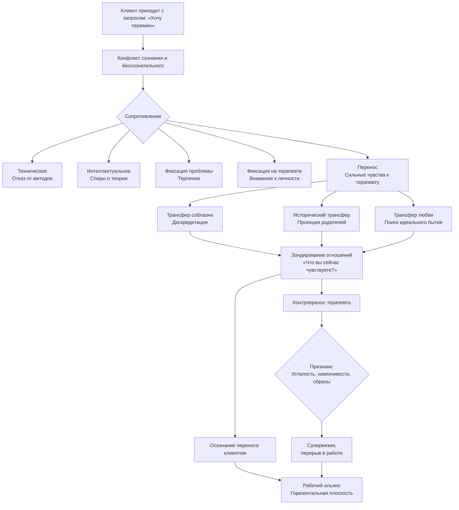

Отношения между психологом и клиентом не статичны. Они развиваются во времени, подчиняясь определённым закономерностям. Если терапевт хоть что-то умеет, динамика будет воспроизводиться снова и снова — независимо от личности клиента. Понимание этих процессов превращает хаос чувств в рабочий инструмент.

Клиент приходит за трансформацией. Это его сознательная, рациональная часть. Но одновременно в нём действует другая, теневая структура, которая перемен боится. Она сопротивляется, стремится сохранить статус-кво и часто требует менять не себя, а окружающих. Конфликт между сознанием и бессознательным обостряется, и именно этот конфликт разворачивается в кабинете терапевта.

## Специфика контакта: осознанность против бессознательности

Главное различие позиций терапевта и клиента — в степени осознанности.

**Психотерапевт** должен находиться в сознательной позиции. Он понимает, что происходит, видит динамику, отслеживает свои реакции. **Клиент** же в значительной степени бессознателен: он не отдаёт себе отчёта в своих защитах, переносах и истинных мотивах.

Из этого следует важный вывод: клиент не может адекватно оценить действия терапевта. То, что делает профессионал, строится на основе глубинных параметров внутреннего мира клиента, которые тому пока недоступны. Терапевт не может доказать обоснованность своих действий — клиент просто не увидит доказательств, пока не изменится сам.

Это порождает **профессиональное одиночество консультанта**. В контакте терапевт всегда одинок. Ему приходится быть «живым мертвецом» — убрать свою личность настолько, чтобы она не мешала проявлениям клиента.

## Особенности позиции клиента

- **Обострённая противоречивость**: человек ищет помощи, но не хочет меняться. Встреча с терапевтом не осознаётся им как начало серьёзных внутренних перемен.
- **«Умственная слепота»**: проекция стереотипов мышления — клиент оценивает ситуацию и терапевта через шаблоны, усвоенные ранее.
- **«Слепота сердца»**: проекция стереотипов отношений — способы реагировать эмоционально, строить привязанность, доверять или защищаться тоже переносятся из прошлого.

Эти неосознаваемые формы поведения становятся материалом для работы, но поначалу они выглядят как сопротивление.

## Сопротивление

Сопротивление — всё то, что в клиенте противодействует терапевтическому процессу и переменам. Оно может проявляться по-разному.

### 1. Техническое сопротивление
Клиент не соглашается с предлагаемыми методами или формами работы. Он не уходит, но и не включается: «Нет, это мне не подходит», «Я не буду это делать». Важно не пускаться в уговоры и не доказывать пользу техники.

### 2. Интеллектуальное сопротивление
«Докажите, что ваша терапия работает», «Я хочу только психоанализ, а вы предлагаете что-то другое». Клиент уходит в рассуждения о теории, технике, эффективности. Это ловушка: если терапевт начинает спорить, он тратит время и деньги клиента на дискуссию, которая не ведёт к изменениям.

В таких случаях помогает чёткая граница. Лектор приводит пример: «Представьте, что у вас аппендицит. Вы же не будете давать советы хирургу. Прошу не давать советы мне. Либо вы делаете то, что я предлагаю, либо нам придётся попрощаться». Это снимает ненужные разговоры и, как ни странно, часто нравится клиентам — они чувствуют надёжные рамки.

### 3. Фиксация проблемы
Технически терапевт всё делает правильно: контакт установлен, отражение работает, эмпатия есть. Но проблема не решается, симптом не уходит. Здесь требуется **безграничное терпение**. Терапия не терпит спешки. Фиксация может длиться неделями и месяцами, пока внутренняя структура не созреет для сдвига.

### 4. Сопротивление через личность терапевта
Вместо того чтобы заниматься собой, клиент пристально рассматривает терапевта. Оценивает, интересуется, критикует, восхищается. Это бессознательный манёвр: фокус внимания смещается с себя на другого. Так работает та часть, которая не хочет меняться.

### 5. Сопротивление в связи с перенесением
Самая сложная форма, когда нежелание меняться перерастает в сильные эмоции по отношению к терапевту. Это уже переход к феномену переноса.

## Перенесение (трансфер)

**Перенесение (трансфер)** — появление интенсивных нежных или враждебных чувств к психотерапевту, которые не оправданы ни его поведением, ни реальными отношениями в консультировании.

Феномен впервые описал Зигмунд Фрейд в 1916 году. Карл Густав Юнг в 1945 году писал: «Перенос подобен тем лекарствам, которые оказываются для одних панацеей, для других ядом. Его появление в одном случае может означать изменения к лучшему, в другом — помеху, осложнение, если не перемену к худшему; его отсутствие столь же значимо, как и его присутствие».

Юнг считал, что главное в терапии — борьба двух тенденций: стремления измениться и не меняться. Эта борьба направляется на отношения с терапевтом. По тому, каков перенос, можно многое сказать о внутреннем мире клиента.

### Виды перенесения

В лекции выделяются несколько типов трансфера:

**1. Трансфер соблазна**
Чаще всего встречается у мужчин по отношению к женщинам-терапевтам (до 99% случаев, по наблюдениям лектора). Бессознательная цель — дискредитировать терапевта, свести его с пьедестала, превратить в обычного человека, с которым можно играть в знакомые игры. Это защита от реальной работы.

**2. Исторический трансфер**
На личность терапевта переносятся чувства и отношения, сложившиеся со значимыми людьми из прошлого — чаще всего с родителями. Фразы-маркеры: «Вы такая же холодная, как моя мать», «Мой отец всегда был таким же требовательным». Клиент реагирует не на реального терапевта, а на проекцию.

**3. Трансфер любви (к Бытию)**
Более сложный и редкий тип. Это перенос стремления к идеальному, полному, принимающему бытию на фигуру терапевта. Клиент словно ищет в терапии не просто помощь, а само существование, наполненное любовью и смыслом, которого ему не хватало.

### Как работать с перенесением

Главный вопрос, который терапевт должен задавать себе: **«Что я буду делать с перенесением?»**. Нельзя ждать, пока оно зашкалит.

**Регулярное зондирование отношений**
Рекомендуется на каждой сессии (иногда несколько раз за сессию) прояснять состояние контакта. Можно спрашивать прямо: «Как вам кажется, у нас всё идёт так, как нужно?», «Что вы сейчас чувствуете по отношению ко мне?». Это позволяет выводить трансфер в сознание.

Когда клиент говорит: «Вы меня критикуете, как мой отец», задача терапевта — не защищаться, а исследовать: «Вам кажется, что я вас критикую. Давайте сделаем это предметом обсуждения. Расскажите, что вы чувствуете, когда это бывает». Так фокус возвращается на клиента.

**Прояснение и различение**
В конце сессии можно дать разъяснение: «Я не ваша мать. Я профессионал, и я верю, что вы можете изменить свою жизнь». Важно не просто интерпретировать, а помочь клиенту увидеть разницу между проекцией и реальностью.

**Вопрос Ирвина Ялома**
Один из полезных приёмов — спросить в конце встречи: «Какой момент в нашем общении показался вам наиболее полезным?». Ответ покажет, идёт ли речь о трансферентных отношениях или о реальной сознательной работе.

Перенесения будут повторяться. Каждый раз нужно мягко возвращать клиента к исследованию его чувств, связывая их с его внутренним миром, а не с личностью терапевта.

## Контрперенесение

**Контрперенесение (контртрансфер)** — ответные бессознательные чувства терапевта на перенос клиента. Это наибольшая опасность для профессиональной жизни психолога.

Опасность попадания в трансферентную связь всегда высока. Терапевт — живой человек, и у него есть свои неразрешённые конфликты, свои «слепые зоны». Если клиент проецирует на него образ холодной матери, а у терапевта действительно есть проблемы с собственной матерью, он может начать бессознательно отыгрывать эту роль.

### Признаки контрпереноса

- **Специфическая усталость** после сессии, не соответствующая объёму работы. Это сигнал, что подключились собственные реальные переживания.
- **Навязчивые мысли о клиенте**. Считается нормальным думать о клиенте 15 минут до и 15 минут после сессии. Если больше, если мысли мучительные, не отпускают — это тревожный знак.
- **Образы клиента во сне**, навязчивые видения.

### Что делать с контрпереносом

1. **Ставить трансфер и контртрансфер в центр терапии**. Осознавать свои чувства, анализировать их на супервизии.
2. **Постоянная диагностика отношений** — своих и клиента.
3. **Диагностика энергетического состояния** — отслеживать, где берётся и куда уходит энергия во время сессии.
4. **Диагностика образов бессознательного** — замечать, какие образы вызывает клиент.
5. **Аутентифицирующая психотерапия** — собственная личная терапия, супервизия, группы.

Если признаки контрпереноса стали явными, нужно **сделать перерыв в работе с клиентом** и бежать к супервизору. Промедление опасно для обеих сторон.

### Позиция терапевта

Единственные сообщения, которые терапевт может транслировать клиенту о себе:
- «Я профессионал, моя задача — создавать условия для ваших перемен».
- «Я верю в ваш безграничный потенциал и восхищаюсь вашим прогрессом».

Никаких реальных отношений с клиентами нет. Деньги, полученные за сеанс, помогают отказаться от потребности в благодарности и личной привязанности.

## Профессиональное одиночество: амплификация

Тема одиночества требует отдельного внимания. Терапевт в контакте всегда одинок, потому что:
- он не может разделить с клиентом свою правду о процессах (клиент её не поймёт);
- он не может опереться на клиента в своей эмоциональной поддержке;
- он должен удерживать сознательную позицию, даже когда клиент «тонет» в бессознательном.

Это одиночество — не патология, а условие профессии. Его нельзя преодолеть, но можно компенсировать: супервизией, интервизией, личной терапией, полноценной жизнью вне кабинета.

## Запомнить

- **Динамические процессы** — это закономерное разворачивание отношений во времени. Они воспроизводятся всегда, если терапевт работает профессионально.
- **Клиент противоречив**: он хочет перемен и одновременно боится их. Бессознательное сопротивление — нормальная часть терапии.
- **Сопротивление** проявляется в разных формах: технической, интеллектуальной, фиксации проблемы, переносе внимания на личность терапевта.
- **Перенос (трансфер)** — это сильные чувства к терапевту, не связанные с реальностью. Виды: трансфер соблазна, исторический трансфер, трансфер любви к Бытию.
- **Работа с переносом** требует регулярного зондирования отношений и мягкого возвращения фокуса на клиента. Вопрос Ялома («Что было полезным?») помогает различить трансфер и реальную работу.
- **Контрперенос** — ответные бессознательные чувства терапевта. Его признаки: необычная усталость, навязчивые мысли, образы клиента вне сессий.
- **Профессиональное одиночество** — неизбежное состояние консультанта. Оно требует супервизии и личной терапии.
- **Деньги** в терапии выполняют важную функцию: они помогают сохранять границы и не ждать от клиента благодарности.
