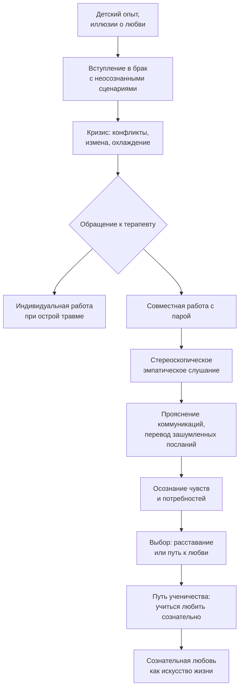

Супружеская пара приходит к психологу, когда привычные способы взаимодействия перестают работать. Часто запрос звучит как жалоба на секс, ссоры из-за денег или вмешательство родственников. Но за этими симптомами почти всегда скрывается более глубокий конфликт — утрата близости, непонимание, боль. Работа с парой требует особой технологии, отличной от индивидуального консультирования. Здесь пациентом становится не отдельный человек, а сама пара — со своими циклическими реакциями, зашумленными посланиями и неосознаваемыми сценариями.

## Консультирование семейных пар: методология «Пара» (Pairs)

Термин **Pairs** (от англ. pair — пара) охватывает различные виды диадных отношений, с которыми работает семейный консультант:

- супружеские пары;
- пары «родитель — ребёнок»;
- пары «прародитель — внук»;
- сиблинги (братья и сёстры).

Каждый тип пары имеет свою специфику, но общая цель — создать условия для изучения собственных отношений и их изменения в направлении, которое выберет сама пара.

В консультировании супружеских пар перед терапевтом встают ключевые вопросы:
- Какова цель психотерапии?
- Как построить работу — индивидуально или в паре?
- Как строить контакт и каковы его цели?
- Какие методы и приёмы применять?

Ответы зависят от конкретной ситуации, но есть общие закономерности.

## Феноменология проблем в супружеских парах

Жалобы, с которыми пары обращаются к психологу, можно разделить на несколько категорий.

### Сексуальные дисгармонии

Пациенты часто формулируют проблему как «сексуальную несовместимость», «отсутствие влечения», «разные темпераменты». Однако в подавляющем большинстве случаев истинная причина лежит глубже. Сексуальная дисгармония — это, как правило, маска дисгармонии в отношениях. Когда любовь угасает, когда накапливаются обиды, первым страдает интимная близость. Об этом легче говорить, чем о боли, непонимании или разочаровании.

### Дисгармонии в отношениях, ссоры, конфликты, кризисы

Это наиболее частые запросы. Партнёры жалуются на постоянные ссоры, невозможность договориться, чувство отчуждения. Важно понять, что за этим стоит: несовпадение ожиданий, борьба за власть, невысказанные претензии.

### Ревность и измена

Ревность и супружеская измена — одни из самых болезненных тем. Здесь важно различать: если ситуация острая, супруг переживает аффективную дезориентировку, работа должна быть строго индивидуальной. Совместные сессии в разгар кризиса могут усилить травму.

### Разводы

В работе с разводами выделяют три этапа:
- **предразводная ситуация** — когда решение ещё не принято, пара колеблется;
- **сопровождение развода** — помощь в прохождении процедуры с минимальными потерями для обеих сторон и детей;
- **отношения после развода** — выстраивание новых способов коммуникации (например, если остаются общие дети).

## Особенности работы с разными типами запросов

### Консультирование при сексуальных дисгармониях

Важнейший вопрос: работать с одним из супругов или с парой? Ответ зависит от того, насколько быстро удаётся перейти от сексуальной темы к обсуждению отношений. Обычно терапевт сразу смещает фокус: «Вы говорите о сексе, но, возможно, дело в том, как вы общаетесь в повседневности?». Если партнёры готовы обсуждать отношения, работа ведётся с парой.

Полезные приёмы:
- ослабление психологического напряжения через юмор, игру, осмеяние симптома;
- условная желательность проблемы — показать, что симптом может выполнять некую функцию в паре (например, удерживать внимание);
- поиск связи между сексуальными трудностями и коммуникативными сбоями.

### Консультирование в ситуациях ревности и измены

Здесь правило однозначно: **работа только с одним из супругов** (тем, кто переживает измену или ревность). Совместные сессии в острой фазе не проводятся. Задачи консультанта:
- эмоциональная поддержка, помощь в стабилизации состояния;
- предотвращение действий на фоне аффективной дезориентировки (месть, самообвинение, необдуманные решения);
- изучение семейных ценностей и истории пары, но только через призму переживаний обратившегося;
- анализ ожиданий и разочарований;
- если партнёры позже захотят восстановить отношения, работа над прощением возможна только после того, как острые эмоции утихнут. Иногда кризис измены становится пробуждающим переживанием, которое заставляет пару заново учиться любить.

### Предразводное и постразводное консультирование

В предразводной ситуации возможна как совместная, так и раздельная работа — в зависимости от целей. Если пара хочет сохранить отношения, но не знает как, показаны совместные сессии. Если решение принято, лучше работать раздельно, помогая каждому адаптироваться к новой жизни.

После развода, когда страсти улеглись, можно снова встретиться вместе, чтобы обсудить вопросы воспитания детей или новые границы общения.

## Технология работы с супружеской парой

Когда оба супруга готовы к совместной работе, применяется особая технология, основанная на принципах эмпатического слушания и системного подхода.

### Любовь как критерий выбора технологии

Любовь — не просто чувство, а критерий, определяющий стратегию терапии. Если в паре ещё сохраняется хотя бы остаточная любовь, технология будет направлена на её усиление. Если любовь полностью разрушена, цель может быть иной — цивилизованное расставание. Но в любом случае работа строится на создании условий, при которых партнёры смогут осознать свои истинные чувства и прояснить коммуникации.

### Архитектоника работы: пара как пациент

В совместной терапии пациентом выступает **сама пара**, а не два отдельных индивида. Задача терапевта — достичь на сеансе реальности отношений, а не проекций и жалоб друг на друга. Это значит, что разговор должен идти не о том, «что было вчера», а о том, что происходит здесь и сейчас между ними.

Цель — создание условий, при которых супруги осознают свои чувства и прояснят собственные коммуникативные послания.

### Стереоскопическое эмпатическое слушание

Для работы с парой часто привлекают двух терапевтов — мужчину и женщину. Это позволяет избежать эффекта «один против двоих» и даёт возможность более объёмного восприятия.

**Технология стереоскопического эмпатического слушания:**

1. Оба терапевта устанавливают эмпатический контакт с каждым из супругов.
2. Как только между супругами возникает прямая коммуникация (они начинают разговаривать друг с другом, а не жаловаться терапевту), терапевты слегка отстраняются, пересаживаются, занимая позицию наблюдателей.
3. Теперь каждый терапевт становится **переводчиком эмоционального подтекста** высказываний «своего» клиента. Они помогают партнёрам услышать не только слова, но и чувства, стоящие за ними.
4. В результате этого перевода происходит переход от зашумленных посланий к чистым. Супруги начинают понимать, что на самом деле хочет сказать другой.
5. Сеанс часто завершается объятиями или, по крайней мере, объяснениями в любви (возможно, не на первой встрече).

Важно, чтобы терапевты были разнополыми, иначе может возникнуть неосознаваемый альянс (двое мужчин против женщины и т.п.).

### Прояснение коммуникаций

В основе многих семейных конфликтов лежат **зашумленные послания** — сообщения, в которых скрыт истинный смысл. Например, жена говорит: «Ты опять задержался на работе», а на самом деле хочет сказать: «Я скучаю, я боюсь, что ты меня разлюбил». Муж отвечает: «Ты меня пилишь», вместо того чтобы услышать: «Я нужна тебе».

Задача терапевтов — прояснить эти послания, перевести их из скрытой формы в открытую, сохраняя эмпатию к обоим.

### Психологические условия работы пары профессионалов

Работа с парой в ко-терапии требует особой подготовки самих терапевтов:
- предварительное создание пары, настройка на совместную работу;
- осознание собственных чувств и прояснение коммуникаций между терапевтами;
- высокий уровень профессионального доверия;
- осознание собственного детского и семейного опыта, ретроспекция детских сценариев, чтобы не проецировать их на клиентов;
- совместный опыт обучения и работы.

## Семья как первичный опыт любви: глубинные истоки проблем

Почему так трудно строить гармоничные отношения? Ответ кроется в раннем семейном опыте. Именно в семье у человека формируется первая убеждённость, что он знает о любви всё, что умеет любить. И именно здесь зарождаются иллюзии, которые потом разрушаются во взрослой жизни.

### Иллюзии любви

Главная иллюзия, которую выносит человек из детства: **проблема любви — найти того, кто будет любить нас**. Или наоборот: встретить человека, достойного нашей любви. Обе формулировки ошибочны. Они смещают фокус с собственной способности любить на поиск «правильного объекта».

### Любовь как объект научения, а не врождённое качество

Подавляющее большинство людей — это всего лишь дети, страстно желающие быть любимыми, но не умеющие любить. Любовь воспринимается как стечение обстоятельств, удачный или роковой случай. В современном мире царит «арифметика отчаяния и одиночества»: все жаждут любви, но мало кто может её дать. Люди часто переживают любовь как ошибку, боль, страдание, поражение.

Человек, даже когда он полон желания любить, не задумывается о том, что ему самому необходимо стать благом для любимого существа. Он не осознаёт этого и не верит в это.

### Психопатология любви

В семье формируются искажённые паттерны любви, которые затем переносятся в супружеские отношения.

#### Женские паттерны
- **Героическое поведение**: ошибка в приложении сил. Стремление максимально продлить «букетно-конфетный» период без интимной сближения или, наоборот, быстрое сожительство с выполнением роли жены без официального статуса — и то, и другое ведёт к разочарованию.
- **«Тёмная женственность»**: неосознаваемые тенденции к мести, глубинное негативное отношение к мужчине.
- **Неосознаваемая незнакомая сексуальность**: женщина может не контролировать свою сексуальность, действовать как «гениталии на ножках», что пугает её саму и партнёра.
- **Женщина как витрина**: желание быть лучшей и желанной любой ценой, стать единственной, что часто оборачивается нарциссическими играми.
- **Женщина-мать**: любовь как тотальная забота, бегство от одиночества через гиперопеку, которая превращает партнёра в «ребёнка».
- **Женщина-жертва**: притворная слабость, обеспечивающая право на господство и эмоциональный шантаж.

#### Отношения матери и сына, матери и дочери
- **Мать-сын**: негласный тайный сговор, поддержка «избранности» сына, которая в реальной жизни оборачивается иллюзией и ведёт к чувству отверженности. Эта динамика переносится на отношения с женщинами: мужчина ищет идеальную мать, но никогда не может её найти.
- **Мать-дочь**: сложная смесь любви и соперничества. Мать может неосознанно конкурировать с дочерью, одновременно подавляя её и привязывая к себе.

#### Мужские паттерны
- Потребность в **жене-матери** — тайной, недосягаемой, к которой он навсегда сохраняет исключительную верность. Эта ностальгическая фиксация делает невозможными аутентичные отношения с реальной женщиной.
- Бессознательный шантаж женщины, попытки удержать роль «первого, главного и единственного ребёнка».
- Сексуализация конфликта: тема секса усиливается вплоть до перверсий, питаясь комплексами. Любовь превращается в неосознаваемую агрессивную схватку, где интимность становится предметом шантажа, наказания, орудием мести.
- Глубоко внутри сохраняется боль и тревога утраты любви. В результате супруги не наслаждаются друг другом, не созидают отношения, а разрушают. Брак становится «законным этическим правом на совершение убийства».

### Четыре ложные предпосылки о любви

1. **Проблема любви в том, чтобы быть любимым**, а не в том, чтобы любить.
2. **Проблема любви — это проблема объекта**, а не способности (любить легко, если найти подходящий объект).
3. **Смешение первоначального чувства влюблённости** с постоянным состоянием пребывания в любви.
4. **Смешение эротизма и любви**.

Влюблённость — это временный эмоциональный подъём, часто основанный на проекциях. Любовь — длительное, требующее усилий искусство.

## Путь ученичества: как научиться любить

В рамках психотерапии человек постепенно понимает: любви надо учиться. Наблюдая за своими неудачами, поражениями, потерями, он приходит к выводу, что единственный эффективный способ избежать трагедий — наблюдать свою жизнь и сознательно развивать способность любить.

### Сознательная любовь как произведение искусства

Сознательная любовь никогда не приходит случайно. Она должна быть результатом сознательного выбора и твёрдого желания совершать над собой усилия. Она не может возникнуть и развиваться сама по себе. Это **произведение искусства жизни**.

Чтобы вступить на этот путь, необходимо:
- отречься от эгоистических стремлений и предрассудков;
- сделать чистым своё желание учиться любви;
- постоянно спрашивать себя: «Буду ли я способен любить?» и честно отвечать: «Нет, но попробую учиться»;
- проявить смирение и готовность к испытаниям, к усилиям;
- постоянно стремиться изучать того, кого любишь: кто этот мужчина или эта женщина, кем они могут стать, что им нужно, к чему взывает их душа;
- научиться предвидеть сегодня то, в чём любимый будет нуждаться завтра, не думая о бремени для себя.

### Формула сознательной любви

**Движущая сила сознательной любви в её развитой форме — желание, чтобы объект любви достиг своего собственного совершенства, изначально заключённого в нём от рождения, независимо от тех последствий, которые это может иметь для любящего.**

Парадокс такой любви: она, рано или поздно (часто не сразу, медленно и постепенно), вызывает те же чувства у другой стороны. Сознательная любовь порождает сознательную любовь.

Она требует огромной самодисциплины и самообладания. «Боги любят друг друга сознательно. А сознательно любящие становятся богами».

## Запомнить

- **Консультирование пар** (Pairs) включает работу с супругами, родителями и детьми, прародителями и внуками, сиблингами. Каждый тип пары требует учёта специфики отношений.
- **Феноменология проблем**: сексуальные дисгармонии чаще всего маскируют проблемы в отношениях; ревность и измена требуют индивидуальной работы в острой фазе; развод проходит через три этапа (предразводный, сопровождение, постразводный).
- **Технология стереоскопического эмпатического слушания** предполагает работу двух терапевтов (мужчины и женщины), которые помогают паре перевести зашумленные послания в чистые, возвращая способность слышать друг друга.
- **Семья — первичный опыт любви**, в котором формируются иллюзии: проблема любви — найти того, кто полюбит, а не научиться любить самому.
- **Психопатология любви** у женщин, мужчин, в диадах мать-сын и мать-дочь создаёт сценарии, разрушающие супружеские отношения.
- **Четыре ложные предпосылки** о любви (быть любимым, проблема объекта, смешение влюблённости и любви, смешение эротизма и любви) мешают взрослению.
- **Сознательная любовь** — это результат сознательного выбора и усилий, искусство жизни. Её формула: желать совершенства любимому независимо от последствий для себя.
- **Путь ученичества** требует смирения, постоянного самонаблюдения и готовности учиться понимать другого.
