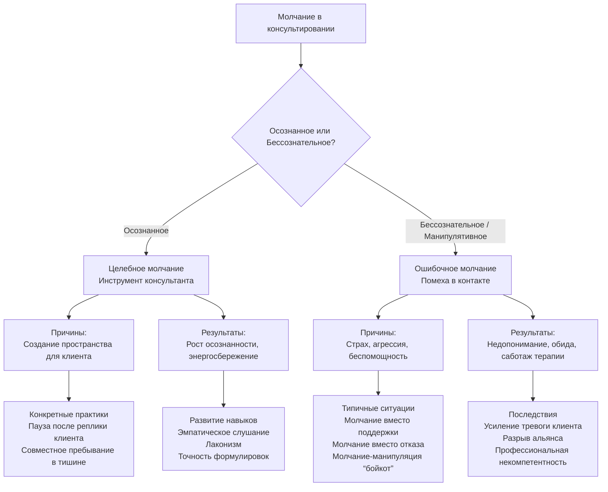

Речь и молчание формируют два полюса консультативного контакта. Если речь — это инструмент исследования, то молчание — среда, в которой это исследование происходит. Неуправляемый поток слов и бессознательное умалчивание одинаково разрушительны. Понимание их природы превращает тишину из паузы в терапевтическое действие.

## Речевые злоупотребления: патология коммуникации

Речевые злоупотребления — это не ошибки стиля, а проявления бессознательных психологических процессов, которые искажают контакт и истощают энергию. Они возникают, когда речь перестает служить коммуникации и начинает обслуживать внутренние конфликты, страхи и компенсаторные механизмы.

### Многоречивость: говорение как бегство от себя

**Многоречивость** — самое распространенное злоупотребление. Её корни лежат не в избытке мыслей, а в дефиците внутренней устойчивости. Бессознательные причины этого феномена:

*   **Иллюзия бытия:** человек доказывает факт своего существования через непрерывный поток слов. «Говорю — значит, существую».
*   **Страх не быть:** многословие как попытка «вписаться» в группу, понравиться, завоевать место в социальной иерархии.
*   **Тревожность:** речь становится способом сбросить внутреннее напряжение, «проговорить» тревогу, что лишь усиливает её.
*   **Астенические состояния:** при упадке сил бессознательное многословие может быть попыткой мобилизовать себя.
*   **Тщеславие и доминирование:** речь используется для самоутверждения, демонстрации превосходства и контроля над собеседником.
*   **Переоценка роли речи:** убежденность, что только словами можно что-либо доказать, изменить или донести.

Многоречивость проявляется в различных «феноменах изобильности говорения»:
*   **Говорение как удовольствие** — нарциссическое наслаждение звуком собственного голоса.
*   **Говорение как борьба с актуальным временем** — заполнение паузы, бегство от «здесь и сейчас».
*   **Говорение как жалоба** — циклическое пережевывание проблем без намерения их решать.
*   **Говорение как «перетирание других» (сплетни)** — установление связи за счет обсуждения третьих лиц.
*   **Говорение как критика и претензии** — агрессия, замаскированная под активность.
*   **Говорение как усталость или напряжение** — речевой поток как индикатор истощения нервной системы.

В основе часто лежит неосознаваемая **потребность высказывать мнение по любому поводу**, как если бы оно было истиной. Человек говорит не потому, что знает, а потому, что не может не говорить. Это создает иллюзию компетентности и занятости, блокируя реальное познание и контакт.

### Сплетни: коммуникация как суррогат близости

Сплетни — особый вид речевого злоупотребления, где предметом разговора становится отсутствующий третий. В консультировании искушение сплетней — серьезное профессиональное нарушение. Оно подменяет **строжайшую конфиденциальность** и искажает информацию, превращая профессиональный разговор в кулуарный. Умение передавать суть случая без деталей, могущих идентифицировать клиента, — базовый навык, который рушится, когда речь становится сплетней.

### Искажения: речь как кривое зеркало

Речевые искажения — это не просто безграмотность. Они включают:
1.  **Безграмотность как недостаток общей культуры**, что снижает точность формулировок и сужает понятийный аппарат.
2.  **Резкий оценочный язык** с преобладанием негативных высказываний («ужасно», «неправильно», «глупо»). Это проявление **ложной личности**, тщеславия и установки «думаю, что знаю». Такая речь не описывает, а осуждает, закрывая возможность для диалога.

### Внутренняя речь: невидимый саботажник

**Изобилие внутренней речи** — наиболее серьезное и скрытое злоупотребление для самого консультанта. Постоянный внутренний монолог или диалог во время сессии создает иллюзию работы, но на самом деле блокирует восприятие клиента. Консультант слышит не клиента, а свои интерпретации, оценки, советы, которые рождаются в этом внутреннем шуме.

Содержание этого шума чаще всего — **счета и претензии, обида, вина, жалость к себе**, проецируемые на клиента. Иллюзия уникальности своего внутреннего мира заставляет консультанта слушать себя, а не другого. Это основная причина ошибок и неэффективности.

## Молчание: искусство и ловушки

Молчание — не просто отсутствие слов. Это активное состояние сознания. Как сказал Пифагор: *«Молчи, или пусть твои слова стоят дороже молчания»*. Однако молчание может быть как целебным, так и разрушительным. Различие — в его осознанности и контексте.

### Когда молчание — ошибка: четыре негативных сценария

Бессознательное или намеренное умалчивание в ключевых ситуациях наносит вред отношениям и блокирует развитие.

1.  **Молчание вместо похвалы, поддержки, одобрения.** Отсутствие вербальной поддержки часто воспринимается как безразличие или неодобрение. Похвала и поддержка — сознательные действия. Молчание в ситуациях, где уместно доброе слово, подрывает доверие и лишает близких обратной связи. В эффективном общении похвал должно быть вдвое больше, чем критики.

2.  **Молчание вместо отказа.** Когда согласие противоречит вашим убеждениям или интересам, молчание вводит собеседника в заблуждение. Оно дает простор для фантазии и часто трактуется как согласие. Евангельская истина — *«Чтобы Да было - Да, а Нет было – Нет»*. Сознательный, четкий отказ, произнесенный из уважения к себе и другому, предотвращает накопление обид и манипуляций.

3.  **Молчание вместо смелого высказывания.** Страх или стеснение заставляют умалчивать новаторские мысли, творческие решения, важные знания. Это ошибка, лишающая группу или диалог потенциального развития. Сила сказать — это ответственность перед ситуацией, требующей перемен.

4.  **Молчание, когда обманывают.** Бессознательное «проглатывание» намеренной лжи разрушает самоуважение и поощряет манипулятора. Смелое, сознательное заявление о недоверии или указание на искажение информации защищает личные границы и сохраняет ясность коммуникации.

**Намеренное молчание как манипуляция** (например, «бойкот» в семейном конфликте) — отдельный разрушительный феномен. Как заметил Демокрит: *«Молчание — самый громкий крик, потому что он рвет не уши, а сердце»*. Это форма пассивной агрессии, которая не разрешает конфликт, а загоняет его вглубь, оставляя долгий негативный след, особенно травматичный для детей.

### Целительная сила осознанного молчания

В мире, перегруженном «пустой болтовней» и «многоворением», осознанное молчание становится ресурсом.

*   **Энергосбережение.** На каждое слово тратится энергия. Многословие нарушает ритм дыхания, снижая приток жизненных сил. День, проведенный в пустых разговорах, истощает.
*   **Снижение тревоги.** В состоянии тревоги, обиды, негативных эмоций человек говорит много и хаотично. Этот поток еще больше расшатывает нервную систему. Осознанное молчание прерывает этот порочный круг, возвращая к состоянию внутреннего покоя. Существует мнение, что день молчания может удлинить субъективное восприятие жизни.
*   **Речевой контроль.** Молчание — лечение от неосознаваемых речевых зависимостей:
    *   **Склонность к противоречию** — автоматическое «нет» на любое утверждение.
    *   **Склонность говорить «правду в глаза»** — неразборчивая критика под маской помощи.
    *   **Склонность к излишней откровенности** — выдача информации, которая ставит в опасное или глупое положение.

Как сказал персидский поэт Саади: *«Что проку в разуме, если он не приходит мне на помощь прежде, чем слова слетают с моих уст!»*. Молчание создает паузу между импульсом и высказыванием, в которую может вмешаться осознанность.

## Психология и практика молчания для консультанта

Для психолога-консультанта молчание — не этикет, а профессиональный навык, требующий развития. Индийский поэт образно описал его суть: *«Раковина, прячущая жемчужину, скажи, откуда твоя прекрасная пленница? - Она рождена Молчанием, ибо мои уста не раскрывались много лет»*. Ценность рождается в тишине.

### Уровни практики молчания и её результаты

Регулярная практика осознанного молчания (вне сессий и как часть профессиональной аскезы) ведет к конкретным результатам:

1.  **Контроль и выбор.** Появляется способность выбирать, говорить или молчать, и какие именно слова произносить.
2.  **Лаконизм.** Умение передавать большие смыслы малым количеством слов. Речь становится емкой и точной.
3.  **Точность передачи.** Снижаются искажения при передаче информации, будь то содержание сессии в супервизии или интерпретация для клиента.
4.  **Соблюдение конфиденциальности.** Молчание как естественное состояние укрепляет внутренний запрет на сплетни и утечку информации.
5.  **Эмпатическое слушание.** Внешняя и внутренняя тишина открывает канал для подлинного слышания другого человека, его чувств и смыслов.
6.  **Рост энергетического потенциала.** Сохраняемая энергия речи преобразуется в устойчивость, внимание и присутствие.
7.  **Рост осознанности и профессионализма.** Консультант начинает различать собственные внутренние процессы и процессы клиента, что повышает точность вмешательств.

### Задачи консультанта в работе над речью и молчанием

Материалы формулируют четкие задачи для специалиста:

*   **Изучать и возвышать собственную речь.** Работать над грамотностью, смысловой наполненностью, убирать оценочность и штампы.
*   **Овладевать речевыми жанрами.** Осознанно использовать разъяснение, отражение, интерпретацию, вопросы.
*   **Развивать способность «Быть и Быть словами».** Слово должно быть наполнено личным проживанием и присутствием, а не быть пустой оболочкой.
*   **Поддерживать состояние внутренней тишины.** Это база, из которой рождается точное слово и глубокое слушание.
*   **Помнить, что для консультанта Молчание – золото.** Не как абсолют, а как осознанный выбор в нужный момент для создания пространства, в котором клиент может услышать себя.

Цель — не в том, чтобы сделать молчание культом, а в том, чтобы восстановить его законное место в коммуникации. Осознанное молчание перестает быть паузой между словами и становится самостоятельным языком, на котором говорит доверие, принятие и глубина.

## Запомнить

*   **Многоречивость** — ключевое речевое злоупотребление, коренящееся в страхах (небытия, непринятия), тревоге, тщеславии и бессознательной потребности высказывать мнение как истину. Её формы — от болтовни до сплетен и хронических жалоб.
*   **Сплетни** и **речевые искажения** (оценочность, безграмотность) разрушают конфиденциальность и точность контакта. **Избыток внутренней речи** у консультанта — главная скрытая помеха, саботирующая слушание.
*   **Молчание не всегда целебно.** Оно становится ошибкой, когда подменяет необходимую поддержку, четкий отказ, смелое высказывание или противостояние обману. Намеренное молчание-манипуляция («бойкот») наносит глубокие психологические травмы.
*   **Осознанное молчание** — активное состояние сознания и профессиональный навык. Оно экономит энергию, снижает тревогу, лечит речевые зависимости (склонность спорить, грубо критиковать, быть излишне откровенным).
*   **Практика молчания для консультанта** ведет к лаконизму, точности, усилению эмпатического слушания, соблюдению конфиденциальности и росту общего энергетического и профессионального потенциала.
*   Главная задача — развивать способность к **внутренней тишине**, которая позволяет слову быть весомым, а слушанию — глубоким. Молчание создает пространство, в котором возможно настоящее понимание.
