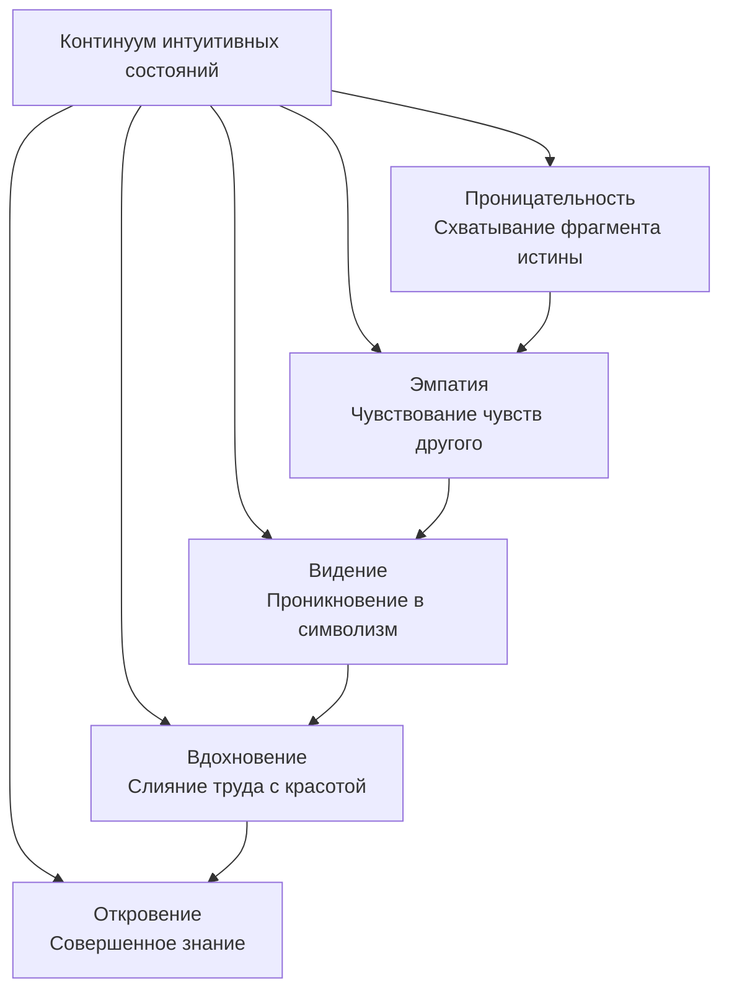

Почему одни психологи точно «видят» проблему клиента с первой минуты, а другие, вооружённые методиками, топчутся на месте? Причины успехов и неудач в профессии кроются не столько в знании техник, сколько в состоянии внутреннего мира консультанта, в его способности открыть в себе действие интуитивных процессов. Интуиция позволяет схватывать суть ситуации мгновенно, минуя долгие цепочки логических рассуждений. Это не мистический дар, а психическая способность, которую можно и нужно развивать.

## Что такое интуиция: определение и феноменология

Термин «интуиция» происходит от латинского *intuitio* — «пристально смотрю», «созерцание». В психологии **интуиция** понимается как способность непосредственно, без логического обоснования, постигать истину, проникать в смысл ситуаций, отношений и объектов. Это знание, возникающее как озарение (инсайт), внезапно, без осознания путей и условий его получения.

Интуитивное познание характеризуется четырьмя ключевыми процессами:

- **Схватывание** — мгновенное понимание сути предмета или явления.
- **Предчувствие** — знание о том, что ещё не наступило, но уже ощущается как неизбежное.
- **Охватывание** — способность удерживать в сознании большой объём информации, целые системы знаний, не разворачивая их в логическую цепочку.
- **Постижение** — глубокое проникновение в предмет, при котором он открывается сразу во всей полноте.

Главное качество интуиции — быстрота, моментальность. Она опережает рациональное мышление и часто превосходит его по точности.

## Интуитивное познание в истории науки и философии

История науки полна примеров, когда великие открытия совершались не за письменным столом, а во сне, в полудрёме или при неожиданном озарении.

### Великие открытия как инсайты

**Карл Фридрих Гаусс**, знаменитый математик, так описывал доказательство одной теоремы: «Через два дня мне это наконец удалось, но не за счёт моих мучительных усилий, а милосердием Божьим. Как неожиданная вспышка молнии, загадка разрешилась случайно, я сам не могу сказать, что было путеводной нитью».

**Фридрих Август Кекуле**, химик-органик, открыл циклическую структуру бензола после видения во сне: атомы танцевали перед его глазами, извиваясь, как змеи, и вдруг одна из змей ухватила свой хвост. Кекуле проснулся и понял: бензольное кольцо замкнуто. Он призывал коллег: «Давайте научимся видеть сны, господа!»

**Дмитрий Иванович Менделеев** увидел свою периодическую систему элементов во сне. Профессор Иностранцев, друг Менделеева, вспоминал: «Очевидно, я увидел во сне таблицу, в которой элементы были расположены по мере необходимости. Я проснулся и сразу же записал данные на листе бумаги и снова заснул. И только в одном месте потребовалась затем правка».

### Античные мыслители об интуиции

**Платон** разделял познание на два вида:
- **Дианойя** — рассудочное, дискурсивное знание, основанное на логике.
- **Ноэзис** — интуитивное знание, чистое созерцание, позволяющее уму непосредственно усматривать мир идей. Ноэзис доступен лишь тем, кто прошёл путь посвящения, и Платон использовал мифы, чтобы навести учеников на рождение этого знания в себе.

**Эпикур** в своей теории познания (канонике) утверждал, что критерием истины служит особое состояние души — **атараксия**. Это невозмутимость, безмятежность, свобода от беспокойства. Только в таком состоянии человек способен на непосредственное, интуитивное постижение истины. Эпикур подчёркивал, что счастье — не в грубых удовольствиях, а в этом внутреннем покое, который открывает доступ к подлинному знанию.

### Интуиция в эпоху Возрождения и Нового времени

**Леонардо да Винчи** использовал особый метод пробуждения интуиции: он советовал вглядываться в пятна на стене, угли в огне, облака или грязь — в этих случайных формах можно увидеть образы, порождающие гениальные идеи. Он также прислушивался к звукам колоколов, в которых «можно уловить любое имя и любое слово». Леонардо признавал, что его метод может показаться смешным, но он невероятно полезен для вдохновения ума.

**Фрэнсис Бэкон**, основоположник эмпиризма, критиковал традиционную логику: «Настоящая система логики больше соответствует упрочению и ускорению ошибок, основанных на общераспространённых взглядах, чем поиску истины, и поэтому скорее вредна, чем полезна». Достижения наук, по Бэкону, обязаны не логике, а чему-то иному — интуитивному прозрению.

**Джон Локк** считал интуитивное знание самым ясным и достоверным. Он сравнивал его с восприятием света: ум видит истину непосредственно, как глаз видит свет. Например, мы сразу знаем, что белое не есть чёрное, что круг не есть треугольник. Эта интуиция лежит в основе всей достоверности нашего познания.

### Интуиция в современной науке

**Альберт Эйнштейн** прямо заявлял: «Не существует логического пути к открытию основных законов. Есть только путь интуиции, которой помогает ощущение порядка, лежащего за внешней видимостью».

## Интуиция в практике консультирования: пример из беатотерапии

В практике беатотерапии зафиксирован случай, наглядно демонстрирующий работу интуиции. Клиент обратился с проблемой выбора: инвестировать деньги в проверенный банк или в новый, более рискованный проект. Он рассказал сон: буря повалила старые тяжёлые деревья, а молодняк устоял. Беатотерапевт истолковал сон как указание делать ставку на новый банк — символ молодняка. Клиент не согласился, логика и советы экспертов говорили об обратном. Он вложился в старый банк, который вскоре обанкротился.

Спустя год клиент вернулся и признал точность интуитивного вывода терапевта. Его поразило, откуда специалист мог знать исход, противоречащий всем экономическим прогнозам. Этот пример показывает, что интуитивное познание даёт информацию, недоступную обычной экспертной логике.

## Континуум интуитивных состояний

Интуиция неоднородна. Она проявляется в целой гамме состояний — от простейших форм до высшего совершенства.

### Проницательность
Проницательность — это способность «схватывать глазом» фрагмент истины. Вы смотрите на незнакомого человека и мгновенно понимаете его состояние: спокоен он или напряжён, рад или огорчён. Вы ещё не знаете его биографии, не анализировали его поведение, но уже знаете. Проницательность хорошо работает в новой обстановке, с новыми людьми. В привычной же среде она может притупляться: мы не замечаем изменений в близких. Развитие проницательности — необходимое условие профессионализма психолога.

### Эмпатия
Эмпатию называют «проницательностью сердца». Если проницательность — это зрение ума, то эмпатия — чувствование всем существом. Этимология слова (от *esse* — быть, *mihi* — мне, *pati* — чувствовать) передаёт суть: «сильное чувство во мне». Вы не просто понимаете чувства клиента — вы ощущаете их как свои собственные. Ваше тело откликается на его боль, радость, напряжение. Эмпатия возникает только тогда, когда мы отключаем рациональный анализ и позволяем себе резонировать с другим человеком.

### Видение
Видение — это способность проникать в символизм мира, читать язык образов. Оно позволяет за внешними явлениями увидеть их глубинный смысл. Например, выбор одежды может быть не просто целесообразным, а проективным — бессознательно мы выражаем через неё своё состояние. Видение особенно ярко проявляется при работе со сновидениями и имагогическими образами. Сон несёт информацию не только о текущем моменте, но и о прошлом и будущем человека, о возможных путях его развития.

### Вдохновение
Вдохновение — это состояние, в котором труд становится искусством. Работать с вдохновением — значит постичь красоту любого дела. Его нельзя вызвать искусственно, оно приходит само, когда ум спокоен, а мысли полностью поглощены задачей. Вдохновение требует полной отдачи, концентрации всех сил. В нём проявляется высокая концентрация психической энергии, которая в обычной жизни часто рассеивается.

### Откровение
Откровение — совершенная форма интуиции. Оно вбирает в себя и проницательность, и эмпатию, и видение, и вдохновение. Человек, достигший откровения, живёт в полном единстве с миром. Границы между ним и универсумом исчезают. Такое состояние доступно людям высочайшего духовного развития — например, Франциску Ассизскому, который, по преданию, понимал язык птиц и зверей, или Серафиму Саровскому. Откровение — это совершенная мудрость, полное развитие способности к предчувствию.

## Рациональное и интуитивное мышление: сравнительная характеристика

| Рациональное мышление | Интуитивное мышление |
|----------------------|----------------------|
| Опосредованное логикой | Непосредственное, прямое |
| Пошаговое, дискурсивное | Мгновенное, скачкообразное |
| Требует времени и усилий | Возникает как озарение |
| Осознаваемые операции | Неосознаваемый процесс |
| Основано на правилах | Основано на целостном схватывании |
| Проверяемо, доказуемо | Трудно вербализуется |

Для психолога оба вида мышления важны. Рациональное необходимо для анализа, планирования интервенций, теоретической рефлексии. Интуитивное — для моментального понимания клиента, выбора точного слова, предчувствия поворотов терапии.

## Что мешает интуиции: преграды на пути

Интуиция — врождённая способность, но её действие блокируется несколькими психическими слоями.

1. **Искажения впечатлений, стереотипы общения.** Когда мы смешиваем человека и его поведение, навешиваем ярлыки, ставим диагнозы, мы закрываем себе доступ к живому восприятию.
2. **Недостаточный энергетический потенциал.** Интуиция требует высокой внутренней энергии, «накала». Психотерапевт должен быть энергетически сильным, сохраняя при этом спокойствие.
3. **Псевдорациональность, мыслительные стереотипы.** Привычка всё объяснять логически, опора на готовые схемы убивает интуитивное чувствование.
4. **Негативные эмоции.** Тревога, раздражение, гнев замутняют внутреннее зрение. Терапевту необходимо состояние эмоциональной стабильности.
5. **Отравленные инстинкты.** Пищевые, сексуальные и другие зависимости искажают восприятие. Для чистой интуиции нужен здоровый образ жизни, нормальное функционирование инстинктов.
6. **Ложная личность.** Тщеславие, убеждённость в собственном всезнании («я уже мудрец») останавливают развитие. Важно сохранять позицию «незнания», открытость новому.

## Как развивать интуицию консультанту

Развитие интуиции — это работа над состоянием внутреннего мира.

- **Достижение атараксии.** Как учил Эпикур, безмятежность души — условие истинного познания. В контакте с клиентом важно удерживать состояние спокойной концентрации, освобождённой от суеты.
- **Практика разделённого внимания.** Наблюдение за собой и клиентом одновременно, развитие способности замечать тонкие телесные сигналы (велосенсорика).
- **Работа с образами.** Анализ сновидений, имагогика, творчество — всё это тренирует символическое, интуитивное мышление.
- **Освобождение от стереотипов.** Регулярная рефлексия собственных шаблонов, супервизия, личная терапия.
- **Культивирование вдохновения.** Полное погружение в работу, любовь к процессу, отсутствие «остаточных сил» — тогда приходит вдохновение.
- **Здоровый образ жизни.** Нормализация инстинктов, физическая активность, полноценный отдых.

## Запомнить

- **Интуиция** — это способность непосредственного постижения истины, минуя логику. Она проявляется как схватывание, предчувствие, охватывание, постижение.
- **Великие учёные** (Гаусс, Кекуле, Менделеев, Эйнштейн) признавали ведущую роль интуиции в своих открытиях.
- **Философы** (Платон, Эпикур, Бэкон, Локк) описывали интуицию как высшую форму познания, доступную в состоянии умственного созерцания и душевной безмятежности (атараксия).
- **В консультировании** интуиция позволяет предвидеть события, точно интерпретировать образы и чувствовать состояние клиента без слов.
- **Континуум интуитивных состояний** включает проницательность, эмпатию, видение, вдохновение и откровение — от простейших форм до совершенного знания.
- **Рациональное и интуитивное мышление** дополняют друг друга. Психологу необходимо владеть обоими.
- **Преграды интуиции**: стереотипы, низкая энергия, псевдорациональность, негативные эмоции, отравленные инстинкты, ложная личность.
- **Развивать интуицию** можно через атараксию, практику разделённого внимания, работу с образами, освобождение от шаблонов и здоровый образ жизни.
