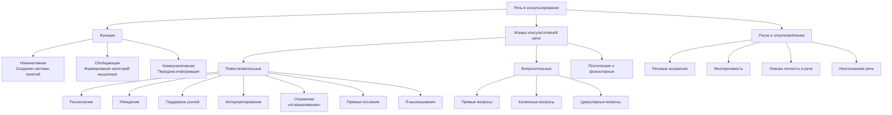

Психологическое консультирование строится на речи, но сама речь часто становится не инструментом, а помехой. Слова клиента и консультанта могут как раскрывать внутренний мир, так и надежно маскировать его. Проблема не в количестве слов, а в их качестве, осознанности и точном соответствии цели.

## Происхождение речи: от биогенеза к социогенезу

Возникновение членораздельной речи остается загадкой. Наука предлагает несколько объяснений, и каждое из них формирует взгляд на природу человеческого общения.

### Биогенная теория

Согласно биогенной теории, речь стала результатом длительной биологической эволюции. У предков человека противоречия между их морфофизиологической организацией и зарождающейся трудовой деятельностью разрешались через естественный отбор. Этот процесс привел к трем ключевым изменениям:
1.  Преобразование передних конечностей.
2.  Развитие коры больших полушарий головного мозга.
3.  Появление сознания.

Сознание, возникнув как биологический механизм, стало основой для дальнейшего социального развития. Биологическая эволюция человека замедлилась, уступив место развитию, определяемому средой и культурой.

### Трудовая (социогенная) теория

Фридрих Энгельс выделил **трудовую деятельность** как главную движущую силу эволюции человека. Освобождение руки от функции опоры и её использование для изготовления орудий привело к функциональному и морфологическому совершенствованию. Труд сплотил древних людей в коллективы, создав общество. В ходе совместной деятельности возникла необходимость в обмене информацией, что, в свою очередь, стимулировало развитие голосового аппарата и мозга, приведя к появлению речи.

### Теории божественного и космического происхождения

Параллельно существуют нематериалистические гипотезы:
*   **Креационизм и религиозная гипотеза:** речь — богоподобный дар, переданный человеку при творении.
*   **Логосическая теория:** слово (Логос) есть фундаментальная творящая сила и разумная основа мира.
*   **Космическая гипотеза:** речь — либо дар пришельцев, либо их прямое наследие.

Эти теории подчеркивают сакральность и исключительность дара слова.

## Эволюция или регресс языка?

Лингвистические данные бросают вызов идее о постоянном прогрессе языка. Сравнительный анализ показывает, что многие древние языки (киммерийский, языки аборигенов Австралии) обладали чрезвычайно сложной грамматической структурой, богатством звучания и множеством форм. Современные европейские языки часто демонстрируют упрощение. Этот факт указывает не на линейный прогресс, а на возможный **языковой регресс** или адаптацию к меняющимся условиям коммуникации.

## Функции речи и мышление

Речь выполняет три ключевые функции, неразрывно связанные с мышлением:

1.  **Номинативная (сигнификативная):** обозначение объектов и явлений с помощью слов, что создает систему понятий.
2.  **Обобщающая:** слово выделяет существенные признаки предметов и объединяет их в группы. Слово «стол» обозначает не конкретный предмет, а класс предметов с общими свойствами. Эта функция — основа категориального мышления.
3.  **Коммуникативная:** передача информации от одного индивида к другому.

Мышление оперирует понятиями и логическими законами, которые существуют конвенционально и передаются через речь. Речь является языком мышления, а мышление невозможно вне логических структур, которые оно само и создает с помощью речи.

## Психология речи в консультативном контакте

В кабинете психолога речь перестает быть бытовым явлением. Она становится основным инструментом исследования внутреннего мира и объектом анализа.

### Речевая личность и язык клиента

Каждый человек является **речевой личностью** — носителем уникального языкового кода, сформированного его опытом, культурой, социальной группой и личной историей. Группы имеют свой язык, у каждого ребенка — свой игровой язык. Задача консультанта — не просто говорить с клиентом на одном языке, но и научиться слышать и понимать этот индивидуальный код, не переводя его автоматически на свой.

### Потребность в самовыражении и роль слушания

Все в природе стремится к выразительности. Человеческая речь — высшая форма этого стремления. Однако в консультировании стремление консультанта «понять» клиента с помощью активной речевой деятельности часто становится ложной целью. Понять другого до конца невозможно. Первичная задача — создать условия, в которых клиент сможет услышать и понять себя сам. Это смещает фокус с говорения консультанта на его способность к глубокому, эмпатическому слушанию.

### Бессознательность речи как главный риск

Речь — психическая функция, которая может протекать автоматически, без участия сознания. Люди часто «не ведают, что говорят». Эта бессознательность — источник основных **речевых злоупотреблений**:
*   **Речевые искажения:** неточные формулировки, подмена понятий, проекции.
*   **Многоречивость:** использование потока слов для избегания молчания, заполнения пауз, ухода от болезненных тем или создания иллюзии работы.

Причина обоих злоупотреблений — недостаточная осознанность собственной речи как у клиента, так и у консультанта.

## Речь в практике консультирования: виды и методы

### Письменная речь

Письменная речь в консультировании выполняет диагностическую и терапевтическую функции через:
*   **Специальные задания:** ведение дневника, написание сочинений, отчетов о самонаблюдении, выполнение проективных тестов.
*   **Биографические методы:** описание ключевых периодов жизни, отношений («опишите первые годы брака»). Этот подход лежит в основе нарративной психологии, где история жизни переосмысливается через письменное повествование.
*   **Библиотерапию:** анализ прочитанных клиентом текстов, их обсуждение и интерпретация.

### Устная речь: от монолога к диалогу

Устная речь в консультировании структурируется в две основные формы:

**1) Монолог клиента.**
Это спонтанная речь в процессе самовысказывания или выполнения заданий (например, интерпретации произведения искусства). Задача консультанта — обеспечить безопасное пространство для такого монолога, не прерывая его оценочными или интерпретирующими репликами.

**2) Диалог.**
Это обмен речью между клиентом и консультантом, который может принимать разные формы:
*   **Беседа** (спонтанный обмен).
*   **Интервью** (структурированный вопрос-ответ).
*   **Дискуссия** (обсуждение конкретной темы).
*   **Выслушивание** (акцент на восприятии речи клиента).

Карл Роджерс в «Лечебных беседах» подчеркивал, что умение говорить искренне, точно выражая свои чувства и мысли, оставаясь при этом осознающим свою речь, — сложнейшее психологическое качество, требующее длительного обучения.

## Речевые жанры в арсенале консультанта

Консультант осознанно использует различные речевые жанры, каждый из которых служит специфической цели.

### Повествовательные жанры

*   **Разъяснение.** Четкое, логичное, адресное и краткое изложение фрагмента теории или инструкции. Обращается к рациональному плану сознания клиента.
    *   *Пример:* «Сейчас я опишу механизм, который, как мне кажется, здесь работает. Это не истина в последней инстанции, а одна из возможных моделей для рассмотрения».
*   **Убеждение.** Побуждение к действию без подробных объяснений, основанное на уверенности консультанта. Обращается к предсознательным структурам и использует суггестивные элементы.
    *   *Пример:* «Предлагаю вам сейчас встать и попробовать произнести эту фразу, чувствуя опору в ногах».
*   **Поддержка.** Акцент на поддержке **усилий** клиента, а не на создании комфорта. Похвала за шаги в изучении себя и готовность к изменениям.
    *   *Пример:* «Я вижу, как сложно вам было сегодня говорить об этом. Ценно, что вы это сделали».
*   **Интерпретирование.** Самый распространенный жанр. Повторение мысли клиента с другой точки зрения, введение нового контекста (научного, этического, опыта других людей). Цель — расширение поля мышления.
    *   *Пример (ответ на фразу «Я всегда все делаю сам»):* «Если слышать это иначе, то можно подумать, что просьба о помощи для вас равносильна признанию собственной несостоятельности».
*   **Отражение («отзеркаливание»).** Высшее искусство консультирования. Возврат клиенту его же высказывания без изменений, с его интонационным рисунком и смыслом. Позволяет клиенту услышать себя со стороны.
    *   *Пример:* Клиент: «Я просто в ярости от этой ситуации!». Консультант: «Вы в ярости от этой ситуации».
*   **Прямые послания.** Мини-лекция, предоставление информации без требования ее немедленно применить. Часто используется в системной семейной терапии.
*   **Я-высказывания.** Озвучивание консультантом своих мыслей и чувств в ответ на слова клиента. Требует осторожности, чтобы не сместить фокус с клиента на консультанта. Следует избегать длинных личных историй.
    *   *Пример:* «Когда вы это говорите, я чувствую напряжение. Давайте попробуем понять, что его вызывает».

### Вопросительные жанры

Вопросы — мощный, но рискованный инструмент. Они могут увести в сторону от актуальных переживаний.

*   **Прямые вопросы** («Где учились?», «Сколько лет в браке?») чаще используются на этапе сбора информации и в диагностике, чем в самой терапевтической работе.
*   **Косвенные вопросы** помогают клиенту описать переживания («Что вы чувствуете, когда это вспоминаете?», «Какая мысль пришла вам в голову?»). Их должно быть немного.
*   **Циркулярные вопросы** (из системной терапии) исследуют отношения и восприятие в системе. Вопрос задается относительно конкретного момента или мнения другого человека («Что вы подумали в тот момент, когда она сказала об измене?», «Как, по-вашему, ваш сын воспринял ваш развод?»).

### Поэтическая речь и фольклор

Использование афоризмов, пословиц, поговорок, притч и поэзии может создать мощный образ, обойти сопротивление рационального сознания и предложить новую перспективу.
*   *Пример афоризма:* «Молчи, или пусть твои слова стоят дороже молчания» (Пифагор).
*   *Пример притчи:* Притчи активно использовались Милтоном Эриксоном и другими терапевтами для косвенного внушения и предоставления клиенту свободы интерпретации.

## Задачи консультанта в работе с собственной речью

Консультант должен постоянно рефлексировать и развивать свою речевую компетентность. Ключевые задачи:

1.  **Ликвидировать речевые злоупотребления.** Повысить осознанность каждого произнесенного слова, его цели и уместности.
2.  **Повысить грамотность и гибкость речи.** Расширить владение речевыми жанрами, достигать искусства владения словом.
3.  **Сделать речь безоценочной и мягкой.** Использовать сослагательное наклонение («возможно», «можно предположить»), избегать категоричных суждений и ярлыков.
4.  **Поддерживать состояние внутренней тишины.** «Молчание — золото». Способность сохранять внутреннюю тишину, не заполняя паузы автоматической речью, позволяет слышать не только слова клиента, но и смыслы за ними.

Цель консультирования — не в том, чтобы консультант понял клиента, а в том, чтобы клиент, благодаря созданным условиям и грамотно выстроенному речевому контакту, смог понять себя. Консультант использует слова как инструмент, чтобы в конечном итоге подняться над ними, к сути переживания.

## Запомнить

*   Речь возникла в результате взаимодействия биологических (эволюция мозга, аппарата) и социальных (труд, коллективная деятельность) факторов. Существуют также креационистские и логосические теории ее происхождения.
*   Функции речи — номинативная (обозначение), обобщающая (категоризация) и коммуникативная (передача информации). Обобщающая функция напрямую связана с мышлением.
*   В консультировании речь — главный инструмент и одновременно объект анализа. Ключевые риски — её бессознательность, ведущая к искажениям и многословию.
*   Задача консультанта — не «понять» клиента своей речью, а создать условия для его самопонимания через слушание и грамотную речевую反馈.
*   Консультант использует специфические речевые жанры: повествовательные (разъяснение, поддержка, интерпретация, отражение), вопросительные (прямые, косвенные, циркулярные вопросы) и поэтические (афоризмы, притчи).
*   Развитие консультанта включает работу над осознанностью, безоценочностью и гибкостью собственной речи, а также умение сохранять продуктивное молчание.
