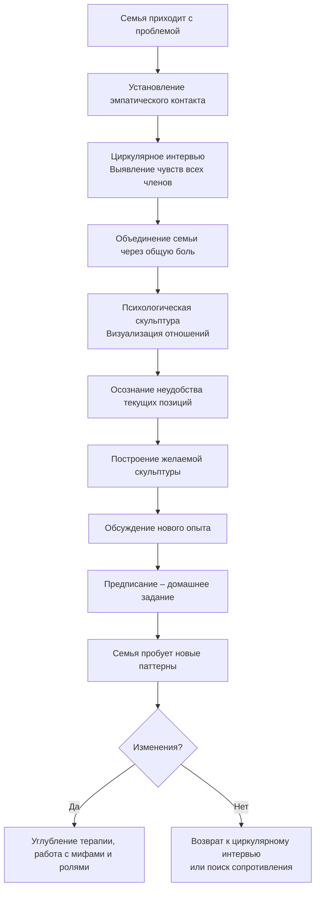

Каждая семья уникальна. У неё свой язык, свои ритуалы, своя история. Но есть и общее: в любой семье заложен огромный потенциал роста, развития и преображения. Однако этот потенциал часто блокируется преградами — непониманием, старыми обидами, жёсткими ролями, семейными мифами. Семейная психотерапия создаёт условия, чтобы семья смогла реализовать свой внутренний бытийный потенциал, изменить отношения и вернуть себе способность к развитию.

## Основное определение семейной психотерапии

**Семейная психотерапия (консультирование)** — это создание условий для изменений, для перемен в жизни семьи, в семейных отношениях, в семейном общении.

Каждая семья обладает **безграничным бытийным потенциалом** изменения, роста, развития, становления, самосозидания, трансформации, самоактуализации. Этот потенциал заложен изначально, но в процессе жизни вокруг него формируются преграды, барьеры, «экраны», «цепи», которые препятствуют его реализации или искажают её. Эти барьеры искажают внутрисемейные отношения, создают боль и непонимание.

Главной характеристикой терапевтических условий является особый **контакт** между семьёй и психотерапевтом (или командой терапевтов). Установить контакт с семьёй — это искусство. Основное качество этого контакта — **сознательная любовь**. Не сентиментальная привязанность, а ясное, принимающее, внимательное отношение, которое позволяет семье раскрыться.

## Семья как психологический феномен

Семья — это сложнейшая общность людей. Её жизнь многогранна и включает множество аспектов, каждый из которых может стать предметом исследования и терапии:

- семья и любовь;
- семья и телесность;
- семья и здоровье;
- семья и спорт;
- семья и общество;
- семья и деньги;
- семья и культура;
- семья и искусство;
- семья и образование;
- семья и время;
- семья и религия;
- семья и природа.

Болезнь одного из членов семьи влияет на всех. Столкновение с обществом кого-то из членов семьи меняет динамику всей системы. Понимание этой сложности необходимо для точной терапевтической работы.

### Психология семейного бессознательного

Семья складывается задолго до встречи будущих супругов. Бессознательные мотивы, семейные сценарии, невысказанные ожидания — всё это образует мощный пласт неосознаваемого материала, с которым предстоит работать.

Ключевые вопросы, которые возникают при анализе семейного бессознательного:
- Кто или что выбирает партнёра?
- Что движет человеком при вступлении в брак — чувства или разум?
- Какую роль играет негласный брачный контракт?
- Какова динамика отношений на бессознательном уровне?
- Какие бессознательные мотивы стоят за решением родить ребёнка?

В работе с семьёй психолог постоянно сталкивается с этим глубинным фондом — с тем, что не проговаривается, но определяет поведение каждого члена семьи.

## Основные понятия семейной терапии

### Семья как система

В системной семейной терапии семья рассматривается как система, состоящая из взаимосвязанных подсистем и элементов, находящихся в динамических взаимоотношениях друг с другом. Характер связей в каждой семье особенный. Для полноценной диагностики желательно видеть семью в трёх поколениях — это позволяет понять, как передаются паттерны отношений.

**Как попадают в семейную систему?**
- Рождение;
- брак;
- усыновление/удочерение.

**Как выходят из семейной системы?**
Из семейной системы невозможно выйти полностью. Даже после смерти влияние умершего может оставаться очень сильным. Например, отец-алкоголик после смерти может идеализироваться родными, и его образ продолжает влиять на семейные отношения. Развод — это не выход, а усложнение семейной системы. Бывшие супруги и их новые партнёры создают новые связи, но старые не исчезают.

Отсюда следует вывод: всё человечество в каком-то смысле родственники — мы все связаны через поколения.

### Семейный гомеостаз

**Семейный гомеостаз** — это тенденция поддерживать семейную целостность и стабильность. Система стремится сохранить привычное равновесие, даже если оно болезненно. Любое изменение (например, взросление ребёнка, попытка одного из супругов изменить поведение) встречает сопротивление со стороны гомеостатических механизмов.

### Центробежные и центростремительные силы

В любой семье действуют две группы сил:
- **центробежные** — толкают членов семьи вовне, к автономии, независимости, отделению;
- **центростремительные** — удерживают вместе, создают сплочённость, зависимость.

Баланс этих сил определяет динамику семьи. Кризисы часто возникают, когда баланс нарушается (например, подросток пытается отделиться, а семья не отпускает).

### Семейная боль и идентифицированный пациент

**Семейная боль** — это страдание, которое испытывает вся семья, если кто-то из её членов болен или переживает трудности. Боль всегда семейная, она затрагивает души и тела каждого участника.

**Идентифицированный пациент** — тот член семьи, который сфокусировал на себе всю семейную боль. Именно он предъявляет симптом (например, депрессию, зависимость, плохое поведение), но на самом деле симптом принадлежит всей системе. Работа только с идентифицированным пациентом без изменения семейного контекста малоэффективна.

### Системное семейное мышление

**Системное семейное мышление** — это способ мышления, в центре которого находится не отдельный человек, а семейная общность в целом. Семейный консультант и психотерапевт должен овладеть этим мышлением. Оно позволяет видеть, как поведение одного члена семьи связано с реакциями других, как циркулируют паттерны взаимодействия.

### Особенности вхождения в семью

Терапевт входит в семью в нескольких ипостасях:
- **эксперт** — тот, кто знает, как устроены семейные системы;
- **модель** — своим поведением показывает образцы здорового общения;
- **комментатор** — описывает происходящее, делая скрытые процессы видимыми.

Глубинное вхождение обеспечивается эмпатией — способностью чувствовать состояние семьи изнутри.

## Методика системной семейной терапии

### Командная работа и зеркало Гезела

В системной семейной терапии часто используется командная работа. Это связано с тем, что семья — сложный объект, и одному терапевту трудно одновременно удерживать контакт со всеми её членами и отслеживать системную динамику.

В команде могут быть:
- **терапевты-контактёры** — непосредственно работают с семьёй;
- **терапевт-переговорщик** — тоже участвует, помогая выстраивать диалог;
- **терапевты-супервизоры** — наблюдают за процессом через специальное оборудование.

Классическое оснащение — **зеркало Гезела** (одностороннее зеркало, за которым находятся супервизоры). Сегодня часто используется видеоаппаратура и мониторы. Такая организация позволяет получить более объёмное видение семейных процессов.

### Методы контакта с семьёй

Для установления и поддержания контакта с семьёй применяются различные методы:

#### Диалог
Базовый метод, построенный на принципах эмпатического слушания, но с учётом множественности участников. Терапевт поочерёдно или одновременно поддерживает диалог с разными членами семьи, удерживая фокус на системных связях.

#### Циркулярное интервью
Один из ключевых методов. Терапевт выбирает значимую ситуацию или момент и опрашивает всех участников по кругу. Каждый член семьи должен рассказать о гамме своих чувств к семье, к себе и к ситуации в целом. Например, если проблема в том, что дочь поздно возвращается домой, терапевт спрашивает каждого: «Что вы чувствуете, когда дочь задерживается?», «Как вы думаете, что чувствует она?», «Как это влияет на ваши отношения?».

Цель циркулярного интервью — показать, что семья — единое целое, и что все переживают сходные чувства. На первой встрече обычно центрируются на переживании душевной боли, чтобы объединить семью в общем страдании и мотивировать к изменениям. После выслушивания терапевт резюмирует: «Посмотрите, вы все испытываете душевную боль — как единый организм. Но при этом каждый стоит на своей позиции».

#### Психологические скульптуры
Метод, позволяющий визуализировать семейные отношения. Терапевт просит членов семьи встать так, как они чувствуют свои позиции по отношению друг к другу. Например, изобразить в позах, кто к кому как относится, кто от кого отвернулся, кто тянется. После того как семья застыла в «скульптуре боли», терапевт спрашивает: «Чувствуете ли вы напряжение? Удобно ли вам так стоять?». Затем даёт инструкцию: «А теперь встаньте так, как вам бы хотелось». Обычно после этого все обнимаются или располагаются более гармонично. Скульптуры помогают быстро перевести невербальный опыт в осознание и дают толчок к изменениям.

#### Предписания
Это домашние задания для всех членов семьи. Они предполагают опробование новых способов общения, парадоксальную перестройку отношений и позиций. Например, терапевт может предложить супругам провести выходные вдвоём в отеле, без детей, чтобы восстановить контакт. Или попросить семью каждый вечер в течение 10 минут говорить только о приятных событиях дня. Важно, что предписания даются после того, как семья уже пережила новый опыт на сессии (например, в скульптуре), и они должны быть выполнимыми.

### Параметры изучения семейных систем

Чтобы помочь семье осознать свои особенности, терапевт направляет её внимание на следующие параметры:

#### Границы семьи
- Насколько они гибкие или ригидные? Может ли бабушка прийти без предупреждения?
- Меняются ли границы с течением времени (например, после рождения детей)?
- Как семья реагирует на вторжения или, наоборот, на отдаление?

#### Семейная иерархия и управление
- Кто лидирует в семье?
- Как принимаются решения?
- Есть ли скрытые лидеры?

#### Семейные истории, сценарии и мифы
У каждой семьи есть своя мифология — истории, которые передаются из поколения в поколение. Они могут как поддерживать, так и разрушать семью. Выявлять их нужно с осторожностью, уважая право семьи на тайну. Подвергать групповому обсуждению можно только то, что семья сама готова открыть. Инструментом изучения служит **генограмма** — схема семьи с указанием родственных связей, значимых событий, болезней, моделей отношений.

#### Семейные роли
Роли отражают естественный статус семьи, но они не всегда связаны с половозрастными различиями. Ребёнок может выполнять роль отца, если отец отсутствует или болен. Мать может стать лидером, если отец потерял работу. Инверсия семейных ролей — частая причина дисгармонии. Важно, чтобы члены семьи осознали, какие роли они играют, и смогли при необходимости их перераспределить.

### Техники работы (структура сессии)

На практике сессия семейной терапии может строиться следующим образом:

1. **Эмпатический контакт.** Терапевт устанавливает контакт с каждым присутствующим. Если говорят родители, он слушает их с полным вниманием.
2. **Метафоры семейной атмосферы.** Терапевт может предложить семье описать атмосферу в доме через метафоры (например, «как будто мы живём в военном лагере»). Затем — короткий перерыв (чай-кофе), чтобы снизить напряжение.
3. **Циркулярное интервью.** Выбирается значимый эпизод, и каждый член семьи рассказывает о своих чувствах. Терапевт центрирует на боли, а затем объединяет семью в общем переживании.
4. **Психологические скульптуры.** Семья изображает свои отношения в пространстве. После этого — обсуждение ощущений и переход к желаемой скульптуре.
5. **Предписания.** На основе сессии семья получает задание на дом. Важно, чтобы задание было конкретным и выполнимым.

---

## Запомнить

- **Семейная психотерапия** — это создание условий для реализации внутреннего бытийного потенциала семьи. Главный инструмент — контакт, основанный на сознательной любви.
- **Семья как система** включает три поколения, имеет сложную структуру и подчиняется закону гомеостаза.
- **Идентифицированный пациент** — носитель симптома, который принадлежит всей семье. Работать нужно с системой, а не только с ним.
- **Системное семейное мышление** позволяет видеть связи, циркулярные паттерны и скрытые роли.
- **Методы работы**: циркулярное интервью (сбор чувств всех членов), психологические скульптуры (визуализация отношений), предписания (домашние задания для всей семьи).
- **Командная работа** и использование зеркала Гезела повышают эффективность терапии, позволяя наблюдать за процессом со стороны.
- **Параметры анализа** семьи: границы, иерархия, истории и мифы, роли. Изучение этих параметров помогает семье осознать свои неэффективные паттерны.
- **Перемены возможны всегда**, даже если сейчас в семье только конфликты. Каждая семья изначально обладает ресурсом для исцеления и роста.
