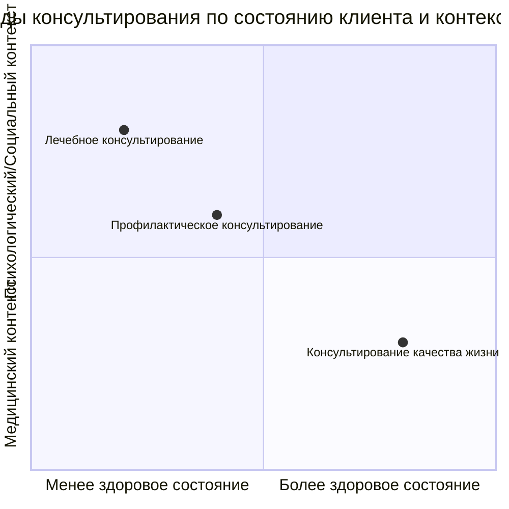

Психологическое консультирование часто воспринимается как продукт XX века, порождение западной научной мысли. Однако его корни уходят в глубокую древность. На протяжении тысячелетий под разными именами и в различных формах существовала практика, направленная на преображение человеческой души, изучение законов ее возможной эволюции и помощь в сознательном изменении жизни.

## Древние корни практики изменения сознания

Идея целенаправленной работы с внутренним миром человека не является новой. Она присутствовала в культурах и традициях, которые мы сегодня относим к сфере философии, религии или эзотерики.

**В Древнем Египте и античном мире** жрецы и философы выполняли функции, которые сейчас можно отнести к психотерапевтическим. Греческие и римские философские школы, такие как стоики, эпикурейцы или киники, были не только теоретическими кружками, но и практическими сообществами. Они предлагали систему взглядов и упражнений для достижения душевного покоя (*атараксии*), преодоления страстей и осмысленной жизни. Их диалоги с учениками были формой консультирования.

**Религиозный контекст** на протяжении веков служил основной рамкой для практик преображения. Все мировые религии развивали каноны жизни, ритуалы, молитвы и медитации, направленные на «стяжание духа», очищение, самопознание и преодоление страданий. Эти практики содержали глубокое психологическое знание о работе с вниманием, эмоциями и мотивацией.

**Искусство и мистерии** также выступали инструментами трансформации. В Древней Греции театральные трагедии, по замыслу Аристотеля, проводили катарсис — очищение через сострадание и страх. Мистерии в Египте и Элладе были сложными ритуалами посвящения, менявшими сознание участников. Школы поэзии, танца или архитектуры передавали не только мастерство, но и особое состояние восприятия и бытия.

**Символические учения** Средневековья и позднее — астрология, алхимия, магия, а позднее масонство и теософия — с точки зрения истории психологии можно рассматривать как попытки систематизировать знания о внутреннем мире человека, его связи с космосом и этапах внутренней трансформации. Их язык был символическим, а цель — духовно-психологическое совершенствование.

Таким образом, современное психологическое консультирование и психотерапия являются наследниками этой многовековой традиции, переведенной на язык научной и практической психологии.

## Психологическое консультирование в системе помогающих практик

Сегодня консультирование существует в ряду других форм психологической работы. Важно понимать их различия в целях, методах и целевой аудитории.

| Практика | Основная цель / фокус | Примечания |
| :--- | :--- | :--- |
| **Психотерапия** | Глубинное лечение психических расстройств, работа с личностью, часто долгосрочная. | Часто пересекается с консультированием, граница условна. Требует медицинского или психологического образования. |
| **Психокоррекция** | Корректировка конкретных нарушенных функций или форм поведения (например, у детей с СДВГ). | Более узкая, симптомо-ориентированная работа. |
| **Психогигиена** | Профилактика психических расстройств, поддержание психического здоровья через образ жизни. | Образовательные и просветительские программы. |
| **Восстановительное обучение (реабилитация)** | Восстановление утраченных психических функций после болезней, травм, операций. | Работа в связке с врачами, нейропсихологами. |
| **Психологический тренинг** | Развитие конкретных навыков (коммуникация, уверенность, лидерство) в групповом формате. | **Критика в лекции:** даёт сильный энергетический подъём, который может привести к импульсивным решениям (развод, увольнение), о которых потом жалеют. Эффект может быть краткосрочным. |
| **Коучинг** | Достижение конкретных жизненных или профессиональных целей, работа с рациональным планом действий. | Фокус на будущем и результатах. Иногда коучи неосознанно вторгаются в терапевтическую область без должной подготовки. |
| **Целительство** | Заявленное исцеление физических или душевных недуг сверхъестественными или «энергетическими» методами. | **Важное примечание:** В лекции упоминаются «редкие таланты», однако **отсутствуют научные доказательства эффективности** подобных практик. Существует риск отказа от реального медицинского или психологического лечения. |
| **Психологическая помощь** | Широкое понятие, включающее кризисную помощь, поддержку, информирование. | Может оказываться не только психологами, но и подготовленными волонтёрами, например, на телефоне доверия. |
| **Помогающие профессии** (социальная работа, mentoring) | Широкая поддержка в социальной адаптации, решении практических проблем. | **Ключевая мысль из лекции:** Если считать главной задачей «помощь», это может невольно культивировать позицию слабости и беспомощности у клиента. |

## Определение, предмет и цели психологического консультирования

В рамках данного курса предлагается следующее понимание:
*   **Определение:** Психологическое консультирование — это **искусство создания условий для изменения человека**. Речь идёт о изменении внутреннего мира, поведения, отношений и жизненного пути в целом.
*   **Предмет:** Внутренний мир человека в процессе его **сознательного изменения и преображения**.
*   **Задача консультанта:** Не «влиять», «менять» или «лечить» клиента. Даже своих детей изменить невозможно. Задача — создать такие условия в диалоге и отношениях, при которых у клиента активируются его собственные ресурсы, и перемены становятся возможными и естественными. Консультант — не причина изменений, а их **катализатор**.

## Виды консультирования по сфере применения

Материалы лекции предлагают классификацию, основанную на целевой группе и контексте оказания услуг.

**Лечебное консультирование (психотерапия)**
*   **Кому адресуется:** Люди с диагностированными психическими расстройствами (депрессия, тревожные расстройства) или психосоматическими заболеваниями.
*   **Где осуществляется:** Стационары, диспансеры, поликлиники. Работа ведётся в бригаде с врачом-психиатром или психотерапевтом, где основная ответственность лежит на враче. Клинический психолог является частью этой команды.

**Профилактическое консультирование**
*   **Кому адресуется:** Люди из групп риска, у которых ещё нет заболевания, но присутствуют факторы, повышающие вероятность его развития (хронический стресс, травма, сложная жизненная ситуация).
*   **Где осуществляется:** Поликлиники, консультационные центры, диспансеры. Цель — предотвратить переход в болезнь.

**Консультирование качества жизни**
*   **Кому адресуется:** Условно здоровые люди, стремящиеся к большей осознанности, самореализации, решению экзистенциальных или личностных вопросов, улучшению отношений.
*   **Где осуществляется:** Специализированные психологические центры, студии личностного роста, частная практика.

## Современные вызовы и перспективы

Лекция указывает на контекст, в котором развивается консультирование сегодня, — эпоху **цивилизационного слома**, связанного с развитием искусственного интеллекта, нейроинтерфейсов и биоинженерии.

Возникают новые вопросы, стоящие перед практической психологией:
*   Как изменится **психосоматика** и самовосприятие человека, если в его мозг будут вживлены чипы, расширяющие когнитивные возможности?
*   Останется ли человек с киберимплантами «человеком» в традиционном психологическом понимании, или мы столкнёмся с новым гибридным существованием?
*   Этические и экзистенциальные дилеммы, связанные с подобными технологиями, станут полем работы для консультантов будущего.

Параллельно с внешними технологическими вызовами остается и вечный внутренний фронт работы. **Глубины бессознательного**, механизмы интуиции, природа сознания — всё это по-прежнему представляет собой terra incognita для науки. Практика консультирования, стоя на стыке науки, искусства и древних традиций самоисследования, продолжает быть одним из инструментов познания этих тайн.

## Запомнить

*   **Психологическое консультирование имеет глубокие исторические корни** в античной философии, религиозных практиках, древних мистериях и символических учениях (алхимия, астрология). Современная практика — это перевод древних интуиций на язык научной психологии.
*   **Консультирование отличается от других помогающих практик** (психотерапии, коучинга, тренинга) своей основной задачей — **созданием условий для самостоятельного изменения клиента**, а не прямым воздействием на него.
*   **Критический взгляд на некоторые практики** (тренинги, целительство) важен: тренинги могут давать краткосрочный эмоциональный подъём, ведущий к необдуманным решениям, а эффективность целительства **не имеет научных доказательств**.
*   **Основные виды консультирования** разделяются по контексту: **лечебное** (в мед. учреждениях для больных), **профилактическое** (для групп риска) и **консультирование качества жизни** (для здоровых людей в психологических центрах).
*   **Современные вызовы** — развитие ИИ, нейроинтерфейсов, биохакинга — ставят перед консультированием новые вопросы о природе человека, его психосоматике и этике, расширяя поле для будущих исследований и практик.
*   **Предмет консультирования** — внутренний мир человека в процессе **сознательного преображения**. Роль консультанта — быть катализатором этого процесса, а не его причиной.
