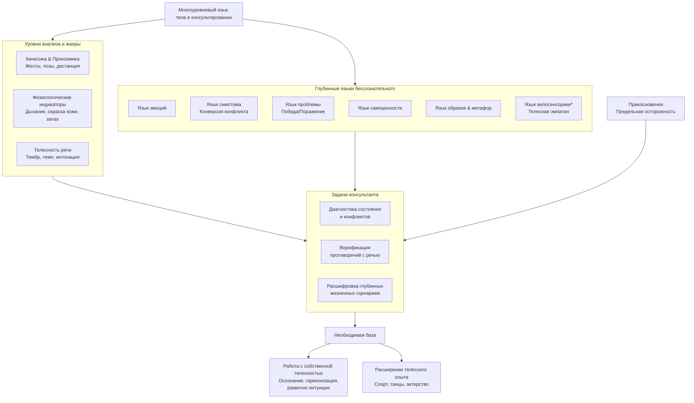

В кабинете психолога звучат два параллельных языка. Первый — речь, линейная и логичная, повествующая о событиях и мыслях. Второй — язык тела, мгновенный и искренний, транслирующий эмоции, внутренние конфликты, жизненные сценарии и даже тип личности. Умение читать этот многослойный невербальный текст и осознавать собственные телесные реакции — ключевой навык для глубинного контакта.

## Тело: дар, удовольствие, инструмент и отражение личности

Человеческое тело — уникальный дар, получаемый безвозмездно. Его первичный язык — язык **телесных удовольствий**, возникающих спонтанно и напрямую связанных с органами чувств. Однако эта радость мимолетна. Телесные удовольствия — ненадежный фундамент для жизни, но бесценный компас. Когда «с душой плохо», тело подает сигналы: боль, дискомфорт, болезнь. Оно становится не только источником наслаждения, но и уникальным инструментом общения, зеркалом личности и летописью жизненных проблем.

### Конституциональный подход и типология телесности

С древних времен и до наших дней наблюдается устойчивая идея о связи физического облика и психологического склада. **Конституциональный подход в психологии** предполагает, что по структуре тела (типу телосложения) можно определить характерные черты личности, склонности и модели поведения.

Современные исследования, такие как работы П. Лисовского и С. Трощенко («Психология типов тела»), подтверждают, что существует взаимосвязь между физическими качествами («типом тела») и тем, как человек воспринимает мир, чувствует, думает и действует. Это не жесткая determinзм, а статистическая тенденция, отражающая единство психофизической организации.

**Типология телесности** рассматривает, например, как астеническое (худощавое), атлетическое (мускулистое) или пикническое (плотное) телосложение может коррелировать с определенными поведенческими паттернами, энергетическим тонусом и уязвимостью к специфическим стрессам. Для консультанта это — еще один словарь для понимания клиента, помогающий увидеть не только сиюминутное состояние, но и его конституциональные, врожденные предпосылки. **Изменение общего облика человека** (резкое похудение, набор веса, нарушение осанки) также может быть важным маркером глубинных психологических изменений или кризиса.

## Язык тела: от эмоций к проблемам и победам

**Язык тела** — это система знаковых элементов, с помощью которых передаются чувства, эмоции и внутренние конфликты. Если **речь — это язык мышления**, то **тело — язык эмоций**. Однако его лексикон богаче: помимо сиюминутных чувств, тело говорит на языках симптома и проблемы.

### Язык симптома: когда душа кричит телом

Наиболее драматичный жанр телесного языка — **язык симптома**. Его основная идея: **если душе плохо, тело болеет**. Этот процесс называется **конверсией** — трансформацией глубинного психического конфликта в физический симптом (паралич, слепота, тики, хроническая боль). Симптом — это крик тела о помощи, когда душа не может выразить страдание словами.

### Язык психологической проблемы: территория борьбы и достижений

Помимо симптома, тело выражает и саму **структуру жизненных трудностей**. **Стремление человека побеждать, переустраивать свою жизнь, а также препятствия и трудности на этом пути имеют свою территорию внутри телесного языка — это язык проблемы**.

**Телесность может быть языком поражения, неуспеха, потери или, наоборот, — победы, успеха, достижения.**
*   **Язык поражения:** хронически ссутуленные плечи («груз неудач»), опущенная голова, «тяжелая» походка, ощущение «каменного» напряжения в шее и плечах как символ неподъемной ноши ответственности.
*   **Язык победы:** расправленные плечи, «легкая» походка, прямой открытый взгляд, ощущение «крыльев за спиной». Даже дыхание в состоянии успеха становится более полным и свободным.

Таким образом, наблюдая за телесным паттерном клиента, консультант может получить доступ не только к текущей эмоции, но и к его глубинному жизненному сценарию — ощущает ли он себя побежденным или победителем, находится ли в состоянии борьбы или капитуляции.

## Кинетико-проксемический анализ: грамматика телесного языка

Чтобы системно читать язык тела, консультант использует **кинетско-проксемический анализ**:
*   **Кинесика:** изучение жестов, поз, мимики.
*   **Проксемика:** изучение дистанции в общении.

Этот анализ дает объемную картину: *как* движется тело и *на каком расстоянии* клиент выстраивает контакт.

## Жанры телесного языка: от походки до прикосновений

Телесный язык реализуется через конкретные, наблюдаемые «жанры»:
1.  **Походка, позы:** индикаторы устойчивого состояния (шаркающая походка, «закрытая» поза).
2.  **Жесты, мимика:** мгновенные реакции, микроэкспрессии выдают истинные эмоции.
3.  **Дыхание:** ритм напрямую связан с состоянием (учащенное — тревога, глубокое — покой).
4.  **Окраска кожи:** непроизвольный признак (покраснение — стыд, побледнение — страх).
5.  **Запах:** может меняться от стресса, эмоций.
6.  **Телесность речи (паралингвистика):** *как* говорят — важнее *что*.
7.  **Прикосновения:** в терапии требуют предельной осознанности и осторожности из-за риска нарушения границ.

## Работа консультанта с собственной телесностью

Умение читать клиента начинается с умения читать себя. Консультант должен активно работать с собственной телесностью, иначе его реакции будут проекциями, помехами.

### Задачи консультанта в развитии телесной компетентности:
1.  **Осознание и самонаблюдение.** Постоянный контакт с собственным организмом, отслеживание своих телесных реакций на разных клиентов и ситуации.
2.  **Обогащение и гармонизация телесного языка.** Ликвидация психофизических зажимов и предрассудков, расширение диапазона собственной телесной выразительности и приемлемости.
3.  **Развитие «висцеро-тонального мышления» и организмического познания.** Это способность чувствовать и мыслить всем телом, а не только головой. **Интуиция в психотерапии рассматривается как высшая форма такого познания.**
4.  **Расширение телесного опыта.** Для развития интуиции и эмпатии нужно развивать тело: занятия спортом, танцами, актерским мастерством, практики осознанности. Как сказано в материале: «Стать танцором, актером, спортсменом» — не для карьеры, а для обогащения внутреннего инструментария.
5.  **Чувствовать чувства клиента в своем теле (велосенсорика).** Развитая телесная чувствительность позволяет буквально «настраиваться» на состояние клиента, ощущая в своем теле отголоски его эмоций и напряжений, что лежит в основе глубокой эмпатии.
6.  **Сепарация своих проекций.** Методы вроде просмотра фильмов с последующим анализом собственных реакций (как в беатотерапии) помогают выявить свои «слепые пятна» и не накладывать их на клиента.

Клиент подсознательно считывает язык тела консультанта. Напряженный, скованный или, наоборот, развязный терапевт может блокировать доверие. Открытая, спокойная, «присутствующая» поза, гармоничные жесты и соответствующая дистанция создают безопасное пространство.

## Языки беатотерапевтического контакта: многоуровневая коммуникация

Общение, особенно терапевтическое, — это многослойное послание, где информация передается одновременно на нескольких «языках», уходящих вглубь бессознательного. В беатотерапии выделяют следующие ключевые языки контакта, которые необходимо изучать:
*   **Речь** (язык мышления)
*   **Язык тела** (язык эмоций)
*   **Язык симптома** (криптограмма психического конфликта)
*   **Язык проблемы** (телесное воплощение жизненного сценария)
*   **Язык самоценности** (как тело выражает принятие или отвержение себя)
*   **Язык образов и метафор** (символический уровень, доступный через фантазию, сны, ассоциации)
*   **Язык велосенсорики** — способность использовать тонкое телесное чувствование для эмпатии и понимания другого, развиваемая в практике.

**Послания в общении пишутся одновременно на разных языках.** Задача консультанта — научиться их интегрировать. Когда слова клиента говорят «я справлюсь», а его тело сжато в комок и дыхание прерывисто, истинное послание кроется в контрасте. **Движение вглубь бессознательного** часто происходит через **язык метафор** и образов, которые рождаются как из речи, так и из телесных ощущений.

## Запомнить

*   Тело — **многоуровневый текст**: язык эмоций, симптомов, жизненных проблем (победы/поражения) и отражение типологических особенностей личности (конституциональный подход).
*   **Язык психологической проблемы** проявляется в теле как паттерн победы (расправленность, легкость) или поражения (сутулость, тяжесть), рассказывая о глубинном жизненном сценарии клиента.
*   Для консультанта критически важна **работа с собственной телесностью**: осознание своих реакций, гармонизация, развитие интуиции (как организмического познания) и велосенсорики — способности чувствовать состояние клиента в своем теле.
*   **Развитие телесного опыта** (танцы, спорт, актерство) напрямую обогащает профессиональный инструментарий терапевта, усиливая эмпатию и точность восприятия.
*   **Терапевтический контакт** — многослойное общение, где послания передаются одновременно на многих языках: речи, тела, симптома, проблемы, образов. Умение их расшифровывать и интегрировать — основа глубинной работы.
*   Клиент бессознательно считывает **телесный язык консультанта**, поэтому осознанная, гармоничная и присутствующая телесность терапевта — необходимое условие для создания безопасного и доверительного пространства.
