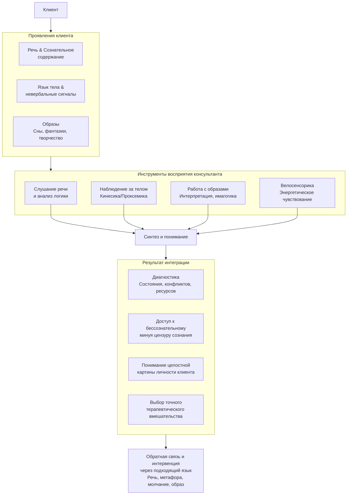

В кабинете психолога встречаются два мира. Первый — мир сознания, логики и речи, где все стремится к ясности и причинно-следственным связям. Второй — мир бессознательного, где правят иные законы, а информация поступает не в виде понятий, а в виде живых, энергичных, порой пугающих образов. Умение консультанта быть «переводчиком» между этими мирами, понимать **язык образов**, определяет, сможет ли работа коснуться глубинных пластов психики или останется на поверхности рациональных обсуждений.

## Сознание и бессознательное: два разных закона

Чтобы понять язык образов, нужно осознать принципиальную разницу между работой сознания и бессознательного.

**Сознание** подчиняется законам, подобным классической геометрии Евклида или физике Ньютона. Эти законы логики (изученные еще Аристотелем) являются конвенциональными, то есть общепринятыми и передаваемыми от человека к человеку. **Языком сознания является речь.** Мышление оперирует понятиями, категориями и обобщениями, которые мы можем в определенной мере контролировать и осознавать.

**Бессознательное** строится по иным принципам — **законам Бытия**. Оно не конвенционально, а глубоко индивидуально и субъективно. Его законы ближе к неевклидовой геометрии Лобачевского или физике Эйнштейна, где возможны иные связи и искажения. Постичь бессознательное логическим умом напрямую невозможно. Мы можем лишь наблюдать и интерпретировать результаты его работы, которые являются сознанию в специфической форме. **Языком бессознательного являются образы.**

Бессознательное постоянно и активно общается с сознанием, влияет на него, а зачастую и управляет им. Оно «бьется» в наше сознание, пытаясь быть прочитанным и услышанным.

## Образ как алфавит энергии: позитивность и негативность

Образы — это не просто картинки в голове. Это **алфавит энергии**, заряженные кванты психической силы (катексис).

Изначально вся человеческая энергия, как энергия жизни и Бытия, позитивна. Это сила роста, развития, творчества, любви. Однако в психике накапливается и другой материал.

**Негативность** — это энергия психологического содержания, которое не было понято, прожито, выражено и в итоге было **цензурировано и вытеснено** в бессознательное. Эта энергия, подобно застойной крови, изолируется, лишается движения и «перекисает», превращаясь в токсичный груз.

Таким образом, мир образов — это язык **двух видов энергии**:
1.  **Позитивной, бытийной:** находящейся в движении, стремящейся к жизни, победе и росту.
2.  **Негативной, «перекисшей»:** застывшей, испорченной, представляющей угрозу для Бытия.

Каждый человек — целый океан таких образов. Образы негативности, словно маяки, указывают на те внутренние или внешние структуры, которые содержат угрозу, блокируют развитие и причиняют душевную боль.

## Образы в консультировании: рентгенограмма души

Умение прочитывать образы бессознательного — ключевое профессиональное умение консультанта и одно из высших проявлений интуиции.

**Образы — это рентгенограмма внутреннего мира и состояния души.** То, что непостижимо для самого клиента, может стать доступным для анализа умелого консультанта, подобно тому, как врач читает рентгеновские снимки.

Через систему образов клиента консультант может понять:
*   **Где его сила:** какие образы несут позитивную, бытийную энергию?
*   **Где блоки и причины страданий:** какие образы представляют «перекисшую» негативность, вытесненные конфликты, травмы?
*   **Какова актуальная динамика:** какие образы доминируют *сейчас*, независимо от того, когда они возникли?

Обнаружение и анализ этой образной системы позволяет не только диагностировать состояние, но и наметить пути терапии, помогая клиенту трансформировать застывшую негативную энергию в движение и рост.

## Три пути к бессознательному: как работать с образами

Доступ к миру образов и их терапевтическое использование осуществляется через три основных канала.

### 1. Дневные фантазии и имагогика
**Имагогика** (от лат. *imago* — образ) — это техника работы с образами, возникающими в состоянии направленного внимания, фокусировки или легкого транса, близкого к полусну. Она основана на том, что человек — это система образов.

Работа в этом направлении требует создания особых условий, помогающих клиенту обратить внимание внутрь себя, отключившись от внешних раздражителей. Сюда относятся:
*   **Эриксоновский гипноз (недирективный гипноз):** терапевт помогает клиенту войти в состояние легкого транса, оставаясь при этом в контакте. В этом состоянии бессознательное становится более доступным для порождения и восприятия образов.
*   **Направленные визуализации:** клиента мягко направляют в путешествие по внутренним ландшафтам, встречаясь с символическими образами (например, «мысленное безопасное место», «встреча с внутренним советником»).

### 2. Сновидения: «столбовая дорога к бессознательному»
Сновидения с древнейших времен рассматривались как послания из иного мира — мира богов, предков или, в психологическом ключе, бессознательного. В терапии существует два основных подхода к их толкованию:

*   **Конвенциональный (договорной) подход:** предполагает существование универсального или культурно-обусловленного словаря символов. Классические примеры:
    *   **З. Фрейд:** сновидение — замаскированное исполнение вытесненных, часто сексуальных, желаний. Используется метод свободных ассоциаций для расшифровки символов (например, длинные предметы = фаллические символы).
    *   **К.Г. Юнг:** сновидение — прямое выражение бессознательного, говорящее на языке **архетипов** коллективного бессознательного (Тень, Анима/Анимус, Мудрый Старец). Сон — это «курьер» от бессознательных структур к сознанию.

*   **Бытийный подход (более современный и принятый в беатотерапии):** смещает фокус с универсального значения символа на его **личный смысл для сновидца**.
    *   **Ключевые вопросы:** Каков смысл этого образа для *твоей* жизни? Какова его действенность для тебя? Какие последствия для тебя несет этот сон?
    *   **Важнейший принцип:** Не имеет значения, когда сон приснился на самом деле. **Анализу подлежит рассказ о сне здесь и сейчас.** Сам способ рассказа, сопровождающие его язык тела, эмоции, паузы и велосенсорические ощущения консультанта важнее, чем буквальное содержание. Рассказ сновидения — это неосознаваемый психологический материал, конгруэнтный текущему состоянию клиента.

### 3. Творческие продукты
Творчество — будь то рисунок, танец, спонтанное сочинение истории, лепка или музыкальная импровизация — это прямой выход бессознательного в материальную форму, минуя цензуру сознания. **Язык образов в психологии творчества** позволяет анализировать эти продукты, чтобы понять внутренний мир автора, его неосознаваемые мотивы, эмоциональное состояние и конфликты.

Проективные методики («Нарисуй человека, дом, дерево», «Несуществующее животное») и методы арт-терапии строятся именно на этом принципе. Здесь образ, созданный руками клиента, становится объектом для совместного исследования и диалога.

## Велосенсорика: язык энергетического контакта

Работа с глубинными образами требует от консультанта особой чувствительности, выходящей за рамки зрения и слуха. Это **язык велосенсорики** — способность улавливать и воспринимать тонкие энергетические послания, идущие от клиента, всем своим телом и существом.

Согласно материалу, любое живое тело испускает энергетические кванты, способные передаваться и восприниматься. Чтобы использовать велосенсорику, консультанту нужно превратить себя в «точно настроенный радар».

Это достигается через:
*   **Развитие целостного телесного опыта и осознанности** (как описано в разделе о работе с собственной телесностью).
*   **Накопление опыта открытого и точного приема** этих посланий.
*   **Умение отличать свои собственные ощущения (проекции) от истинных велосенсорических сигналов от клиента.**

Велосенсорика особенно ярко проявляется, когда клиент рассказывает сон или фантазию. Консультант может буквально **чувствовать в своем теле** страх, напряжение, грусть или всплеск энергии, которые сопровождают рассказ, даже если слова клиента нейтральны. Это прямое, невербальное знание, которое дополняет и обогащает понимание образного материала.

## Интеграция языков: от образа к целостной картине

Язык образов не существует изолированно. Он является частью сложной, многоуровневой системы коммуникации в терапевтическом контакте.

На практике это выглядит так: клиент рассказывает о проблеме на **языке речи** (сознание). Его тело при этом может быть скованно (**язык тела**), выдавая тревогу. В ходе сессии он спонтанно вспоминает повторяющийся тревожный сон (**язык образов**). Консультант, слушая этот рассказ, чувствует тяжесть в груди (**велосенсорика**).

Синтезируя все эти данные, консультант понимает, что сознательный рассказ — лишь верхушка айсберга. Истинный конфликт, вытесненный и превратившийся в «перекисшую» энергию, зашифрован в образе из сна и «записан» в мышечных зажимах. Работа тогда может пойти через **язык метафор и образов** (предложить клиенту «поговорить» с персонажем из сна), через **работу с телом** (снять зажим) или через **осознание** (помочь связать образ, ощущение и жизненную ситуацию).

## Запомнить

*   **Сознание** говорит на языке логики и речи, **бессознательное** — на **языке образов**. Они подчиняются разным законам (конвенциональным и законам Бытия).
*   **Образы — это алфавит психической энергии.** Они бывают **позитивными** (бытийная энергия роста) и **негативными** (энергия вытесненного, «перекисшего» содержания). Последние указывают на зоны конфликтов и травм.
*   **Работать с образами можно через три канала:** 1) **Дневные фантазии и имагогика** (работа в легком трансе, визуализации); 2) **Сновидения**; 3) **Творческие продукты** (арт-терапия).
*   В толковании снов **бытийный подход** (личный смысл для сновидца *здесь и сейчас*) сегодня чаще предпочтительнее **конвенционального** (универсальные словари символов по Фрейду или Юнгу). Важен не сон, а **акт его рассказа** и сопутствующие невербальные сигналы.
*   **Язык велосенсорики** — это способность консультанта телесно и энергетически чувствовать состояние клиента. Это высший навык эмпатии, требующий развития собственной телесной осознанности и умения отделять свои проекции.
*   **Эффективный консультант интегрирует все языки:** речь, тело, самоценность, образы, велосенсорику. Только так можно составить целостную картину и выбрать точное терапевтическое вмешательство, способное достичь глубинных слоев психики. Язык образов — самый прямой мост к этим слоям.
