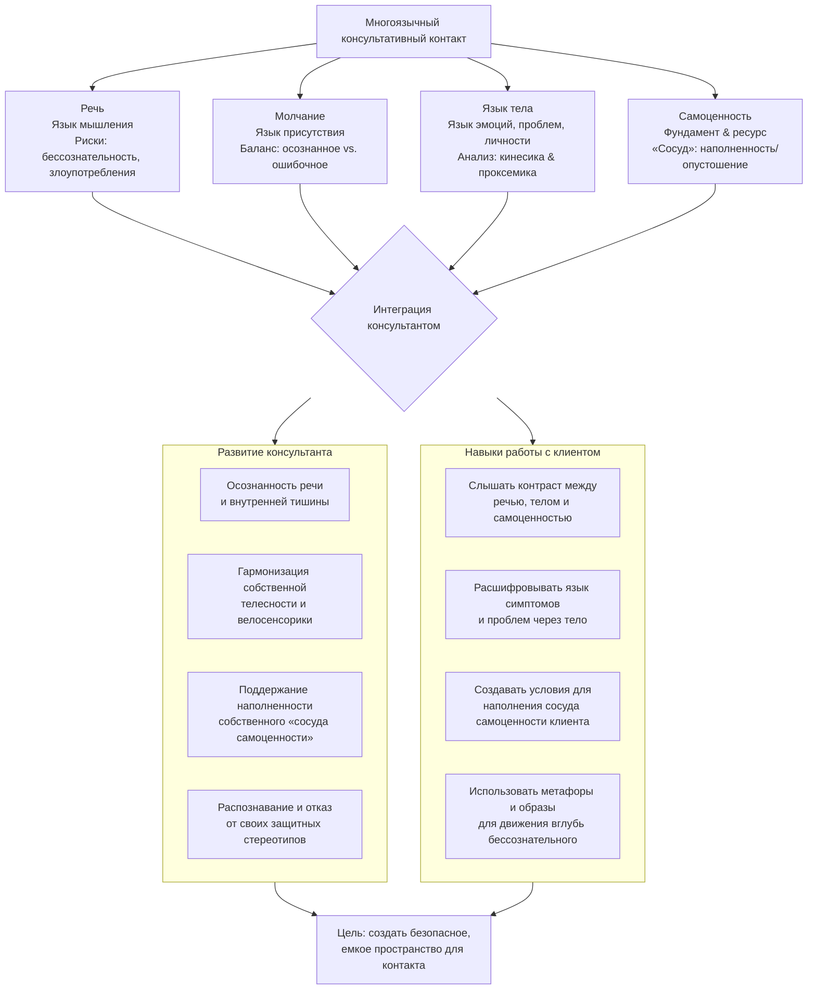

Психологический контакт похож на оркестр, где каждый инструмент ведет свою партию. Речь говорит о мыслях, тело кричит о чувствах, молчание создает пространство для понимания, а фундаментальное ощущение ценности собственного бытия — самоценность — определяет, насколько громко и искренне может звучать каждый из этих «голосов». Умение консультанта слышать и дирижировать этой сложной симфонией определяет глубину и результат работы.

## Речь и молчание: диалог и тишина как инструменты

Речь и молчание — две стороны одной коммуникативной медали. Одна без другой теряет смысл. Речь — основной, но коварный инструмент.

### Речь: язык мышления и его ловушки
**Речь** — это язык мышления, способ материализации и передачи мыслей. Она выполняет ключевые функции: номинативную (обозначает), обобщающую (категоризирует) и коммуникативную. Однако в консультировании речь часто становится не проводником, а барьером.

Главная опасность — **бессознательность речевого потока**. К речевым злоупотреблениям относятся:
*   **Многоречивость:** поток слов, за которым стоят страх небытия, тревога, тщеславие или потребность доказать свою значимость через мнение по любому поводу.
*   **Искажения:** безграмотность и резкий оценочный язык, который не описывает, а осуждает.
*   **Сплетни:** нарушение конфиденциальности и искажение информации.
*   **Внутренняя речь консультанта:** непрекращающийся внутренний монолог во время сессии, который блокирует возможность truly слышать клиента.

### Молчание: искусство присутствия
**Молчание** — это не отсутствие коммуникации, а ее активная форма, сложное состояние сознания. Оно может быть как целебным, так и разрушительным.

*   **Осознанное молчание** — инструмент консультанта. Оно экономит энергию, снижает тревогу, создает пространство для рефлексии клиента и позволяет слышать не только слова, но и смыслы за ними. Это практика, ведущая к лаконизму, точности и глубокому эмпатическому слушанию.
*   **Ошибочное (бессознательное или манипулятивное) молчание** — это помеха. Оно ранит, когда подменяет необходимую поддержку, четкий отказ, смелое высказывание или противостояние обману. Молчание-«бойкот» — это форма пассивной агрессии.

Задача консультанта — развить в себе способность к **внутренней тишине**, чтобы внешнее слово было весомым и точным.

## Язык тела: многослойный текст эмоций, проблем и личности

Если речь — это что сказано, то тело — это как. **Язык тела** — это прямая, нефильтрованная трансляция эмоций, внутренних конфликтов и жизненных сценариев.

### Кинесика и проксемика: грамматика невербалики
Для системного анализа используется **кинетско-проксемический анализ**:
*   **Кинесика** изучает *как движется тело*: жесты, позы, мимику.
*   **Проксемика** изучает *дистанцию* в общении, которая говорит о степени доверия, комфорте и культурных нормах.

### Жанры телесного языка и их значение
Тело говорит разными «жанрами», каждый из которых информативен:
1.  **Походка и поза:** показывают устойчивое состояние (уверенность, подавленность).
2.  **Жесты и мимика:** выдают мгновенные, часто неосознанные реакции.
3.  **Дыхание:** его ритм и глубина напрямую связаны с эмоциональным состоянием (тревога, покой, страх).
4.  **Окраска кожи и запах:** непроизвольные физиологические маркеры стресса, стыда, напряжения.
5.  **Телесность речи (паралингвистика):** тембр, темп, интонация. *Как* говорят — часто важнее *что*.

### От эмоций к проблемам и типу личности
Язык тела многослоен:
*   **Язык эмоций:** базовый уровень, сиюминутные чувства.
*   **Язык симптома (конверсия):** когда невыносимый психический конфликт превращается в физический симптом (паралич, боль). Тело «кричит» болезнью.
*   **Язык психологической проблемы:** тело воплощает жизненный сценарий. **Паттерны поражения** (сутулость, тяжесть) или **победы** (расправленность, легкость) рассказывают о том, как человек живет.
*   **Конституциональный подход:** тип телосложения (астеническое, атлетическое и др.) может коррелировать с определенными чертами темперамента и личности, что дает консультанту дополнительный контекст для понимания клиента.

### Работа консультанта с собственной телесностью
Чтобы читать клиента, нужно понимать себя. Консультанту необходимо:
1.  Осознавать свои телесные реакции и зажимы.
2.  Развивать **велосенсорику** — способность чувствовать состояние другого в своем теле.
3.  Расширять телесный опыт (танцы, спорт, актерство) для обогащения эмпатии и интуиции.
4.  Сепарировать свои проекции, чтобы не накладывать их на клиента.

Клиент бессознательно считывает язык тела консультанта. Спокойная, присутствующая, открытая поза создает безопасное пространство.

## Самоценность: фундаментальный ресурс контакта

**Самоценность** — это переживание наполненности Бытием в себе, жизненной силой. Это не **самооценка**, которая является когнитивной, измеримой и сравнительной оценкой себя. Самоценность — субъективное, глубокое эмоционально-когнитивное переживание, «сосуд», который может быть наполнен или опустошен.

### Метафора сосуда самоценности (Вирджиния Сатир)
Самоценность можно представить как сосуд:
*   **Наполненный сосуд:** человек переживает ценность жизни, из него изливается сила, любовь, эмпатия, ясновидение. Это состояние творчества и связи с миром.
*   **Опустошенный сосуд:** человек ощущает душевную боль, потерю жизненных сил, апатию, нелюбовь. В крайних случаях это ведет к суицидальным мыслям и поведению.

**Душевная боль** — это сигнал об опустошении сосуда. Как физическая рана реагирует болью на любое прикосновение, так и психологически уязвимый человек может болезненно реагировать даже на комплименты.

### Защитные стереотипы: псевдозащита, опустошающая сосуд
Чтобы избежать душевной боли, человек бессознательно использует ригидные **защитные стереотипы** (по Сатир):
1.  **Обвинитель:** «Это все твоя вина!»
2.  **Жертва:** «Я ничего не могу, я только стараюсь для вас».
3.  **Компьютер:** «Следует рассуждать рационально, чувства неуместны».
4.  **Флюгер:** непоследовательное, отвлекающее поведение.

Эти стереотипы — работа **ложной личности** и **псевдозащитных механизмов**. Они не наполняют сосуд самоценности, а лишь создают иллюзию безопасности, продолжая опустошать его, лишая человека уникальности и контакта с реальностью.

### Наполнение сосуда: победы и сознательная любовь
Сосуд самоценности наполняется через:
*   **Победы, даже маленькие:** эффективное завершение дел, новые навыки.
*   **Творческие акты:** делание чего-либо по-новому.
*   **Сознательную любовь:** искусство, которому нужно учиться.

Для консультанта жизненно важно поддерживать наполненность собственного сосуда. Терапевт, действующий из опустошения, рискует скатиться в роли Обвинителя, Жертвы, Компьютера или Флюгера, что разрушает терапевтический альянс.

## Синтез: языки беатотерапевтического контакта

Эффективный консультативный контакт — это одновременное общение на нескольких уровнях, или **языках**. В беатотерапии выделяют следующие ключевые языки, уходящие вглубь бессознательного:
1.  **Речь** (язык мышления).
2.  **Язык тела** (язык эмоций и проблем).
3.  **Язык симптома** (конверсия конфликта).
4.  **Язык проблемы** (телесный сценарий победы/поражения).
5.  **Язык самоценности** (фундаментальное переживание жизненной силы).
6.  **Язык образов и метафор** (символический уровень).
7.  **Язык велосенсорики** (тонкое телесное чувствование и эмпатия).

**Послания в общении пишутся одновременно на всех этих языках.** Противоречие между ними — ключ к диагностике. Например, когда речь говорит «я успешен», а тело демонстрирует паттерн поражения, а самоценность опустошена — истинная проблема лежит глубже декларируемого.

Задача консультанта — научиться свободно «читать» и интегрировать эти языки, одновременно работая над собственной «музыкальностью»: осознанной речью, гармоничной телесностью, способностью к тишине и, что важнее всего, с наполненным сосудом собственной самоценности. Только из этого ресурса может родиться настоящая встреча, которая поможет клиенту услышать самого себя.

## Запомнить

*   Консультативный контакт — **многоязычная система**. Ключевые языки: речь (мышление), тело (эмоции и проблемы), молчание (присутствие), самоценность (ресурс).
*   **Речь** подвержена бессознательным злоупотреблениям (многословие, искажения). **Осознанное молчание** — терапевтический инструмент, а бессознательное — помеха.
*   **Язык тела** многослоен: передает эмоции (кинесика/проксемика), конвертированные конфликты (симптомы), жизненные сценарии (проблемы) и отражает конституциональные особенности.
*   **Самоценность** — не самооценка. Это фундаментальное переживание жизненной силы («сосуд»). Его опустошение вызывает душевную боль и запускает ригидные **защитные стереотипы** (Обвинитель, Жертва, Компьютер, Флюгер), которые лишь усугубляют проблему.
*   **Задача консультанта — двуедина:** 1) Развивать себя (осознанная речь, гармоничная телесность, внутренняя тишина, наполненная самоценность). 2) Интегрировать все языки в работе с клиентом, слыша контрасты и создавая условия для наполнения его «сосуда» через победы и осознанность.
*   **Ложная личность** и ее **псевдозащитные механизмы** действуют на всех уровнях (в речи, теле, поведении), искажая восприятие реальности. Работа с ними — основа профессионального и личного роста консультанта.
