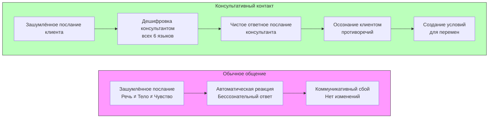

Повседневное общение редко приводит к значимым изменениям в жизни. Люди годами обсуждают одни и те же проблемы с друзьями или партнерами, но ситуация остаётся прежней. В кабинете психолога общение строится иначе. **Особый контакт**, возникающий между консультантом и клиентом, создаёт условия для трансформации. В чём секрет этого контакта? Как следует общаться, чтобы запустить процесс перемен? Ответ лежит в понимании консультирования как высокоорганизованной **информационно-коммуникативной системы**.

## Сложность человеческого общения

Чтобы понять уникальность консультативного диалога, нужно осознать невероятную сложность обычного человеческого общения. По своей структуре и динамике оно превосходит многие известные нам системы.

**Скорость и объём.** Психические процессы протекают с огромной скоростью. В каждый момент общения люди передают и принимают колоссальное количество разнородной информации — слова, интонации, жесты, микровыражения, эмоциональный фон. Всё это происходит почти мгновенно.

**Целостность.** Общение — целостный феномен, вовлекающий всего человека. Оно затрагивает не только интеллект, но и эмоции, тело, глубинные слои личности. Нельзя «частично» общаться — в каждый акт коммуникации вовлекается вся личность со своим уникальным опытом, страхами и надеждами.

**Многоуровневость.** Каждый акт общения происходит одновременно в трёх взаимосвязанных мирах:
1.  **Организмический (телесный) мир:** язык позы, дыхания, мышечных зажимов, симптомов.
2.  **Психологический мир отношений:** язык чувств, ожиданий, ролей, конфликтов.
3.  **Духовный (экзистенциальный) мир:** язык смыслов, ценностей, переживания бытия и связи с чем-то большим.

Игнорирование любого из этих уровней ведёт к непониманию.

## Ключевое отличие: бессознательное общение против сознательного контакта

Главное различие между обычной беседой и консультативным общением лежит в плоскости **осознанности**.

В повседневности общение чаще всего протекает **бессознательно**. Людей ведут автоматические реакции, устоявшиеся сценарии, неосознаваемые эмоции и защиты. Они «не ведают, что творят» в коммуникации, посылая противоречивые сигналы и не понимая истинных мотивов ни своего поведения, ни поведения собеседника. Общение как деятельность может обходиться без участия сознания.

**Консультативное общение — это сознательный (осознаваемый) контакт.** Это не спонтанный обмен репликами, а целенаправленный процесс приёма, переработки и передачи информации. Задача обучения консультанта — научиться делать общение осознанным, превратить его из бессознательного потока в управляемый инструмент создания перемен.

## Консультативный контакт как обмен посланиями

Удобной метафорой для анализа общения в кабинете психолога является обмен **посланиями**. Каждое высказывание, жест, молчание — это своего рода «письмо», «телеграмма» или «сообщение», отправленное от одного участника другому.

Сложность в том, что эти послания **одновременно пишутся и читаются на нескольких разных языках**. Консультант должен быть полиглотом, способным слышать и интерпретировать каждый из них.

### Языки консультативного контакта

1.  **Язык речи.** Словарный состав, грамматика, логика высказываний. Самый очевидный, но не единственный язык.
2.  **Язык тела.** Поза, жесты, мимика, направление взгляда, мышечный тонус, вегетативные реакции (покраснение, потливость).
3.  **Язык симптома.** Головная боль, паническая атака, бессонница, кожное высыпание. Симптом — это послание тела о непереносимом внутреннем конфликте или напряжении.
4.  **Язык проблемы.** То, как клиент формулирует свою трудность: «я не могу сказать "нет"», «меня все бросили», «я чувствую пустоту». В формулировке уже содержится определённое мировоззрение и позиция.
5.  **Язык самоценности.** Послания, передающие отношение человека к самому себе: самообвинения, обесценивание своих достижений или, наоборот, попытки себя защитить и оправдать.
6.  **Язык образов.** Метафоры, символы, сновидения, спонтанные фантазии, которые клиент использует в рассказе. Это прямой доступ к языку бессознательного.

**Мастерство консультанта заключается в способности одновременно слушать и «дешифровать» все эти языки.**

## Чистые и зашумлённые послания: причина коммуникативных сбоев

Анализируя поток информации по всем каналам, можно выделить два типа посланий:

*   **Чистые послания.** Содержание, передаваемое на всех языках (речевом, телесном, образном), едино или взаимно дополняемо. Слова соответствуют интонации, интонация — позе, поза — смыслу высказывания. Например, клиент говорит о печали тихим голосом, с опущенными плечами и потухшим взглядом.
*   **Зашумлённые послания.** На разных языках передаются **противоречивые, часто полярные содержания**. Клиент может утверждать: «Я не злюсь» (речь), при этом его челюсти сжаты, кулаки сжаты, а голос звучит напряжённо и резко (тело). Или заявлять о желании изменить жизнь, сидя в пассивной, «расплывшейся» позе.

**В обычной жизни люди преимущественно используют зашумлённые послания.** Причина — огромный фонд неосознаваемого психического материала. Человек может искренне верить в то, что он говорит, не замечая, что его тело, тон голоса или симптоматика кричат о противоположном. Это фундаментальная причина, почему бытовые разговоры не ведут к переменам: коммуникация идёт вразнобой, собеседники реагируют на шум, а не на истинный сигнал.

В консультировании действует важный принцип: **«Клиент всегда прав»** в том смысле, что каждое его послание, даже самое противоречивое, является психологической реальностью и заслуживает изучения. Задача не в том, чтобы уличить его во лжи, а в том, чтобы помочь ему самому увидеть эти противоречия.

В идеале **послания консультанта-мастера должны стремиться к чистоте.** Это создаёт безопасное, предсказуемое и ясное коммуникативное поле, в котором клиент может начать доверять и исследовать себя.

## Как консультанту научиться создавать чистые послания?

Сознательность в общении не возникает сама собой. Это результат целенаправленной работы консультанта над собой. Путь к мастерству включает:

1.  **Ясное осознание целей общения.** Консультант должен постоянно помнить, для чего он задаёт вопрос, делает паузу или даёт обратную связь. Каждое действие служит общей цели — созданию условий для раскрытия потенциала клиента.
2.  **Систематическое самонаблюдение (рефлексия).** Консультант учится отслеживать свои собственные реакции, мысли и чувства в процессе сессии. Почему это слово вызвало раздражение? Откуда взялась эта интерпретация? Ведение дневника супервизии — ключевой инструмент.
3.  **Личный опыт перемен и трансформации.** Сложно искренне верить в возможность изменений у клиента, если не проходил через собственные внутренние кризисы и преодоления. Личная терапия для консультанта — не блажь, а профессиональная необходимость.
4.  **Рост теоретического знания.** Понимание психологии общения, механизмов защиты, теории привязанности, невербальной коммуникации даёт карту для навигации в сложном процессе диалога.
5.  **Целенаправленное изучение языков контакта.** Развитие навыка «слушать» тело, читать метафоры, слышать за симптомом историю, видеть в формулировке проблемы мировоззренческую установку.

**Секрет эффективного консультирования** с точки зрения информационно-коммуникативного подхода заключается в следующем: терапевт, владеющий языками контакта и способный к чистым, осознанным посланиям, создаёт «резонансную» коммуникативную среду. В этой среде зашумлённые, противоречивые послания клиента постепенно начинают «настраиваться» на чистую волну. Клиент учится слышать самого себя, замечать разрывы между тем, что он говорит, и тем, что он на самом деле чувствует или делает. Это осознание и есть первый и главный шаг к настоящим переменам.

Таким образом, консультативный контакт — это не магия, а высокоорганизованный процесс **сознательного управления сложнейшей информационной системой — человеческим общением**. Мастерство консультанта — это искусство быть одновременно переводчиком, дешифровщиком и архитектором этого процесса.

## Запомнить

*   **Обычное общение** чаще бессознательно и зашумлено противоречивыми сигналами, поэтому не ведёт к изменениям. **Консультативный контакт** — это сознательно выстроенный процесс обмена информацией.
*   **Сложность общения** определяется высокой скоростью психических процессов, целостным вовлечением личности и одновременной работой на трёх уровнях: телесном, психологическом (отношенческом) и духовном (экзистенциальном).
*   **Консультант работает с посланиями**, которые клиент отправляет на **шести языках**: речь, тело, симптом, проблема, самоценность, образы. Умение «дешифровать» все языки — основа понимания.
*   **Зашумлённые послания** (когда разные языки передают противоречивое содержание) — норма в обычной жизни и причина коммуникативных сбоев. **Чистые послания** (согласованность по всем каналам) — цель и инструмент работы консультанта-мастера.
*   **Принцип «Клиент всегда прав»** означает принятие любого его послания как психологической реальности, подлежащей исследованию, а не осуждению.
*   **Путь к чистым посланиям** для консультанта лежит через: ясность цели, самонаблюдение, личный терапевтический опыт, теоретическую подготовку и целенаправленное изучение языков контакта.
*   **Эффективность консультирования** в этом аспекте — это создание резонансной коммуникативной среды, где клиент через контакт с осознанным терапевтом учится слышать и согласовывать собственные противоречивые послания, что и становится двигателем перемен.
