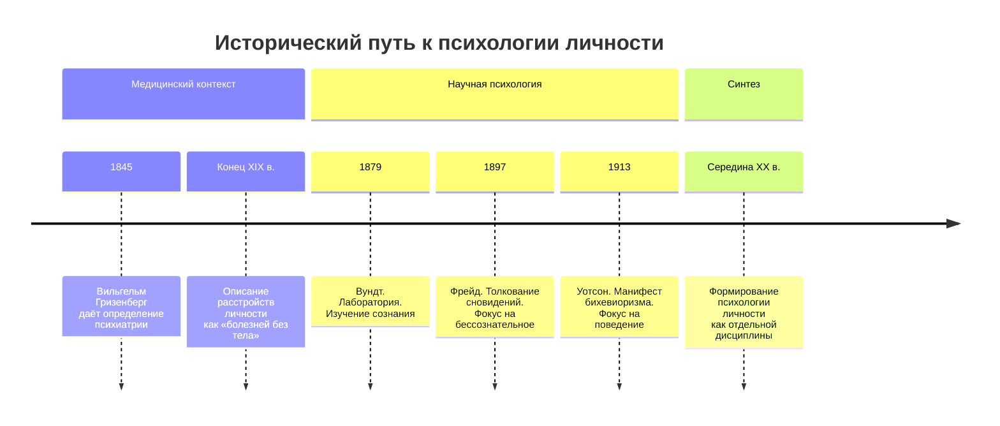

Психология личности сталкивается с фундаментальной проблемой — её объект многомерен и ускользает от однозначного определения. Возникнув на стыке медицины и социологии, эта дисциплина до сих пор исследует, можно ли описать человека через его память, поведение, социальные роли или сознание.

## Исторические предпосылки возникновения психологии личности

Психология личности сформировалась не в вакууме. Её появление было ответом на конкретные вызовы, которые ставила перед обществом и наукой реальность.

### Медицинский вызов: феномен «болезней без тела»

К концу XVIII — началу XIX веков стало очевидно, что некоторые состояния человека не укладываются в рамки физиологических недугов. Поведение, похожее на одержимость, но без явных биологических причин, потребовало нового понятия. В 1845 году Вильгельм Гризенберг дал определение **психиатрии** как области, изучающей эти загадочные явления.

Психиатры столкнулись с паттернами поведения и переживаний, которые не имели органической основы. Эту «тёмную материю» психики они начали называть **личностью**. Так возникли первые клинические описания её расстройств:
*   **Неустойчивая (диссоциальная) личность**
*   **Экспансивная личность**
*   **Эпилептоидная личность**
*   **Сенситивная личность**
*   **Психастеническая (ананкастная или тревожная) личность**

Изучение этих феноменов показало, что истоки проблем лежат не в телесной, а в психологической организации человека.

### Социальный и научный контекст

Параллельно с медициной развивалось и научное изучение психики. Ключевые вехи создали методологическую основу для будущей психологии личности.
*   **1879**: Вильгельм Вундт основал первую психологическую лабораторию в Лейпциге. Фокус был на изучении сознания методом интроспекции — самонаблюдения.
*   **1897**: Зигмунд Фрейд прочёл первую лекцию о толковании сновидений, сместив акцент на **бессознательное**.
*   **1913**: Джон Уотсон опубликовал манифест **бихевиоризма**, объявив предметом психологии наблюдаемое **поведение**, а не внутренние состояния.

Эти события создали три разных вектора изучения человека: через сознание, через бессознательное и через внешние действия.

## Проблема определения личности

Психология личности — это междисциплинарная область. Она находится на пересечении философии, биологии, социологии, лингвистики и других наук. Её главная проблема — **многомерность** объекта изучения. Личность нельзя свести к одной переменной. Это заставляет исследователей искать разные подходы к её определению, каждый из которых имеет свои сильные и слабые стороны.

### Можно ли определить личность через память?

**Аргументы за:**
Прошлый опыт, зафиксированный в памяти, формирует уникальный жизненный путь человека и определяет его будущие реакции.

**Аргументы против:**
*   Память субъективна и пластична. Одно и то же событие разные люди помнят по-разному.
*   Память может искажаться и «лгать».
*   Нарушения памяти (например, амнезия) не обязательно приводят к полному изменению личности. Ядро «Я» может сохраняться.

**Пример:** Два брата, пережившие одну и ту же автомобильную аварию, через год по-разному описывают детали происшествия. Однако их базовые ценности и характер остались прежними.

### Можно ли определить личность через мотивы и ценности?

**Аргументы за:**
Мотивы и ценности — это внутренние двигатели, которые побуждают человека к деятельности. Ответ на вопрос «Кто я?» часто сводится к вопросу «Чего я хочу?».

**Аргументы против:**
*   Многие мотивы навязаны извне семьёй, культурой, социальной ролью.
*   Способность выбирать, принимать или отвергать внешние мотивы — это уже проявление более высокого уровня организации личности. То есть личность — это не сами мотивы, а инстанция, которая ими управляет.

**Пример:** Человек может работать юристом (внешняя социальная роль и мотив — деньги, статус), но при этом его внутренние ценности и истинные мотивы лежат в области помощи людям, что приводит его в волонтёрство.

### Можно ли определить личность через мысли и речь?

**Аргументы за:**
*   Мысли отражают внутренний мир человека. Декартовское «Cogito ergo sum» (Мыслю, следовательно, существую) указывает на мысль как основу самоощущения.
*   У каждого человека есть индивидуальный стиль речи — **личная семантика**, которая служит его уникальным маркером.

**Аргументы против:**
*   Осознаваемые мысли — лишь верхний слой. Значительная часть психической жизни происходит в **бессознательном** и не вербализуется.
*   Речь — продукт коммуникации. Без другого человека, без языка, усвоенного от родителей, не формируется ни полноценная речь, ни, как следствие, сложное самосознание.

**Пример:** Теория **лингвистической относительности** предполагает, что язык, на котором мы говорим, влияет на наше мышление. Однако личность не тождественна языковому шаблону. Личностные опросники, созданные в рамках этой теории, фиксируют лишь часть картины.

### Можно ли определить личность через социальную роль?

**Аргументы за:**
Человек живёт в обществе и большую часть времени выполняет определённые роли: родитель, сотрудник, друг. Эти роли можно считать «масками», через которые проявляется личность. Окружающие своим восприятием и обратной связью также конструируют наше «Я».

**Аргументы против:**
*   Общественное мнение может быть ошибочным. Человек обладает внутренним пространством, где он принимает решения самостоятельно, по-своему исполняя одну и ту же роль.
*   Количество социальных ролей не равно глубине личности. Человек с множеством ролей может быть поверхностным.

**Пример:** Два учителя одинаково профессионально ведут урок (исполняют роль), но один видит в этом служение, а другой — лишь способ заработка. Их личности проявляются в индивидуальной интерпретации роли.

### Можно ли определить личность через поведение?

**Аргументы за:**
*   Поведение, деятельность — это единственный способ, которым личность проявляет себя во внешнем мире.
*   Поведенческий акт — это итог выбора, финальное звено внутренних процессов.

**Аргументы против:**
*   За одинаковым поведением могут стоять разные мотивы (см. пример с учителями).
*   Возникает проблема **«чёрного ящика»**: мы видим реакцию, но не понимаем, что происходит внутри.
*   Поведение часто ситуативно и зависит от контекста, а не от устойчивых черт личности.
*   Поведению можно научиться, скопировать его.
*   Если считать поведение критерием личности, то тогда и высокоорганизованные животные должны считаться личностями, что противоречит общепринятому словоупотреблению.

**Пример:** Человек в состоянии глубокой депрессии может перестать действовать. Его поведение минимально, но это не означает, что его личность исчезла — она пребывает в ином, часто мучительном, состоянии.

### Можно ли определить личность через сознание?

**Аргументы за:**
*   **Самосознание** — ключевой признак. Это осознание себя отдельным существом, обладающим определёнными качествами, способностями и мотивами.

**Аргументы против:**
*   Существование мощного пласта **бессознательных** процессов, которые управляют нами, но не осознаются. Полностью редуцировать личность к сознанию нельзя.

### Можно ли определить личность через творчество и способности?

**Аргументы за:**
Уникальные способности и творческий потенциал — это то, что ярко отличает одну личность от другой и позволяет человеку делать свой выбор в мире.

**Аргументы против:**
*   Для раскрытия способностей нужна подходящая среда. Без неё потенциал может остаться нереализованным.
*   Способности — это предпосылка, но не сама личность. Люди со схожими способностями (например, абсолютным музыкальным слухом) могут быть абсолютно разными личностями.

## Синтез: определение личности Гордона Олпорта

Множество противоречивых подходов потребовало интеграции. Психолог Гордон Олпорт, которого называют великим классификатором, предложил синтетическое определение, которое стало классическим.

**Личность — это динамическая организация тех психофизических систем внутри индивидуума, которые определяют характерное для него поведение и мышление.**

Разберём ключевые компоненты этого определения:

1.  **Динамическая организация.** Личность — не статичный набор черт, а подвижная, развивающаяся система. Она организована, то есть её элементы взаимосвязаны.
2.  **Психофизические системы.** Личность неотделима от биологического субстрата — мозга и тела. Повреждение мозга может радикально изменить или разрушить личность.
3.  **Внутри индивидуума.** Это указание на биологическую основу. Индивид рождается, а личность формируется. Новорождённый — это индивид, но ещё не личность.
4.  **Определяют характерное поведение и мышление.** Итогом работы внутренних психофизических систем являются устойчивые, узнаваемые паттерны действий и мыслительных процессов, которые позволяют отличить одного человека от другого.

Это определение не отрицает предыдущие подходы, а включает их в более широкую систему: память, мотивы, сознание — всё это части динамической психофизической организации.

## Запомнить

*   Психология личности возникла из двух потребностей: объяснить **психические расстройства**, не имеющие явной органической причины, и понять феномен **влияния отдельного человека** на многих.
*   Личность — **многомерный** и **междисциплинарный** объект изучения. Её нельзя свести к одному критерию.
*   Существует семь основных подходов к определению личности: через **память**, **мотивы и ценности**, **мысли и речь**, **социальную роль**, **поведение**, **сознание**, **творчество и способности**. Каждый подход имеет свои сильные и слабые стороны.
*   **Поведение** — важный, но недостаточный показатель, так как оно ситуативно и может копироваться.
*   Наличие **бессознательного** и **биологической основы** (мозга) — обязательные условия для понимания личности.
*   Классическое определение **Гордона Олпорта** интегрирует разные аспекты: личность — это **динамическая психофизическая система внутри индивида, определяющая его характерные мысли и поведение.**
