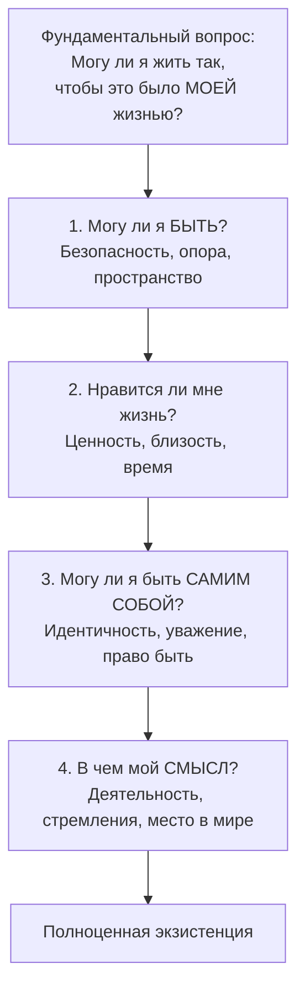

Психология личности существует в поле напряжения между двумя фундаментальными вопросами. Первый исходит из внутреннего мира человека и звучит как «В чем смысл моего существования?». Второй обращен к внешней деятельности и формулируется как «Что я делаю и как это меня формирует?». Ответы на эти вопросы предлагают экзистенциальный и деятельностный подходы, чье сопоставление раскрывает многогранность процесса становления личности.

## Основы экзистенциального взгляда на человека

Экзистенциальная психология, адаптированная для практики в логотерапии Виктора Франкла и развитая такими мыслителями, как Ролло Мэй и Альфрид Ленгле, исходит из нескольких ключевых принципов. Эти принципы не являются абстрактной теорией, а описывают базовые условия человеческого бытия.

### Бытие предшествует сущности

Это центральный постулат. Человек не рождается с готовой, раз и навсегда заданной сущностью. Вначале он просто существует, и лишь через свои действия, выборы и переживания он обретает свою сущность. Бытие динамично и открыто, сущность — это относительно стабильный результат этого процесса. Из этого следует абсолютная **ответственность** человека за свою жизнь. С точки зрения экзистенциального подхода, даже ситуация, в которой человек оказывается жертвой, рассматривается через призму выбора, который привел к этой ситуации, или выбора, который доступен в ней сейчас. Ответственность — не обвинение, а констатация авторства собственной жизни.

### Ценность переживания

Непосредственный опыт и переживание ставятся выше любой теории, которая пытается их объяснить. Теория может упростить, обеднить или даже «убить» живое, уникальное чувство. То, что человек чувствует «здесь и сейчас», обладает высшей ценностью и истинностью. **Воля** в этом контексте — не просто сила желания, а активное утверждение себя в мире, способность действовать в соответствии со своим бытием.

### Структура Dasein: три мира личности

Ролло Мэй описывает человеческое существование (Dasein, «бытие-здесь») как одновременное пребывание в трех взаимосвязанных измерениях или «мирах».

**Umwelt** — это мир окружающей среды, биологических потребностей и объектов. В этом мире другие люди могут восприниматься функционально, как средства для достижения целей.

**Mitwelt** — мир взаимоотношений с другими как с равными, отдельными субъектами. Это пространство диалога, любви, дружбы и вражды. Переход от восприятия человека как объекта к восприятию его как субъекта (например, в отношениях) происходит именно в Mitwelt.

**Eigenwelt** — внутренний, приватный мир самоосознания, глубоких отношений с самим собой. Это основа для понимания своих ценностей и смыслов.

Здоровая личность интегрирует все три мира, не позволяя одному из них доминировать над другими.

## Внутренние конфликты: вина, стыд и тревога

Экзистенциальный подход дает четкое разграничение между чувствами вины и стыда, а также описывает природу невротической тревоги.

### Вина и стыд по Ролло Мэй

**Вина** — это глубоко личное, внутреннее явление. Она возникает при нарушении собственных, внутренне принятых норм и ценностей. Стыд, напротив, публичен и связан с нарушением внешних, социальных ожиданий. Человек может испытывать стыд, но не чувствовать вины, если не согласен с осуждающей его внешней оценкой.

Мэй выделяет три типа экзистенциальной вины, соответствующих мирам Dasein:
*   **Umwelt-вина**: вина перед природой или своим телом за пренебрежительное отношение (например, за разрушительный образ жизни).
*   **Mitwelt-вина**: вина перед другими за неспособность понять их мир, увидеть их субъектность, за использование их в своих целях.
*   **Eigenwelt-вина**: вина перед самим собой за неаутентичность, отказ от реализации своего потенциала, непонимание собственных глубинных потребностей.

Разделение вины и стыда проясняет разницу между поиском «виноватых» и принятием ответственности. Родители могут быть объективно «виноваты» в детской травме, но взрослый человек несет **ответственность** за то, как он теперь распоряжается своей жизнью — например, подает ли он документы в желаемый вуз.

### Невротическая тревога

Тревога как таковая — нормальная реакция на угрозу ценностям, составляющим основу существования. **Невротическая тревога** возникает тогда, когда эти «ценности» на проверку оказываются догмами — жесткими, негибкими убеждениями, отказ от которых воспринимается как крах всего смысла жизни. Например, догма «в моем холодильнике всегда должно быть 5 банок йогурта определенной марки, иначе мир рухнет». Такая тревога парализует, заставляя человека не развиваться, а лишь постоянно подтверждать незыблемость своего хрупкого миропорядка.

## Четыре фундаментальных мотивации по Альфрид Ленгле

Альфрид Ленгле, развивая идеи Франкла, предлагает модель четырех этапов или фундаментальных мотиваций, которые человек должен последовательно разрешить для обретения полноценной, осмысленной жизни. Это ответ на центральный вопрос: «Могу ли я жить так, чтобы это было *моей* жизнью?»

1.  **Могу ли я быть?** Это основа — ощущение физической и психологической безопасности, наличие «опоры». Ребенок лишается этой опоры, если слышит послания вроде «лучше бы тебя не было». Для взрослого опорой может быть расписание, договоренности, физическое пространство.
2.  **Нравится ли мне жизнь?** Приняв факт своего существования, человек обращается к его качеству. Здесь возникают чувства, отношения, близость, переживание красоты мира. Жизнь начинает восприниматься как ценность.
3.  **Могу ли я быть собой?** Это вопрос идентичности и самоуважения. Имею ли я право быть таким, какой я есть? Говорю ли я себе «да»? Признание и уважение со стороны других важны на этом этапе, но ключевым является внутреннее разрешение быть собой.
4.  **В чем мой смысл?** Для чего я, такой, нужен миру? Этот вопрос, первичный для Франкла, у Ленгле становится возможным только после прохождения трех предыдущих уровней. Смысл реализуется через деятельность, стремления и занятие своего уникального места в структуре бытия.

### Практика «Час до смерти»

Техника, приписываемая Г.И. Гурджиеву, служит мощным инструментом экзистенциальной рефлексии. Она предлагает представить, что до смерти остался один час, и при этом доступны все текущие ресурсы (вариант 1), или что вы находитесь в необратимой изоляции и можете отправить последнее сообщение (вариант 2). Анализ возникающих мыслей и желаний — позвонить близким, завершить дело, просто насладиться моментом — обнажает истинные, часто скрытые **ценности** и **смыслы**, которые двигают человеком. Если в последний час человек думает о незаконченном рабочем проекте, значит, работа составляет суть его существования. Эта техника — проверка аутентичности жизни.

## Деятельностный подход: личность как продукт и процесс

В противоположность внутренне ориентированному экзистенциализму, теория личности **А.Н. Леонтьева**, представляющая советскую психологическую школу, делает активность и деятельность основой формирования личности.

### Личность как продукт деятельности

Леонтьев утверждает: личность не дана изначально, она не равна индивиду с его темпераментом и задатками. **Личность рождается и формируется в деятельности**. Что и как человек делает, так его личность и складывается. В филогенезе (истории человечества) личность как отдельное явление выделилась из первоначальной коллективной личности племени с появлением первых индивидов с особыми социальными функциями — шамана, вождя, короля.

### Два рождения личности

Ключевой момент в онтогенезе (индивидуальном развитии) — возникновение **иерархии мотивов**. Когда у человека появляется возможность и необходимость выбирать между разными побуждениями, и он этот выбор осознанно осуществляет, — рождается личность.

*   **Первое рождение личности** происходит в детстве (примерно в 3-4 года, в кризис трех лет) и связано с возникновением первого **внутреннего конфликта мотивов**. Классическая иллюстрация — **феномен «горькой конфеты»**.

#### Феномен «горькой конфеты»
В эксперименте ребенку дается задание: не вставать со стула, чтобы взять конфету со стола. Если он догадается, как взять ее, не вставая, то получит вторую. Взрослый выходит. Ребенок сталкивается с конфликтом: мотив послушания взрослому против мотива получить сладкое. Часть детей, нарушив правило, спокойно берут вторую награду. Другие же, решив задачу и получив вторую конфету, отказываются от нее или плачут. Награда для них становится «горькой» из-за переживания вины за нарушение правила. Этот момент и есть акт рождения личности: социальный мотив (быть «хорошим», соответствовать правилу) впервые побеждает ситуативный, натуральный мотив (получить удовольствие). Возникает соподчинение мотивов — основа будущей иерархии.

*   **Второе рождение личности** Леонтьев связывал с поздним подростковым возрастом (около 18 лет), когда иерархия мотивов стабилизируется в некую относительно **законченную структуру**, определяющую жизненный путь. Однако позже он признал, что личность может «рождаться» многократно в ходе жизни — в моменты глубокого переосмысления ценностей, после катастроф или духовных кризисов, когда рушится старая иерархия и строится новая.

### Критика смежных экспериментов

Леонтьевская логика позволяет критически взглянуть на известный «зефирный тест» Уолтера Мишела. В нем ребенку предлагают одну зефирку сейчас или две, если он подождет. Леонтьев мог бы указать, что такой тест проверяет не «силу воли» абстрактно, а наличие уже сформированного **мотива подчинения социальному договору** (обещанию экспериментатора). Ребенок без этого сформированного мотива (т.е. с еще не «родившейся» в леонтьевском смысле личностью) не будет испытывать внутреннего конфликта и просто съест угощение. Отсутствие четкой долгосрочной корреляции результатов теста с успешностью в жизни косвенно подтверждает, что тест измеряет не универсальную черту, а конкретный, культурно и ситуативно обусловленный поведенческий паттерн.

## Запомнить

*   **Экзистенциальная психология** (Мэй, Ленгле, Франкл) видит ядро личности в поиске смысла, переживании ответственности и аутентичности. Ключевые концепции: Dasein (три мира), экзистенциальная вина и стыд, четыре фундаментальные мотивации.
*   **Деятельностный подход** (Леонтьев) определяет личность как продукт иерархии мотивов, возникающей и проявляющейся в деятельности. Личность рождается в момент первого внутреннего конфликта мотивов.
*   **Феномен «горькой конфеты»** — эмпирическое доказательство рождения личности у ребенка, когда социальный мотив впервые побеждает ситуативный, что сопровождается переживанием вины.
*   **Чувство вины** (внутреннее нарушение своих норм) и **стыд** (нарушение внешних ожиданий) — разные феномены. Ответственность вытекает из способности различать их и действовать исходя из своих ценностей.
*   **Модель Ленгле** — последовательный путь к полноценной жизни: от базовой безопасности через переживание ценности жизни и самоуважение к поиску уникального смысла.
*   Личность — не статичное образование. Она способна к многократным «рождениям» — перестройкам своей мотивационной иерархии в течение жизни под влиянием глубокого опыта и рефлексии.
