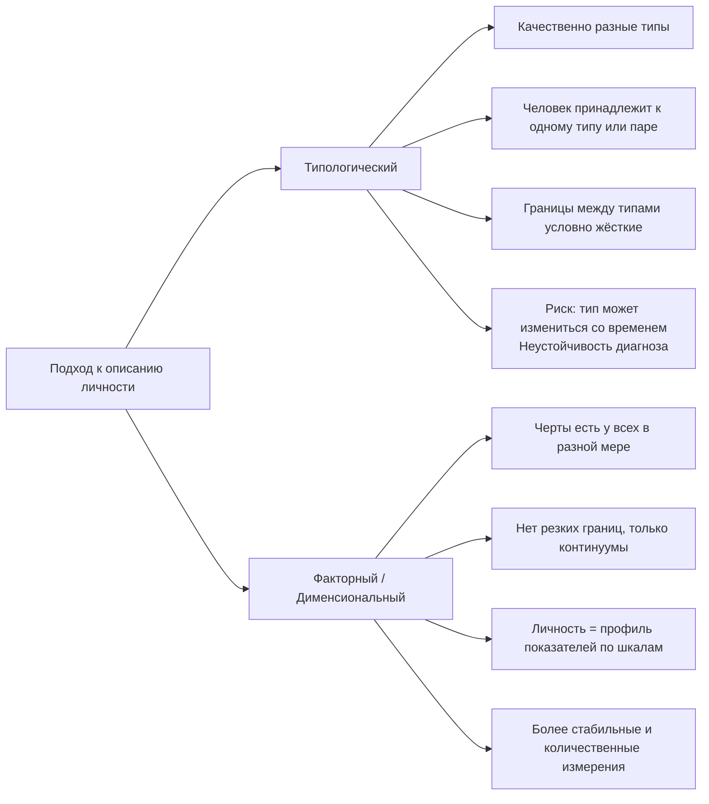

Факторные опросники предлагают соблазнительную иллюзию: разложить личность на составляющие, измерить их и получить точный цифровой профиль. Этот подход, основанный на статистическом анализе и поиске базовых черт, стал доминирующим в психологической диагностике. Однако за кажущейся объективностью скрываются методологические ловушки, а результат часто зависит не столько от испытуемого, сколько от выбранного инструмента.

## Суть факторного подхода: от слов к числам

Факторная стратегия в создании личностных опросников исходит из простой предпосылки: фундаментальные, устойчивые черты личности можно выявить через анализ того, как люди описывают себя и других. Исследователи собирают огромные массивы слов-характеристик, которые люди используют в повседневной жизни (например, «общительный», «добросовестный», «тревожный»). С помощью факторного анализа — сложного статистического метода — эти тысячи слов группируются в коррелирующие между собой кластеры. Каждый такой кластер и становится **базовым фактором** или чертой личности.

Ключевое отличие этого подхода — **континуальность**. Черта — это не наличие или отсутствие качества, а точка на непрерывной шкале. У всех людей есть, например, экстраверсия, но в разной степени. Личность в этой парадигме представляет собой уникальный **профиль показателей** по набору базовых шкал. Здесь нет резких границ и качественно различных типов; есть лишь количественные различия.

## Эволюция факторных моделей: от 16PF к «Большой пятерке»

История факторных опросников — это история сжатия и уточнения. Ученые искали минимальное количество факторов, достаточное для полного и экономного описания личности.

### 16 личностных факторов Рэймонда Кеттелла (16PF)
Одной из первых и наиболее известных попыток стал опросник **16PF**, разработанный Рэймондом Кеттеллом. Исходя из лексического анализа, Кеттелл выделил 16 первичных черт, которые, по его мнению, составляют основу личности (например, эмоциональная устойчивость, доминирование, живость ума). Этот опросник быстро нашел практическое применение, особенно в сфере профессионального отбора.

Однако у 16PF с самого начала были серьезные методологические изъяны, отмеченные в материалах:
*   **Отсутствие шкал достоверности**: в опроснике не было встроенных контрольных шкал (например, шкалы лжи, случайных ответов), которые позволяли бы оценить искренность и внимательность испытуемого. Это делало результаты уязвимыми для сознательной или бессознательной фальсификации.
*   **Нестабильность результатов**: показатели по шкалам могли сильно варьироваться при повторном тестировании, что ставило под сомнение надежность (консистентность) методики.
*   **Некритичное применение**: несмотря на эти недостатки, опросник стали массово и постоянно использовать, часто без должной перепроверки и учета контекста, что могло приводить к ошибочным выводам.

### «Большая пятерка» (Big Five)
Дальнейшие кросс-культурные исследования показали, что многие из факторов Кеттелла сильно коррелируют друг с другом. Статистический анализ данных из разных языков и культур последовательно выявлял **пять независимых и устойчивых измерений** личности. Так родилась модель «Большой пятерки», которая сегодня считается одной из наиболее эмпирически обоснованных:

1.  **Открытость опыту (Openness)**: воображение, любознательность, интерес к новому.
2.  **Добросовестность (Conscientiousness)**: организованность, самодисциплина, стремление к достижениям.
3.  **Экстраверсия (Extraversion)**: общительность, активность, оптимизм.
4.  **Доброжелательность (Agreeableness)**: доверие, альтруизм, склонность к сотрудничеству.
5.  **Нейротизм (Neuroticism)**: тревожность, эмоциональная неустойчивость, ранимость.

Каждый фактор представляет собой континуум между двумя полюсами (например, экстраверсия — интроверсия). Модель «Большой пятерки» доказала свою предсказательную силу в отношении широкого спектра жизненных outcomes — от успехов в карьере до стабильности брака.

### «Тёмная триада» и «Тёмная тетрада»
Если «Большая пятерка» описывает нормативный спектр личностных черт, то **«Тёмная триада»** фокусируется на социально-деструктивных, но при этом клинически суб-пороговых чертах:
*   **Макиавеллизм**: циничная манипулятивность, тактическое использование других в своих интересах.
*   **Нарциссизм**: грандиозное чувство собственной важности, потребность в восхищении, отсутствие эмпатии.
*   **Психопатия** (в личностном, а не клиническом смысле): импульсивность, поиск острых ощущений, бессердечие, отсутствие вины и привязанности.

Позднее к этой триаде был добавлен **садизм** — получение удовольствия от причинения физического или психологического страдания другим. Этот комплекс из четырех черт иногда называют **«Тёмной тетрадой»**. Эти черты, хотя и коррелируют между собой, являются отдельными конструктами и могут присутствовать у человека в разной степени. Их оценка важна в контекстах, связанных с безопасностью, лидерством и девиантным поведением.

## MMPI: золотой стандарт клинической диагностики

**Миннесотский многопрофильный личностный опросник (MMPI)** занимает особое место среди факторных методик. Он был создан не для описания нормальной личности, а для дифференциальной диагностики психических расстройств. Его ключевое преимущество — сложная, многоуровневая система **контрольных шкал достоверности**.

MMPI позволяет не только оценить профиль по клиническим шкалам (ипохондрия, депрессия, паранойя и др.), но и понять, **как** человек проходил тестирование. Три основные шкалы достоверности, упомянутые в материалах:

*   **Шкала L («Ложь»)**: выявляет наивную попытку представить себя в социально-одобряемом свете, отрицая мелкие общечеловеческие слабости.
*   **Шкала F («Достоверность»)**: показывает тенденцию к симуляции, аггравации (преувеличению) симптомов или случайным, невнимательным ответам. Высокие баллы по этой шкале делают весь профиль недостоверным.
*   **Шкала K («Коррекция»)**: измеряет более тонкую и осознанную защиту, попытку контролируемо выглядеть «нормальным». Существуют специальные формулы для коррекции клинических шкал с учетом показателя K.

Как отмечено в материалах, именно наличие этих шкал позволяет отличить человека, который действительно нуждается в лечении в клинике, от того, кто симулирует или неправильно понял инструкцию. **Шкала аггравации** (часто связанная с F-шкалой или специальными дополнениями) прямо указывает на то, что испытуемый пытался сделать свои симптомы хуже, чем они есть на самом деле.

## Факторная стратегия против типологической: принципиальное противостояние

Это одно из ключевых методологических различий в психодиагностике. Материалы прямо противопоставляют два подхода:

**Типологический подход** (например, теории Юнга, типология Майерс-Бриггс) делит людей на дискретные, качественно различные категории (например, «интроверт» vs «экстраверт» как отдельные типы). Его критика очевидна: люди редко идеально вписываются в один тип, а при повторном тестировании через время могут получить другой результат. Это говорит либо о ненадежности методики, либо о том, что сама модель не отражает реальной непрерывности психологических признаков.

**Факторный (дименсиональный) подход** избегает этих ловушек. Он признает, что черты распределены в популении нормально, и каждый человек — это уникальная комбинация степеней выраженности этих черт. Такой подход более гибок, точен и статистически обоснован. Предупреждение в материалах — «надо быть аккуратно с типологическими опросниками» — основано именно на их низкой надежности и валидности по сравнению с факторными.

## Критика и ограничения: почему «какой инструмент, такой результат»

Несмотря на статистическую строгость, факторные опросники не являются безупречными. Их основные проблемы вытекают из самой методологии:

1.  **Зависимость от самоотчета**. Опросники измеряют не реальное поведение, а то, как человек **хочет** себя представить (осознанно или нет) или как он сам себя **воспринимает**. Это субъективное мнение может сильно расходиться с объективной реальностью.
2.  **Культурная и языковая обусловленность**. Факторы, выделенные на основе лексикона одного языка (чаще всего английского), могут не полностью транслироваться в другие культуры со своей системой понятий о личности.
3.  **Проблема «средней величины»**. Профиль показывает, насколько человек отклоняется от статистической нормы, но не объясняет **качественного своеобразия** его внутреннего мира, мотивов и конфликтов. Два человека с одинаковым высоким баллом по нейротизму могут переживать свою тревогу совершенно по-разному.
4.  **Риск реификации**. Черта из удобного статистического конструкта превращается в мнимую реальную «сущность», которая якобы существует в мозге. На самом деле, фактор — это лишь удобный способ описания устойчивых паттернов поведения и переживаний.
5.  **Злоупотребление в отборе**. Использование тестов в кадровой работе, особенно без участия квалифицированного психолога, может приводить к несправедливым решениям. Тест становится не инструментом понимания, а «черным ящиком», выносящим вердикт.

Материалы емко резюмируют эту проблему: **«Какой инструмент используется, такой результат и получается»**. Если вы измеряете 16 факторами — получите 16-факторный профиль. Если пятью — пятифакторный. Выбор модели предопределяет «карту местности», которую вы увидите. Ни одна модель не является окончательной истиной; каждая — лишь полезное, но ограниченное приближение к сложности человеческой личности.

## Практические рекомендации по использованию факторных опросников

1.  **Сочетайте методы**. Данные опросника должны быть только одним из источников информации, наряду с наблюдением, беседой, проективными методиками и анализом биографии.
2.  **Обязательно используйте шкалы достоверности**. Интерпретация любого профиля, особенно клинического (MMPI) или используемого для отбора, должна начинаться с анализа шкал L, F, K. Недостоверный протокол не подлежит интерпретации.
3.  **Учитывайте контекст**. Ситуация тестирования (отбор на работу, клиническая диагностика, научное исследование) сильно влияет на установку испытуемого. Это необходимо учитывать при интерпретации.
4.  **Избегайте жестких типологических интерпретаций даже в рамках факторного подхода**. Не говорите: «Вы — невротик». Говорите: «У вас наблюдается повышенный уровень нейротизма, что может означать склонность к переживанию тревоги в стрессовых ситуациях».
5.  **Помните об этике**. Результаты теста — конфиденциальная информация. Их интерпретация должна быть понятной и не наносящей вред испытуемому.

## Запомнить

*   **Факторные опросники** выявляют базовые, непрерывно распределенные черты личности через статистический анализ самоописаний.
*   **Эволюция моделей**: от 16 факторов Кеттелла (16PF) к более надежной и универсальной **«Большой пятерке»** (Открытость, Добросовестность, Экстраверсия, Доброжелательность, Нейротизм). **«Тёмная триада/тетрада»** фокусируется на социально-деструктивных чертах.
*   **MMPI** — эталонный клинический опросник, чья сила в системе **шкал достоверности** (L, F, K), позволяющих отсеять симуляцию, аггравацию и невнимательность.
*   **Факторный подход** (профиль показателей) принципиально отличается от **типологического** (принадлежность к типу) и является более валидным и надежным.
*   **Ключевые ограничения**: зависимость от самоотчета, культурная обусловленность, риск упрощения личности до набора баллов.
*   **Главный принцип**: результат диагностики во многом определяется выбранным инструментом. Ни один опросник не дает полной и объективной «правды» о личности, а лишь ее специфическое, модельное отражение.
