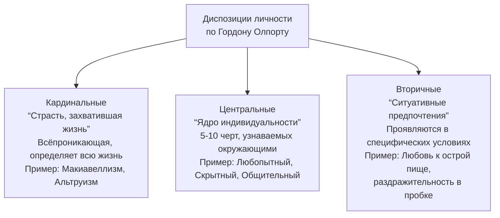

В середине XX века психология личности представляла собой поле противостояния разных школ. Гордон Олпорт совершил синтез, создав теорию, которая объясняла уникальность каждого человека через систему устойчивых черт и стремление к внутреннему единству, не отрицая при этом роль социальных ситуаций.

## Гордон Олпорт: интегратор психологии личности

Гордон Олпорт стал одним из первых, кто начал систематически преподавать и разрабатывать психологию личности как отдельную дисциплину. Его работа началась ещё до 1938 года. Личный опыт (он родился с полидактилией — лишними пальцами на ногах) мог повлиять на его интерес к уникальности человеческой природы. Главной целью Олпорта было не создание новой революционной теории, а интеграция и упорядочивание существующих идей Фрейда, Адлера, бихевиористов и других в целостную систему, которая помогала бы людям взаимодействовать друг с другом как личностям.

## Определение личности по Олпорту

Олпорт предложил одно из самых цитируемых определений в психологии:
**«Личность — это динамичная организация тех психофизических систем внутри индивидуума, которые определяют характерное для него поведение и мышление»**.

Ключевые аспекты этого определения:
*   **Динамичная организация:** Личность — не статичный набор черт, а живая, развивающаяся и подвижная система.
*   **Психофизические системы:** Олпорт подчёркивал неразрывную связь психического и биологического. Личность «живёт» в теле и зависит от его состояния.
*   **Внутри индивидуума:** Акцент на внутренних, присущих конкретному человеку структурах.
*   **Характерное поведение и мышление:** Задача психологии — выявлять устойчивые, предсказуемые паттерны, которые отличают одного человека от другого.

## Аттитюды: социальные установки как готовность к действию

Олпорт заимствовал и развил понятие **аттитюда** (социальной установки) у Карла Юнга. Он определил его как **«состояние психонервной готовности, сложившееся на основе опыта и оказывающее направляющее и (или) динамическое влияние на реакции индивида относительно всех объектов или ситуаций, с которыми он связан»**.

Аттитюд — это социальная «поза», которую человек принимает в конкретной ситуации. Например, установка лектора на преподавание или установка студентов на конспектирование. Как и в балете, где аттитюд — это устойчивое положение, социальный аттитюд позволяет человеку «встроиться» в ситуацию.

### Три компонента аттитюда

1.  **Когнитивный компонент:** Осознание и знание об объекте установки (например, представление о том, что такое «хорошая лекция»).
2.  **Аффективный компонент:** Эмоциональная оценка объекта (нравится или не нравится лектор, предмет).
3.  **Поведенческий компонент:** Фактическое поведение по отношению к объекту (активное слушание, запись или, наоборот, игнорирование).

Язык общения — также своего рода коллективный аттитюд. Человек, ведущий себя не в соответствии с групповым аттитюдом, либо выделяется (как подростки в протесте), либо отвергается группой.

### Функции аттитюдов

1.  **Функция оценки объекта:** Упрощает обработку новой информации, позволяя быстро отнести объект к категории «хороший/плохой», «свой/чужой».
2.  **Функция социального приспособления:** Позволяет адаптироваться к группе, идентифицироваться с ней или, наоборот, противопоставить себя ей. Аттитюд не существует в одиночестве — он всегда формируется и проявляется в социальном контексте.
3.  **Функция экстернализации:** Помогает воплотить в социально приемлемых формах глубинные, скрытые мотивы человека (например, потребность во власти может реализоваться через аттитюд активного организатора).

## Диспозиции: иерархия устойчивых черт личности

Если аттитюды ситуативны, то **диспозиции** (синоним **черт личности**) — это устойчивые индивидуальные особенности поведения, которые повторяются у данного человека, но отсутствуют у большинства других.

Олпорт строго разделял **черты характера** и **черты личности**:
*   **Черта характера** — это поведенческий паттерн, который может быть и у животного (например, собака таскает еду со стола).
*   **Черта личности** — это **внутренний процесс**, который стоит за поведением. Например, привычка ночью ходить к холодильнику может быть проявлением внутренней черты «склонность к скуке» или «эмоциональная нестабильность». У животных, по Олпорту, черт личности нет.

### Три уровня диспозиций

Олпорт выстроил иерархию диспозиций по степени их обобщённости и влиянию на жизнь человека.

1.  **Кардинальные диспозиции.**
    *   Это всепроникающая, максимально генерализованная черта, которая определяет практически всю жизнь человека. Она становится его страстью и визитной карточкой.
    *   **Примеры:** Макиавеллизм, альтруизм, эгоизм в крайней, всеохватывающей форме.
    *   **Важно:** Обладать стабильной кардинальной диспозицией — редкость. Она делает человека предельно предсказуемым. Большинство людей меняются, и их диспозиции также могут трансформироваться.

2.  **Центральные диспозиции.**
    *   Это **ядро индивидуальности**. От 5 до 10 хорошо узнаваемых окружающими устойчивых характеристик, которые достаточно полно описывают личность.
    *   **Примеры:** «Любопытный», «скрытный», «общительный», «добросовестный», «тревожный».
    *   Для выявления центральных диспозиций полезно спрашивать мнение знакомых, так как самооценка может быть неточной.

3.  **Вторичные диспозиции.**
    *   Это менее устойчивые и более ситуативные предпочтения и установки. Они проявляются в определённых обстоятельствах.
    *   **Примеры:** Вкусовые предпочтения (любовь к острой пище), раздражительность в пробке, краткосрочные увлечения.

## Проприум: развитие самости

Олпорт ввёл понятие **проприума** (от лат. *proprium* — собственный, своеобразный) для описания того, что делает человека уникальной, целостной личностью. Проприум — это позитивное, созидательное начало, «Я» как субъект, которое интегрирует все аспекты индивидуальности в единое целое.

Развитие проприума — это процесс становления самосознания, который проходит через семь взаимосвязанных стадий (или аспектов).

### 1. Ощущение своего тела (Телесное Я)
В течение первого года жизни младенец начинает осознавать многочисленные ощущения, идущие от мышц, сухожилий, внутренних органов. Эти повторяющиеся ощущения формируют **телесное «Я»** — основу для отличения себя от других объектов. Телесное «Я» остаётся опорой для самосознания на протяжении всей жизни, остро проявляясь во время болезни или боли.

### 2. Самотождественность
Ребёнок осознаёт себя как определённое и постоянное лицо через общение и язык. Ключевые моменты:
*   Наличие собственного имени.
*   Понимание, что, несмотря на все изменения (рост, разные действия), он остаётся одним и тем же человеком.
*   Личные вещи (одежда, игрушки) усиливают чувство тождественности.
*   Переход от речи о себе в третьем лице к использованию местоимения «Я» — важная веха.

### 3. Самоуважение
Ребёнок испытывает чувство гордости, когда самостоятельно выполняет какое-то действие и получает положительную реакцию от взрослых или даже животных. В этот момент активно работает **дофаминовая система** подкрепления («сделал — получил реакцию»).

### 4. Расширение самости
В дошкольном и школьном возрасте ребёнок начинает понимать, что ему принадлежит не только тело, но и элементы внешнего мира (родители, дом, игрушки). Он также задаётся вопросами: «Что я могу?», «Какой я?», «Как меня видят другие?». Появляется понимание социальных классификаций («Я — хороший по математике», «Меня не любит учительница русского»).

### 5. Образ себя
Формируется способность к **рефлексивному мышлению** — самоанализу своих мыслей и действий, постановке вопросов «почему?» и «как иначе?». Параллельно развивается **формальное мышление** — логически структурированные, последовательные умственные действия. Рефлексия отвечает за глубину самоосознания, формальное мышление — за правильность и последовательность.

### 6. Рациональное управление собой
Человек осознаёт себя как существо, способное ставить долгосрочные цели, планировать и находить средства для их достижения. Это уровень **метапознания** — осознания самого процесса мышления, который доступен не всем в равной степени.

### 7. Проприативное стремление
Высшая стадия развития проприума. Человек не просто ставит цели, но формирует **проприативные (собственные, глубоко личностные) стремления** — фундаментальные жизненные цели, ценности, смыслы, которые определяют общее направление жизни (выбор карьеры, спутника жизни, философской позиции). Это стремление к реализации своего уникального потенциала.

## Значение теории Олпорта

Теория Гордона Олпорта стала мостом между глубинными психологическими подходами и более поздними структурными моделями личности. Он показал, что личность:
1.  **Уникальна и целостна** (идея проприума).
2.  **Обладает устойчивым ядром** (центральные диспозиции), что делает поведение предсказуемым.
3.  **Гибко адаптируется** к социальным ситуациям через аттитюды.
4.  **Развивается на протяжении жизни**, стремясь к внутренней согласованности и реализации.

Его синтетический подход, акцент на здоровой, стремящейся вперёд личности и операционализация понятия «черта» заложили основы для современной дифференциальной психологии и психодиагностики.

## Запомнить

*   **Гордон Олпорт** — интегратор, создавший одну из первых целостных теорий личности, основанную на идее **уникальности** каждого человека.
*   **Личность** по Олпорту — **динамичная психофизическая организация**, определяющая характерные для человека мысли и поведение.
*   **Аттитюды (социальные установки)** — ситуативные состояния готовности, имеющие три компонента: когнитивный, аффективный и поведенческий. Они выполняют функции оценки, социальной адаптации и экстернализации мотивов.
*   **Диспозиции (черты личности)** — устойчивые индивидуальные особенности. Олпорт разделял их на три уровня: **кардинальные** (всепроникающие), **центральные** (ядро из 5-10 черт) и **вторичные** (ситуативные).
*   **Проприум** — позитивное, развивающееся **«Я»**, которое проходит 7 стадий: от ощущения тела до формирования глубоких жизненных стремлений. Это источник целостности и уникальности личности.
*   Теория Олпорта подчёркивает **единство биологического и социального**, **устойчивости и изменчивости**, что делает её фундаментальной для понимания человеческой личности.
