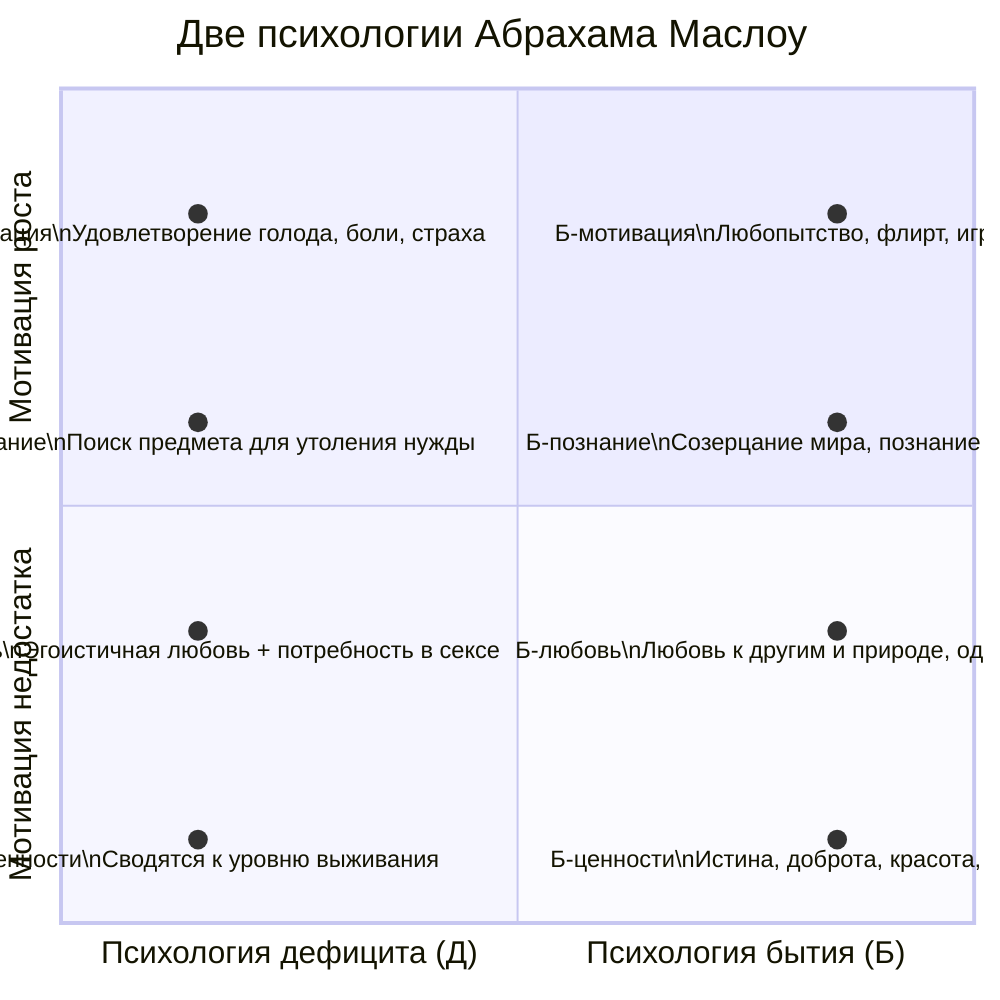

Гуманистическая психология возникла как «третья сила» в противовес детерминизму психоанализа и механицизму бихевиоризма. Её основатели, Карл Роджерс и Абрахам Маслоу, предложили радикально новый образ человека — не как игрушку влечений или реакций, а как активного, рационального творца собственной жизни, стремящегося к росту и реализации внутреннего потенциала.

## Человекоцентрированная теория Карла Роджерса

Карл Роджерс, американский психолог, совершил революцию в психотерапии, сместив фокус с диагноза и интерпретации терапевта на внутренний мир и ресурсы самого клиента. Его подход основан на глубочайшем уважении к человеку и вере в его врождённую тенденцию к развитию.

### Рациональность и самоактуализирующаяся тенденция

Роджерс полемизировал с распространённым в психоанализе представлением об иррациональной и деструктивной природе человека. Он утверждал:
**«Поведение человека отличается абсолютной рациональностью: он двигается к целям, которых старается достичь, по хитроумной и упорядоченной системе»**.

Проблема, по Роджерсу, не в иррациональности, а в том, что защитные механизмы искажают самовосприятие. Человек может думать, что движется к одной цели, но на самом деле его поведение рационально служит другой, часто неосознаваемой, цели (например, сохранению шаткой самооценки). Трагедия — в этом несоответствии.

Ключевое понятие теории — **самоактуализирующаяся тенденция**. Это врождённая направленность организма на развитие, рост, реализацию своего потенциала. Это не то, чему нужно учить; это фундаментальная движущая сила человеческой психики. Задача терапевта или любого помогающего специалиста — не направлять, а создавать условия, в которых эта естественная тенденция сможет развернуться.

### Я-концепция: реальное Я и идеальное Я

Центральным конструктом личности у Роджерса является **Я-концепция** — система представлений человека о самом себе. Она формируется в процессе взаимодействия с окружающими, особенно значимыми другими.

*   **Реальное Я:** Это восприятие себя таким, какой человек есть сейчас, основанное на его непосредственном опыте и самонаблюдении.
*   **Идеальное Я:** Это представление о том, каким человек хотел бы быть, совокупность его стремлений, целей, идеалов.

Здоровое развитие происходит, когда между реальным и идеальным Я существует **конгруэнтность** (соответствие). Это не означает их полного совпадения, а скорее динамичное сближение: человек ставит реалистичные цели и движется к ним. В этом случае наблюдения самого человека и стороннего наблюдателя будут совпадать — человек «прозрачен» для себя и других.

Проблемы и неврозы возникают при **инконгруэнтности** — большом расхождении между реальным и идеальным Я. Человек испытывает внутренний конфликт, тревогу, его поведение становится ригидным и неэффективным, так как энергия тратится на поддержание защит, а не на развитие. Чем сильнее это расхождение, тем больше человек страдает от своих же действий.

### Условия для роста личности: терапевтическая триада

Роджерс сформулировал три необходимых и достаточных условия для позитивных изменений личности как в терапии, так и в любых значимых отношениях (родитель-ребёнок, учитель-ученик). Эти условия известны как **терапевтическая триада**.

1.  **Безусловное позитивное принятие (безусловное положительное отношение).**
    *   Это отношение к клиенту как к ценной личности, независимо от его чувств, поведения или мыслей. Это не одобрение всех поступков, а принятие права человека испытывать любые чувства. Терапевт демонстрирует: «Я позабочусь о тебе», а не «Я позабочусь о тебе, *если* ты будешь соответствовать моим правилам».
    *   **Пример из практики Роджерса:** Клиент признаётся, что бьёт жену. Реакция терапевта в духе безусловного принятия: «Что у вас случилось, что вы так себя повели? Я хочу понять вас и позаботиться о вас, и обещаю, что не сделаю вам плохо».

2.  **Эмпатическое понимание.**
    *   Это способность точно воспринимать чувства и личные смыслы клиента и передавать ему это понимание. Терапевт стремится увидеть мир глазами клиента, не оценивая и не интерпретируя.
    *   **Пример:** Клиент говорит: «Не знаю, как вести себя иначе, в детстве меня не научили». Эмпатический ответ терапевта: «Понимаю. Если бы меня в детстве не научили другим способам справляться с гневом, я, вероятно, тоже мог бы поступать так же».

3.  **Конгруэнтность (аутентичность, искренность) терапевта.**
    *   Терапевт должен быть самим собой в отношениях с клиентом, не прячась за профессиональной маской. Его реальные переживания в данный момент доступны его осознанию, и он способен при необходимости их выразить.
    *   **Пример:** В ситуации с клиентом, бьющим жену, конгруэнтный терапевт может сказать: «Мне не симпатична концепция, что вы бьёте свою жену. Но я верю, что у вас были на это серьёзные причины, и я ценю вашу честность, рассказав мне об этом».

Роджерс подчёркивал важность **открытых вопросов** («Что вы чувствуете?») вместо закрытых или наводящих («Вы испытываете гнев?»), чтобы не навязывать клиенту своё видение и дать ему возможность самому исследовать свой опыт.

## Трансперсональная психология Абрахама Маслоу

Абрахам Маслоу, называвший себя «фрейдистом, бихевиористом и приверженцем гуманистической психологии», стремился к созданию целостной, интегративной модели человека. Его работа вышла за рамки гуманистической психологии к **трансперсональной** — изучающей высшие, духовные аспекты человеческого существования.

### Иерархия потребностей: от дефицита к росту

Самое известное наследие Маслоу — **пирамида (иерархия) потребностей**. Её ключевой принцип: **неудовлетворённый уровень потребностей определяет доминанту поведения**. Пока базовые потребности не удовлетворены, высшие не актуализируются.

Стандартная пятиуровневая модель (позже Маслоу расширил её до 7-8 уровней):
1.  **Физиологические потребности** (пища, вода, сон, секс).
2.  **Потребности в безопасности** (стабильность, порядок, защищённость).
3.  **Социальные потребности (в принадлежности и любви)** (дружба, семья, принятие).
4.  **Потребности в уважении и признании** (самоуважение, достижения, репутация).
5.  **Потребность в самоактуализации** (реализация потенциальных возможностей, «быть тем, кем ты можешь быть»).

Позднее Маслоу добавил **познавательные** и **эстетические потребности** (в порядке, красоте, симметрии) как шаг перед самоактуализацией, а также **потребность в трансценденции** (выход за пределы своего «Я», помощь в самоактуализации другим) как высший уровень.

Маслоу отмечал парадокс: базовые потребности (физиология) жизненно важны, но в современном обществе мы их в основном **автоматизировали** и тратим на них мало сознательных усилий. Основные когнитивные ресурсы уходят на удовлетворение потребностей более высокого уровня — уважения и самоактуализации.

### Метажалобы и метапотребности

Важным диагностическим инструментом в концепции Маслоу стало различение **жалоб** и **метажалоб**.
*   **Жалобы (дефицитарные):** Связаны с неудовлетворением базовых потребностей в безопасности, физиологии, принадлежности. Пример: «Мне холодно», «Мне недоплачивают», «Меня не ценят на работе».
*   **Метажалобы (бытийные):** Возникают на уровне потребностей в красоте, справедливости, истине, самоактуализации. Это признак психологического здоровья и развития. Пример: «В офисе некрасиво, завяли розы», «Мне не с кем обсудить смысл этой книги», «В мире слишком много несправедливости».

Наличие у человека метажалоб указывает на то, что его базовые потребности в целом удовлетворены, и он «поднялся» на более высокий уровень иерархии.

### Психология дефицита и психология бытия

В поздних работах Маслоу ввёл фундаментальное различение двух типов мотивации и, соответственно, двух типов психологии.

*   **Психология дефицита (Д-психология):** Изучает мотивацию, направленную на устранение дефицита, нехватки (голод, опасность, одиночество). Это **Д-мотивация**. Человек в этом состоянии ориентирован на внешние цели, его познание избирательно и служит удовлетворению нужды, любовь эгоистична и обусловлена.
*   **Психология бытия (Б-психология):** Изучает мотивацию роста, самоактуализации, направленную не на уменьшение напряжения, а на его увеличение ради нового опыта. Это **Б-мотивация**. Человек в этом состоянии характеризуется **Б-познанием** (созерцание мира таким, какой он есть), **Б-любовью** (безусловное, не обладающее любящее отношение к сущности другого) и ориентацией на **бытийные ценности** (истина, добро, красота, совершенство, справедливость).

**Самоактуализированный человек**, по Маслоу, — это тот, чьи базовые потребности удовлетворены и кто живёт преимущественно в модусе бытия. У такого человека **нет ничего, что можно было бы у него отнять** — его ценности и смыслы внутренне присущи ему. Он способен гибко менять иерархию приоритетов ради высших целей (например, забыть поесть, увлечённо решая конструкторскую задачу). Его личностный рост определяется **посвящением себя чему-то большему, чем он сам**, и **принятием своей природы**.

## Запомнить

*   **Гуманистическая психология** возникла как «третья сила», противопоставившая детерминизму психоанализа и бихевиоризму веру в **активную, рациональную и стремящуюся к росту природу человека**.
*   **Карл Роджерс** считал, что в основе личности лежит **врождённая самоактуализирующаяся тенденция**. Психологические проблемы возникают из-за **инконгруэнтности** (несоответствия) между **реальным Я** и **идеальным Я**.
*   Условиями для личностного роста, по Роджерсу, являются **терапевтическая триада**: **безусловное позитивное принятие**, **эмпатическое понимание** и **конгруэнтность (искренность)** помогающего.
*   **Абрахам Маслоу** создал **иерархию потребностей**, где поведение определяет **неудовлетворённый уровень**. Высшая потребность — **самоактуализация** (реализация потенциала).
*   **Метажалобы** (о несовершенстве мира, несправедливости, отсутствии красоты) — признак удовлетворённости базовых потребностей и перехода на уровень **метапотребностей** (роста).
*   Маслоу различал **психологию дефицита (Д)** (мотивация удовлетворить нехватку) и **психологию бытия (Б)** (мотивация роста, познания, безусловной любви и ориентации на высшие ценности). **Самоактуализированный человек** живёт преимущественно в модусе бытия.
*   Оба подхода сместили фокус психологии с патологии на здоровье, с прошлого на будущее и с управления клиентом на создание условий для раскрытия его собственного внутреннего ресурса.
