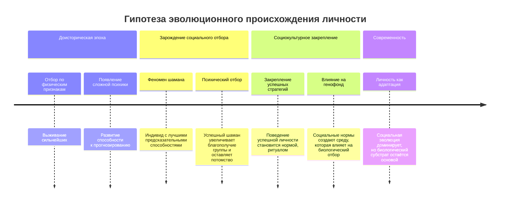
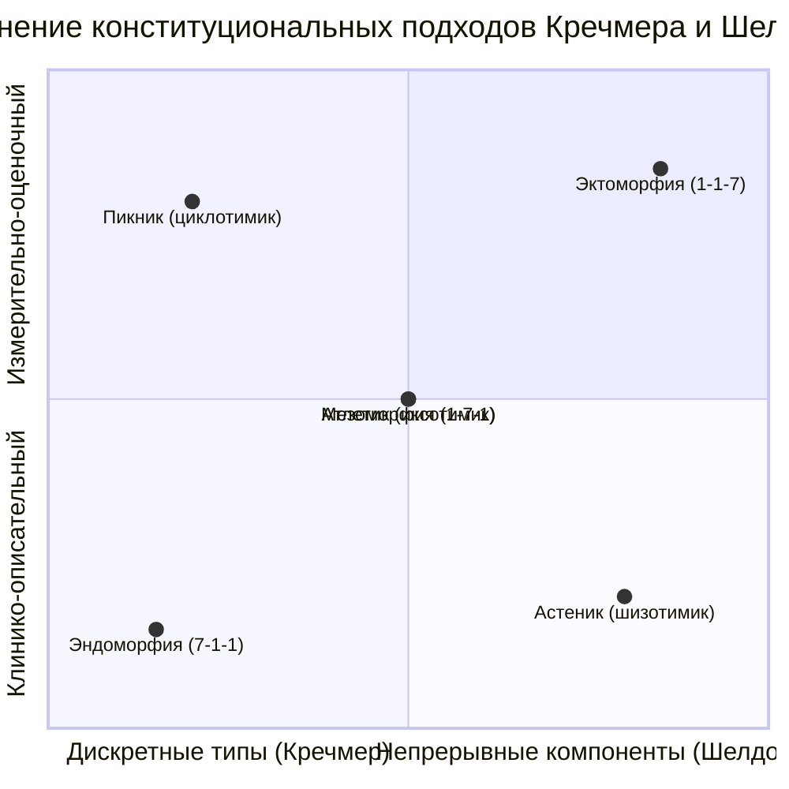

Личность формируется в социальном взаимодействии, но её фундамент — биологический. Это создаёт диалектическое напряжение: личность как продукт высших социальных функций оказывается в заложниках у собственного тела, состояния которого, от хронической боли до свойств нервной системы, напрямую влияют на её проявления.

## Историко-эволюционные истоки личности: от шамана к социуму

Возникновение личности — не случайность, а этап эволюции. Ключевой вопрос: что сильнее определяет человека — биоэволюция или социальная эволюция? Работы А.Н. Северцова указывают на то, что социальная жизнь начинает влиять на биологическую эволюцию. Изменения закрепляются не только через вымирание неприспособленных, но и через рассеивание (распространение) успешных социальных стратегий.

### Гипотеза личности как эволюционного приспособления

Согласно этой логике, личность возникла как адаптивный механизм. Её зачатки можно увидеть в феномене **шаманов** в древних сообществах.

*   **Шаман как первый «профессиональный психолог»:** Это был индивид с наиболее развитой способностью **предсказывать будущее** — моделировать исход охоты, изменение погоды, последствия конфликтов. Эта способность, основанная на сложной психической деятельности, давала группе survival-преимущество.
*   **Психический отбор:** Успешный шаман, точнее предсказывающий события, повышал благополучие своей группы и, следовательно, свои шансы оставить потомство. Он также воспитывал последователей в своей «психической парадигме». Неудачный шаман (плохой предсказатель) такие шансы терял. Таким образом, происходил **сложный психический отбор**, где выживали и передавали свои гены не просто сильнейшие физически, но и наиболее психически развитые индивиды.
*   **Социальное закрепление:** То, как успешная личность (шаман) вела группу, закреплялось в социальных нормах, ритуалах, культуре. Со временем эти социальные паттерны могли оказывать обратное влияние на отбор, формируя среду, где ценились определённые психологические качества.

Переход к использованию орудий и сложным формам cooperation означал, что **социум стал доминировать над биологией** как двигатель развития. Однако фундамент остался биологическим: сам мозг, обеспечивающий возможность социальной жизни и существование личности, — продукт биологической эволюции. Мы живы и социальны **благодаря** тому, что у нас есть личность, но сама эта личность разворачивается на телесном субстрате.

## Место индивидных свойств в организации личности

**Индивидные свойства** — это устойчивые биологические характеристики человека, выступающие как природная основа личности. К ним относятся конституциональные особенности (телосложение), свойства нервной системы (темперамент), нейродинамические паттерны, половозрастные характеристики, органические потребности.

В психологии XX века сформировалось два основных вектора их изучения:
1.  **Феноменологическая тенденция** (Э. Шпрангер): описание целостных «форм жизни», где биологические предпосылки выступают как неразрывная часть духовного облика.
2.  **Дифференциально-психофизиологическая тенденция** (Г. Айзенк, Р. Кеттел, конституциональные школы): измерение и классификация этих свойств, поиск их коррелятов с психологическими чертами.

Гордон Олпорт, комментируя подход Шпранггера, отмечал, что личность (душа) представляет собой **«смысловую взаимосвязь действий, переживаний и реакций, объединенных человеческим Я»**. Индивидные свойства — тот материал, из которого это Я строит свои смысловые связи.

## Феноменологический подход: жизненные формы Эдуарда Шпранггера

Шпрангер не проводил экспериментов и не строил факторные модели. Его метод — феноменологическое наблюдение и анализ. Он выделил шесть идеальных **типов личности** или **жизненных форм**, определяемых доминирующей ценностной ориентацией.

1.  **Теоретический человек.**
    *   **Доминирующая ценность:** Познание, установление закономерностей.
    *   **Мотивация:** Стремление к объективности, независимости от частных целей, преодоление аффектов. Любое явление стремится включить в общую систему.
    *   **Пример:** Учёный-исследователь, для которого процесс поиска истины важнее практического результата.

2.  **Экономический человек.**
    *   **Доминирующая ценность:** Полезность, выгода.
    *   **Мотивация:** Ориентация на извлечение максимальной пользы из материи, энергии, времени. Ценности логики уступают ценностям полезности.
    *   **Пример:** Предприниматель, эффективный менеджер, для которого главный критерий — практический результат и рентабельность.

3.  **Эстетический человек.**
    *   **Доминирующая ценность:** Форма, гармония, выражение.
    *   **Мотивация:** «Воля к форме». Стремление преобразовать впечатления в выражения, построить и оформить себя и мир вокруг. Универсализация эстетического видения.
    *   **Пример:** Художник, музыкант, дизайнер, а также человек, уделяющий чрезвычайное внимание стилю и гармонии в повседневной жизни.

4.  **Социальный человек.**
    *   **Доминирующая ценность:** Любовь (в широком, альтруистическом смысле), служение другим.
    *   **Мотивация:** Стремление к отдаче, заботе, установлению духовной связи с людьми. Любовь как организующий принцип жизни.
    *   **Пример:** Волонтёр, социальный работник, педагог по призванию.

5.  **Политический (властный) человек.**
    *   **Доминирующая ценность:** Власть, влияние, доминирование.
    *   **Мотивация:** Стремление преобладать над другими, внушать свою ценностную установку. Все иные сферы (эстетика, экономика, теория) становятся средствами для достижения власти.
    *   **Пример:** Политический лидер, топ-менеджер авторитарного стиля. Шпранггер отмечал, что если властным человеком движет безграничная фантазия по переустройству мира, он сближается с эстетическим типом (например, многие великие завоеватели).

6.  **Религиозный человек.**
    *   **Доминирующая ценность:** Высшее, абсолютное, поиск единства с бесконечным.
    *   **Мотивация:** Постоянная ориентация на обнаружение высшего ценностного переживания, дающего абсолютное удовлетворение.
    *   **Пример:** Мистик, глубоко верующий человек, философ, занятый поиском смысла бытия.

**Важные особенности типологии Шпранггера:**
*   Это **идеальные типы**. В реальности человек сочетает в себе несколько ориентаций, одна из которых доминирует.
*   Типы **не являются жёстко адаптивными**. Человек может проявлять черты одного типа в знакомой, компетентной сфере и другого — в ситуации неуверенности (например, властный человек в некомпетентной области может вести себя как эстетик, выстраивая красивую, но неэффективную картину происходящего).
*   **Практическое применение:** Эта классификация полезна для первичного прогнозирования поведения малознакомого человека, исходя из его доминирующей ценностной риторики и действий.

## Конституциональная психология: поиск связи тела и психики

В начале XX века, параллельно с развитием психологии, в психиатрии и криминологии зародилось направление, стремившееся найти биологические маркеры психологических особенностей, изучая **конституцию** (телосложение). Исходные данные часто собирались среди заключённых и пациентов психиатрических клиник.

### Типология Эрнста Кречмера

Кречмер выделил три дискретных конституциональных типа, связав их с предрасположенностью к определённым психическим заболеваниям (психозам).

1.  **Пикник** (от греч. *pyknos* — плотный, толстый).
    *   **Описание:** Круглая голова, короткая шея, широкая грудь, склонность к ожирению за счёт развитой жировой ткани.
    *   **Предполагаемый психологический склад (циклотимический):** Общительный, практичный, эмоционально лабильный, с колебаниями настроения.
    *   **Предрасположенность к:** Маниакально-депрессивному психозу (биполярному аффективному расстройству).

2.  **Атлетик.**
    *   **Описание:** Крепкий костяк, развитая мускулатура, широкие плечи, узкий таз.
    *   **Предполагаемый психологический склад (иксотимический):** Спокойный, малоимпрессивный, сдержанный в жестах и мимике, склонный к властности.
    *   **Предрасположенность к:** Эпилепсии (гипотеза позднее не получила широкого подтверждения).

3.  **Астеник** (или **лептосомный**, от греч. *leptos* — тонкий).
    *   **Описание:** Худощавое тело, длинные конечности, узкая грудная клетка, вытянутое лицо.
    *   **Предполагаемый психологический склад (шизотимический):** Замкнутый, серьёзный, склонный к абстракции, сдержанный в эмоциях.
    *   **Предрасположенность к:** Шизофрении.

### Континуальная система Уильяма Шелдона

Шелдон критиковал дискретность типологии Кречмера и предложил систему из трёх непрерывных **компонент телосложения**, каждая из которых оценивается по 7-балльной шкале. Сумма баллов по всем компонентам для конкретного индивида всегда равна константе.

1.  **Эндоморфия** (преобладание внутреннего зародышевого листка — эндодермы).
    *   **Телесные признаки:** Развитие внутренних органов и жировой ткани, мягкость, округлость форм.
    *   **Психологический темперамент (висцеротония):** Расслабленность, общительность, любовь к комфорту, социофилия.

2.  **Мезоморфия** (преобладание среднего зародышевого листка — мезодермы).
    *   **Телесные признаки:** Развитие костей, мышц и соединительной ткани, физическая крепость, прямоугольные очертания.
    *   **Психологический темперамент (соматотония):** Энергичность, склонность к риску и доминированию, любовь к физической активности, сдержанность в проявлении чувств.

3.  **Эктоморфия** (преобладание внешнего зародышевого листка — эктодермы).
    *   **Телесные признаки:** Развитие кожи и нервной ткани, хрупкость, линейность, минимум жира и мышц.
    *   **Психологический темперамент (церебротония):** Сдержанность, скованность, социальная тревожность, склонность к уединению, повышенная реактивность.

**Чистые типы** встречаются редко (например, 1-1-7 — чистый эктоморф). Чаще наблюдаются смешанные профили (например, 3-5-2).

### Система Конрада: пропорции и плотность

К. Конрад предложил рассматривать конституцию через две независимые оси первичных переменных:
*   **Лептоморфия — Пикноморфия:** Ось, описывающая **пропорции тела** (худощавость vs. полнота, вытянутость vs. округлость).
*   **Гипоплазия — Гиперплазия:** Ось, описывающая **плотность и степень развития тканей** (недоразвитие, изящность vs. массивность, разрастание).

Эта система добавляет важное наблюдение: эстетическое восприятие и доверие к человеку часто связаны с умеренными, слегка асимметричными пропорциями. Чрезмерная «твёрдость» (гиперплазия) или «мягкость» (гипоплазия), как и идеальная симметрия, могут подсознательно отталкивать, тогда как лёгкая асимметрия воспринимается как живая и естественная.

### Критика и значение конституциональных подходов

*   **Методологическая критика:** Исходные данные (тюрьмы, клиники) нерепрезентативны для общей популяции. Связи между телосложением и психическими заболеваниями носят статистический, а не причинно-следственный характер. Многие корреляции (например, атлетика с эпилепсией) не подтвердились.
*   **Современное значение:** Эти теории представляют в первую очередь **исторический интерес** как ранние попытки систематизировать связь биологии и психики. Они заложили основы для более современных исследований в области дифференциальной психофизиологии и психогенетики, которые изучают связь свойств нервной системы, генетических факторов с чертами личности, используя более строгие методы.

## Заключение: синтез биологического и социального

Индивидные свойства личности — это не приговор, а **исходный материал** и **система ограничений**. Эволюция создала личность как социальную адаптацию, но поместила её в биологический «контейнер» — тело с определённой конституцией, темпераментом, потребностями.

1.  **Личность возникла в результате «психического отбора»** как инструмент для выживания через лучшее прогнозирование и социальную координацию (гипотеза о шаманах).
2.  **Социальная эволюция стала доминирующей силой**, но биологический субстрат остаётся фундаментальным условием. Хроническая боль, свойства нервной системы напрямую влияют на то, как личность проявляет себя в мире.
3.  **Индивидные свойства изучаются с разных позиций:** феноменологической (целостные жизненные формы Шпранггера) и дифференциально-измерительной (конституциональные типологии, факторные модели черт).
4.  **Конституциональные теории (Кречмер, Шелдон, Конрад)** исторически важны, но их прямолинейные выводы следует воспринимать критически. Они указывают на существование **вероятностных связей** между телесной организацией и некоторыми психологическими тенденциями, а не на жёсткую детерминацию.

Понимание индивидных свойств позволяет психологу видеть не только социальную маску и личностные конструкты, но и биологическую основу, которая может объяснять устойчивые паттерны поведения, границы адаптации и точку приложения для комплексной (в том числе, при необходимости, медико-психологической) помощи.

## Запомнить

*   **Личность имеет эволюционные корни** и могла возникнуть как адаптация для лучшего прогнозирования (гипотеза о «шаманах»), что привело к сложному **психическому отбору**.
*   **Индивидные свойства** — устойчивые биологические характеристики (конституция, темперамент), составляющие природную основу личности.
*   **Типология Шпранггера** описывает 6 **жизненных форм** (теоретический, экономический, эстетический, социальный, политический, религиозный), основанных на доминирующей ценностной ориентации. Это феноменологические, а не биологические типы.
*   **Конституциональные подходы** (Кречмер, Шелдон, Конрад) исторически пытались найти связь между телосложением и психикой. Кречмер выделял **пикника, атлетика, астеника**. Шелдон — три компоненты (**эндоморфия, мезоморфия, эктоморфия**), оцениваемые по балльной системе.
*   Современная психология рассматривает связи между конституцией и психикой как **статистические и вероятностные**, а не как жёсткую причинно-следственную зависимость. Биологические свойства задают диапазон возможностей, внутри которого социальные факторы формируют конкретную личность.
