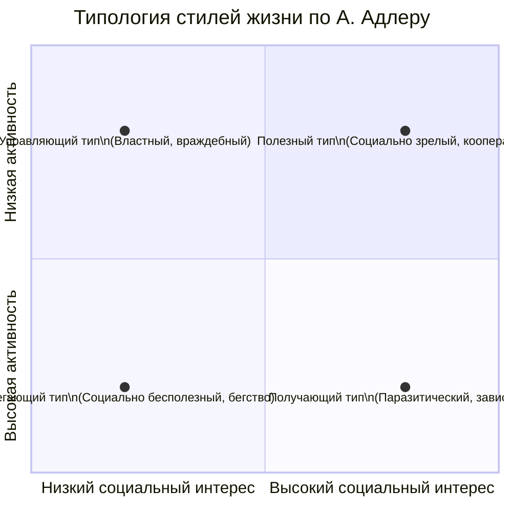

После Фрейда психология личности искала новые объяснения движущим силам человека. Альфред Адлер сместил фокус с бессознательных влечений прошлого на осознанные цели будущего, а Курт Левин привнёс в психологию язык физики, показав, что поведение — функция личности и её психологического поля здесь и сейчас.

## Индивидуальная психология Альфреда Адлера: от неполноценности к социальному интересу

Альфред Адлер, изначально соратник Фрейда и президент Венского психоаналитического общества, вскоре вступил с ним в полемику, что привело к разрыву в 1911 году. Его личный опыт (болезнь, рахит в детстве) повлиял на теорию, в центре которой — преодоление чувства неполноценности.

### Комплекс неполноценности как движущая сила

Адлер утверждал, что чувство неполноценности универсально: никто не рождается взрослым и всемогущим. Оно становится **комплексом**, когда чувство слабости и неуместности становится центральным, хроническим переживанием, определяющим жизнь.

**Факторы, усугубляющие комплекс неполноценности в детстве:**
1.  **Органическая неполноценность:** Врождённые болезни или физические недостатки (как рахит у самого Адлера).
2.  **Избалованность (потворство):** Ребёнку всё позволяют, в результате он оказывается не готов к трудностям реального мира и чувствует себя беспомощным, когда сталкивается с ними.
3.  **Заброшенность (отвержение):** Недостаток внимания, любви и поддержки порождает глубокое чувство ненужности.

Эти условия формируют основу для **невротического стиля жизни**, направленного не на решение реальных проблем, а на компенсацию субъективного чувства неполноценности.

### Стремление к превосходству и социальный интерес

В ответ на неполноценность возникает **стремление к превосходству** — фундаментальный мотив, направленный на развитие, совершенствование, достижение мастерства. Здоровая форма этого стремления — **самореализация и совершенствование**. Невротическая, искажённая форма — **стремление к личной власти** над другими, доминированию как способу доказать свою ценность.

Ключевое понятие Адлера — **общественный интерес (социальное чувство, Gemeinschaftsgefühl)**. Это врождённая, но требующая развития способность к сотрудничеству, эмпатии, заботе об общем благе. Истинное психическое здоровье и удовлетворение, по Адлеру, человек обретает не во власти, а в **чувстве общности и полезности**. Власть — лишь суррогатный способ «привязать» к себе людей, тогда как подлинная радость — в том, чтобы быть полезным другим.

**Три жизненные задачи (проблемы), в которых проверяется зрелость личности:**
1.  **Работа (профессиональная деятельность).**
2.  **Дружба (социальные отношения).**
3.  **Любовь (интимные отношения).**

Успех в этих сферах взаимосвязан. Провал в одной области (например, одиночество) заставляет человека чувствовать себя неполноценным и может компенсироваться гипертрофированным вниманием к другой (трудоголизм). Адлер подчёркивал **проактивный подход**: важно не «почему у меня это есть», а «чего я хочу этим добиться?». Например, клиентка с агрофобией могла бессознательно использовать симптом, чтобы удержать мужа рядом, обеспечивая себе чувство безопасности и значимости.

### Стиль жизни и типология

**Стиль жизни** — это уникальная, создаваемая самим человеком когнитивно-поведенческая схема, его способ движения к целям. Он формируется в раннем детстве и включает:
1.  **Я-концепцию** (идеал себя).
2.  **Образ мира (схему апперцепции)** — субъективную «карту» реальности.
3.  **Этические убеждения.**

Адлер описывал четыре типа установок (стилей жизни), основанных на комбинации двух параметров: **уровня социального интереса** и **уровня активности**.

*   **Управляющий тип:** Высокая активность, но низкий социальный интерес. Самоуверенные, напористые, стремятся к превосходству над другими. Решают жизненные задачи во враждебной, антисоциальной манере (могут быть юные правонарушители).
*   **Получающий тип:** Низкая активность, низкий социальный интерес. Паразитическое отношение к миру, ожидание, что другие удовлетворят их потребности. Не склонны причинять вред активно, но социально бесполезны.
*   **Избегающий тип:** Низкая активность, низкий социальный интерес. Основная цель — избегание любых проблем и неудач. Характерно бегство от жизненных задач, социально-бесполезное поведение.
*   **Полезный (социально-полезный) тип:** Высокая активность, высокий социальный интерес. Идеал психического здоровья. Проявляют заботу о других, решают задачи через сотрудничество, мужество и готовность вносить вклад в общее благополучие.

Адлер считал, что поворот рефлексии с себя на другого — ключ к обретению активности и сил. Нормальная адаптация предполагает успешное решение трёх жизненных задач.

## Теория поля Курта Левина: психология как точная наука

Курт Левин, «дедушка социальной психологии», стремился привнести в психологию строгость естественных наук. Он противопоставлял **аристотелевский стиль мышления** (описание мира как набора отдельных, классифицируемых явлений) **галилеевскому** (понимание мира как целостной, гомогенной системы, где всё взаимосвязано). Его девиз: «Нет ничего практичнее хорошей теории».

### Гештальт-основа: от фи-феномена к целостности

Левин был представителем **гештальт-психологии**. Ключевой принцип: **целое больше суммы своих частей**. Система обладает свойствами, которых нет у отдельных элементов.
*   **Фи-феномен:** Иллюзия движения, возникающая при быстрой смене статичных изображений (основа кинематографа). Мы видим «бегающий кружочек», хотя это лишь мигающие лампочки. Целое (движение) рождается из взаимодействия элементов.
*   **Фигура и фон:** Восприятие всегда структурируется на выделяющуюся фигуру и отступающий фон. Это динамично: одно и то же может быть то фигурой, то фоном.
*   **Инсайт (ага-переживание):** Момент внезапного понимания, когда разрозненные элементы складываются в целостную, осмысленную картину или решение проблемы.

### Основные принципы теории поля

Левин перенёс эти идеи на личность и её поведение.
1.  **Образ мира целостен.** Человек воспринимает не разрозненные стимулы, а целостное «психологическое поле».
2.  **Образ мира создаётся «здесь и сейчас».** Даже воспоминания о прошлом актуализируются и переживаются в настоящий момент.
3.  **Принцип изоморфизма.** Законы организации целостных систем универсальны и могут описываться сходным образом в физике, биологии и психологии.

### Формула поведения и жизненное пространство

Левин вывел знаменитую формулу, описывающую поведение как функцию личности и среды:

**B = f(P, E)**
*   **B (Behavior)** — поведение.
*   **P (Person)** — внутренние факторы человека (потребности, цели, установки, способности).
*   **E (Environment)** — окружающая среда, но не физическая, а **психологическая** — то, как она воспринимается и значима для самого человека в данный момент (**феноменальное поле**).

Таким образом, поведение зависит от **взаимодействия** личности и её психологического окружения в конкретный момент времени.

**Жизненное пространство** — ключевое понятие. Это совокупность всех факторов (внутренних и внешних), влияющих на поведение индивида в данное время. Оно включает:
*   **Потребности и квазипотребности** (актуальные намерения, например, желание закончить статью).
*   **Цели (валентности).** Объекты в среде обладают **валентностью** — субъективной привлекательностью (+) или отталкивающестью (-).
*   **Векторы.** Психологические «силы», которые «тянут» человека к положительным целям или «отталкивают» от отрицательных.

### Типы внутриличностных конфликтов

Левин классифицировал конфликты, возникающие в жизненном пространстве, по типу валентностей целей:

1.  **Конфликт «приближение–приближение»:** Выбор между двумя равно привлекательными целями (два вкусных десерта). Конфликт обычно разрешается легко, так как выбор любого варианта даёт положительный результат.
2.  **Конфликт «избегание–избегание»:** Выбор между двумя неприятными альтернативами (мыть посуду или готовиться к сложному экзамену). Часто приводит к попыткам «выйти из поля» (заняться чем-то третьим, прокрастинировать).
3.  **Конфликт «приближение–избегание»:** Один и тот же объект или цель обладает и положительной, и отрицательной валентностью одновременно (интересная, но рискованная работа; желание выступить публично и страх сцены). Это наиболее сложный и трудноразрешимый тип конфликта, ведущий к колебаниям.

### Развитие личности по Левину

Развитие личности — это качественное изменение её жизненного пространства:
*   **Дифференциация:** Увеличение числа и разнообразия выделяемых областей, интересов, навыков. Ребёнок изначально воспринимает мир глобально и диффузно, с возрастом он учится различать нюансы.
*   **Интеграция (организация):** Установление связей между дифференцированными областями, создание иерархии целей, ценностей. Жизненное пространство становится более структурированным и упорядоченным.
*   **Увеличение широты жизненного пространства:** Расширение временной перспективы (способность планировать будущее и извлекать уроки из прошлого) и социального кругозора.

**Практический вывод:** Чтобы способствовать развитию, нужно создавать условия для дифференциации (предлагать новое, пробовать разное) и интеграции (помогать осмыслять опыт, выстраивать связи).

### Прикладное значение: от нерешаемых задач до организационной психологии

Левин был блестящим экспериментатором и практиком. Его известный эксперимент с «нерешаемой задачей» (например, достать предмет, не вставая со стула) показал, как фрустрация и беспомощность возникают в определённой структуре поля. Он же первым описал феномен **замещающего действия** — когда недостижимая цель заменяется другой, символически связанной.

В годы Второй мировой войны, эмигрировав в США, Левин занялся прикладными исследованиями:
*   **Изучение стилей лидерства** (авторитарный, демократический, попустительский).
*   **Изменение пищевых привычек** в целях оптимизации питания в условиях дефицита.
*   **Решение организационных задач:** Например, для снижения травматизма на заводе он предложил сделать частоту мерцания лампочек несовпадающей с частотой вращения фрезера, чтобы движение стало заметным для рабочего. Это решение было не техническим, а **психологическим** — оно меняло восприятие среды (**феноменальное поле**) работника.
*   **Тимбилдинг и групповая динамика:** Левин основал движение «тренинг-групп» (Т-групп), направленных на развитие групповой сплочённости и эффективности через анализ «здесь и сейчас» происходящих процессов.

Его работа заложила основы **организационной психологии** и **психологии социальных изменений**, показав, что для изменения поведения необходимо менять не человека изолированно, а всю систему «личность–среда».

## Практические вопросы для самоанализа

Обе теории предлагают инструменты для рефлексии. Вопросы, основанные на идеях Адлера и Левина, могут помочь выявить закрытые зоны и точки роста.

**Вопросы по Адлеру:**
1.  Где и когда вы ощущали себя беспомощным? Есть ли сферы, где это чувство сохраняется? Как можно изменить эту ситуацию?
2.  Приведите пример, когда вы искали личного превосходства над другими вместо конструктивного саморазвития. Каковы были результаты и ваши чувства?
3.  Представьте, что у вас появилась почти неограниченная власть. Как бы вы её использовали? Как это повлияло бы на ваши отношения и ощущение счастья?

**Вопросы по Левину:**
1.  Опишите текущую важную для вас цель. Какие «силы» (внутренние и внешние) притягивают вас к ней? Какие — отталкивают?
2.  Проанализируйте ваш типичный внутриличностный конфликт. К какому типу по Левину он относится? Как вы обычно его разрешаете?
3.  Как можно «расширить» или «дифференцировать» ваше текущее жизненное пространство, чтобы почувствовать больше возможностей и свободы?

Трудности с ответами могут указывать на области, где доминирует **комплекс неполноценности** (Адлер) или где **жизненное пространство** остаётся ригидным и недифференцированным (Левин).

## Запомнить

*   **Адлер сместил фокус с прошлого на будущее.** Центральные понятия: **комплекс неполноценности**, **стремление к превосходству**, **социальный интерес**. Здоровье — в полезности и решении трёх жизненных задач: работа, дружба, любовь.
*   **Стиль жизни** — уникальная схема движения к целям. Адлер выделял четыре типа: **управляющий, получающий, избегающий, полезный** (идеал).
*   **Курт Левин** применил **гештальт-подход** и **галилеевский стиль мышления** к психологии. Поведение — функция личности и среды: **B = f(P, E)**.
*   **Жизненное пространство** — психологическая реальность, влияющая на человека. В нём возникают конфликты: **«++»**, **«--»**, **«+-»**.
*   **Развитие личности** — это **дифференциация**, **интеграция** и **расширение** жизненного пространства.
*   **Прикладное наследие Левина** огромно: от изучения стилей лидерства и групповой динамики до основ **организационной психологии** и методов решения практических задач через изменение восприятия среды.
