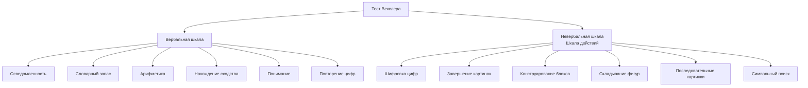

Интеллект долгое время рассматривался как отдельная, измеримая способность, предопределяющая жизненный путь человека. Однако исследования показали, что связь между высоким IQ и успехом нелинейна. Понимание интеллекта как многокомпонентного явления, вплетенного в ткань личности и взаимодействующего с эмоциями, мотивацией и социальным контекстом, меняет представления о человеческом потенциале.

## Определение и структура интеллекта

**Интеллект** — это системное качество психики, объединяющее способности к познанию, решению проблем и адаптации к новой среде. Он включает базовые познавательные процессы: ощущение, восприятие, память, внимание, мышление и воображение, а также опирается на речь, мотивацию и эмоции. В современной психометрии принято разделение на два основных компонента.

**Подвижный интеллект** — это способность к обучению, анализу новых ситуаций, выявлению закономерностей и логическому мышлению. Он в меньшей степени зависит от накопленных знаний и культуры.

**Кристаллизовавшийся интеллект** — это накопленный багаж знаний, навыков и опыта, способность использовать усвоенную информацию. Он тесно связан с образованием и культурной средой.

Общая способность, лежащая в основе всех когнитивных достижений, обозначается как **генеральный фактор G**, или фактор общей умственной энергии.

## Исторические корни: Фрэнсис Гальтон и наследуемость ума

Основоположником научного изучения индивидуальных различий и интеллекта стал **Фрэнсис Гальтон**. Его подход можно охарактеризовать девизом: «Всё, что можно сосчитать – считайте». Гальтон впервые применил количественные методы — анкетирование и генеалогический анализ — для изучения одаренности.

В масштабном исследовании он сравнил две группы по 4000 человек: выходцев из семей с известными талантами и из обычных семей. В первой группе незаурядные способности проявили около 1000 человек, во второй — лишь 300. Гальтон заметил, что всех одаренных людей объединяет «инстинктивная жажда умственного труда», которую сегодня можно назвать внутренней мотивацией или стремлением к самоактуализации.

Его выводы сформировали **наследственническую** позицию:
1.  Потенциальные умственные способности наследуются.
2.  Каждый человек несет «груз наследственности», проявляющийся в телосложении, темпераменте, характере и интеллекте.
3.  Среда, воспитание и образование лишь наслаиваются на эту биологическую основу, немного улучшая или ухудшая исходный потенциал.

Работы Гальтона заложили основы психометрии и породили дискуссию «природа versus воспитание», которая остается актуальной.

## Рождение IQ: от Бине до Штерна

Практический запрос на выявление детей, нуждающихся в педагогической помощи, привел к созданию первого научного теста интеллекта. **Альфред Бине** и **Теодор Симон** по заказу французского министерства образования разработали методику, оценивающую внимание, память и мышление. Они ввели понятие **умственного возраста** — уровня сложности задач, которые способен решить ребенок.

Немецкий психолог **Вильям Штерн** предложил соотнести умственный возраст с хронологическим, чтобы получить универсальный показатель. Так появился **коэффициент интеллекта (IQ)**. Формула `IQ = (Умственный возраст / Хронологический возраст) * 100` позволила сравнивать детей разного возраста. Значение 100% стало статистической нормой, означающей соответствие способностей среднему уровню для данной возрастной группы.

### Критика первых тестов
Методика Бине-Симона сразу столкнулась с критикой:
1.  **Культурная и языковая зависимость**: акцент на вербальных заданиях ставил в невыгодное положение детей, для которых язык теста не был родным.
2.  **Игнорирование процессуальных аспектов**: короткие задания не позволяли оценить мотивацию, упорство или стратегию решения.
3.  **Проблемы интерпретации**: неравномерность результатов (когда ребенок решает сложные, но не справляется с простыми задачами) трудно было объяснить в рамках линейной шкалы возраста.

## Современные психометрические подходы к измерению интеллекта

### Ганс Айзенк и скорость обработки информации
**Ганс Айзенк** считал, что в основе биологического интеллекта лежит скорость и эффективность работы нервной системы. Он предлагал использовать **время простой сенсомоторной реакции** как индикатор интеллекта. Его тесты, основанные на выявлении логических закономерностей в числовых и графических рядах, делают акцент на скорости и точности. Это «жесткие» тесты, выявляющие людей с быстрым аналитическим умом, но они охватывают лишь часть интеллектуальных способностей.

### Джон Равен и измерение фактора G
**Тест прогрессивных матриц Равена** считается одним из «чистых» инструментов для оценки **подвижного интеллекта** и фактора G. Он невербальный и минимизирует влияние культуры и образования. Испытуемому предлагается найти недостающий элемент в матрице сложных геометрических паттернов. Тест существует в двух формах: с ограничением времени (20 минут) и без. Сам Равен полагал, что временные ограничения не критичны для оценки способности к абстрактному мышлению.

Практическая ценность теста Равена в педагогике связана с концепцией **зоны ближайшего развития**. Если два ребенка показывают одинаковый результат, но один, получив небольшую подсказку, решает задачи более высокого уровня, а другой — нет, это указывает на разный потенциал к обучению и требует дифференцированного подхода.

### Дэвид Векслер и многофакторная модель
**Шкалы интеллекта Векслера** (WAIS для взрослых, WISC для детей) — это комплексный, дорогостоящий и длительный диагностический инструмент. Он состоит из двух основных частей, что позволяет получить профиль сильных и слабых сторон.

Такой подход помогает понять, почему человек с высоким общим IQ может испытывать трудности в учебе или работе — например, из-за низких показателей по обработке зрительно-пространственной информации или скорости восприятия. Тест Векслера регулярно пересматривают и обновляют, так как средний уровень интеллекта в популяции со временем растет.

## Эмоциональный интеллект: когда чувства управляют успехом

Наблюдение, что люди со средним IQ часто добиваются большего успеха в жизни и карьере, чем обладатели высокого IQ, привело к осознанию роли некогнитивных факторов. В 1990-х годах **Джон Майер** и **Питер Саловей** ввели термин **«эмоциональный интеллект» (EQ)**.

**Эмоциональный интеллект** — это совокупность навыков распознавать, понимать, использовать и управлять своими эмоциями и эмоциями других людей для решения практических задач.

Модель эмоционального интеллекта, популяризированная **Дэниелом Гоулманом**, включает пять ключевых компонентов:

1.  **Самосознание**: умение распознавать собственные эмоции и их влияние на мысли и поведение. Это основа психологической зрелости.
2.  **Саморегуляция**: способность контролировать деструктивные импульсы, управлять своими эмоциональными состояниями, адаптироваться к changing circumstances.
3.  **Мотивация**: использование эмоций для постановки целей, упорства и настойчивости, несмотря на неудачи. Ключевой аспект — способность откладывать вознаграждение.
4.  **Эмпатия**: распознавание и понимание чувств, потребностей и точек зрения других людей. Это фундамент для эффективной коммуникации и помогающего поведения.
5.  **Социальные навыки**: искусство управления отношениями, построения сетей, нахождения общего языка и разрешения конфликтов.

### Измерение и тренировка EQ
Для оценки эмпатии и способности распознавать эмоции используется **Reading the Mind in the Eyes Test (RMET)** Саймона Барона-Коэна. Испытуемому показывают 36 фотографий, на которых видны только область глаз, и просят выбрать слово, наилучшим образом описывающее состояние человека. Этот тест демонстрирует, что эмоциональный интеллект — это не абстракция, а конкретный навык, который можно оценить и, что важно, **развивать через тренировку**.

### Спор о природе EQ
В научном сообществе существуют два лагеря:
*   **Врожденная основа** (Ганс Айзенк, Яак Панксепп): базовые эмоциональные паттерны и темперамент заданы биологически, они являются врожденными нейронными программами (страх, гнев, забота). Их невозможно кардинально изменить, можно лишь учиться компенсировать.
*   **Приобретаемая способность** (Майер, Саловей, Гоулман): эмоциональный интеллект — это набор навыков, которым можно научиться. Ребенка можно научить распознавать эмоции, понимать их причины и регулировать свои реакции.

## Множественный интеллект Говарда Гарднера

Теория **Говарда Гарднера** совершила революцию, поставив под сомнение идею единого интеллекта. Он предложил модель **множественного интеллекта**, выделив девять относительно автономных видов:

1.  **Лингвистический**: чувствительность к слову, любовь к языку, письму, чтению (журналисты, писатели).
2.  **Логико-математический**: способность оперировать символами, выявлять логические связи, работать с абстракциями (математики, программисты).
3.  **Пространственный**: умение воспринимать и манипулировать зрительно-пространственными образами (архитекторы, художники, штурманы).
4.  **Музыкальный**: чувствительность к ритму, тону, тембру, мелодии (музыканты, композиторы).
5.  **Телесно-кинестетический**: мастерское владение телом для решения задач или самовыражения (спортсмены, танцоры, хирурги).
6.  **Межличностный**: способность понимать намерения, мотивации и желания других людей, навык эффективного взаимодействия (педагоги, политики, психологи).
7.  **Внутриличностный**: глубокая интроспекция, понимание собственных чувств, страхов, мотивов; саморефлексия.
8.  **Натуралистический**: способность распознавать и классифицировать объекты природы, чувствительность к флоре и фауне (биологи, экологи, фермеры).
9.  **Экзистенциальный** (гипотетический): склонность к размышлениям о фундаментальных вопросах бытия, жизни, смерти.

Эта теория утверждает, что не существует «глупых» или «умных» людей в целом — есть разные профили интеллектуальных способностей. Успех зависит от того, насколько среда и деятельность человека соответствуют его сильным типам интеллекта.

## Интеллект в контексте личности: синтез подходов

Интеллект не существует в вакууме. Рассмотренные теории показывают, как он встроен в более широкую структуру личности.

*   **Связь с темпераментом и наследственностью** (Гальтон, Айзенк): биологическая основа задает диапазон возможностей для развития как когнитивных, так и эмоциональных способностей.
*   **Интеллект как деятельность** (в духе Леонтьева): кристаллизовавшийся интеллект — это следствие прошлой деятельности, а подвижный — основа для новой. Мотивация («жажда умственного труда») становится движущей силой этого процесса.
*   **Эмоциональный интеллект как часть экзистенциального благополучия** (в духе Ленгле): способность к самосознанию и управлению эмоциями напрямую связана с фундаментальной мотивацией «Могу ли я быть собой?». Эмпатия и социальные навыки — основа для построения **Mitwelt** (мира взаимоотношений).
*   **Множественный интеллект и самореализация**: теория Гарднера созвучна гуманистическому подходу, подчеркивая уникальность индивидуального пути и необходимость поиска деятельности, соответствующей внутренней структуре способностей.

Таким образом, современное понимание интеллекта вышло далеко за рамки тестов IQ. Это динамическая, многокомпонентная система, тесно переплетенная с эмоциональной сферой, волей, мотивацией и социальным контекстом. Эффективное развитие и применение интеллекта возможно только при учете всей сложности личности.

## Запомнить

*   **Интеллект** — комплексная способность, включающая подвижный (обучение) и кристаллизовавшийся (знания) компоненты. Его нельзя свести к одному числу IQ.
*   **Фрэнсис Гальтон** заложил основы психометрии, подчеркивая роль наследственности. Его методы — анкетирование и генеалогический анализ.
*   **Тест IQ** появился благодаря работам Бине-Симона (умственный возраст) и Штерна (коэффициент). Ранние тесты критиковали за культурную зависимость.
*   **Современные тесты** измеряют разные аспекты: Айзенк — скорость, Равен — подвижный интеллект/G-фактор, Векслер — дает развернутый профиль вербальных и невербальных способностей.
*   **Эмоциональный интеллект (EQ)** — навык распознавать, понимать и управлять эмоциями. Включает самосознание, саморегуляцию, мотивацию, эмпатию и социальные навыки. Является ключевым предиктором успеха в жизни и карьере.
*   **Теория множественного интеллекта Гарднера** утверждает существование 9 относительно независимых видов интеллекта (логико-математический, лингвистический, межличностный и др.). У каждого человека уникальный профиль.
*   **Интеллект неотделим от личности**: на него влияют темперамент (биология), мотивация (деятельность), эмоциональная компетентность и социальная среда. Развитие интеллекта эффективно только в контексте целостного личностного роста.
