Познание — это не нейтральный процесс получения информации. Между миром и нашим сознанием стоят индивидуальные фильтры — устойчивые способы восприятия, анализа и оценки действительности. Эти фильтры, называемые когнитивными стилями, предопределяют, что мы заметим, как поймем и какой способ решения выберем, часто оставаясь за рамками нашего осознания. Их изучение отвечает на вопрос: почему в одной и той же ситуации разные люди принимают диаметрально противоположные решения.

## Что такое когнитивные стили: инструменты познания

**Когнитивные стили (КС)** — это индивидуально-своеобразные, устойчивые способы приема, переработки и организации информации. В отличие от интеллекта, который отвечает на вопрос «сколько и насколько сложную информацию человек может обработать», когнитивные стили отвечают на вопрос **«как именно»** он это делает.

Ключевые особенности когнитивных стилей:
*   **Инструментальный характер**: они обеспечивают не содержание знания, а его **инструментальное сопровождение** — регуляцию и организацию познавательных процессов (восприятия, внимания, памяти, мышления).
*   **Проявление в стратегиях**: стили проявляются в предпочитаемых познавательных стратегиях в ситуации неопределенности, когда нет однозначно правильного ответа.
*   **Связующее звено**: КС выступают как механизм когнитивного контроля, опосредующий взаимосвязь между внешними воздействиями и внутренней, потребностно-аффективной сферой личности. Они показывают, как эмоции и мотивы «окрашивают» мышление.
*   **Психологическая структура**: стиль — это функциональная система, возникающая для решения задачи и мобилизующая разные ресурсы субъекта (внимание, память, прошлый опыт) для достижения цели.

Изучение когнитивных стилей позволяет понять глубинные механизмы, по которым **познание и личность** взаимодействуют, формируя уникальную картину мира каждого человека.

## Основные параметры когнитивных стилей: карта индивидуальных различий

Исследователи выделяют несколько биполярных измерений когнитивных стилей. Каждый человек занимает определенное место на континууме между полюсами.

```mermaid
graph TD
    A[Когнитивный стиль] --> B[Восприятие интенсивности]
    A --> C[Восприятие различий]
    A --> D[Когнитивный контроль]
    A --> E[Способ анализа]
    A --> F[Внимание]
    A --> G[Зависимость от контекста]

    B --> B1[Усиление<br>Преувеличение интенсивности стимулов]
    B --> B2[Ослабление<br>Преуменьшение интенсивности стимулов]

    C --> C1[Сглаживание<br>Сглаживание, минимизация различий]
    C --> C2[Заострение<br>Акцентирование, максимизация различий]

    D --> D1[Гибкость<br>Легкое переключение между задачами/стратегиями]
    D --> D2[Ригидность<br>Трудности с переключением, фиксация на способе]

    E --> E1[Аналитичность<br>Фокус на различиях, выделение деталей из целого]
    E --> E2[Синтетичность<br>Фокус на сходстве, восприятие целостных паттернов]

    F --> F1[Фокусирующий контроль<br>Узкий, избирательный фокус на ключевых признаках]
    F --> F2[Сканирующий контроль<br>Широкий, поверхностный обзор множества признаков]

    G --> G1[Поленезависимость<br>Способность отделить фигуру от фона, аналитичность]
    G --> G2[Полезависимость<br>Восприятие целостно, сильное влияние контекста]
```

### 1. Усиление – Ослабление (Augmenting-Reducing)
Стиль характеризует индивидуальную чувствительность к интенсивности стимулов. **«Усилители»** субъективно преувеличивают интенсивность поступающих сигналов (звук кажется громче, свет — ярче). Они более реактивны, легко возбудимы. **«Ослабители»**, напротив, преуменьшают субъективную интенсивность, «приглушая» внешний мир. Они кажутся более спокойными и менее реактивными. Этот стиль может быть связан с базовыми свойствами нервной системы (сила-слабость по Павлову).

### 2. Сглаживание – Заострение (Leveling-Sharpening)
Этот параметр описывает, как человек обрабатывает информацию во времени, особенно при запоминании. **«Сглаживатели»** склонны стирать различия между сходными объектами или событиями, обобщать и упрощать. Их воспоминания становятся более схематичными. **«Заострители»**, наоборот, акцентируют и усиливают различия, сохраняя в памяти уникальные детали.

### 3. Гибкость – Ригидность познавательного контроля
Способность переключаться между различными способами решения задач, стратегиями мышления или перцептивными установками в ответ на изменение условий. **Гибкость** позволяет легко адаптироваться. **Ригидность** (жесткость) проявляется в трудностях отказа от once выбранного пути, даже если он неэффективен.

### 4. Аналитичность – Синтетичность
Стиль характеризует доминирующий способ сравнения объектов. **Аналитики** ориентируются преимущественно на выявление различий, склонны расчленять целое на части. **Синтетики** ищут и замечают сходства, стремятся к обобщению и восприятию целостных паттернов.

### 5. Фокусирующий и сканирующий контроль
Это стилевая особенность внимания. **Фокусирующий контроль** — это способность к длительной концентрации на ключевых, значимых аспектах задачи, игнорируя нерелевантные. **Сканирующий контроль** — это стратегия широкого, но поверхностного обзора всего поля информации.

### 6. Полезависимость – Поленезависимость
Один из наиболее изученных когнитивных стилей, открытый Германом Уиткиным. **Полезависимые** люди с трудом отделяют объект от окружающего его фона. Их восприятие целостно, но сильно зависит от контекста. **Поленезависимые** легко вычленяют деталь из сложного целого, аналитичны и меньше подвержены влиянию контекста.

## Методики диагностики: как увидеть невидимое

### Тест Струпа: диагностика гибкости-ригидности
**Методика вербально-цветовой интерференции Дж. Струпа (Stroop Test)** — классический инструмент для оценки когнитивного контроля и способности к переключению.

**Суть методики**:
Испытуемому последовательно показывают карточки:
1.  Слова, обозначающие цвета, написанные **черными** чернилами (нужно прочитать слово).
2.  Цветные пятна (нужно назвать цвет).
3.  Критическая серия: слова, обозначающие цвета, написанные **несовпадающими** чернилами (например, слово «КРАСНЫЙ» написано синим цветом). Задача — назвать **цвет чернил**, а не прочитать слово.

**Возникающий когнитивный конфликт** между автоматической реакцией (чтение) и требуемой реакцией (название цвета) выявляет уровень когнитивного контроля. Время реакции и количество ошибок служат индикаторами.

**Интерпретация в контексте стиля**:
*   **Ригидный контроль**: значительное увеличение времени и ошибок в критической серии. Человек с трудом подавляет автоматизм, медленно переключается.
*   **Гибкий контроль**: относительно небольшое увеличение времени, высокая точность. Легкое торможение автоматических реакций и быстрое переключение на новую задачу.

Тест широко применяется не только в исследовании стилей, но и в клинической диагностике (СДВГ, последствия ЧМТ), а также для тренировки концентрации внимания.

### Методика «Включенные фигуры» Уиткина: диагностика полезависимости
**Embedded Figures Test (EFT)** Германа Уиткина напрямую измеряет стиль **полезависимость-поленезависимость**.

**Суть методики**:
Испытуемому предъявляют простую геометрическую фигуру-эталон, а затем сложный, замысловатый рисунок, в который эта фигура «спрятана». Задача — как можно быстрее найти и указать простую фигуру внутри сложной.

**Ключевые понятия**:
*   **Полезависимость**: медленное и ошибочное выполнение задания. Восприятие целостно, человек «поглощается» общим полем, ему трудно аналитически расчленить его на части.
*   **Поленезависимость**: быстрое и точное нахождение фигуры. Способность к аналитическому восприятию, игнорированию влияния фона, выделению значимого элемента из контекста.

Эта методика имеет версии для детей и группового тестирования и является ключевой для понимания того, как человек ориентируется в перцептивном и, как показали дальнейшие исследования, в социальном поле.

## Когнитивные стили в системе индивидуальности: связь с темпераментом, интеллектом и личностью

Когнитивные стили не существуют изолированно. Они являются важным звеном, опосредующим связь между базовыми биологическими уровнями индивидуальности и высшими личностными проявлениями.

### Связь с темпераментом и нейродинамикой
Многие стили имеют вероятную **биологическую основу**. Например, стиль «Усиление-Ослабление» может коррелировать со **силой нервной системы** (по Павлову). «Гибкость-Ригидность» связана с лабильностью нервных процессов и эффективностью работы **исполнительных систем мозга** (префронтальная кора). Таким образом, когнитивные стили можно рассматривать как **психологические проявления свойств темперамента** на уровне познавательных процессов. Они являются тем мостом, через который формально-динамические особенности (скорость, выносливость) превращаются в конкретные познавательные стратегии.

### Связь с интеллектом
Когнитивные стили и интеллект — независимые, но взаимодействующие конструкции. Высокий IQ не гарантирует гибкого или поленезависимого стиля. Однако определенные стили могут способствовать или препятствовать реализации интеллектуального потенциала в конкретных условиях. Например, **поленезависимость** (аналитичность) часто коррелирует с успехами в точных науках, требующих абстрактного мышления. **Полезависимость** (синтетичность) может быть преимуществом в социальных науках или искусствах, где важно чувствовать контекст и целое. **Подвижный интеллект** (способность к обучению) может быть теснее связан с гибкостью контроля.

### Связь с личностными чертами и характером
Когнитивные стили тесно переплетаются с **чертами характера** и **личностными диспозициями**.
*   **Ригидность** познавательного контроля может сопутствовать **ригидности аффекта** (застреванию) как черте характера.
*   **Тревожные** люди чаще демонстрируют **сканирующий контроль** внимания (гипербдительность), постоянно «прочесывая» среду на предмет угроз.
*   Стиль **«Сглаживание»** может быть связан с высокой **доброжелательностью** (стремлением к гармонии и сглаживанию конфликтов).
*   **Экстраверсия-интроверсия** (Айзенк) также может проявляться в стилях: экстраверты могут быть более полезависимы (ориентированы на внешнее социальное поле), а интроверты — более поленезависимы.

Когнитивные стили, таким образом, выступают как **когнитивная составляющая черт личности**, объясняя, *почему*, например, тревожный человек ведет себя именно так в ситуации неопределенности — потому что его стиль обработки информации заставляет его видеть больше рисков.

## Практическое значение: от классной комнаты до кадрового отдела

Понимание когнитивных стилей имеет огромное прикладное значение.

1.  **Образование (дифференцированное обучение)**. Учет стилей позволяет адаптировать подачу материала. Поленезависимым (аналитикам) подойдет логичная, структурированная, пошаговая подача. Полезависимым (синтетикам) — целостный, контекстуальный подход, связь с практикой. Ригидным студентам нужно больше времени на перестройку, им важна четкость инструкций.

2.  **Профессиональный отбор и профориентация**. Разные профессии требуют разных когнитивных профилей. Хирург, программист, аналитик финансовых рынков выигрывают от поленезависимости и аналитичности. Педагог, психолог, менеджер по продажам, художник — от полезависимости, синтетичности и развитой эмпатии, связанной с восприятием контекста.

3.  **Психологическое консультирование и терапия**. Осознание клиентом своего доминирующего когнитивного стиля помогает понять истоки его проблем. Например, ригидность мышления может лежать в основе межличностных конфликтов. Тренировка когнитивной гибкости (в том числе через техники, подобные тесту Струпа) становится целью терапии.

4.  **Прогноз поведения в неопределенности**. Как отмечается в материалах, когнитивные стили — это способ **распределения личных ресурсов в ситуации неопределенности**. Зная стиль человека, можно предсказать, будет ли он искать больше информации (сканирующий контроль), зафиксируется на первом варианте (ригидность) или сможет гибко перебирать альтернативы.

5.  **Преодоление ограничений тестирования**. В эпоху доступности информации, когда люди учатся давать социально-желательные ответы в личностных опросниках, объективные методики диагностики стилей (как тест Струпа или EFT) становятся ценным инструментом, меньше подверженным фальсификации.

## Запомнить

*   **Когнитивные стили** — это устойчивые, индивидуальные способы **переработки информации** («как»), а не ее содержания («что»). Они регулируют восприятие, внимание, память, мышление.
*   **Основные биполярные стили**: Усиление-Ослабление, Сглаживание-Заострение, Гибкость-Ригидность, Аналитичность-Синтетичность, Полезависимость-Поленезависимость.
*   **Тест Струпа** диагностирует **гибкость-ригидность** познавательного контроля через конфликт между автоматическим чтением и названием цвета чернил.
*   **Методика включенных фигур Уиткина** диагностирует **полезависимость-поленезависимость** — способность вычленить деталь из сложного контекста.
*   **Когнитивные стили связаны с другими уровнями индивидуальности**: они имеют **биологические корни** (темперамент, свойства НС), **взаимодействуют с интеллектом** (облегчая или затрудняя его применение) и являются **когнитивной составляющей черт личности** (объясняя паттерны поведения).
*   **Практическое применение** стилей охватывает **образование** (адаптация обучения), **профотбор** (соответствие стиля профессии), **психологическую помощь** и **прогнозирование поведения** в сложных, неопределенных ситуациях. Понимание стилей помогает увидеть уникальные «очки», через которые человек смотрит на мир.
