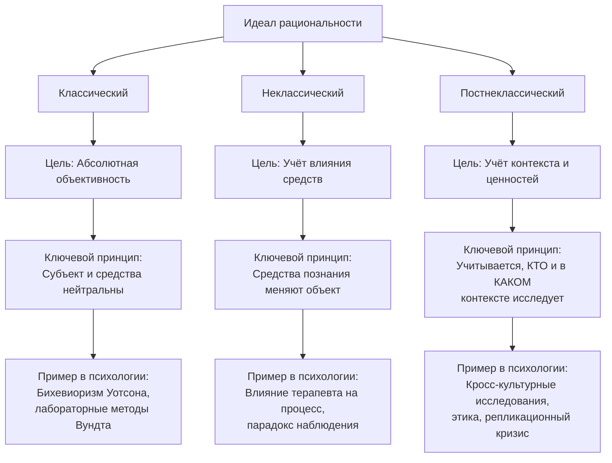

Психология личности балансирует на грани: её предмет — субъективная, изменчивая человеческая сущность, а её цель — стать объективной наукой. Этот конфликт ведёт к вопросу о критериях научности и к смене самих идеалов рациональности, по которым работает исследователь.

## Критерии научного знания в психологии

Наука отличается от других форм познания не просто способностью предсказывать будущее. Её сила — в специфическом способе прогнозирования, основанном на логике, проверяемости и независимости от субъекта.

### Предсказание как базовая функция психики

Способность предвидеть будущее — фундаментальное свойство психики, обеспечившее выживание *Homo sapiens*. Мозг человека эволюционировал как инструмент прогнозирования. Любая научная деятельность, включая психологию, использует эту базовую способность, но структурирует её по особым правилам.

### Логическое обоснование и причинность

Научное объяснение должно выстраивать логическую цепочку между причинами и следствиями. В отличие от эзотерических систем, которые также имеют внутреннюю «логику» (правила расклада карт Таро, толкования гороскопов), научная логика требует **объективной проверяемости**. Она вскрывает механизмы преобразования одного явления в другое, а не просто интерпретирует знаки.

### Реплицируемость как краеугольный камень

Это ключевой критерий, отделяющий науку от гадания.
*   **Повторяемость:** Эксперимент или наблюдение должны быть воспроизводимы в разных условиях и разными исследователями. Не существует «одинаковых» раскладов карт или гороскопов — каждый уникален. Научный факт должен быть стабилен.
*   **Причинно-следственная связь:** Метод должен выявлять механизмы, а не просто констатировать корреляции.
*   **Согласованность с другими знаниями:** Научные данные из психологии не должны противоречить установленным фактам в смежных дисциплинах — биологии, нейрофизиологии, социологии.
*   **Объективность:** В идеале результат не должен зависеть от личности экспериментатора.

## Эволюция научных идеалов рациональности

Представления о том, как должна работать «идеальная» наука, менялись на протяжении XX века. Психология личности прошла схожий путь с физикой — от веры в абсолютную объективность до признания роли субъекта в познании.

### Классический идеал рациональности: мечта об абсолютной объективности

Этот идеал господствовал в естественных науках до начала XX века и был взят за образец первыми психологами.

**Принципы классического идеала:**
*   **100% повторяемость:** При соблюдении условий эксперимент даёт идентичный результат.
*   **100% предсказуемость:** Результат точно известен заранее, даже при изменении некоторых параметров.
*   **Чёткая инструкция (метод):** Протокол исследования строго определён и исключает произвол.
*   **Объективность:** Объект познания — единственный активный элемент. Средства познания (приборы, методы) и субъект (исследователь) считаются нейтральными, они не влияют на объект.

**Пример:** Опыт Галилея с падением тел разной массы. При повторении в вакууме результат всегда будет одинаковым: тела упадут одновременно. Субъект, бросающий шары, не влияет на исход.

**В психологии:** Ранние школы стремились к этому идеалу. Вильгельм Вундт в своей лаборатории изучал сознание через интроспекцию по строгим протоколам. Бихевиорист Джон Уотсон исследовал поведение как реакцию на стимул, стремясь к полной предсказуемости и контролю над условиями. Зигмунд Фрейд, хотя и работал с бессознательным, стремился вывести универсальные законы психики.

### Неклассический идеал рациональности: средства познания меняют реальность

Революция в квантовой физике показала: сам акт измерения влияет на измеряемую систему. Этот принцип оказался чрезвычайно близок к проблемам психологии.

**Принципы неклассического идеала:**
*   **Средства и способ познания влияют на результат.** То, *как* мы изучаем явление, становится частью явления.
*   **Ключевые атрибуты сохраняются:** повторяемость, чёткий метод и предсказуемость, но их реализация усложняется.

**Пример из физики:** Электрон проявляет свойства волны (квантовый объект) или частицы (материальный объект) в зависимости от типа эксперимента, который проводят для его наблюдения.

**Пример из психологии личности:** Исследование бессознательного. Сам процесс терапии или эксперимента, направленный на «вскрытие» бессознательных конфликтов, неизбежно меняет психику клиента. Наблюдатель (терапевт, исследователь) становится участником процесса.
*   **Эксперимент «Горькая конфета»:** Ребёнок, оставленный со строгим, незнакомым взрослым («страшный дядя Ваня»), может не проявить ожидаемого поведения (съесть конфету, несмотря на запрет), испугавшись. Тот же эксперимент, проведённый доброжелательным взрослым, похожим на маму («тетя Маша»), может дать классический результат. Средство познания (личность экспериментатора) напрямую влияет на объект.

Психология вышла на этот уровень, когда появилось множество конкурирующих школ и инструментов для измерения одного явления (личности). Каждый подход (психоанализ, бихевиоризм, гуманистическая психология) «ощупывает слона с разных сторон», получая разные, но методически обоснованные данные.

### Постнеклассический идеал рациональности: учёт субъекта и контекста

Современный этап, на который выходит и психология, признаёт, что на исследование влияет не только метод, но и личность учёного, его ценности и социальный контекст.

**Принципы постнеклассического идеала (теория хаоса, синергетика):**
*   **Учитывается, КТО проводит исследование.** Ценности, ожидания, культурный бэкграунд исследователя признаются значимым фактором.
*   **Влияют социальные и научные ценности** эпохи. Направление исследований часто задаётся запросами общества.
*   **Предсказуемость на уровне вероятностей.** От абсолютной точности наука переходит к вероятностным моделям и сценарному прогнозированию.
*   **Репликация тоже вероятностна.** Повторение исследования с высокой долей вероятности даст сходный, но не идентичный результат, и это нормально.

**В психологии личности это проявляется в следующем:**
1.  **Кросс-культурные исследования:** Показали, что многие «универсальные» теории личности (например, иерархическая структура черт) по-разному проявляются в разных культурах. Контекст перестал быть фоном, он стал переменной.
2.  **Репликационный кризис:** Многие известные психологические эксперименты (например, с «силой воли» или priming-эффектами) не удалось точно воспроизвести. Это привело не к отрицанию научности психологии, а к пересмотру стандартов доказательности, учёту «малых» факторов (например, настроения участников, времени суток, особенностей выборки).
3.  **Роль этики и ценностей:** Современные исследования личности немыслимы без этического комитета. Ценности общества (уважение автономии, недопустимость вреда) напрямую формируют методологию, ограничивая возможные эксперименты (как в случае со знаменитым Стэнфордским тюремным экспериментом).

**Пример:** Два исследовательских коллектива, изучающие связь типа привязанности и карьерных успехов, могут получить разные корреляции. Одна группа, работающая в культуре, ценящей индивидуализм, может найти сильную связь. Другая, в коллективистской культуре, — слабую. Разный результат — не ошибка, а отражение сложной реальности, где объект (личность) неотделим от контекста, а контекст частично задаётся ценностями самих исследователей.

## Место психологии личности среди идеалов рациональности

История психологии личности — это история движения от классического идеала к постнеклассическому, с неизбежным «застреванием» в неклассической парадигме как основной.

*   **Попытка классики (конец XIX — начало XX вв.):** Вундт, Фрейд, Уотсон стремились к построению психологии по образцу классической физики — с чёткими законами, причинностью и объективностью.
*   **Переход к неклассике (середина XX в.):** Появление множества школ (психоанализ, бихевиоризм, гуманизм, когнитивизм) с разными методами и языками описания привело к пониманию, что личность подобна слону из притчи о слепцах. Каждый подход изучает свою часть, и средства познания (теория, терапевтический метод) формируют то, что они находят. Психология приняла, что её объект изменяется под влиянием измерения.
*   **Движение к постнеклассике (конец XX — XXI вв.):** Кризис репликации, рост кросс-культурных исследований, рефлексия о роли ценностей и этики заставили психологию учесть ещё один фактор: **субъекта познания в его социальном и ценностном измерении**. Теперь «странные» или неповторимые результаты рассматриваются не просто как артефакты или ошибки, а как потенциальные проявления сложной, открытой, контекстно-зависимой системы, какой является личность.

Это означает, что современный исследователь или практик должен постоянно рефлексировать: как его собственные характеристики, выбранный метод и культурный контекст влияют на получаемые данные о другом человеке. Отказ от мифа о полной нейтральности — не слабость психологии, а признак её научной зрелости и соответствия сложности своего предмета.

## Запомнить

*   Научность в психологии определяется не способностью предсказывать, а **логическим обоснованием, объективной проверяемостью и реплицируемостью** прогнозов.
*   **Классический идеал рациональности** предполагал 100% повторяемость, предсказуемость и нейтральность исследователя. Ранняя психология стремилась к этому идеалу.
*   **Неклассический идеал** признал, что **средства познания влияют на объект**. В психологии это проявилось в понимании, что процесс исследования или терапии меняет психику.
*   **Постнеклассический идеал** учитывает, что на результат влияет **личность исследователя, его ценности и социальный контекст**. Это ведёт к вероятностным моделям и принятию репликации как вероятностного процесса.
*   Психология личности прошла путь от попыток быть **классической** наукой через признание **неклассической** парадигмы к движению в сторону **постнеклассических** принципов.
*   **Разные результаты у разных исследователей** в современной психологии — не всегда ошибка, а часто следствие работы в постнеклассической системе, где объект (личность), средства познания и субъект (исследователь) взаимосвязаны.
