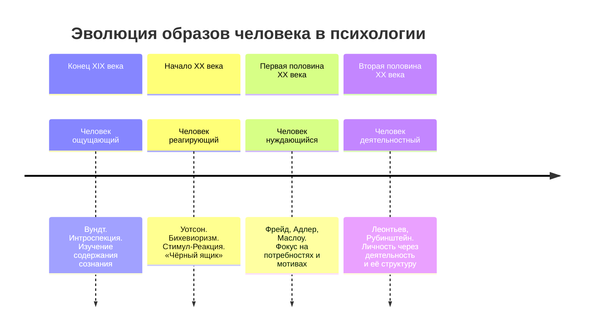

Психология личности предлагает не одно, а множество изображений человека. Каждая школа создаёт свой образ — от пассивного регистратора ощущений до активного творца будущего. Эти образы определяют не только теории, но и конкретные методы помощи, формируя карту, по которой специалист движется в работе с личностью.

## Исторические образы человека в психологии

Развитие психологической науки можно представить как смену доминирующих образов человека. Каждый образ отвечает на свой центральный вопрос и фокусируется на определённом аспекте психической жизни.

### Человек ощущающий

Этот образ связан с **интроспекционизмом** Вильгельма Вундта и первой психологической лабораторией 1879 года. Ключевой вопрос: «Что вы *ощущаете*?».

*   **Суть:** Личность рассматривается как субъект, способный к самонаблюдению за содержанием своего сознания — ощущениями, чувствами, образами.
*   **Метод:** Аналитическая интроспекция — подробный словесный отчёт испытуемого о своих переживаниях в контролируемых условиях.
*   **Пример:** Исследователю важно понять, какие именно ощущения (тепло, давление, цвет) вызывает у испытуемого предъявляемый стимул. Человек может ощутить и описать даже несуществующую «проблему», и с этим описанием уже можно работать.

### Человек реагирующий

Образ, предложенный **бихевиоризмом** Джона Уотсона. Ключевой вопрос: «На что и как вы *реагируете*?».

*   **Суть:** Личность сводится к совокупности наблюдаемых реакций (R) на внешние стимулы (S). Формула **S-R** становится основной. Сознание и внутренний мир объявляются «чёрным ящиком», недоступным для научного изучения.
*   **Метод:** Объективное наблюдение и эксперимент, фиксирующие связь между изменяемым стимулом и измеряемой реакцией.
*   **Пример:** Исследование прыжка человека (реакция) в ответ на внезапный громкий звук (стимул). Для бихевиориста люди и животные принципиально не различаются как объекты изучения — важны общие законы научения. Этические нормы становятся единственным ограничителем в экспериментах.

### Человек нуждающийся

Этот образ смещает фокус на внутренние движущие силы. Ключевой вопрос: «Чего вы *хотите*?». Разные теоретики давали разные ответы:
*   **Зигмунд Фрейд:** Базовая потребность в **сексе** (либидо) как источник психической энергии.
*   **Альфред Адлер:** Стремление к **власти** и преодоление чувства неполноценности.
*   **Абрахам Маслоу:** Потребность в **любви**, принадлежности и, на вершине иерархии, в самоактуализации.
*   **Виктор Франкл:** Поиск **смысла** как фундаментальная мотивационная сила.

Образ «нуждающегося человека» ввёл в психологию идею направленности, целеполагания и будущего.

### Человек деятельностный

Образ, развитый в отечественной психологии (А.Н. Леонтьев, С.Л. Рубинштейн). Ключевой вопрос: «Что вы *делаете*?».

*   **Суть:** Личность проявляется и формируется в **деятельности**. Акцент сделан не на потребности сами по себе, а на процессе их удовлетворения через целенаправленные действия в предметном мире.
*   **Структура деятельности:** Потребность -> Мотив -> Цель -> Действие -> Операция (выполняемая в конкретных условиях).
*   **Пример:** Потребность в общении (нужда) превращается в мотив — позвать друга в кино. Цель — купить билеты на определённый сеанс. Действие — зайти на сайт кинотеатра. Операции — нажать конкретные кнопки, ввести данные карты. Личность проявляется в выборе деятельности и способах её осуществления.

## Временная ось психологии: от ретроспекции к футурологии

Четыре образа человека можно расположить на оси времени, что показывает историческое развитие дисциплины.
*   **Прошлое:** **Человек ощущающий**. Интроспекция работает с актуальным содержанием сознания, но это содержание часто относится к прошлому опыту.
*   **Настоящее:** **Человек реагирующий**. Бихевиоризм изучает реакцию «здесь и сейчас», на актуальный стимул.
*   **Будущее:** **Человек нуждающийся** и **деятельностный**. Мотивы и цели всегда направлены в будущее. Деятельность — это процесс преобразования настоящего для достижения будущего результата.

Таким образом, психология прошла путь от анализа прошлых ощущений через фиксацию настоящих реакций к прогнозированию и проектированию будущего через понимание мотивов и деятельности.

## Уровни методологии: как не заблудиться в подходах

При работе с конкретным человеком (например, клиентом с жалобой на тревогу) психолог должен осознанно действовать на разных уровнях методологии. Понимание этой иерархии предотвращает эклектику и методологические ошибки.

### Пирамида уровней методологии

1.  **Уровень методики (инструментальный).**
    *   **Что это:** Конкретные техники и инструменты: тесты (например, опросник Бека на тревогу), клиническое интервью, проективные методики, аппаратные исследования.
    *   **Пример:** Для проверки гипотезы о депрессии психолог просит клиента заполнить опросник и сдать общий анализ крови (чтобы исключить витаминную недостаточность, которая может mimic симптомы).

2.  **Конкретно-научный уровень (теоретический).**
    *   **Что это:** Конкретная теория или модель, в рамках которой формулируется гипотеза и интерпретируются данные с уровня методики.
    *   **Пример:** Теория когнитивной тревоги Аарона Бека. Интерпретация результатов опросника будет происходить через призму этой теории: выявление автоматических негативных мыслей и когнитивных искажений.

3.  **Общенаучный уровень (парадигмальный).**
    *   **Что это:** Более общее представление о природе психического и методах его познания. Это «школа» или подход.
    *   **Пример:** Когнитивно-поведенческая терапия (КПТ) — это общенаучный подход, внутри которого существует теория Бека (конкретно-научный уровень). Психодинамический подход — другая общенаучная парадигма.

4.  **Философский уровень (мировоззренческий).**
    *   **Что это:** Базовые философские установки о природе человека, познании и реальности, на которых строится подход.
    *   **Пример:** КПТ часто опирается на **позитивизм** — убеждение, что психические явления можно объективно измерить и предсказать. Психодинамический подход ближе к **феноменологии** и **герменевтике** — убеждению в уникальности и глубинной, часто скрытой, смысловой организации внутреннего мира каждого человека.

**Ключевой принцип:** Любая методика «вырастает» из своей теории, которая, в свою очередь, основана на философской парадигме. Использование методики вне её теоретического и философского контекста ведёт к ошибкам.

### Пример методологической ошибки

Задача: Молодой специалист, сторонник **юнгианского анализа** (философский уровень: глубинная психология, интерес к архетипам и коллективному бессознательному), для подготовки к работе с клиентом, жалующимся на кошмары, даёт ему **опросник Павлова-Айзенка** на определение темперамента.

**В чём ошибка?**
1.  **На философском уровне:** Юнгианство рассматривает интроверсию/экстраверсию как направление потока психической энергии (вовнутрь или вовне). Подход Айзенка основан на **позитивистской** традиции и рассматривает эти же черты как результат свойств нервной системы (сила/слабость, стабильность/лабильность).
2.  **На общенаучном уровне:** Это разные, несводимые друг к другу системы понятий. Данные, полученные с помощью опросника Айзенка, не могут быть адекватно интерпретированы в юнгианской парадигме.
3.  **На уровне методики:** Использован инструмент, чуждый выбранному подходу. Для юнгианца кошмары — потенциальное сообщение из бессознательного, символ, требующий толкования. Темперамент по Айзенку даст лишь информацию об общей эмоциональной лабильности, не раскрывая смысла сновидения.

Ошибка совершена на **философском и общенаучном уровнях**: смешение несовместимых парадигм. Специалист должен быть адаптивным, но осознанно выбирать и соблюдать методологическую целостность.

## От задатков к таланту: психология одарённости

Изучение личности включает в себя вопрос о её высших проявлениях — способностях и таланте. Психология описывает этот путь как последовательность этапов.

1.  **Задатки.**
    *   Это врождённые, биологические предпосылки: анатомические особенности (длинные пальцы для пианиста), свойства нервной системы (высокая скорость протекания нервных процессов), особенности анализаторов (абсолютный слух).
    *   **Пример:** Ребёнок родился с высокой лабильностью нервной системы (быстро реагирует, быстро переключается).

2.  **Способности.**
    *   Это **задатки, раскрытые в деятельности**. Без деятельности задаток остаётся потенциалом. Абсолютный слух не проявится, если человек никогда не будет заниматься музыкой.
    *   Способности можно развить и **компенсаторно**: отсутствие одного задатка (например, неидеальный слух) может быть скомпенсировано развитием других (чувства ритма, трудолюбия).
    *   **Пример:** Тот же ребёнок начал заниматься спортом, где его быстрая реакция и переключаемость (задатки) превратились в спортивные способности — ловкость, координацию.

3.  **Талант (одарённость).**
    *   Это **комплекс способностей**, позволяющий достигать выдающихся результатов в определённой деятельности.
    *   Ключевая особенность: талант признаётся только **в системе «личность-социум»**. Это социальная оценка. Человек не может самопровозгласить себя талантливым.
    *   Как отмечал Б.М. Теплов: «Быть талантливым — значит развить свои способности несмотря ни на что». Иногда талантом называют способность проявиться вопреки неблагоприятным обстоятельствам.
    *   **Пример:** Развив свои спортивные способности до высочайшего уровня и добившись признания на соревнованиях, спортсмен получает от общества статус «талантливого».

## Стратегии изучения личности

В современной психологии сформировалось несколько базовых стратегий (подходов) к изучению личности. Каждая стратегия отвечает на свой вопрос и использует свои методы.

### 1. Поведенческо-интеракционная стратегия

*   **Вопрос:** Как человек *ведёт себя* в ответ на конкретные стимулы?
*   **Суть:** Наследница бихевиоризма. Личность изучается через наблюдаемые поведенческие акты в процессе взаимодействия (интеракции). Внутренний мир по-прежнему считается «чёрным ящиком».
*   **Методы:** Наблюдение, эксперимент (например, «ящик Скиннера» для животных), анализ поведенческих паттернов.
*   **Пример из практики:** На допросе следователь анализирует не только слова подозреваемого, но и его невербалику: учащённое моргание, изменение позы, микродвижения. Цель — понять, является ли реакция заученной или спонтанной, выявить состояние когнитивной нагрузки.

### 2. Конституционально-антропометрическая стратегия

*   **Вопрос:** Что можно сказать о личности, исходя из её *телесности*?
*   **Суть:** Изучение связи между врождёнными, конституциональными особенностями (строение тела, темперамент, нейробиологическая динамика) и психологическими чертами.
*   **Методы:** Антропометрия, наблюдение за двигательной активностью, оценка темперамента.
*   **Пример:** По особенностям телосложения (астеник, атлетик, пикник) и динамике движений (плавные/резкие, быстрые/медленные) делаются предположения о вероятных чертах характера и стиле реагирования. Важно: это вероятностные связи, а не жёсткие определения. Дергающийся глаз или дрожащие руки рассматриваются не как реакция на стимул, а как проявление текущего состояния нервной системы.

### 3. Факторная стратегия

*   **Вопрос:** Какие *устойчивые черты* (факторы) описывают личность?
*   **Суть:** Личность описывается как набор количественно измеряемых измерений (факторов). Это стратегия «изучения человека через слово» — его самоотчёт в опросниках.
*   **Методы:** Стандартизированные личностные опросники: 16PF (Кеттел), «Большая пятёрка» (NEO-PI-R), MMPI, тесты на «Тёмную триаду».
*   **Пример: Описание факторов из 16PF:**
    *   **Фактор A+ (Открытость):** Готовность к общению, приветливость, внимательность к людям.
    *   **Фактор A- (Замкнутость):** Скептицизм, склонность к уединению, формальность в общении.
    *   **Фактор C+ (Эмоциональная стабильность):** Спокойствие, зрелость, уверенность в сложных ситуациях.
    *   **Фактор C- (Эмоциональная неустойчивость):** Раздражительность, тревожность, склонность откладывать решения.
*   **Ограничение:** Риск социально желательных ответов и расхождения между «словом» и «делом». Поэтому данные опросников необходимо проверять против данных поведенческой и конституциональной стратегий.

### 4. Мотивационно-динамическая стратегия

*   **Вопрос:** Чего человек *хочет* от жизни? Каковы его *потребности* и *направленность*?
*   **Суть:** Изучение иерархии потребностей, мотивов, ценностей и смыслов, которые определяют жизненный путь личности.
*   **Методы:** Глубинное интервью, проективные методики (ТАТ), анализ биографии, ценностные опросники.
*   **Пример:** Использование **пирамиды потребностей А. Маслоу** для анализа запроса клиента:
    *   **Физиологические потребности** (голод, жажда).
    *   **Потребность в безопасности** (стабильная работа, крыша над головой).
    *   **Потребность в любви и принадлежности** (отношения, семья, друзья).
    *   **Потребность в уважении и признании.**
    *   **Потребность в самоактуализации** (реализация потенциала).

### 5. Комплексная (интегративная) стратегия

*   **Вопрос:** Как *объединить* все доступные данные для целостного понимания личности?
*   **Суть:** Это современная тенденция к синтезу. Психолог собирает информацию со всех уровней:
    1.  **Конституция и реакции:** Телесные особенности, темперамент, актуальное поведение.
    2.  **Факторный профиль:** Устойчивые черты по опросникам.
    3.  **Прошлый опыт:** Биография, память, сформированные навыки.
    4.  **Направленность:** Мотивы, цели, ценности, смыслы.
*   **Методы:** Системный анализ случая (case formulation), использование батареи методик из разных парадигм с последующей интеграцией данных в единую объяснительную модель.

Эта стратегия наиболее адекватна сложности объекта — человеческой личности, но требует от специалиста высокой методологической культуры и широкого теоретического кругозора.

## Запомнить

*   Психология личности оперирует **четырьмя историческими образами человека**: ощущающий (интроспекционизм), реагирующий (бихевиоризм), нуждающийся (психоанализ, гуманизм), деятельностный (деятельностный подход).
*   Эти образы соответствуют **временной оси**: анализ прошлого опыта -> реакция в настоящем -> направленность в будущее через мотивы и деятельность.
*   Работа психолога строится на **четырёх уровнях методологии**: методика, конкретно-научная теория, общенаучный подход (парадигма), философские основания. Смешение парадигм ведёт к методологическим ошибкам.
*   Путь развития высших качеств личности описывается цепочкой: **задатки (биологические) -> способности (в деятельности) -> талант (признанный социумом комплекс способностей)**.
*   Существует **пять основных стратегий изучения личности**: поведенческо-интеракционная (через поведение), конституционально-антропометрическая (через тело), факторная (через черты по опросникам), мотивационно-динамическая (через потребности), комплексная (синтез всех данных).
*   **Комплексная стратегия** представляет собой современный тренд на интеграцию и даёт наиболее полную картину, но требует от специалиста осознанного владения разными методологическими языками.
