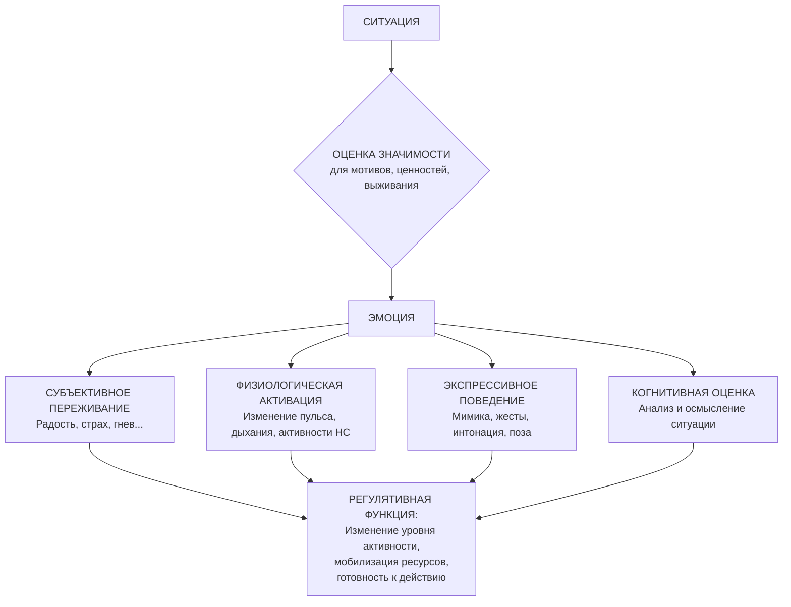

Эмоции — это не просто фоновая музыка жизни. Это сложный, мгновенный и универсальный язык, на котором наша психика сообщает о главном: о степени значимости происходящего для наших потребностей, ценностей и выживания. Они возникают на стыке внешнего события и внутреннего мира, являясь ключом к пониманию истинных мотивов, невысказанных конфликтов и смысловых ориентиров личности.

## Определение и природа эмоций

В психологическом смысле термины **«эмоция»** и **«аффект»** часто используются как синонимы, обозначая интенсивное, относительно кратковременное переживание. Эмоция — это результат выражения непосредственного переживания человеком своего состояния (радости, страха, удивления), отражающего **оценку значимости** воспринимаемой или представляемой ситуации. Эта оценка напрямую связана с мотивационно-потребностной и смысловой сферами.

Проще говоря, эмоция — это **сигнал** о том, что некое событие имеет для человека особый смысл, от биологического (угроза жизни) до социального (угроза самооценке или ценностям). Значимо — значит, **осмысленно**. Поэтому анализ эмоциональных реакций позволяет понять, что на самом деле важно для человека, каковы его истинные потребности и мотивы.

## Четырехкомпонентная структура эмоции

Эмоция как целостное состояние проявляется через четыре взаимосвязанных компонента, которые можно схематически представить как работу единой системы.

1.  **Субъективный (эмоционально-оценочный) компонент**. Это внутреннее психическое переживание, чувство, которое испытывает человек (например, ощущение радости, волны страха, приступ гнева). Это личный, часто невыразимый в словах опыт.

2.  **Экспрессивный (поведенческий) компонент**. Внешние, наблюдаемые проявления эмоции. К ним относятся:
    *   **Мимика** (изменения в лице).
    *   **Пантомимика** (жесты, позы).
    *   **Вокальная экспрессия** (изменения голоса: тембр, громкость, темп).
    *   Другие поведенческие паттерны (например, стремление приблизиться или удалиться).

3.  **Когнитивный компонент**. Анализ и осмысление ситуации, вызвавшей эмоцию. Это наши мысли, рассуждения, интерпретации («Почему я разозлился?», «Чем это мне грозит?»). Этот компонент связывает эмоцию с мышлением.

4.  **Физиологический компонент**. Комплекс изменений в деятельности организма:
    *   **Центральная нервная система** (активация определенных зон мозга).
    *   **Вегетативная нервная система** (учащение сердцебиения и дыхания, потоотделение, кожно-гальваническая реакция).
    *   **Нейроэндокринная система** (выброс гормонов, например, адреналина или кортизола).

**Регулятивная функция** эмоций состоит в том, чтобы, синхронизируя все эти компоненты, изменить уровень активности человека, его энергетические ресурсы и **готовность к конкретному действию** (бороться, бежать, приблизиться, застыть).

## Наблюдаемые проявления: что мы видим и как интерпретируем

На практике, особенно в таких областях, как профайлинг или психологическая диагностика, мы имеем дело в первую очередь с наблюдаемыми проявлениями.

### Основные параметры для наблюдения:
*   **Валентность (эмоциональный тон)**: фундаментальное измерение «приятно-неприятно». Положительная валентность (радость, интерес) или отрицательная (страх, гнев, печаль). Интенсивность — сила переживания.
*   **Отсутствие эмоций** (аффективная уплощенность) — также важный диагностический признак, который может указывать на депрессию, истощение, некоторые расстройства личности или сознательную маскировку.

### Базовые эмоции и их «семейства»
Согласно современным представлениям, существует набор **базовых (фундаментальных) эмоций**, которые считаются эволюционно древними, универсальными и имеющими специфическую нейрофизиологическую основу. Классический список, расширенный в последние годы, включает:
1.  **Радость (Счастье)**
2.  **Печаль**
3.  **Удивление**
4.  **Гнев**
5.  **Отвращение**
6.  **Страх**
7.  **Презрение** (добавлено относительно недавно, около 5 лет назад по данным материала)

Каждая базовая эмоция — это целое «семейство», включающее дерево более сложных, производных переживаний. Например, из страха могут произрастать тревога, опасение, ужас, паника.

### Индивидуальное своеобразие выражения
Важно различать универсальные паттерны и индивидуальные особенности:
*   **Эмблемы эмоций**: сознательные или привычные «ярлыки» на лицо, которые человек демонстрирует, чтобы показать определенную эмоцию, **независимо от реального переживания** (например, дежурная улыбка). Это элемент социальной коммуникации и маскировки.
*   **Мимические привычки**: уникальные для каждого человека мелкие движения мышц лица, не связанные напрямую с базовыми эмоциями (например, привычное подергивание щекой, особая манера прищуриваться). Они составляют индивидуальный «почерк» выражения.
*   **Эмоциональные диалекты**: культурно и социально обусловленные особенности выражения эмоций (например, разная степень допустимой экспрессивности в разных культурах).

## Практическая значимость: эмоции как инструмент анализа

Понимание эмоций выходит за рамки академического интереса и имеет прямое прикладное значение, особенно в профайлинге, клинической психологии и консультировании.

### Эмоции как адаптационный механизм
С эволюционной точки зрения, эмоции — это **психологические инструменты адаптации**. Они быстро мобилизуют организм для решения двух ключевых задач: **выживания** (реакция на угрозу или возможность) и **коммуникации** (сигнализация о своем состоянии сородичам). Они синхронизируют работу различных систем организма для гибкого и быстрого реагирования на изменения среды.

### Эмоции как индикаторы для профайлера
Для специалиста, анализирующего поведение, эмоции служат важнейшими ориентирами:
1.  **Индикаторы значимости**: эмоциональная реакция (или ее отсутствие) показывает, что именно в ситуации задело человека, что для него субъективно важно. Это прямой путь к пониманию его актуальных мотивов и ценностей.
2.  **Индикаторы настроения**: устойчивый эмоциональный фон (длительное аффективное состояние) говорит об общем психофизиологическом тонусе человека (приподнятое, подавленное, раздражительное настроение).
3.  **Индикаторы черт характера**: устойчивые паттерны эмоционального реагирования (например, вспыльчивость, склонность к тревоге, эмоциональная холодность) являются внешним проявлением **аффективных черт характера**. Они указывают на типичные для данного человека способы поведения: импульсивный, сдержанный, агрессивный.

Таким образом, эмоция — это не просто реакция, а **знак**, мгновенная оценка ситуации, которую человек часто не может или не хочет вербализовать.

## Эволюция теорий: от телесных реакций до социального конструирования

Понимание природы эмоций прошло сложный путь, и каждая теория вносит свой вклад в общую картину.

### Исторические и классические теории
*   **Чарльз Дарвин**: предложил эволюционный взгляд, утверждая, что эмоции и их выражения — наследуемые адаптивные механизмы, общие у человека и животных.
*   **Периферические теории (Джеймс-Ланге)**: парадоксальное утверждение «мы чувствуем печаль, потому что плачем». Эмоция трактуется как осознание телесных изменений, вызванных стимулом.
*   **Таламическая теория (Кеннон-Бард)**: критика Джеймса-Ланге. Эмоциональное переживание и телесные реакции возникают почти одновременно из-за возбуждения таламуса.
*   **Когнитивные теории (Фестингер, Шехтер, Лазарус, Симонов)**: акцент на оценке и интерпретации ситуации.
    *   **Леон Фестингер**: эмоция зависит от согласованности ожиданий с реальным ходом деятельности.
    *   **Информационная теория П.В. Симонова**: сила и качество эмоции определяются соотношением между потребностью, информацией, необходимой для ее удовлетворения, и имеющейся в наличии информацией: `Э = f[П, (Ин – Ис)]`.
    *   **Ричард Лазарус**: эмоция — результат когнитивной оценки угрозы или выгоды.

### Ключевые теории второй половины XX века
*   **Теория дифференциальных эмоций Кэррола Изарда**: эмоции — особая мотивационная система, фундаментальная для регуляции поведения. «Эмоция... мотивирует, организует и направляет восприятие, мышление и действие». Изард расширил список базовых эмоций до 10, добавив стыд/смущение, вину и интерес, подчеркивая, что эмоции отражают смыслы личности.
*   **Психоэволюционная теория Роберта Плутчика**: эмоция — системная реакция, ведущая к действию, цель которой — повышение вероятности выживания. Плутчик ввел концепцию **копинг-стратегий** (совладающего поведения), которые запускаются эмоциями. Его идеи близки к взглядам Яака Панксеппа на базовые эмоциональные системы мозга.

### Современные концепции (конец XX — начало XXI века)
1.  **Концепция конструирования эмоций Лизы Фельдман Барретт** (теория constructed emotion):
    *   Эмоции не являются универсальными, готовыми программами, а **различаются в разных культурах**.
    *   Они не «запускаются», а **конструируются** мозгом в реальном времени на основе:
        *   внутренних физиологических ощущений (интероцепция),
        *   прошлого опыта,
        *   социального и культурного контекста.
    *   Это делает эмоции глубоко **индивидуальными** комбинациями телесных и мозговых особенностей, опосредованными воспитанием.

2.  **Компонентная концепция Клауса Шерера**:
    *   Возникновение эмоции — это работа механизма **последовательной оценки** (appraisal) ситуации по ряду критериев (новизна, приятность, соответствие целям, возможности совладания и т.д.).
    *   Эмоция — механизм **адаптивной синхронизации** различных систем организма (когнитивной, экспрессивной, физиологической, мотивационной) для гибкой реакции.
    *   Эмоция — это **особая репрезентативная система**, через которую мы отображаем мир и других людей в виде переживаний.

3.  **Теория дискретных эмоций Пола Экмана**:
    *   Развитие идей Дарвина о универсальности выражения эмоций.
    *   Эмпирическое подтверждение существования **базовых эмоций** с универсальными мимическими паттернами через исследования в разных культурах.
    *   Создание **Системы кодирования лицевых движений (FACS)** — детального анатомического атласа мимики, позволяющего объективно описывать любое выражение лица.
    *   Практическое применение в профайлинге, обнаружении лжи и клинической диагностике.

## Выводы: эмоции в системе психики

Обобщая представленные в материалах взгляды, можно сформулировать несколько фундаментальных положений о природе эмоций:

1.  **Адаптационная природа**: Эмоции возникли в эволюции как инструмент решения задач **выживания** и **коммуникации**. Они обеспечивают быструю мобилизацию и синхронизацию организма.
2.  **Двойная детерминация**: Эмоции имеют как **генетическую (биологическую) основу** (универсальные базовые эмоции), так и **средовую** (социальные эмоции, диалекты, индивидуальные стили выражения формируются культурой и опытом).
3.  **Научный конструкт**: Эмоции — это гипотетические конструкты, которые нельзя «потрогать», но можно изучать эмпирически через их наблюдаемые проявления (поведение, физиология, самоотчет).
4.  **Функция обратной связи**: Эмоции — это форма **обратной связи**, сигнализирующая об успешности или неуспешности адаптации, направленная на достижение баланса (гомеостаза) и реализацию намерений.
5.  **Иерархия и связь с другими структурами**: Существуют базовые и производные (социальные) эмоции. Эмоциональная сфера тесно связана и взаимодействует с:
    *   **Чертами характера** (являясь их аффективным компонентом).
    *   **Смысловыми образованиями личности** (обозначая, что является смыслообразующим).
    *   **Психопатологией** (нарушения эмоциональной сферы — ключевой симптом многих расстройств).
6.  **Основные измерения**: Любую эмоцию можно описать через три измерения: **валентность** (+/-), **интенсивность** (сила) и **содержание** (качественная оценка вызвавшей ее ситуации).

Важно помнить, что, как отмечается в материалах, большинство базовых эмоций (5 из 7) имеют **негативную валентность**. Это не недостаток, а следствие их эволюционного предназначения: в первую очередь сигнализировать об **опасности**, угрозе и препятствиях, мобилизуя ресурсы для их преодоления. Радость и удивление выполняют функции закрепления успешного опыта и ориентации в новом.

## Запомнить

*   **Эмоция** — это комплексная реакция на оценку **значимости** события для мотивов и ценностей человека. Она состоит из четырех компонентов: **субъективного переживания, экспрессии, когнитивной оценки и физиологических изменений**.
*   **Базовые эмоции** (радость, печаль, страх, гнев, отвращение, удивление, презрение) считаются универсальными. **Эмблемы эмоций** — это социальные маски, а **мимические привычки** — индивидуальные особенности выражения.
*   **Практическая ценность**: эмоции — ключевой индикатор для анализа личности. Они показывают **значимые** темы, отражают **настроение** и выявляют устойчивые **черты характера**.
*   **Исторические теории** (Джеймс-Ланге, Кеннон-Бард) спорили о первичности тела или переживания. **Когнитивные теории** (Симонов, Лазарус) поставили в центр оценку ситуации.
*   **Современные взгляды**: **Лиза Фельдман Барретт** рассматривает эмоции как социально конструируемые феномены. **Клаус Шерер** — как процесс оценки и синхронизации. **Пол Экман** — как универсальные дискретные состояния с конкретным нейрофизиологическим и экспрессивным базисом (FACS).
*   **Основные функции** эмоций — **адаптация** и **коммуникация**. Они имеют биологическую основу, но формируются под влиянием культуры и индивидуального опыта, тесно связаны с характером и смысловой сферой личности.
