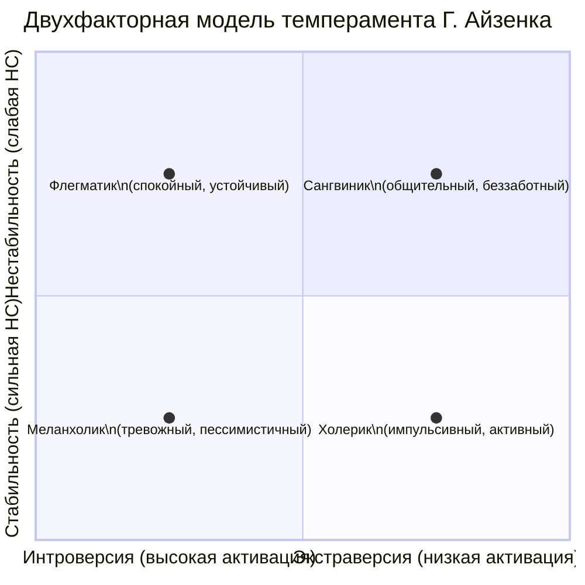

Поведенческие различия между людьми имеют биологическую основу. Индивидные свойства личности, такие как темперамент, определяются нейродинамикой — работой нервной системы и биохимическими процессами в мозге. Эти свойства задают диапазон реакций, внутри которого формируется личность.

## Физиологическая основа темперамента: схема И. П. Павлова

Иван Петрович Павлов подошёл к темпераменту с позиций физиологии высшей нервной деятельности. Его исследования на собаках легли в основу первой научной типологии темпераментов, основанной на свойствах нервных процессов.

### Свойства нервной системы по Павлову

Павлов выделил три ключевых свойства нервной системы, которые можно объективно оценить по поведенческим реакциям.

1.  **Сила (стабильность) нервной системы.**
    *   **Определение:** Способность нервных клеток выдерживать сильное или длительное возбуждение без перехода в состояние запредельного торможения (охранительного торможения).
    *   **Метод оценки:** Наблюдение за **ориентировочной реакцией** на сильный, неожиданный раздражитель (например, резкий звук упавшего предмета).
    *   **Интерпретация:** Если испытуемый слабо реагирует или быстро (в течение секунд) возвращается к исходному состоянию — нервная система **сильная**. Если реакция ярко выражена (вздрагивание, испуг) и угасает медленно (несколько минут) — нервная система **слабая**. Павлов заметил, что у некоторых собак после сильного стресса (гроза) выработанные условные рефлексы исчезали — это также свидетельство слабости.

2.  **Уравновешенность нервных процессов.**
    *   **Определение:** Баланс между процессами возбуждения и торможения в центральной нервной системе. Эти процессы обеспечиваются разными нейромедиаторами: **глутамат** — основной возбуждающий, **ГАМК** (гамма-аминомасляная кислота) — основной тормозной.
    *   **Метод оценки:** Обучение животного или человека командам двух типов: активирующим («взять!», «бежать!») и тормозным («стоп!», «ждать!»). Оценивается способность к торможению.
    *   **Интерпретация:** Если испытуемый легко выполняет активирующие команды, но с трудом удерживает тормозные — преобладает **возбуждение**. Если легко даются и те, и другие — процессы **уравновешены**.

3.  **Подвижность нервных процессов.**
    *   **Определение:** Скорость переключения между возбуждением и торможением, способность быстро менять поведение в ответ на изменение обстановки.
    *   **Метод оценки:** Скорость перехода от выполнения одной команды к другой, противоположной (например, от «бежать» к «стоять»).
    *   **Интерпретация:** Быстрое и точное переключение говорит о **высокой подвижности**. Замедленное, с инерцией предыдущего действия — о **низкой подвижности** (инертности).

### Четыре типа темперамента

Комбинация этих трёх свойств даёт четыре классических типа темперамента, известных ещё со времён Гиппократа.

| Свойства нервной системы | Тип темперамента | Поведенческие проявления (по Павлову) |
| :--- | :--- | :--- |
| **Сильный, неуравновешенный** (преобладание возбуждения), подвижный | **Холерик** | Энергичен, активен, но легко выходит из себя, склонен к бурным эмоциональным вспышкам. Собаке-холерику сложно выполнять команду «ждать». |
| **Сильный, уравновешенный, подвижный** | **Сангвиник** | Живой, активный, легко переключается, эмоции яркие, но неглубокие. Легко меняет деятельность. |
| **Сильный, уравновешенный, инертный** | **Флегматик** | Спокойный, медлительный, устойчивый в настроении и стремлениях. С трудом переключается, но зато основателен. |
| **Слабый** (часто неуравновешенный, с преобладанием торможения), может быть разная подвижность | **Меланхолик** | Легко раним, склонен глубоко переживать даже незначительные события, быстро утомляется. Высокая чувствительность, но низкая устойчивость к нагрузкам. |

**Важный принцип Павлова:** Темперамент — это «**личность животных**», биологический фундамент, который у человека служит основой для формирования более сложных личностных структур. Оценка должна проводиться так, чтобы испытуемый не понимал, что его тестируют, для исключения сознательного контроля.

## Психометрический подход: схема Ганса Айзенка

Ганс Айзенк, опираясь на идеи Павлова, пошёл обратным путём: от анализа поведения большого числа людей с помощью **факторного анализа** он вывел основные измерения личности и затем связал их с физиологическими показателями.

### Двухфакторная модель: нейротизм и экстраверсия

Первоначальная модель Айзенка включала два независимых биполярных измерения.

1.  **Нейротизм (стабильность—нестабильность).**
    *   **Психологическое содержание:** Эмоциональная устойчивость. Высокий нейротизм означает склонность к тревоге, беспокойству, быстрой смене настроений.
    *   **Физиологическая основа (по Айзенку):** Лабильность вегетативной нервной системы, скорость и сила **ориентировочной реакции**. Высокий нейротизм коррелирует со слабой нервной системой по Павлову.

2.  **Экстраверсия—интроверсия.**
    *   **Психологическое содержание:** Направленность интересов и энергии. **Экстраверты** ориентированы на внешний мир, общительны, импульсивны. **Интроверты** — на внутренний мир, сдержанны, склонны к самоанализу.
    *   **Физиологическая основа (по Айзенку):** **Уровень корковой активации** (arousal). Это принципиально иное понимание, чем у Карла Юнга (у которого экстраверсия — направление либидо).
        *   **Интроверты** имеют от природы **высокий уровень активации коры головного мозга**. Их мозг постоянно находится в состоянии высокой активности («дискотека»). Поэтому они избегают излишней внешней стимуляции, которая может привести к перевозбуждению.
        *   **Экстраверты** имеют **низкий уровень корковой активации**. Их мозг «скучен», и они активно ищут внешние стимулы (общение, риск, новизну), чтобы повысить уровень активации до оптимального.

### Трёхфакторная модель PEN

Позднее Айзенк добавил третье, независимое измерение — психотизм, создав модель **PEN**.

1.  **Психотизм (Psychoticism).**
    *   **Психологическое содержание:** Склонность к асоциальному, холодному, импульсивному поведению, низкая эмпатия и социализированность. Высокий полюс не означает психоз, но указывает на предрасположенность к психопатологиям.
    *   **Физиологическая основа:** Баланс нейромедиаторов и гормонов: **тестостерона, дофамина и серотонина**. Высокий психотизм связывают с высоким уровнем тестостерона и дофамина при низком уровне серотонина. Это измерение отражает **способность к самоконтролю и дисциплине**.

### Быстрые методы оценки по Айзенку

Айзенк предлагал поведенческие пробы для экспресс-оценки измерений:
*   **Нейротизм:** Наблюдение за реакцией на неожиданный сильный раздражитель (падение предмета, резкое движение). Сила и продолжительность испуга указывают на уровень нейротизма.
*   **Психотизм (косвенно):** Один из маркеров — соотношение длины указательного и безымянного пальцев. Более короткий указательный палец (по сравнению с безымянным) может указывать на повышенное воздействие тестостерона во внутриутробном периоде и коррелировать с более высоким психотизмом. Длинный указательный палец — с более низким. Однако это статистическая, а не диагностическая связь.

## Биохимические основы поведения: системы вознаграждения и контроля

Современные представления связывают измерения темперамента с активностью конкретных нейромедиаторных систем мозга.

### Три ключевые системы

1.  **Дофаминовая система («хочу» — wanting).**
    *   **Функция:** Обеспечивает **мотивационное подкрепление**, предвосхищение награды, реакцию на **неожиданный позитивный результат** («Эврика!»).
    *   **Пример:** Увидеть красивое платье в магазине или сделать неожиданное научное открытие — всплеск дофамина. Это система поиска нового, достижения целей.
    *   **Связь с темпераментом:** Высокая активность связана с экстраверсией (поиск новизны) и психотизмом (импульсивность).

2.  **Серотониновая система («контролирую» — control).**
    *   **Функция:** Обеспечивает эмоциональную стабильность, **тормозной контроль**, поддержание **гомеостаза** и чувства безопасности. «Всё в порядке, я контролирую ситуацию».
    *   **Пример:** Способность отказаться от импульсивной покупки платья, потому что бюджет ограничен. Серотонин тормозит дофаминовый импульс.
    *   **Связь с темпераментом:** Низкая активность связана с высоким нейротизмом (тревога, депрессия) и высоким психотизмом (низкий самоконтроль).

3.  **Опиоидная (эндорфиновая) система («нравится» — liking).**
    *   **Функция:** Обеспечивает **непосредственное чувство удовольствия и удовлетворения** от происходящего здесь и сейчас.
    *   **Пример:** Наслаждение вкусной едой, сексом, приятной прогулкой.
    *   **Связь с темпераментом:** Влияет на общий эмоциональный фон, чувствительность к гедонистическим аспектам жизни.

### Роль тестостерона

Гормон **тестостерон** действует как модулятор этих систем:
*   **Усиливает** активность дофаминовой и опиоидной систем.
*   **Подавляет** активность серотониновой системы.
Таким образом, высокий уровень тестостерона способствует поведению, направленному на поиск новизны, доминирование и получение немедленного удовольствия, при сниженном самоконтроле. Это биологический коррелят высокого **психотизма** по Айзенку.

## Классификация индивидных свойств по Б. Г. Ананьеву

Борис Герасимович Ананьев предложил систематизировать все природные свойства человека, составляющие основу личности, в две крупные группы.

1.  **Возрастно-половые свойства.**
    *   **Возрастные стадии** (онтогенез): Психофизиологические характеристики закономерно меняются на протяжении жизни (детство, подростковый возраст, зрелость, старость). Эти изменения влияют на потенциал и ограничения личности.
    *   **Половой диморфизм:** Биологические и связанные с ними психологические различия между мужчинами и женщинами, которые формируются в процессе онтогенеза. Эти свойства не предопределяют личность, но задают определённые векторы развития.

2.  **Типологические свойства.**
    *   **Конституция:** Индивидуальные особенности телосложения и обмена веществ (см. подходы Кречмера, Шелдона).
    *   **Функциональная асимметрия мозга:** Индивидуальный профиль латерализации — доминирование правого или левого полушария, проявляющееся в моторной активности (правша/левша), восприятии, когнитивных стилях, асимметрии мимики.
    *   **Нейродинамика:** Свойства нервной системы (по Павлову и их современные интерпретации), определяющие темперамент. Это уровень организации всех биохимических процессов (ГАМК, глутамат, моноамины).

Эта классификация подчёркивает, что индивидные свойства многогранны и включают не только врождённые, но и разворачивающиеся в онтогенезе характеристики.

## Пластичность темперамента и компенсация

Важный вывод из исследований: **темперамент не является фатальной данностью**. Хотя его биологическая основа устойчива, возможны изменения и компенсации.

*   **Ситуативная изменчивость:** В зависимости от контекста (стресс, усталость, безопасная обстановка) человек может проявлять разные поведенческие паттерны, соответствующие разным полюсам его темперамента.
*   **Натренированность и обучение:** Особенно в подростковом возрасте и с помощью **поведенческих методов** можно научиться лучше управлять своими реакциями. Слабость нервной системы можно компенсировать развитием навыков планирования, избегания перегрузок. Инертность — созданием чётких ритуалов и алгоритмов переключения.
*   **Формирование характера:** На основе темперамента в процессе воспитания и социализации формируется **характер** — совокупность устойчивых, социально обусловленных способов поведения. Характер может маскировать или направлять в социально приемлемое русло проявления темперамента.

Таким образом, темперамент задаёт «почерк» реагирования, но не определяет содержание поступков и жизненный путь. Понимание своих индивидных свойств позволяет человеку и специалисту (психологу, педагогу) выстраивать эффективные стратегии развития, обучения и коррекции, учитывающие сильные стороны и ограничения биологического фундамента.

## Запомнить

*   **Темперамент** — биологически обусловленная составляющая личности, основанная на свойствах нервной системы и нейродинамике.
*   **Схема И. П. Павлова** определяет темперамент через три свойства нервной системы: **силу, уравновешенность и подвижность** процессов возбуждения и торможения. Их комбинация даёт четыре классических типа: **холерик, сангвиник, флегматик, меланхолик**.
*   **Схема Г. Айзенка** выводит измерения личности из анализа поведения: **нейротизм** (эмоциональная стабильность), **экстраверсия** (уровень корковой активации) и **психотизм** (самоконтроль, связанный с балансом тестостерона, дофамина и серотонина).
*   **Биохимические системы** лежат в основе измерений темперамента: **дофаминовая** (мотивация, поиск новизны), **серотониновая** (эмоциональный контроль, стабильность), **опиоидная** (непосредственное удовольствие). **Тестостерон** модулирует их активность.
*   **Классификация Б. Г. Ананьева** делит индивидные свойства на **возрастно-половые** (онтогенез, половой диморфизм) и **типологические** (конституция, функциональная асимметрия, нейродинамика).
*   **Темперамент пластичен:** его проявления можно корректировать через обучение, формирование характера и поведенческие стратегии, особенно в периоды высокой нейропластичности (например, в подростковом возрасте). Биология задаёт диапазон, но не жёстко определяет судьбу личности.
