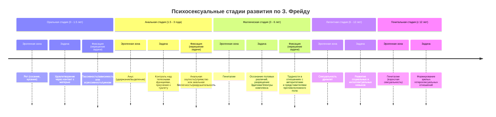

Психология личности начинается с вопроса о движущих силах человеческого поведения. В начале XX века Зигмунд Фрейд дал радикальный ответ: всем управляет бессознательное. Его теория породила как жёсткую критику, так и новые школы, каждая из которых предлагала свою карту скрытых территорий психики.

## Психоанализ Зигмунда Фрейда: революция детерминизма

Психоанализ стал классикой, определившей развитие психологии на десятилетия вперёд. Его появление связано с научным парадоксом: как отмечал историк науки, «величие учёного измеряется тем, на сколько лет он затормозил развитие своей науки». Фрейд, создав цельную систему, надолго задал рамки дискуссии. Его первая лекция о толковании сновидений состоялась в 1897 году, и лишь к 1912-1913 годам появились первые серьёзные отколовшиеся направления — аналитическая психология Юнга и индивидуальная психология Адлера, а также бихевиоризм Уотсона как альтернатива.

### Детерминизм и бессознательное

Ключевая идея Фрейда — **психический детерминизм**. Это философский принцип, согласно которому все психические процессы и поведение человека имеют причину в прошлом опыте. До Фрейда фраза «меня мама не любила, поэтому я такой» не считалась научным объяснением. Он ввёл представление о том, что прошлое, особенно раннее детство, жёстко определяет будущее.

Для обоснования детерминизма Фрейду потребовалось ввести понятие **бессознательного** — огромного пласта психической жизни, не доступного прямому осознанию, но активно влияющего на мысли, чувства и поступки. Таким образом, психоанализ претендовал на статус науки, объясняющей происходящее через причинно-следственные связи, что соответствует **классическому идеалу рациональности**. Однако проверить повторяемость и предсказуемость его выводов экспериментально было крайне сложно.

### «Объективные» методы психоанализа

Фрейд считал свои методы объективными, но в психологии, имеющей дело с уникальной психикой, абсолютная объективность недостижима — отсюда кавычки. Ключевые методы:
*   **Метод свободных ассоциаций:** Пациент говорит всё, что приходит в голову, без цензуры. Аналитик ищет в этом потоке скрытые связи и конфликты.
*   **Толкование сновидений:** Сны рассматриваются как «королевская дорога к бессознательному», где скрытые желания и конфликты проявляются в символической форме.
*   **Интерпретация:** Аналитик объясняет пациенту скрытый смысл его ассоциаций, снов, оговорок (психопатологий обыденной жизни).
*   **Анализ переноса и контрпереноса:** **Перенос** — когда пациент бессознательно проецирует на аналитика чувства и отношения из своего прошлого (например, видит в нём фигуру отца). **Контрперенос** — ответная эмоциональная реакция аналитика на пациента, которая может быть индикатором процессов переноса.
*   **Анализ сопротивления:** Любое нежелание пациента следовать правилам анализа, забывание сессий, отрицание интерпретаций трактуется как **сопротивление** — защитный механизм, мешающий осознанию болезненных бессознательных содержаний.
*   **Понятие компенсации и гиперкомпенсации:** **Компенсация** — здоровый механизм, когда человек восполняет недостаток в одной сфере успехами в другой. **Гиперкомпенсация** — чрезмерное, часто деструктивное стремление к превосходству для подавления глубинного чувства неполноценности (например, трудоголизм как попытка доказать свою ценность).

Гипноз Фрейд отверг как основной метод, так как не все люди гипнабельны. Простой тест на гипнабельность: потереть ладони до ощущения тепла и медленно разводить их в стороны. Если тепло ощущается на расстоянии больше ширины плеч, гипнабельность считается высокой.

### Структура личности и движущие силы

Фрейд представлял личность состоящей из трёх инстанций:
1.  **Оно (Ид):** Примитивная, бессознательная часть, источник всей психической энергии. Руководствуется **принципом удовольствия**, требует немедленного удовлетворения инстинктивных потребностей.
2.  **Я (Эго):** Сознательная часть, которая формируется из Оно. Руководствуется **принципом реальности**, пытается удовлетворить желания Оно социально приемлемыми способами, выступая посредником между Оно и Сверх-Я.
3.  **Сверх-Я (Супер-Эго):** Внутренний цензор, представляющий усвоенные социальные (родительские) нормы, мораль, идеалы. Источник чувства вины и стыда.

Движущими силами личности Фрейд считал два ведущих инстинкта (или влечения):
1.  **Либидо (инстинкт жизни, Эрос).** Источник — Оно. Это энергия созидания, влечения, направленные на сохранение и развитие жизни. Первоначально Фрейд связывал его исключительно с сексуальной энергией, но позднее расширил понятие.
2.  **Мортидо (инстинкт смерти, Танатос).** Позднее введённое понятие, отражающее влечение к разрушению, агрессии, инерции, стремление вернуться в неорганическое состояние. Осознание собственной смертности в поздние годы побудило Фрейда выделить эту силу.

### Психосексуальные стадии развития

Личность формируется в первые годы жизни, проходя через **психосексуальные стадии**, где либидо фокусируется на определённых эрогенных зонах. Фиксация (застревание) на какой-либо стадии из-за чрезмерного удовлетворения или фрустрации потребностей влияет на формирование черт характера взрослого человека.

*   **Оральная стадия (0–1.5 лет):** Удовольствие сосредоточено во рту (сосание, кусание). Фиксация приводит к формированию орально-пассивного (зависимого, доверчивого) или орально-агрессивного (циничного, склонного к спорам) характера.
*   **Анальная стадия (1.5–3 года):** Удовольствие связано с контролем над выделительными функциями (удержание и отпускание). Фиксация формирует анально-сдерживающий (скупой, упрямый, педантичный) или анально-выталкивающий (безрассудный, деструктивный) характер.
*   **Фаллическая стадия (3–6 лет):** Интерес к гениталиям, возникновение **Эдипова комплекса** (у мальчиков — бессознательное влечение к матери и соперничество с отцом) и **комплекса Электры** (у девочек — аналогичное влечение к отцу). Разрешение комплекса через идентификацию с родителем своего пола.
*   **Латентная стадия (6–12 лет):** Сексуальные интересы отступают, энергия направлена на обучение, социализацию, развитие навыков.
*   **Генитальная стадия (с 12 лет):** Пробуждение сексуальности в подростковом возрасте, направленной на установление зрелых гетеросексуальных отношений.

## Теория управления страхом смерти (Terror Management Theory)

Развивая фрейдовскую идею **мортидо** (инстинкта смерти), антрополог Эрнест Беккер и психологи Шелдон Соломон, Джефф Гринберг и Том Пищински создали **Теорию управления страхом смерти** (Terror Management Theory, TMT). Её центральный тезис: осознание собственной смертности — фундаментальный фактор, определяющий человеческое поведение и культуру.

### Основные постулаты TMT

1.  **Осознание собственной смерти:** Человек — единственное существо, осознающее неизбежность и неопределённость времени своей смерти.
2.  **Страх как основа:** Этот страх (экзистенциальный ужас) лежит в основе многих психических процессов.
3.  **Защитные буферы:** Чтобы справиться с этим страхом, психика создаёт два основных психологических буфера:
    *   **Буфер культуры:** Причастность к какой-либо культуре, религии, нации, идеологии даёт человеку **иллюзию бессмертия** через принадлежность к чему-то большему и вечному (память потомков, достижения, вклад в культуру).
    *   **Буфер самоуважения:** Вера в то, что ты — «хороший», «правильный», «ценный» член своего культурного мира. Это создаёт **иллюзию**, что с тобой, как с «правильным» человеком, ничего плоого не случится, или что твоя жизнь имеет значение, трансцендирующее смерть.

Вся человеческая деятельность, согласно TMT, — это попытки защититься от экзистенциального страха, усиливая эти буферы.

### Экспериментальные подтверждения

Классический эксперимент TMT: одной группе судей напоминали об их смертности (задавали вопросы о смерти), другой — о нейтральных темах. Затем обеим группам предлагали вынести приговор проститутке, нарушившей закон. Группа с актуализированным страхом смерти выносила **значительно более жёсткие приговоры**.

**Объяснение:** Проститутка воспринималась как нарушитель культурных норм («морального порядка»). Более суровое наказание её было способом **защиты культуры** — утверждения её правильности и значимости, что, в свою очередь, усиливало у судей буфер культуры и помогало справиться со страхом смерти. Самое страшное, по Беккеру, — не физическая смерть, а «оказаться умершим при жизни», то есть потерять смысл и ценность в рамках своей культурной системы.

## Аналитическая психология Карла Густава Юнга: выход за пределы личного

Карл Густав Юнг, первоначально ближайший соратник Фрейда («принц психоанализа»), создал собственную теорию — **аналитическую психологию**. Его подход стал «теневой стороной психоанализа», во многом пересмотрев его базовые постулаты.

### Переосмысление ключевых понятий

*   **Либидо:** У Юнга это не только сексуальная энергия, а **общая психическая энергия**, жизненная сила, которая может принимать разные формы.
*   **Аттитюд (установка):** Основная направленность этой энергии — **экстраверсия** (вовне, на объекты) и **интроверсия** (вовнутрь, на субъективные переживания). Это фундаментальное разделение психологических типов.

### Психологические функции

Юнг выделил четыре основных психологических функции, которые в сочетании с установкой (экстраверсия/интроверсия) образуют **психологический тип**.

1.  **Функции сбора информации:**
    *   **Ощущение:** Восприятие с помощью органов чувств, ориентация на конкретные факты, реальность («что именно я воспринимаю?»).
    *   **Интуиция:** Восприятие посредством бессознательного, ориентация на возможности, скрытые смыслы, будущее («что могло бы случиться?»).

2.  **Функции принятия решений:**
    *   **Мышление:** Логическая оценка информации, установление причинно-следственных связей («что это значит?»).
    *   **Чувство:** Оценка на основе ценности, значимости («насколько это ценно, приятно?»). **Важно:** Юнг строго разделял **чувство** (рациональную функцию оценки) и **эмоции** (иррациональные аффективные реакции тела).

| Критерий | Чувство (как функция) | Эмоция |
| :--- | :--- | :--- |
| **Продолжительность** | Длительно (любовь, убеждённость) | Кратковременна |
| **Связь с телом** | Оторвано от непосредственной физиологии | Телесная реакция (дрожь, пот) |
| **Пример** | «Я чувствую, что это правильно» | Страх, гнев, радость |

Каждая из четырёх функций может проявляться в **экстравертной** или **интровертной** форме, создавая богатую палитру типов (позднее это легло в основу типологии Майерс-Бриггс и соционики).

### Структура личности по Юнгу

Психика, по Юнгу, состоит из сознания и бессознательного, которое, в свою очередь, делится на личное и коллективное.

**Жители сознания:**
*   **Эго (Я):** Центр сознания, обеспечивающее чувство идентичности и непрерывности. Постоянно ищет причину и смысл, является осью индивидуального мира.
*   **Персона (Маска):** Социальная роль, образ, который человек предъявляет миру для защиты Эго и адаптации. Одежда, манера поведения, имидж — части Персоны. **Субличности** — это множество таких масок для разных контекстов.

**Жители бессознательного:**
*   **Личное бессознательное:** Содержит вытесненные воспоминания, забытые переживания и **Тень**.
    *   **Тень:** «Негатив самости», тёмная, непризнанная часть личности, включающая качества, которые человек в себе отрицает. Опасна, когда не осознана, но является источником творческой энергии и вдохновения. Через осознание Тени лежит путь в коллективное бессознательное.
*   **Коллективное бессознательное:** Самая глубокая и универсальная часть психики, общая для всего человечества. Её содержание составляют **архетипы** — врождённые, базовые образы и паттерны (не сами образы, а их схемы), проявляющиеся в мифах, сказках, сновидениях, искусстве.
    *   **Основные архетипы:**
        *   **Анима (в мужчине) / Анимус (в женщине):** Бессознательный образ противоположного пола. Анима отвечает за настроения, Анимус — за твёрдые мнения. Это связующее звено с бессознательным, ключ к пониманию противоположного пола и источник творческого вдохновения.
        *   **Самость (Self):** Центральный архетип, символ целостности и интеграции всех частей психики. Цель процесса **индивидуации** (личностного роста по Юнгу) — интеграция Эго с Самостью.

Юнг не занимался строгой классификацией архетипов. Это сделали позднее его последователи, такие как Кэрол Пирсон и Маргарет Марк, выделив архетипы Героя, Бунтаря, Мудреца, Шута и другие.

Юнг видел психику как постоянно трансформирующуюся систему. Его увлечение алхимией как метафорой психического преобразования подчёркивало идею процесса: личность никогда не статична, она находится в постоянном движении к большей целостности.

## Запомнить

*   **Психоанализ Фрейда** основан на **психическом детерминизме** и концепции **бессознательного**. Личность структурирована как конфликт между **Оно** (влечения), **Я** (сознание) и **Сверх-Я** (мораль). Развитие проходит через **психосексуальные стадии**, фиксация на которых формирует характер.
*   **Теория управления страхом смерти (TMT)** развивает идею **мортидо**. Осознание смерти порождает базовый страх, от которого люди защищаются с помощью **буфера культуры** (принадлежность к чему-то вечному) и **буфера самоуважения** (вера в свою правильность).
*   **Аналитическая психология Юнга** пересматривает психоанализ. **Либидо** — общая психическая энергия. Ключевые параметры личности — **установки** (экстраверсия/интроверсия) и **функции** (мышление, чувство, ощущение, интуиция).
*   Структура психики по Юнгу включает **Эго**, **Персону** (маска), **Тень** (скрытое), **Аниму/Анимус** (образ противоположного пола) и **коллективное бессознательное** с **архетипами**. Цель развития — **индивидуация**, интеграция всех частей вокруг **Самости**.
*   Эти теории заложили фундамент для понимания глубинных, часто неосознаваемых движущих сил личности, её конфликтов и стремления к целостности.
