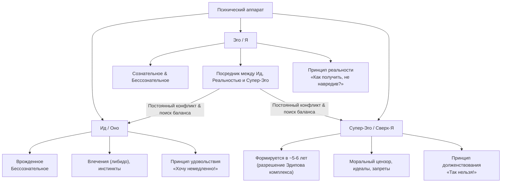
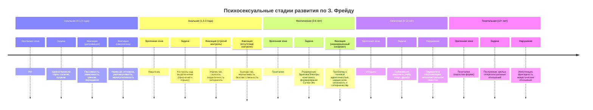

Концепция психического развития, созданная Зигмундом Фрейдом на рубеже XIX–XX веков, совершила революцию. Впервые детство было признано не подготовительным, а **центральным периодом** в формировании личности. Впервые было заявлено, что психическая жизнь имеет скрытое, **бессознательное измерение**, а взрослые конфликты, неврозы и особенности характера — это прямые следствия событий первых лет жизни. Теория Фрейда, несмотря на критику, остается фундаментальной системой координат, без которой невозможно представить современную психологию развития. Это яркий пример **адаптационной (интеграционно-равновесной) модели**, где развитие понимается как движение к равновесию между внутренними силами.

## Движущая сила развития: либидо и принцип удовольствия

В основе концепции Фрейда лежит постулат о **психической энергии влечений**, которую он назвал **либидо**. Первоначально Фрейд связывал ее исключительно с сексуальным инстинктом, позднее расширив понимание до энергии всех жизненных влечений (Эрос). Именно движение, преобразование и сублимация этой энергии и составляют суть развития.

Развитие, по Фрейду, — это смена способов удовлетворения влечений и объектов, на которые они направлены. Изначально поведением управляет **принцип удовольствия**: психический аппарат стремится к немедленному снятию напряжения, вызванного неудовлетворенным влечением. Однако столкновение с реальностью заставляет сформироваться новый регулятор — **принцип реальности**, который учит откладывать удовольствие ради безопасности и социальной приемлемости.

## Топографическая и структурная модели: внутренний мир как поле битвы

Для описания этой динамики Фрейд создал две взаимосвязанные модели психики.

**Топографическая модель** (сознание – предсознательное – бессознательное) описывала **доступность** психического содержания. Главный тезис: **бессознательное** — обширная, скрытая часть психики, где хранятся вытесненные желания, травмы и инстинктивные импульсы, — является главной детерминантой поведения.

Более известная **структурная модель** (Ид, Эго, Супер-Эго) описывает **функциональные части** личности, находящиеся в постоянном конфликте и стремящиеся к динамическому равновесию.

**Ид (Оно)** — это исходная, врожденная инстанция. Оно полностью бессознательно, иррационально и руководствуется принципом удовольствия. Ид — кипящий котел инстинктов (жизни и смерти) и вытесненных воспоминаний.

**Эго (Я)** возникает из Ид как посредник с внешним миром. Его задача — удовлетворять желания Ид, но социально приемлемыми и безопасными способами, руководствуясь **принципом реальности**. Эго использует защитные механизмы (вытеснение, рационализацию, сублимацию), чтобы сглаживать конфликты.

**Супер-Эго (Сверх-Я)** — последняя формирующаяся инстанция, внутренний моральный контролер. Она возникает в результате интроекции (поглощения) родительских и социальных запретов, норм и идеалов. Супер-Эго — источник чувства вины, стыда и моральных оценок.

**Здоровое развитие**, с точки зрения психоанализа, — это достижение баланса, где сильное и гибкое **Эго** способно находить компромисс между примитивными требованиями **Ид**, жесткими запретами **Супер-Эго** и ограничениями реальности. Невроз — это следствие хронического конфликта, который Эго не может разрешить.

## Психосексуальные стадии развития: ландшафт детства

Самый известный элемент теории Фрейда — концепция **психосексуальных стадий**. Развитие проходит через ряд универсальных этапов, каждый из которых характеризуется своей **эрогенной зоной** — областью тела, стимуляция которой приносит основное удовольствие на данном этапе. Успешное прохождение стадии предполагает удовлетворение возрастных потребностей в оптимальной мере. **Фиксация** — частичное «застревание» на стадии из-за чрезмерной фрустрации (неудовлетворения) или, наоборот, сверхудовлетворения — приводит к формированию специфических черт характера во взрослой жизни.

### Оральная стадия (0 – 1,5 года)
На этой первой стадии все удовольствие ребенка сосредоточено вокруг рта — через сосание, кусание, исследование предметов. Ведущая потребность — в питании, телесном контакте и безопасности. Мать — центральный объект мира.
*   **Нормальное прохождение:** Формирование базового доверия к миру, уверенности в том, что потребности будут удовлетворены.
*   **Фиксация при депривации** (недостатке внимания, нерегулярном кормлении): Формируется **орально-пассивный** тип характера. Черты: пассивность, зависимость от других, излишняя доверчивость, пессимизм, склонность к депрессии. Во взрослой жизни — потребность в постоянном «подпитывании» через еду, алкоголь, курение, одобрение.
*   **Фиксация при сверхудовлетворении** (гиперопеке): Формируется **орально-агрессивный** (орально-садистический) тип. Черты: цинизм, сарказм, склонность к спорам, эксплуататорское отношение к людям, потребность доминировать в разговоре.

### Анальная стадия (1,5 – 3 года)
Эрогенная зона смещается к анусу и кишечнику. Удовольствие связано теперь не только с выделением, но и с **контролем** над этим процессом. Именно на этой стадии происходит первое масштабное столкновение между природным импульсом ребенка (удовлетвориться здесь и сейчас) и социальным требованием родителей (приучение к горшку, требование чистоплотности и порядка).
*   **Нормальное прохождение:** Формирование самоконтроля, самостоятельности, чувства компетентности. Ребенок учится балансировать между собственными желаниями и социальными ожиданиями.
*   **Фиксация при строгом, наказающем приучении:** Формируется **анально-удерживающий** тип характера. Черты: упрямство, скупость (как символическое удержание), чрезмерная пунктуальность, педантизм, ригидность мышления, склонность к перфекционизму и накопительству. Люди этого типа часто консервативны, надежны, но эмоционально сдержаны.
*   **Фиксация при поощрении неконтролируемых реакций или непоследовательности требований:** Формируется **анально-выталкивающий** тип. Черты: несдержанность, гневливость, деструктивность, бунтарство против авторитетов, неряшливость, расточительность.

### Фаллическая стадия (3 – 6 лет)
Эрогенная зона — гениталии. Ребенок начинает осознавать анатомические различия между полами, проявляет интерес к вопросам рождения, отношений между родителями. Это период **Эдипова комплекса** (у мальчиков) и **комплекса Электры** (у девочках) — центрального драматического события в теории Фрейда.

*   **Суть Эдипова комплекса:** Мальчик испытывает сексуальное влечение к матери и ревность, враждебность к отцу-сопернику. Одновременно он боится отцовского наказания, которое в его фантазии принимает форму **кастрационной тревоги** (страх лишиться пениса).
*   **Разрешение комплекса:** Чтобы снять тревогу, мальчик идентифицируется с отцом, перенимает его черты, нормы и запреты. Это мощный толчок к формированию **Супер-Эго**. Влечение к матери вытесняется, но остается как прообраз будущих отношений с женщинами.
*   **Комплекс Электры (у девочек):** Девочка, обнаруживая отсутствие пениса, испытывает «зависть к пенису» и обиду на мать, которую считает виноватой. Она переносит любовь на отца, видя в нем обладателя желаемого атрибута. Разрешение также происходит через идентификацию с матерью и усвоение женской роли. Фрейд считал, что Супер-Эго у женщин формируется слабее из-за менее травматичного разрешения комплекса (отсутствие страха кастрации).

**Фиксация на фаллической стадии** (неудачное разрешение Эдипова/Электры комплекса) ведет к серьезным проблемам: трудностям с половой идентичностью, неспособности строить зрелые отношения с партнерами противоположного пола (мужчины могут искать «замену матери», женщины — «отца»), склонности к соперничеству и демонстративности, нарциссическим чертам.

### Латентный период (6 – 12 лет)
Период «затишья». Сексуальные влечения ослабевают, энергия либидо **сублимируется** — перенаправляется в социально приемлемые русла: учебу, спорт, хобби, дружбу со сверстниками своего пола. Супер-Эго укрепляется. Это время активного интеллектуального, социального и морального развития, формирования навыков. Прямые сексуальные темы вызывают у ребенка стыд или отвращение.

### Генитальная стадия (с 12 лет)
С началом полового созревания сексуальные влечения пробуждаются с новой силой. В идеале, пройдя все предыдущие стадии без сильных фиксаций, подросток способен направить либидо на поиск партнера вне семьи, построение зрелых, взаимных и ответственных гетеросексуальных отношений. Это стадия, которая продолжается всю взрослую жизнь и знаменует достижение зрелой личности, способной любить и работать (любить и созидать).

## Значение и критика концепции Фрейда

Теория Фрейда стала **первой всеобъемлющей системой**, связавшей детский опыт с взрослой личностью. Она ввела в науку ключевые понятия: **бессознательное, психологическая защита, внутренний конфликт, значение ранних травм**. Ее влияние вышло далеко за рамки психологии, охватив искусство, литературу и философию.

Однако концепция не избежала серьезной критики:
1.  **Пансексуализм:** Чрезмерное, почти тотальное сведение всех движущих сил развития к сексуальному влечению.
2.  **Биологический детерминизм:** Недооценка роли социальных, культурных и исторических факторов в развитии.
3.  **Методологическая уязвимость:** Теория построена преимущественно на клинических наблюдениях за взрослыми невротиками и их ретроспективных воспоминаниях, что ставит вопрос о репрезентативности и объективности.
4.  **Андроцентризм и сексизм:** Описание женского развития как «неполноценного» варианта мужского, концепция «зависти к пенису» справедливо критиковались феминистскими исследователями.

Несмотря на критику, теория Фрейда остается живой и работающей. Современный психоанализ, сильно изменившийся, по-прежнему использует ее базовые идеи о бессознательных конфликтах, защитных механизмах и важности ранних объектных отношений. Она заставляет нас смотреть на ребенка не как на невинного ангела, а как на сложное существо, в котором уже кипят страсти, идущие к формированию уникальной человеческой личности.

## Запомнить

*   **Движущая сила:** Развитие движется энергией **либидо** (психической энергией влечений) и стремлением снять напряжение между **принципом удовольствия** и **принципом реальности**.
*   **Структура личности:** Психика — поле битвы между **Ид** (влечения), **Эго** (сознание, реальность) и **Супер-Эго** (мораль). Здоровая личность — сильное Эго, балансирующее между ними.
*   **Стадии развития:** Пять **психосексуальных стадий** (оральная, анальная, фаллическая, латентная, генитальная) определяются сменой **эрогенной зоны**.
*   **Ключевые механизмы:**
    *   **Фиксация** — застревание на стадии из-за фрустрации или сверхудовлетворения, ведущее к специфическим чертам характера.
    *   **Эдипов комплекс/Комплекс Электры** (3-6 лет) — центральный конфликт, разрешение которого через идентификацию формирует **Супер-Эго** и половую идентичность.
    *   **Сублимация** — перенаправление энергии либидо в социально одобряемое русло (творчество, работа).
*   **Вклад:** Фрейд создал первую системную теорию, связавшую **детство и взрослую личность**, открыв **бессознательное** и показав, что развитие — это адаптация и поиск равновесия психических сил.
*   **Критика:** Теорию критикуют за **пансексуализм**, **биологический детерминизм** и **методологическую слабость**.
