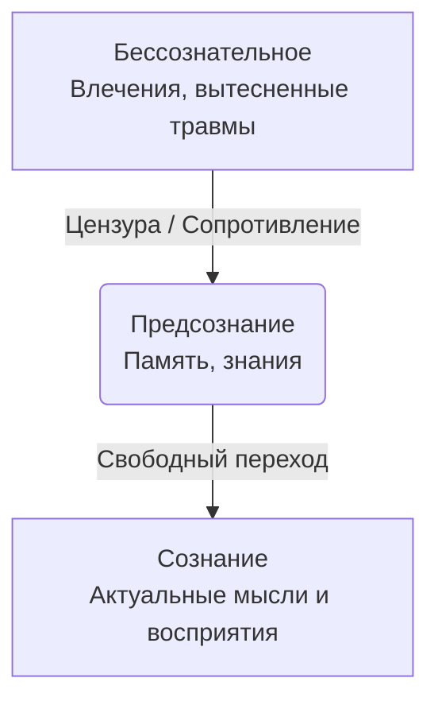
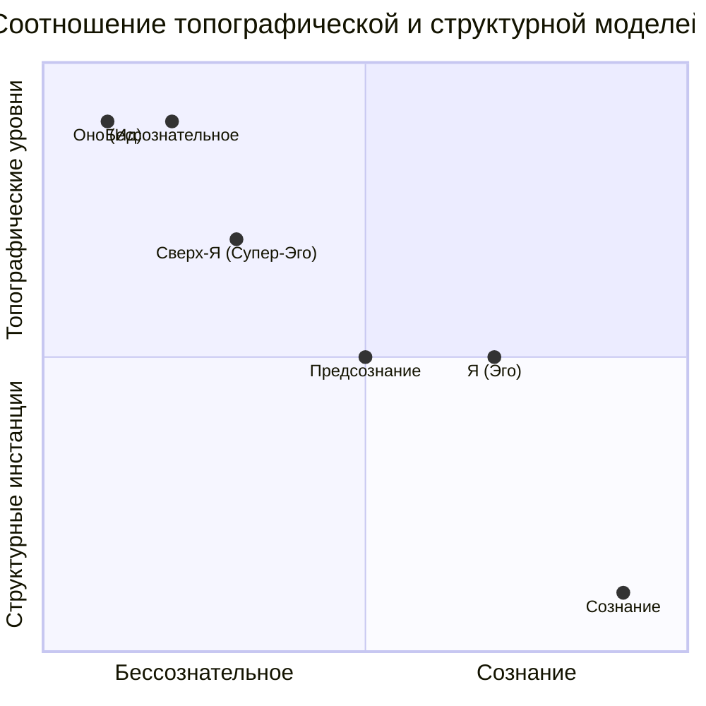

## Две карты психики: где находится и кто действует

Чтобы исследовать неизведанную территорию, нужна карта. В психоанализе Зигмунда Фрейда таких карт личности несколько. Если динамическая перспектива показывает, *что движет* человеком (Эрос и Танатос), а генетическая — *как он развивался*, то **топографическая** и **структурная** модели отвечают на вопросы «*где?*» и «*кто?*» в психическом пространстве. **Топографическая модель** — это вертикальный срез психики, описывающий её **устройство по уровням осознавания**: что находится в фокусе внимания, что лежит на полке памяти, а что похоронено в глубине. **Структурная модель** — это горизонтальный срез, показывающий её **функциональные части, или инстанции**: какие «голоса» или агенты внутри личности ведут постоянный диалог, спорят и принимают решения. Вместе они образуют полную систему координат для понимания внутренних конфликтов, симптомов и механизмов защиты.

## Топографическая модель: айсберг психики

Согласно топографической модели, человеческую психику можно объяснить в трёх взаимосвязанных терминах: **сознание, предсознание и бессознательное**. Эта модель часто иллюстрируется метафорой айсберга, где видимая часть — лишь малая доля целого.

### Сознание: вершина айсберга
Это часть психики, непосредственно контактирующая с внешним миром и внутренними состояниями в **данный момент**. В сознании находятся актуальные мысли, восприятия, чувства, воспоминания и фантазии, которые человек ясно осознаёт. Это инструмент ориентации в настоящем и познания реальности.

### Предсознание: промежуточные воды
Прямо под поверхностью сознания лежит обширная область **предсознательного**. Здесь хранится весь материал, который человек в данный момент не осознаёт, но который может быть без особого труда поднят в сознание усилием воли или при необходимости. Это память, хранилище знаний, навыков, нейтральных воспоминаний и впечатлений. Например, ваше знание столицы Франции или воспоминание о том, что вы ели на завтрак, обычно находится в предсознании и легко становится сознательным.

### Бессознательное: глубины и тени
Самая мощная и скрытая часть психики — **бессознательное**. Здесь сосредоточены инстинктивные, часто примитивные влечения (по Фрейду, прежде всего сексуальные и агрессивные), а также весь материал, **неприемлемый для сознания**: травматические воспоминания, вытесненные желания, запретные фантазии, болезненные переживания. Содержимое бессознательного недоступно для прямого осознания, но оно активно управляет поведением, порождает симптомы, сны и ошибочные действия. Это царство иррационального, где не действуют законы логики, времени и противоречия.

### Границы и цензура: как устроен контроль доступа
Граница между сознанием и предсознанием **прозрачна и проницаема**. Информация между ними движется свободно. Совершенно иная ситуация на границе между предсознанием и бессознательным. Здесь стоит **цензор (или цензура)** — психологический механизм, основная функция которого — не пропускать в сознание неприемлемые бессознательные влечения и вытесненные содержания. Сопротивление цензора и составляет главное препятствие в психоаналитической работе. Оговорки, описки и симптомы — это как раз «прорывы» бессознательного через бреши в цензуре. Таким образом, **сверхзадача психоанализа** — ослабить сопротивление цензуры, чтобы довести до сознания вытесненный материал, сделать бессознательное сознательным и тем самым обезвредить патогенное ядро невроза.

## Структурная модель: внутренний триумвират и его вечный конфликт

К 1920-м годам Фрейд пришёл к выводу, что топографической модели недостаточно для описания динамики внутренних конфликтов. Она отвечала на вопрос «*где это находится?*», но не объясняла, *какие именно силы* внутри личности вступают в противоречие. Так родилась **структурная модель**, описывающая личность как состоящую из трёх инстанций: **Оно (Ид), Я (Эго) и Сверх-Я (Супер-Эго)**. Эти инстанции — не анатомические части, а функциональные системы, подчиняющиеся разным принципам и ведущие постоянную борьбу.

### Оно (Ид): кипящий котёл влечений
**Оно** — самая древняя, глубинная и полностью **бессознательная** часть личности. Оно представляет собой резервуар врождённых биологических влечений (Эроса и Танатоса), наделённых энергией **либидо**, а также всего вытесненного из сознания материала. Оно иррационально, аморально и руководствуется единственным **принципом удовольствия**: немедленно и полностью снять возникающее напряжение, удовлетворить потребность, не считаясь с реальностью или моралью. Его процессы — первичные (образы, символы, сгущения). Оно требует: «Хочу это сейчас!».

### Я (Эго): разумный посредник в осаде
**Я** возникает из Оно в раннем детстве (на оральной стадии) как аппарат приспособления к реальности. Его задача — быть посредником между неистовыми требованиями Оно, суровыми запретами Сверх-Я и объективными условиями внешнего мира. Я в основном сознательно, но частично функционирует и в предсознательной, и в бессознательной сферах. Оно руководствуется **принципом реальности**: откладывать удовлетворение, оценивать последствия, находить социально приемлемые компромиссы. Для этого Я использует вторичные процессы — логическое, реалистичное мышление, а также защитные механизмы (вытеснение, рационализацию, сублимацию), чтобы смягчать внутренние конфликты. Фрейд называл Я «несчастным», вынужденным служить «трём господам» одновременно.

### Сверх-Я (Супер-Эго): внутренний судья и идеал
**Сверх-Я** формируется последним, примерно к 5–6 годам, в результате разрешения Эдипова комплекса. Это инстанция представляет собой **интериоризированные** (усвоенные) родительские и социальные запреты, нормы, идеалы, моральные ценности. Сверх-Я также в значительной степени бессознательно. В его структуре выделяют две подсистемы:
1.  **Совесть** — наказывает за нарушения (чувством вины, стыда, самоуничижения).
2.  **Эго-идеал** — вознаграждает за соответствие стандартам (чувством гордости, самоуважения).

Сверх-Я действует как **внутренний цензор и судья**, стремясь полностью подавить любые неприемлемые с моральной точки зрения импульсы Оно. Оно руководствуется не принципом реальности, а принципом долженствования, часто нереалистично и жестоко по отношению к Я.

## Взаимодействие моделей: единая карта психики

Топографическая и структурная модели не противоречат, а взаимно дополняют друг друга, создавая объёмную картину. Их соотношение можно представить на единой схеме.

*   **Оно** целиком находится в сфере **бессознательного**.
*   **Сверх-Я** в своей запретительной и идеализирующей части также глубоко укоренено в **бессознательном**.
*   **Я** является самой «многослойной» инстанцией: его функция восприятия и адаптации связана с **сознанием**, его память и логика оперируют в **предсознательном**, а его защитные механизмы (например, вытеснение) работают неосознанно, то есть в **бессознательном**.

Таким образом, психический конфликт — это не просто конфликт между сознанием и бессознательным. Это, прежде всего, **конфликт между инстанциями**, который разворачивается на разных уровнях осознавания. Например, бессознательное сексуальное желание (исходящее от **Оно**) сталкивается с бессознательным же запретом (исходящим от **Сверх-Я**). **Я**, пытаясь разрешить этот конфликт и избежать тревоги, использует бессознательный защитный механизм (вытеснение), который отправляет и желание, и связанные с ним мысли в глубины **бессознательного**. Однако подавленная энергия находит окольный путь и прорывается в **сознание** в виде неврологического симптома (например, истерического паралича) или навязчивого действия.

## Запомнить

*   **Топографическая модель** описывает психику по уровням доступности для осознания: **сознание** (актуальное), **предсознание** (доступная память) и **бессознательное** (вытесненные влечения и травмы).
*   Ключевой элемент — **цензура** на границе предсознания и бессознательного, которая не пускает неприемлемый материал в сознание.
*   **Структурная модель** описывает личность как взаимодействие трёх инстанций: **Оно (Ид)** — бессознательные влечения (принцип удовольствия); **Я (Эго)** — посредник, приспосабливающий влечения к реальности (принцип реальности); **Сверх-Я (Супер-Эго)** — усвоенные нормы и идеалы, внутренний цензор.
*   **Оно** и значительная часть **Сверх-Я** находятся в **бессознательном**. **Я** функционирует на всех трёх уровнях: сознательном, предсознательном и бессознательном.
*   **Психический конфликт** — это, в первую очередь, конфликт между инстанциями (Оно vs. Сверх-Я), а **невротический симптом** — компромиссное образование и результат работы защитных механизмов Я, пытающегося этот конфликт разрешить.
*   **Задача психоанализа** — через анализ сопротивления и переноса ослабить цензуру и помочь Я интегрировать вытесненное бессознательное содержание, усиливая его и ослабляя власть невротического конфликта.
