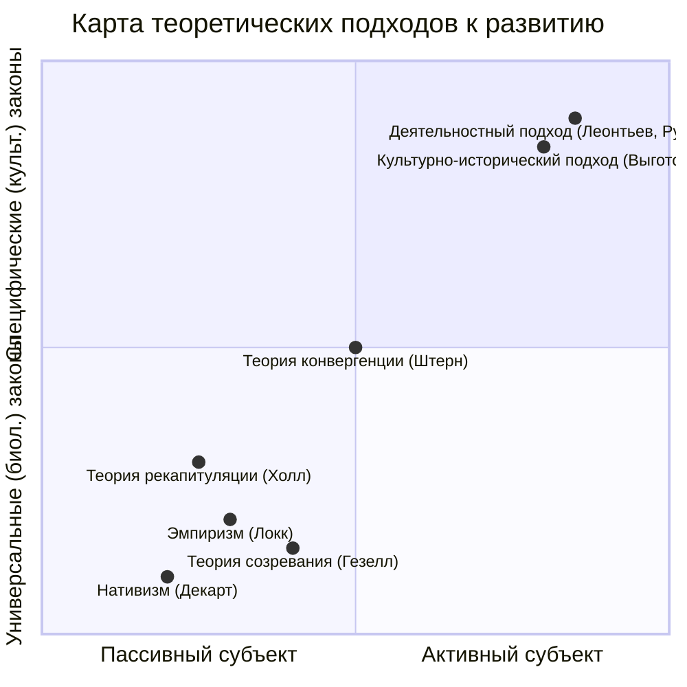

Вопрос о том, что заставляет психику ребенка изменяться, расти и усложняться, является краеугольным камнем возрастной психологии. Ответы на него радикально расходятся, образуя два главных водораздела: первый касается **специфики законов** человеческого развития, а второй — **роли активности** самого развивающегося субъекта. Эволюция взглядов на эти проблемы прошла путь от философских споров о врожденном и приобретенном до современных системных моделей, признающих сложное взаимодействие множества факторов.

## Специфика законов развития: одинаковы ли мы с животными?

Фундаментальная проблема заключается в следующем: подчиняется ли психическое развитие человека тем же законам, что и развитие животных, или у нас действуют принципиально иные механизмы? От ответа зависит все понимание детерминант.

### Натурализм (биологический редукционизм)
Эта позиция утверждает универсальность законов развития. Согласно натурализму, законы, управляющие созреванием и поведением животного, в обобщенном виде применимы и к человеку. Развитие рассматривается как естественный, биологически детерминированный процесс, где социальные и культурные факторы играют второстепенную, надстроечную роль. Этот подход является основой **факторного подхода**, ищущего главный, первичный источник развития (чаще всего в наследственности).

### Культурно-исторический подход
Эта позиция, развитая Львом Выготским и его школой, утверждает принципиальное отличие законов онтогенеза человека. Аргумент прост: образ жизнедеятельности человека (труд, речь, сознание, культура) кардинально отличается от образа жизни животных. Следовательно, и законы развития должны быть иными. Здесь на первый план выходят не биологические механизмы созревания, а процессы **интериоризации** — преобразования внешних, социальных форм деятельности во внутренние, психические процессы. Развитие понимается как присвоение культурно-исторического опыта через общение и совместную деятельность.

## Учет активности субъекта: пассивный объект или творец своего развития?

Второй водораздел касается роли самого ребенка в процессе развития. Является ли он пассивным объектом, на который воздействуют внешние и внутренние силы, или активным субъектом, самостоятельно строящим свою психику?

### Факторный подход: развитие как результат воздействия
В рамках факторного подхода развитие понимается как следствие взаимодействия или одностороннего воздействия главных факторов: **наследственности** и **среды**. Активность самого ребенка как самостоятельная сила не учитывается. Он — материал, на котором разворачивается борьба или сотрудничество этих двух детерминант. Этот подход уходит корнями в древнейшие философские дискуссии.

#### Однофакторные теории: крайности нативизма и эмпиризма

**Нативизм (приоритет наследственности).**
Нативисты верят в изначальную, врожденную заданность психики. Классический пример — теория **врожденных идей Рене Декарта** (1596-1650). Декарт признавал рефлекторные механизмы для простых реакций, но считал, что сложные психические содержания (идеи добра, зла, справедливости, формы, пространства, времени) даны человеку от рождения и лишь «созревают» со временем, не требуя обучения или опыта.

**Эмпиризм (приоритет среды).**
Противоположный лагерь утверждает, что все содержание психики происходит из опыта. Джон Локк (1632-1704) сформулировал теорию **«чистой доски» (tabula rasa)**. Согласно ей, ребенок рождается с минимумом простейших реакций, а его сознание быстро заполняется понятиями, образами и ассоциациями благодаря воздействию внешнего мира. Ведущим механизмом развития здесь выступает **ассоцианизм** — образование связей между элементами психики (ощущениями, представлениями, идеями) на основе смежности, сходства или контраста.

#### Двухфакторные теории: поиск взаимодействия
Со временем стало очевидно, что ни наследственность, ни среда по отдельности не объясняют всего многообразия развития. Возникли теории, пытающиеся учесть оба фактора.

1.  **Теория конвергенции двух факторов (Вильям Штерн).** Штерн предложил модель, в которой наследственность и среда не противостоят, а **«дружат» и помогают друг другу**. Наследственность задает потенциал, направление развития, а среда предоставляет материал для его реализации. Развитие — это результат «схождения» (конвергенции) внутренних предпосылок и внешних условий. Эта теория стала шагом вперед, признав взаимозависимость факторов.

2.  **Теория созревания Арнольда Гезелла.** Гезелл, основатель первой в США лаборатории по изучению детского развития, делал акцент на наследственности, но в более мягкой форме. Он рассматривал развитие как **естественный, генетически обусловленный процесс созревания нервной системы**. Среда, по Гезеллу, не диктует развитие, а лишь **гармонирует** с внутренним, заранее заданным «графиком» созревания. Его знаменитые лонгитюдные исследования были направлены на выявление этих универсальных, биологически детерминированных норм развития.

3.  **Теория рекапитуляции Стэнли Холла.** Холл, открывший первую в США лабораторию детской психологии, предложил радикальную биогенетическую теорию. Он опирался на **биогенетический закон** Э. Геккеля: онтогенез есть краткое и сжатое повторение филогенеза. Холл распространил этот закон на психику, предположив, что ребенок в своем развитии последовательно проходит стадии, соответствующие этапам развития человечества: от животноподобного состояния через эпоху дикарей и варваров к цивилизованному человеку. Игры детей он рассматривал как «пережитки» этих древних эпох (например, лазание по деревьям — рекапитуляция жизни предков-приматов). Холл ввел термин **«подростковый возраст»** как период «бури и натиска», соответствующий, по его мнению, романтической эпохе в истории человечества. Несмотря на критику, заслуга Холла — в попытке связать развитие ребенка с историей общества.

4.  **Теории антагонизма (вытеснения) двух факторов.** В этих теориях, к которым относят ранние работы Зигмунда Фрейда и Жана Пиаже, факторы среды и наследственности не сотрудничают, а **противодействуют** друг другу. Например, в психоанализе врожденные влечения (Ид) вступают в конфликт с социальными запретами (Супер-Эго). Среда выступает как сила, вытесняющая и сублимирующую природное начало. Развитие здесь — результат этого внутреннего конфликта и поиска компромисса.

### Деятельностный подход: развитие как активное присвоение опыта
Факторный подход, даже в его двухфакторных вариантах, сохраняет представление о ребенке как о пассивном объекте влияний. Преодолением этого стала **деятельностная парадигма**, разработанная советскими психологами Сергеем Рубинштейном и Алексеем Леонтьевым.

Ключевой тезис: **психика развивается не под воздействием факторов, а в процессе активной, предметной деятельности самого ребенка**. Деятельность, направленная на удовлетворение потребностей, является той «единицей», внутри которой формируются психические процессы и свойства личности.

*   **Интериоризация:** Психические функции (мышление, произвольное внимание) возникают сначала как форма взаимодействия между людьми (во внешнем плане), а затем «вращиваются» внутрь, становясь внутренними, собственно психическими действиями.
*   **Ведущая деятельность:** На каждом возрастном этапе существует своя ведущая деятельность (например, предметно-манипулятивная в раннем возрасте, сюжетно-ролевая игра в дошкольном), которая обуславливает главные изменения в психике и служит движущей силой перехода на следующую стадию.
*   **Активность субъекта:** Ребенок — не сосуд, который наполняют, а **субъект**, активно присваивающий общественный опыт, преобразующий его и, в конечном счете, преобразующий самого себя.

Этот подход снимает дихотомию «наследственность-среда», переводя фокус на **процесс взаимодействия** активного индивида с миром в ходе деятельности. Он органично сочетается с культурно-историческим подходом, образуя целостную теорию социально обусловленного и активно осуществляемого развития.

## Современный взгляд: от противостояния к системной сложности

Современная психология развития отошла от споров о главенстве одного фактора. Накоплены убедительные доказательства влияния и наследственности, и среды, и собственной активности человека. Развитие понимается как **сложный, нелинейный, системный процесс**.

1.  **Генетическая программа** задает не жесткий сценарий, а **норму реакции** — диапазон возможных траекторий развития в зависимости от условий.
2.  **Среда** (семья, культура, образование, исторический контекст) выступает не просто как «условие», а как **источник содержания** развития, предоставляя материал для усвоения и ставя конкретные задачи.
3.  **Активность субъекта** (его выборы, интересы, воля) становится решающим фактором в том, какая именно возможность из заданного диапазона будет реализована, особенно по мере взросления.

Таким образом, движущие силы развития — это не изолированные факторы, а **система взаимодействий** между биологическими предпосылками, социально-культурным контекстом и целенаправленной деятельностью самого человека. Задача психологии — изучать закономерности этого взаимодействия на каждом этапе жизненного пути.

## Запомнить

*   **Две ключевые проблемы:** Специфика законов развития (универсальны ли они?) и роль активности субъекта (пассивен он или активен?).
*   **Натурализм vs Культурно-исторический подход:** Первый видит общие биологические законы, второй — принципиальное отличие человека, связанное с усвоением культуры.
*   **Факторный подход** ищет главный источник развития в наследственности или среде, считая ребенка пассивным объектом. В нем выделяют:
    *   **Однофакторные теории:** **Нативизм** (врожденные идеи, Декарт) и **Эмпиризм** («чистая доска», ассоцианизм, Локк).
    *   **Двухфакторные теории:** **Конвергенция** (Штерн), **Созревание** (Гезелл), **Рекапитуляция** (Холл), **Антагонизм** (ранние Фрейд и Пиаже).
*   **Деятельностный подход (Рубинштейн, Леонтьев)** преодолевает ограниченность факторного подхода. Развитие происходит в **активной деятельности** ребенка по присвоению общественного опыта. Ведущая деятельность — движущая сила возрастных изменений.
*   **Современный взгляд:** Развитие — результат сложного **системного взаимодействия** генетических задатков, социально-культурной среды и собственной активности человека, который из пассивного объекта превращается в субъекта своего развития.
