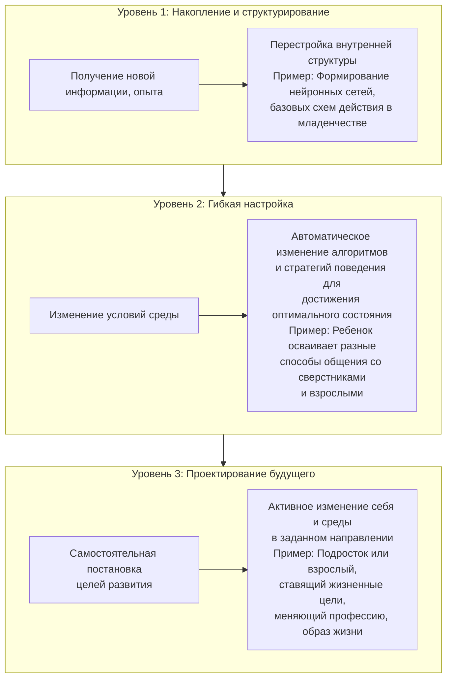

Возрастная психология как самостоятельная научная область возникла следом за экспериментальной психологией. В 1879 году Вильгельм Вундт открыл в Лейпциге первую лабораторию для изучения психических процессов. Уже спустя четыре года, в 1883 году, появилась специализированная лаборатория по изучению детского развития. Эта быстрая преемственность подчеркивает: вопросы о том, как и почему меняется психика человека на протяжении жизни, с самого начала признавались фундаментальными.

**Предмет возрастной психологии** — это изучение **закономерностей психического развития в онтогенезе** и **особенностей развития психики, сознания, личности и деятельности на каждой возрастной стадии**.

Важно провести **водораздел** между близкими дисциплинами. **Психология развития** сосредоточена на **теориях и общих закономерностях**. Она отвечает на вопросы «почему развитие происходит так, а не иначе?» и «какие универсальные механизмы им управляют?». **Возрастная психология**, являясь ее частью, фокусируется на **особенностях** конкретных периодов. Ее задача — составить «психологический портрет возраста», детально описав, что характерно для психики младенца, дошкольника, подростка или взрослого.

Центральное понятие — **онтогенез**, то есть индивидуальное развитие от рождения до завершения жизненного цикла. В биологии онтогенез отсчитывается от зачатия, но в психологической традиции, вслед за Львом Выготским, отправной точкой считается **рождение**. Выготский утверждал, что психическое развитие начинается именно с момента появления на свет, так как оно неразрывно связано с вхождением в мир культуры, языка и социальных отношений. Пренатальный (внутриутробный) период признается важным, но лишь как этап создания биологических **предпосылок** для будущего психического развития.

## Фундаментальные парадоксы развития

Изучение развития сталкивается с вопросами, которые ставят в тупик и стимулируют научный поиск. Эти парадоксы — не просто загадки, а точки роста для самой теории.

**Парадокс беспомощности и могущества.** Новорожденный человек — самое беспомощное существо в природе. Его шансы на выживание без круглосуточной заботы близки к нулю. Физиологически «ближе всего к смерти человек стоит сразу после рождения». Однако этот же беспомощный младенец в зрелости достигает «беспрецедентного могущества» — способности создавать искусство, науку, технологии, преобразовывать планету и осмыслять свое существование. Это радикальное превращение заставляет спросить: является ли исходная биологическая незрелость и беспомощность эволюционной **необходимостью**? Возможно, это «плата» за максимальную пластичность мозга, за открытость к культурному программированию, за возможность стать кем угодно.

**Парадокс стабильной ЦНС и прогрессирующей психики.** В филогенезе (историческом развитии видов) каждый скачок в сложности поведения и психики сопровождался структурными изменениями центральной нервной системы (ЦНС). Однако у человека вида *Homo sapiens* со времен кроманьонца (около 40 000 лет назад) не наблюдается прогрессивных морфологических изменений мозга. Тем не менее, психическое развитие человечества не остановилось: мы наблюдаем прогресс в моторике (спортсмены бьют рекорды), усложнение мышления, возникновение новых форм культуры. Вопрос: **за счет чего** происходит это развитие, если биологический субстрат стабилен? Ответ лежит вне биологии — в социальных, культурных и знаковых системах, которые человек создает и усваивает. Психика развивается не за счет нового «железа», а за счет установки на него все более сложных «программ» — языка, логики, культурных норм.

**Парадокс общения как конституирующей силы.** Это самый драматичный парадокс, подтверждаемый жестокими «экспериментами» судьбы. Что будет, если лишить человека «роскоши человеческого общения» с самого детства? История дает однозначный и пугающий ответ.

## Жестокие «эксперименты» судьбы: дети вне общества

Случаи детей-«маугли» — это натуральные эксперименты, обнажающие суть человеческой природы. Они показывают, что биологического рождения недостаточно, чтобы стать человеком.

**Авейронский дикарь (Виктор, 1798 г.).** В лесах Франции был найден мальчик 10-12 лет, передвигавшийся на четвереньках, не владевший речью и отвечавший рычанием. Врач Жан-Марк Итард, обследовав ребенка, установил: первичный интеллект сохранен, умственной отсталости нет. Задержка в развитии — прямой результат жизни в нечеловеческих условиях. Итард предпринял многолетнюю попытку реабилитации. Виктор научился ходить на двух ногах, пользоваться простыми предметами, понимать и произносить отдельные слова. Однако развитие вскоре застопорилось. Он так и не стал полноценным членом общества, не овладел языком в полной мере, его эмоциональная жизнь осталась крайне бедной.

**Волчьи дети Амала и Камала (Индия, 1920 г.).** Двух девочек, живших в волчьем логове, попытался социализировать миссионер. Результаты были минимальными. Младшая, Амала, вскоре умерла. Камала прожила дольше, но освоила лишь крайне ограниченный набор навыков, ее речь практически не развилась.

**Каспар Хаузер.** Его история — пример не природной, а искусственной изоляции. Предположительно выходец из знатной семьи, он с младенчества содержался в заточении, лишенный контактов. Освобожденный в юношеском возрасте, он демонстрировал глубокие нарушения: не мог говорить, ходил с трудом, его умственное развитие соответствовало уровню маленького ребенка.

**Вывод**, который сформулировал психолог Рене Заззо, становится ключевым: **«Волчонок — всегда волк… Ребенок — только кандидат в человека»**. Для животного принадлежность к виду автоматически гарантирует развитие видовых свойств. Для человека этого недостаточно. Его когнитивные, речевые, личностные свойства **не возникают сами по себе**. Они возникают только в диалоге, в общении с заботящимся взрослым — носителем культуры. **Общение — это не роскошь, а жесткая необходимость**, конституирующая саму человеческую психику.

Даже гипотетический эксперимент «нового Робинзона» — попадание пятилетнего ребенка на необитаемый остров со всеми ресурсами для выживания — приводит ученых к консенсусу: его развитие остановится. Социальная депривация блокирует развитие даже при наличии физического комфорта.

## От хаоса к порядку: синергетический подход в психологии развития

Классические модели развития (эволюционная, детерминистическая, основанная на активности) получают новое осмысление в рамках **синергетического подхода**, основанного на идеях нобелевского лауреата Ильи Пригожина.

Пригожин, физик и химик, предложил **«философию нестабильности»**, которая радикально меняет взгляд на развитие. Ее основные постулаты:

*   **Господство хаоса.** Формой существования сложных систем (включая психику) является не порядок, равновесие или стабильность, а **хаос, нестабильность, неустойчивость**. Порядок — лишь редкий и временный частный случай.
*   **Бифуркация как механизм развития.** В точках максимальной неустойчивости (**бифуркаций**) система оказывается на «развилке». Перед ней открывается веер возможных путей дальнейшей эволюции. Незначительное, случайное событие (флуктуация) в этот момент может направить развитие по принципиально новому, непредсказуемому руслу. В психологии **бифуркация** — это **критический момент, точка принятия решения**, которая кардинально меняет жизненную траекторию. Возрастные кризисы (кризис 3 лет, подростковый кризис, кризис середины жизни) — классические примеры бифуркационных точек.
*   **Неопределенность как пространство свободы.** Пригожин писал: *«Человеческая свобода может иметь смысл только в мире, которым правят не детерминистические законы... Неопределенность служит предпосылкой существования мира людей, мира, где есть место новации, есть место творчеству...»*. Таким образом, хаос и неопределенность — не враги развития, а его необходимое условие, почва для свободы воли и творческого акта.
*   **Самоорганизация.** Порядок и новые сложные структуры могут спонтанно возникать из хаоса и беспорядка в результате внутренних процессов системы, без внешнего управляющего воздействия.

Этот подход объясняет, почему развитие часто носит скачкообразный, непредсказуемый характер и почему в одних и тех же условиях люди могут пойти совершенно разными путями.

## Самоорганизация в развитии психики

Синергетика позволяет выделить уровни сложности развивающихся систем, что напрямую соотносится со становлением психики.

1.  **Самоорганизующаяся система.** Динамическая система, в которой накопление нового опыта (информации) приводит к перестройке ее внутренней структуры. На психологическом уровне это базовая способность к научению и запоминанию, формирование нейронных ансамблей и когнитивных схем в раннем детстве.

2.  **Адаптивная (самоприспосабливающаяся) система.** Система не только меняет структуру, но и **автоматически изменяет алгоритмы своего функционирования и управления**, чтобы сохранить или достичь оптимального состояния в меняющихся внешних условиях. Это уровень гибкого поведения, обратной связи и выбора стратегий. Ему соответствует, например, школьный возраст, когда ребенок осваивает множество социальных и учебных тактик.

3.  **Саморазвивающаяся система.** Высший уровень. Система **самостоятельно выбирает цели своего развития и критерии их достижения**. Она не просто адаптируется, а активно преобразует себя и среду в соответствии с внутренним замыслом. Этап перехода к саморазвивающейся системе в онтогенезе связывают с подростковым возрастом, когда формируется способность к рефлексии, проектированию жизненного пути и сознательной работе над собой.

## Задачи и разделы возрастной психологии

Исходя из своего предмета, возрастная психология решает ряд конкретных задач:
1.  **Изучение общих закономерностей** психического развития в онтогенезе.
2.  **Исследование детерминант (причин и движущих сил)** развития.
3.  **Построение периодизации** психического развития — выделение возрастных стадий.
4.  **Создание «психологического портрета»** каждого возраста.
5.  **Решение практических вопросов:** определение оптимального возраста для начала обучения, возраста ответственности, особенностей развития в зрелости и старости.

Соответственно, курс часто делится на разделы:
*   **Введение:** предмет, задачи, методы (хотя методы исследования могут выноситься за рамки общетеоретического курса).
*   **Детерминанты психического развития:** знакомство с ключевыми теориями, объясняющими движущие силы развития (наследственность, среда, активность субъекта).
*   **Характеристика возрастных стадий:** подробный размотр периода от младенчества до поздней зрелости.

## Запомнить

*   **Предмет:** Возрастная психология изучает **особенности** психики на каждой стадии онтогенеза, в то время как психология развития — **общие закономерности и теории**.
*   **Ключевой парадокс:** Человек начинает жизнь в состоянии **полной беспомощности**, но достигает **культурного могущества**. Развитие психики продолжается при **стабильном мозге** за счет усвоения культурных инструментов.
*   **Роль общения:** **Социальная депривация** фатальна. История детей-«маугли» (Виктор, Амала и Камала) доказывает: ребенок — лишь **кандидат в человека**. Стать человеком можно только через **общение** со взрослым носителем культуры.
*   **Синергетический подход (И. Пригожин):** Развитие происходит не в равновесии, а в **хаосе и нестабильности**. **Бифуркации** (кризисы, точки выбора) — моменты, когда небольшое воздействие может кардинально изменить траекторию развития.
*   **Самоорганизация:** Психическое развитие проходит путь от простого накопления опыта (**самоорганизующаяся система**) через гибкую адаптацию (**адаптивная система**) к высшей форме — **саморазвивающейся системе**, самостоятельно ставящей цели (уровень подростка и взрослого).
*   **Практическая цель:** Понимание закономерностей развития помогает решать вопросы обучения, воспитания, социальной и психологической поддержки человека на всех этапах жизни.
