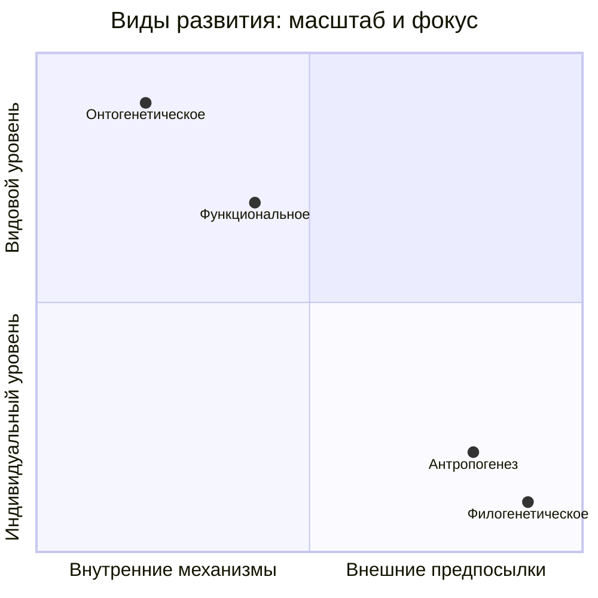
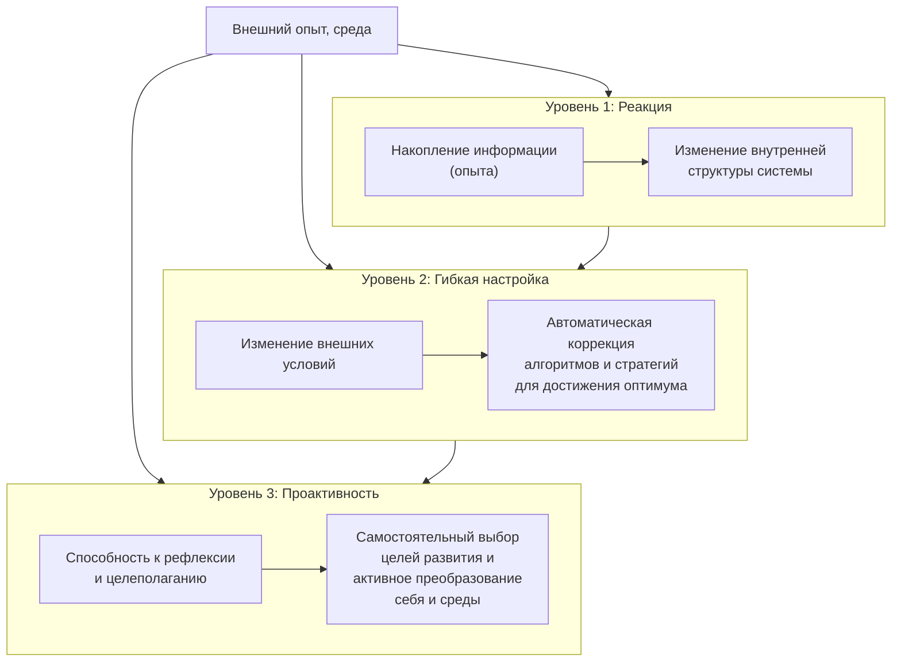

Основная задача возрастной психологии — разобраться в сложной мозаике человеческого развития. Для этого необходимо четко разграничивать, **что именно** развивается и **какими путями**. Наш анализ движется от масштабов эволюции вида к тонким механизмам личностного саморазвития, и на этом пути мы сталкиваемся с ключевыми теоретическими проблемами и практическими вызовами.

## Виды развития: от эволюции вида к становлению личности

Психология развития работает с несколькими принципиально разными масштабами и планами изменений. Их смешение ведет к путанице, поэтому четкое разграничение — первый шаг к пониманию.

### Филогенетическое развитие
Это историческое, **эволюционное развитие вида, рода или другой биологической группы** в масштабах тысяч и миллионов лет. Это процесс, в результате которого формируются биологические предпосылки психики. Для психолога здесь встает фундаментальный вопрос: управляются ли онтогенез (развитие индивида) и филогенез (развитие вида) **одними и теми же законами**? Или это принципиально разные процессы?

### Антропогенез
Это частный, но ключевой случай филогенеза — процесс **становления вида *Homo sapiens***. Результат антропогенеза — кардинальный переход от биологического образа жизни к **социокультурному**. Именно в ходе антропогенеза сформировались видовые свойства человека: прямохождение, развитие кисти руки, возникновение членораздельной речи, сознания, способности к труду и символической деятельности. Эти свойства являются **предпосылкой** для индивидуального развития каждого нового человека, но не гарантируют его.

### Функциональное развитие
Это развитие **отдельных психических функций, процессов или способностей**. Например, развитие памяти от непроизвольной к произвольной и смысловой, развитие мышления от наглядно-действенного к абстрактно-логическому, расширение функций языка. Это развитие «по вертикали» — углубление и усложнение конкретной линии. Здесь возникает важная теоретическая **проблема**: как соотносится функциональный прогресс (скачок в логическом мышлении) с переходом на новую стадию общего онтогенетического развития? Означает ли одно автоматически другое? Единого ответа нет.

### Онтогенетическое развитие
Это комплексное, целостное **индивидуальное развитие человека от рождения до смерти**. Оно интегрирует и синхронизирует все линии функционального развития, добавляя к ним становление личности, самосознания, мировоззрения, жизненного пути. Именно онтогенез является **основным предметом возрастной психологии**.

## Ключевые проблемы психологии развития

Из пересечения этих видов развития рождаются центральные исследовательские проблемы:

1.  **Сравнительное исследование законов развития психики животных и человека.** Действуют ли здесь одни и те же биологические законы, или появление сознания и культуры создало принципиально новую систему развития?
2.  **Исследование видовых свойств человека как результата антропогенеза.** Какие именно новые способности (речь, рефлексия, произвольность) мы приобрели и как они преломляются в жизни индивида?
3.  **Проблема соотношения функционального и онтогенетического развития.** Является ли онтогенез простой суммой развития отдельных функций или нечто большее? Этот вопрос остается открытым и дискутируемым.

## Задачи психологии развития: теория и практика

Работа в этой области ведется по двум основным направлениям: решение фундаментальных теоретических вопросов и ответ на острые социальные запросы.

### Теоретические задачи (основные)
1.  **Изучение общих закономерностей и детерминант.** Выявление универсальных механизмов, причин (наследственность, среда, активность) и последовательностей психического развития.
2.  **Построение периодизации.** Научное обоснование выделения возрастных стадий, определение их границ, центральных новообразований и кризисов перехода.
3.  **Определение соотношения обучения и развития.** Классическая проблема: может ли обучение вести за собой развитие (позиция Л.С. Выготского) или оно лишь следует за естественным созреванием? Какова роль среды в запуске психических процессов?
4.  **Изучение психологических особенностей каждого возраста.** Создание того самого **«психологического портрета возраста»**, который описывает специфику познавательной, эмоционально-волевой сферы, ведущей деятельности и социальной ситуации развития.

### Практические задачи (примеры)
-   Определение **оптимального возраста** для начала систематического школьного обучения.
-   Понимание **различий в обучении** ребенка, подростка и взрослого человека (андрагогика).
-   Установление **возраста ответственности**: гражданской, уголовной, брачной.
-   Разработка программ поддержки развития в зрелом и пожилом возрасте.

## Системы самоорганизации: как психика обретает субъектность

Одним из современных подходов к пониманию механизмов развития является концепция **самоорганизующихся систем**. Она описывает восходящие уровни сложности, которые соответствуют этапам возрастания самостоятельности и субъектности в онтогенезе.

### Уровень 1: Самоорганизующаяся система
Это динамическая адаптивная система, в которой **запоминание информации (накопление опыта) выражается в изменении ее внутренней структуры**. Новая информация не просто добавляется, а перестраивает связи между элементами. На психологическом уровне это соответствует ранним этапам развития, когда впечатления, слова, действия ребенка буквально «формуют» его психику — создают нейронные сети, когнитивные схемы, аффективные паттерны. Система меняется под влиянием среды, но не управляет этим процессом целенаправленно.

### Уровень 2: Адаптивная (самоприспосабливающаяся) система
Это система более высокого порядка. Она не только меняет структуру под влиянием опыта, но и **автоматически изменяет алгоритмы своего функционирования и (иногда) структуру с целью сохранения или достижения оптимального состояния** при изменении внешних условий. Она обладает обратной связью и механизмами саморегуляции. В онтогенезе этот уровень ярко проявляется в младшем и среднем школьном возрасте, когда ребенок осваивает множество гибких стратегий — учебных, коммуникативных, социальных — и учится выбирать их адекватно контексту.

### Уровень 3: Саморазвивающаяся система
Вершина эволюции систем. Это динамическая система, которая **самостоятельно выбирает цели своего развития и критерии их достижения**. Она не просто адаптируется к среде, а активно преобразует и себя, и среду в заданном направлении. Она характеризуется рефлексией, волей и способностью к проектированию будущего. В онтогенезе **переход к саморазвитию происходит примерно в подростковом возрасте**, когда формируется способность ставить долгосрочные жизненные цели, работать над своим характером, сознательно выстраивать траекторию роста. Предпосылки саморазвития, безусловно, формируются раньше.

## Всевозрастной подход Пауля Балтеса: развитие длиною в жизнь

Исторически возрастная психология была по сути **детской психологией**. Период зрелости часто называли «психической окаменелостью», считая, что после юности существенных изменений не происходит. Старость же рассматривалась исключительно как регресс и упадок.

Эта парадигма была пересмотрена во второй половине XX века, во многом благодаря работам **Пауля Балтеса** и сформулированному им **всевозрастному подходу (lifespan approach)**. Его основные принципы стали новой системой координат:

*   **Развитие происходит на протяжении всей жизни.** Не существует периода «окаменелости». Процесс возрастного развития сочетает **количественные (кумулятивные)** изменения (накопление знаний, навыков, опыта) и **качественные (инновационные)** преобразования (появление нового) в любом возрасте.
*   **Многонаправленность развития.** Развитие — это не однонаправленный рост. На любой возрастной стадии одновременно сосуществуют процессы **прогресса (приобретений)** и **регресса (потерь)**. В детстве доминируют приобретения, в старости — потери, но и у подростка что-то утрачивается (детская непосредственность), и у пожилого человека что-то приобретается (мудрость, интеграция опыта).
*   **Развитие как динамика «приобретений-потерь».** Личностный рост следует рассматривать через призму баланса между новыми ресурсами и утратой или трансформацией старых.
*   **Историко-культурная обусловленность (когортные различия).** Развитие человека определяется не только возрастом (нормативные возрастные влияния), но и **историческим временем**, в которое он живет. Поколение, пережившее войну, «дети перестройки» и современные «зумеры» — это разные когорты с уникальным жизненным опытом, ценностями и социальными условиями, накладывающими неизгладимый отпечаток на их развитие.
*   **Контекстуальность.** Развитие есть результат совместного влияния трех групп факторов:
    1.  **Нормативных возрастных** (биологическое созревание, возрастные кризисы).
    2.  **Нормативных исторических** (события, характерные для определенной исторической эпохи, когортные эффекты).
    3.  **Ненормативных (индивидуальных)** (уникальные жизненные события: болезнь, неожиданная встреча, развод, смена профессии).
*   **Междисциплинарность.** Полное понимание развития невозможно без кооперации психологии с **биологией, нейронауками, социологией, антропологией, генетикой, педагогикой**. Необходимо трансдисциплинарное сотрудничество.

## Запомнить

*   **Виды развития:** Важно различать **филогенез** (эволюция вида), **антропогенез** (становление человека), **функциональное развитие** (отдельных способностей) и **онтогенетическое развитие** (целостный жизненный путь индивида).
*   **Ключевые проблемы:** Соотношение законов развития у животных и человека; природа видовых свойств человека; связь функционального прогресса и смены возрастных стадий.
*   **Задачи дисциплины:** Теоретические (закономерности, периодизация, связь обучения и развития, портрет возраста) и практические (определение оптимального возраста для обучения, ответственности и т.д.).
*   **Уровни самоорганизации:** Психика в развитии восходит от **самоорганизующейся системы** (накопление опыта) через **адаптивную систему** (гибкая настройка алгоритмов) к **саморазвивающейся системе** (самостоятельное целеполагание). Переход к саморазвитию происходит в **подростковом возрасте**.
*   **Всевозрастной подход Балтеса:** Развитие **длится всю жизнь**, **многонаправлено** (приобретения + потери), исторически и культурно обусловлено (**когортные различия**), зависит от контекста и требует **междисциплинарного** изучения.
