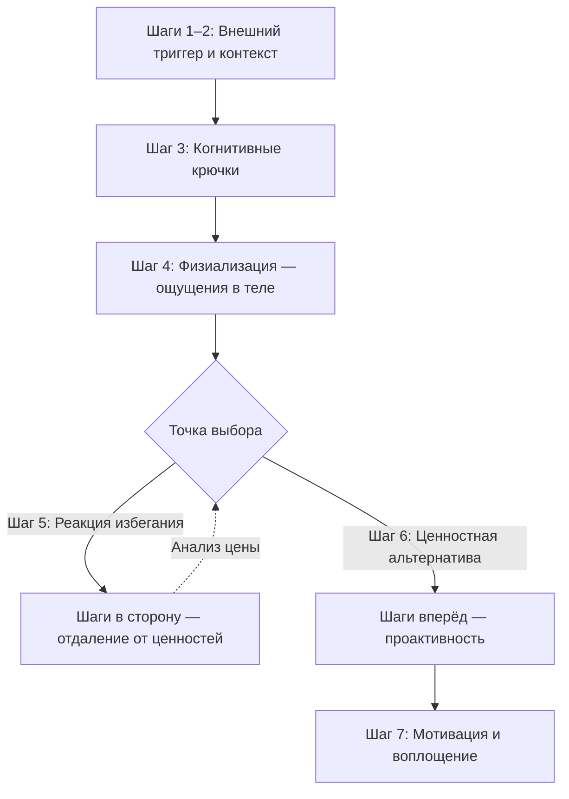

Сталкиваясь с болезненными мыслями или эмоциями, человеческий разум автоматически переходит в режим борьбы или бегства. Люди тратят колоссальное количество энергии на попытки подавить тревогу, доказать внутреннему критику свою правоту или избежать пугающих ситуаций. Эта стратегия даёт краткосрочное облегчение, но в долгосрочной перспективе сужает жизненное пространство и умножает страдания.

Техника **ACT-айкидо** предлагает радикально иной подход к внутреннему дискомфорту. Подобно японскому боевому искусству, этот метод учит не блокировать удар, а использовать энергию нападающего — сложных мыслей и чувств — для сохранения равновесия и выбора осознанного направления *(Бах & Моран, 2021)*. Семишаговый протокол вопросов работает как компас: помогает мгновенно выйти из автоматического транса, оценить ситуацию, найти точку выбора и совершить действие, продиктованное ценностями, а не страхом.

## Сущность и механика ACT-айкидо

ACT-айкидо — это структурированный протокол функционального анализа. Он разрушает автоматическую связь между триггером и реакцией избегания. Семь последовательных вопросов переносят фокус внимания с содержания мыслей («насколько это правда?») на их функцию («куда это меня ведёт?»).

Техника переводит психику из состояния **когнитивного слияния** в состояние осознанного наблюдения. Болезненная эмоция перестаёт восприниматься как приказ к отступлению. Она становится просто контекстом, внутри которого человек осуществляет ценностный выбор *(Бах & Моран, 2021)*.

> Важно: ACT-айкидо — не техника релаксации и не когнитивная реструктуризация. Если применять эти семь вопросов с тайной целью «заставить тревогу уйти», техника теряет эффективность и превращается в изощрённую форму эмпирического избегания *(Хейс, 2020)*.

## Семишаговый протокол

При самостоятельном выполнении фиксируйте ответы письменно. При работе с клиентом задавайте вопросы мягко, выдерживая паузы после каждого ответа.

| Шаг | Вопрос | Цель |
| :--- | :--- | :--- |
| **1. Определение триггера** | С какими проблемами вы столкнулись? | Перевести абстрактную жалобу в конкретный факт. Заземлить внимание на текущей трудности |
| **2. Контекстуализация** | Когда это произошло? Где вы были в тот момент? | Отделить человека от проблемы. Показать, что проблема возникает в конкретном времени и месте, а не является свойством личности |
| **3. Идентификация крючков** | Какие «крючки» вы заметили — мысли, оценки, образы? | Распознать автоматические мысли, которые диктуют поведение. Запустить когнитивное разделение |
| **4. Физиализация** | Как это ощущалось в вашем теле? Где именно? | Перенести фокус с мыслей на чистые телесные ощущения. Снизить сопротивление и дать место эмоции |
| **5. Анализ функции** | И что вы в итоге сделали? | Выявить автоматические «шаги в сторону» (избегание). Увидеть, как попытки избавиться от боли уводят от желаемой жизни |
| **6. Проактивность** | Что бы сделал человек, которым вы хотите быть? Как это выглядело бы со стороны? | Создать альтернативу на основе ценностей. Сформулировать конкретное, видимое извне действие |
| **7. Мотивация и воплощение** | Что для вас важно в том, чтобы продолжать это делать? Как это ощущается в теле прямо сейчас? | Соединить выбранное действие с глубинным смыслом. Найти витальную энергию для трудного шага |

**Инструкции к шагам.** Отвечая на первые два вопроса, избегайте оценок: не «он вёл себя ужасно», а «он сказал мне эти слова». Описывая крючки на Шаге 3, используйте формулировку «у меня появилась мысль, что...». На Шаге 4 концентрируйтесь строго на физике: температура, давление, локализация. Шаг 5 требует предельной честности — укажите, как именно вы пытались заглушить дискомфорт. На Шаге 6 опишите действие так, чтобы его могла снять видеокамера. Формулировка «я бы не кричал» — цель мертвеца, она не подходит. Подходит: «я бы говорил тихим голосом».

## Разбор кейсов: три примера из практики

### Кейс 1: Рик и страх публичных выступлений

**Контекст (Шаги 1–2).** Рик — молодой специалист с социальной тревожностью. Пятница, вечернее рабочее собрание. Рик хотел предложить проект, над которым думал целый год.

**Крючки и тело (Шаги 3–4).** У Рика возникла мысль: «Я буду выглядеть как полный идиот». Тело отреагировало дрожью в руках, покрасневшим лицом и пустотой в голове.

**Избегание (Шаг 5).** Рик решил держать рот на замке. Когда босс задал вопрос — пробормотал бессвязное. Позже коллега Адам предложил тот же самый проект. Придя домой, Рик покурил марихуану, чтобы отключиться от стыда.

**Анализ цены.** Избегание дало краткосрочное снижение тревоги. В долгосрочной перспективе Рик упустил возможность проявить себя, усилил чувство некомпетентности и нарушил своё обещание не курить *(Бах & Моран, 2021)*.

**Ценностная альтернатива (Шаги 6–7).** Человек, которым Рик хочет быть, говорит на собраниях, даже когда голос дрожит. Конкретный шаг вперёд: «Подниму руку и скажу первые три слова — остальное придёт само».

---

### Кейс 2: Энди и критика отца

**Контекст (Шаги 1–2).** Энди, восемнадцатилетний продавец бакалейной лавки. Отец публично критиковал его выбор и действия.

**Крючки и тело (Шаги 3–4).** Энди ощутил унижение и раздражение. Сердце бешено колотилось, появился выброс адреналина, напряжение в области шеи и плеч.

**Избегание (Шаг 5).** Энди попытался контролировать гнев через агрессию: попросил отца «заткнуться», обозвал его, съехал жить к другу, много курил и сплетничал об отце среди знакомых.

**Ценностная альтернатива (Шаги 6–7).** В ходе терапии Энди осознал: он не может контролировать слова отца, но может выбирать свою реакцию. Человек, которым он хотел бы быть, позволил бы этим словам звучать — не реагируя агрессией. Энди научился замечать раздражение в теле и позволять ему быть, не превращая его в топливо для разрушения отношений *(Маккей и др., 2026)*.

---

### Кейс 3: Сьюзан и хроническая боль

**Контекст (Шаги 1–2).** Сьюзан живёт с постоянными хроническими болями. Повседневная жизнь, семья, карьера.

**Крючки и тело (Шаги 3–4).** Физическая боль. Убеждения-крючки: «Я слишком толстая», «Слишком стара для образования», «Сначала нужно полностью избавиться от боли — потом начну жить».

**Избегание (Шаг 5).** Сьюзан брала больничные, избегала физической активности, отказывалась от близости с мужем, изолировалась от друзей, постоянно отдыхала.

**Анализ цены.** Попытки контролировать боль привели к тотальному отдалению от жизненных намерений. Она потеряла связь с детьми, мужем и профессией — при этом боль никуда не исчезла.

**Ценностная альтернатива (Шаги 6–7).** Терапия перенаправила внимание Сьюзан: готовность действовать в направлении семьи и образования *вместе с болью*, а не после её исчезновения *(McCracken, n.d.)*.

## Глубокий анализ: пять оснований

**Конечная цель — психологическая гибкость и витальность.** Наш «пещерный разум» запрограммирован избегать угроз *(Хейс, 2020)*. Если лев рычит — мы убегаем. Применяя эту же логику к собственным эмоциям (убегая от стыда или страха), мы сужаем свою жизнь. ACT-айкидо учит человека становиться самодостаточным архитектором своей судьбы — способным двигаться к целям даже в присутствии внутренней боли *(Бах & Моран, 2021)*.

**Суть изменения — не содержание, а контекст.** Техника не меняет *содержание* мыслей. Рика не убеждают в том, что он умный. Она меняет *контекст* восприятия мыслей *(Бах & Моран, 2021)*. Задавая вопросы о теле и ценностях, протокол осуществляет возмущение дезадаптивной системы. Человек перестаёт быть жертвой симптома и становится наблюдателем, который замечает автоматическую цепочку и делает осознанный выбор.

**Научное основание — Теория реляционных фреймов.** Согласно ТРФ, язык позволяет нам связывать объекты и эмоции произвольным образом *(Торнеке, 2019)*. Слово «провал» способно вызывать такую же физиологическую панику, как реальная физическая угроза. Прямая когнитивная реструктуризация часто неэффективна: попытка оспорить мысль только придаёт ей больше значимости. ACT-айкидо использует дефузию — вопросы протокола превращают пугающие концепции в простой набор звуков или телесных вибраций, лишая их функции приказа.

**Механизм разрыва паттерна.** Когда возникает триггер, разум мгновенно подкидывает «крючок» и диктует поведение. Вопрос «Как это ощущалось в теле?» прерывает интеллектуализацию и возвращает человека в настоящий момент. Вопрос «Что вы сделали?» активирует **креативную безнадежность** — осознание тщетности контроля. Финальные вопросы о ценностях активируют систему позитивного подкрепления, создавая мотивацию для нового, трудного, но осмысленного поведения.

**Типичные ошибки.** Первая — интеллектуализация. Клиент правильно отвечает на все вопросы, но использует ценности как хитрый способ избавиться от тревоги: «Я буду хорошо общаться с мужем, чтобы перестать бояться отвержения». Это подменяет принятие скрытым избеганием *(Хэррис, 2020)*. Вторая — «цели мертвеца» на Шаге 6: «Человек, которым я хочу быть, не нервничал бы». Терапевт должен возвращать клиента к реальности: мы не можем контролировать появление чувств, мы можем контролировать только движение рук и ног *(Бах & Моран, 2021)*.

### Заключение и Литература

ACT-айкидо — это не попытка стать бесчувственным или непробиваемым. Это навык использовать энергию дискомфорта как информацию о ценностях, а не как команду к отступлению. Практикующий, освоивший семь вопросов, превращает каждый эмоциональный шторм в точку выбора: «Я двигаюсь туда, куда меня тянет боль, или туда, куда меня зовут ценности?»

- Бах, П. А., & Моран, Д. Дж. (2021). *ACT на практике. Концептуализация случаев в терапии принятия и ответственности*. Диалектика.
- Маккей, М., Айферт, Г., Форсайт, Д., & Хейс, С. С. (2026). *Гнев без разрушений. Главная книга по управлению сильными эмоциями по методу ACT*. МИФ.
- McCracken, L. M. (n.d.). *ACT for Chronic Pain*.
- Торнеке, Н. (2019). *Теория реляционных фреймов в клинической практике*.
- Хейс, С. С. (2020). *Освобожденный разум. Как побороть внутреннего критика и повернуться к тому, что действительно важно*. Эксмо.
- Хэррис, Р. (2020). *Ловушка счастья. Перестаем переживать — начинаем жить*. Бомбора.

---

**Микро-действие (5 минут).** Возьмите лист бумаги прямо сейчас. Вспомните одну неприятную ситуацию за последние 24 часа и запишите триггер. Ниже запишите мысль-крючок, которая у вас возникла («Я не справлюсь», «Они меня не уважают»). Затем напишите, какое действие вы совершили, чтобы заглушить это чувство (скроллинг телефона, переедание, резкий ответ). Посмотрите на этот треугольник. Скажите вслух: «Я замечаю, что мой разум поймал меня на крючок, и я сделал шаг в сторону». Это осознание — первый шаг к айкидо.

**Проверка понимания.** Анна готовится к важному собеседованию. Утром она чувствует сильную тошноту и сдавленность в груди. В голове крутится мысль: «Я провалюсь и буду выглядеть жалко». Чтобы справиться, она выпивает успокоительное и звонит рекрутеру, говоря, что заболела. При этом развитие в карьере — одна из её ключевых ценностей.

Проведите Анну через протокол ACT-айкидо. На какой из семи вопросов отвечает действие «позвонить рекрутеру и сказать, что заболела»? Какой конкретный «шаг вперёд» (Шаг 6) вы бы предложили ей сформулировать — так, чтобы его могла снять видеокамера?
