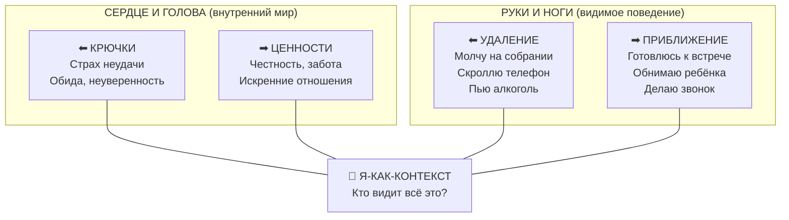

В момент острого стресса сложная теория гексафлекса вылетает из головы. Человек не может вспомнить, какой из шести процессов нужно применить, когда его захлёстывают эмоции. Разум использует саму теорию терапии как новый повод для интеллектуальных споров, парализуя способность действовать.

**Матрица ACT** — это визуальный инструмент из двух пересекающихся осей, который мгновенно переводит все концепции Терапии принятия и ответственности в интуитивно понятный формат *(Хейс, 2020)*. Вместо шести терминов — одна простая развилка: «Я сейчас двигаюсь влево (от боли) или вправо (к ценностям)?» Матрица буквально вытаскивает человека из головы в реальный мир. Она помогает за несколько минут визуализировать внутренний хаос, отделить реальные факты от страхов и вернуть контроль над собственными руками и ногами.

## Анатомия координатной сетки

Матрица строится на пересечении двух линий, образующих четыре квадранта и центр *(Хейс, 2020)*:

**Вертикальная ось (Внутреннее — Внешнее).** Нижняя часть представляет «Сердце и Голову» — невидимые для других мысли, чувства, страхи и ценности. Верхняя часть — «Руки и Ноги» — явные физические действия, которые могут увидеть окружающие.

**Горизонтальная ось (Удаление — Приближение).** Левая сторона — движение *от* нежелательных переживаний (избегание). Правая — движение *к* тому, что действительно важно (ценности).

**Центр.** Точка пересечения символизирует **Я-как-контекст** — трансцендентное наблюдающее «Я», которое осознаёт всё происходящее во всех квадрантах *(Хейс, 2020)*.

| Квадрант | Вопрос | Примеры |
| :--- | :--- | :--- |
| **Низ-Право** — Внутреннее приближение | Кто и что мне действительно важно? Каким человеком я хочу быть? | Радость от помощи людям, честность, любовь к семье |
| **Низ-Лево** — Внутреннее удаление | Какие мысли, страхи и воспоминания меня цепляют? | Страх показаться глупым, обида, неуверенность |
| **Верх-Лево** — Внешнее удаление | Что делают мои руки и ноги, когда я убегаю от боли? | Молчание на совещании, скроллинг соцсетей, алкоголь |
| **Верх-Право** — Внешнее приближение | Что я делаю, когда двигаюсь навстречу ценностям? | Подготовка к встрече, обнять ребёнка, сделать звонок |

## Как Матрица разрушает иллюзию причинности

Клиент говорит: «Я не пошёл на собеседование, потому что у меня низкая самооценка». Разум склеивает внутреннее чувство и внешнее действие в единый неразрешимый ком. Матрица физически разрушает эту связь, помещая самооценку *внизу*, а поход на собеседование *наверху* *(Хейс, 2020)*.

Клиент на собственном опыте видит: это разные плоскости. Страх находится внизу слева, а способность действовать — вверху справа. Ему не нужно уничтожать свои мысли внизу, чтобы его руки и ноги двигались вправо-вверх.

> Матрица не обещает избавления от боли. Она гарантирует, что даже с этой болью вы сможете двигаться в сторону того, что для вас по-настоящему важно.

Важно понять границы инструмента. Матрица — не техника когнитивной реструктуризации. Человек не использует правую сторону, чтобы стереть левую. Если клиент применяет Матрицу ради избавления от тревоги — инструмент перестаёт работать. Единственная цель Матрицы — расширение поведенческого репертуара в присутствии дискомфорта *(Хейс и др., 2021)*.

## Пошаговый алгоритм заполнения

Матрица заполняется последовательно, начиная с правого нижнего квадранта — против часовой стрелки *(Хейс, 2020)*. Стивен Хейс рекомендует использовать глаголы для описания действий и конкретные существительные для описания чувств.

| Шаг | Квадрант | Вопрос | Цель |
| :--- | :--- | :--- | :--- |
| **1** | Низ-Право / Ценности | Кто и что для меня действительно важно? Каким человеком я хочу быть? | Найти внутренние мотиваторы за пределами социальных ожиданий |
| **2** | Низ-Лево / Крючки | Какие мысли, воспоминания и страхи меня цепляют и тянут прочь? | Вывести «Внутреннего Диктатора» на чистую воду. Назвать страхи своими именами |
| **3** | Верх-Лево / Избегание | Что делают мои руки и ноги, когда я убегаю от этих чувств? | Зафиксировать физические действия (молчание, прокрастинация). Увидеть цену борьбы с эмоциями |
| **4** | Верх-Право / Проактивность | Что я сделаю прямо сейчас, чтобы двигаться к ценностям? Как это будет выглядеть со стороны? | Сформулировать конкретные действия, видимые на видеокамере |
| **5** | Центр / Наблюдение | Кто видит все эти ответы? Заметьте свою способность выбирать направление прямо сейчас. | Установить контакт с Я-как-контекстом. Почувствовать свободу выбора |

**Инструкция по Шагу 3 (Избегание).** Записывайте только то, что могла бы снять видеокамера. «Кричу» — подходит. «Чувствую злость» — нет. «Скроллю телефон» — подходит. «Испытываю тревогу» — нет. Встаньте в позицию любопытного учёного. Не осуждайте себя за левую сторону матрицы — она естественна для любого человека *(Хейс и др., 2021)*.

## Разбор кейсов: три примера из практики

### Кейс 1: Недооценённый сотрудник

**Контекст.** Обычный сотрудник испытывает фрустрацию на работе. Он чувствует себя недооценённым и теряет мотивацию.

**Заполнение Матрицы:**

- *Ценности:* Радость от помощи клиентам. Удовлетворение от честности и искренности.
- *Крючки:* Обида, потому что коллеги не замечают усилий. Страх показаться глупым. Неуверенность в собственных способностях.
- *Шаги в сторону:* Молчание на собраниях. Сплетни в кулуарах. Сознательное уклонение от ответственности.
- *Шаги вперёд:* Подготовка к предстоящему собранию. Внесение конкретных предложений. Искреннее внимание к идеям других сотрудников.

**Результат.** Заполнение Матрицы позволило сотруднику выйти из позиции жертвы. Он обратил внимание на то, кто видит все эти реакции (Наблюдающее Я). Осознание своих избегающих действий помогло ему выбрать поведение, соответствующее ценностям, несмотря на страх.

### Кейс 2: Вспышка Эбола в Сьерра-Леоне

**Контекст.** В разгар эпидемии Эболы в Африке традиционные похоронные ритуалы стали смертельно опасными. Местные обычаи требовали омовения тел умерших. Это приводило к массовым заражениям. Запреты властей игнорировались.

Представители сообщества ACT применили Матрицу для работы с целыми деревнями *(Хейс, 2020)*. Жителей попросили заполнить квадранты:

- *Ценности:* Почтение к умершим близким. Уважение традиций. Любовь к семье.
- *Крючки:* Горе. Страх нарушить обычаи. Страх перед болезнью.
- *Шаги в сторону:* Тайное омовение тел (попытка снизить тревогу нарушения традиций, ведущая к заражениям).
- *Шаги вперёд:* Поиск альтернативных способов выразить любовь к умершим без физического контакта.

**Результат.** Жители осознали, что их действия продиктованы страхом, но ведут к разрушению общины. Матрица помогла им придумать безопасные способы почтения умерших. Это остановило распространение вируса *(Хейс, 2020)*. Этот пример доказывает: Матрица работает как для одного сотрудника, так и для спасения целых популяций.

### Кейс 3: Предприниматель Майкл — выгорание и правило «делай всё сам»

**Контекст.** Успешный 27-летний предприниматель Майкл страдал от «утреннего тумана», плохо спал и не занимался спортом. Его здоровье ухудшалось, хотя бизнес шёл хорошо.

**Анализ через Матрицу:**

- *Ценности:* Эффективность, успех, забота о деле.
- *Крючки:* Семейное правило «делай всё сам». Стыд просить о помощи. Тревога за бизнес.
- *Шаги в сторону:* Употребление фастфуда. Отказ от тренировок. Изоляция от людей.
- *Шаги вперёд:* Делегирование задач. Найм личного тренера. Заказ доставки здорового питания.

**Результат.** Майкл увидел, что правило «справляйся сам» превратилось в крючок, уводящий его от здоровья. Терапевт помог ему перенести ценность «бизнес-эффективности» на физическое состояние. Майкл совершил шаг вперёд: нанял тренера и передал часть задач команде.

## Ловушки при работе с Матрицей

**Попытка «стереть» левую сторону.** Клиент говорит: «Я просто вычеркну свои страхи из Матрицы». Нервная система работает только на прибавление, а не на вычитание *(Хейс и др., 2021)*. Попытка стереть нижнюю левую часть лишь плодит новые избегающие действия в левой верхней. Суть Матрицы — *нести* всю нижнюю часть с собой, двигаясь вправо-вверх.

**Позитивное слияние.** Клиент заполняет правый верхний квадрант глобальными невыполнимыми целями: «Стану идеальным работником» или «Никогда не допущу ни одной ошибки». Терапевту необходимо вернуть фокус на конкретные микро-действия (Руки и Ноги), которые можно выполнить прямо сейчас.

**Цели мертвеца.** Клиент пишет в Шагах вперёд: «Я не буду кричать на детей». Мертвецы тоже не кричат. Матрица требует живых, активных действий: «Я буду говорить спокойным голосом». Терапевт должен следить за тем, чтобы ценностные действия не подменялись скрытым избеганием *(Хейс и др., 2021)*.

**Использование Матрицы ради избавления от тревоги.** Клиент решает: «Я буду заниматься спортом, чтобы перестать чувствовать тревогу». Это тупик. Действия, направленные на подавление эмоций, являются шагами в сторону, даже если они выглядят социально одобряемыми.

## Теоретические основания

**Эволюционный смысл.** Человеческий разум в ходе эволюции научился блестяще решать проблемы физического мира. Если идёт дождь — мы строим крышу. Однако разум применяет эту же логику к внутреннему миру: он приказывает нам избегать тревоги так же, как мы избегаем хищников *(Хейс, 2020)*. Матрица эволюционно перепрограммирует этот механизм. Человек учится быть «шахматной доской», на которой борются чёрные и белые фигуры (мысли), а не одной из фигур.

**Научное обоснование.** Матрица опирается на **Теорию реляционных фреймов** (ТРФ). Согласно ТРФ, люди страдают из-за способности языка устанавливать произвольные связи между объектами и эмоциями *(Торнеке, 2019)*. Человек способен бояться слова «провал» так же сильно, как реальной физической угрозы. Матрица работает в обход прямого оспаривания: она меняет не *содержание* мыслей, а *контекст* их восприятия. Разделяя лист на внутреннее и внешнее, инструмент запускает процесс когнитивного разделения (делитерализации). Мысли из приказов превращаются просто в события на бумаге.

### Заключение и Литература

Матрица ACT превращает сложную теорию психологической гибкости в мгновенно доступный навигационный инструмент. Заполнив её один раз с терапевтом, клиент может в любой трудный момент вызвать в памяти образ координатной сетки и мысленно пройтись по квадрантам. Матрица не делит мир на «правильное» и «неправильное» — она подсвечивает, где человек находится прямо сейчас, и возвращает ему ответственность за выбор направления.

- Торнеке, Н. (2019). *Теория реляционных фреймов в клинической практике*.
- Хейс, С. С. (2020). *Освобожденный разум. Как побороть внутреннего критика и повернуться к тому, что действительно важно*. Эксмо.
- Хейс, С. С., Штросаль, К. Д., & Уилсон, К. Г. (2021). *Терапия принятия и ответственности. Процессы и практика осознанных изменений* (2-е изд.). Диалектика.
- Хэррис, Р. (2022). *Ловушка счастья. Перестаем переживать — начинаем жить*. Бомбора.

---

**Микро-действие (5 минут).** Возьмите лист бумаги и нарисуйте крест, разделив его на четыре части. Выберите одну небольшую проблему, которая беспокоит вас сегодня. Заполните только нижний левый квадрант («Крючки»): выпишите 3–4 мысли, которые разум подкидывает вам прямо сейчас. Просто посмотрите на них. Скажите вслух: «Я замечаю, что мой разум предлагает мне эти мысли». Обратите внимание, как дистанция снижает их власть над вами.

**Проверка понимания.** Анна боится публичных выступлений. Завтра ей предстоит презентация. Она чувствует сильную тошноту и панику. Чтобы справиться, она решает выпить бокал вина перед сном и сказать на работе, что у неё пропал голос, чтобы отменить выступление. При этом Анна очень хочет стать руководителем отдела и развивать лидерские качества.

Распределите опыт Анны по четырём квадрантам Матрицы. В каком квадранте находится «бокал вина»? Является ли запись «не буду нервничать на презентации» подходящим шагом вперёд — и если нет, как бы вы её переформулировали?
