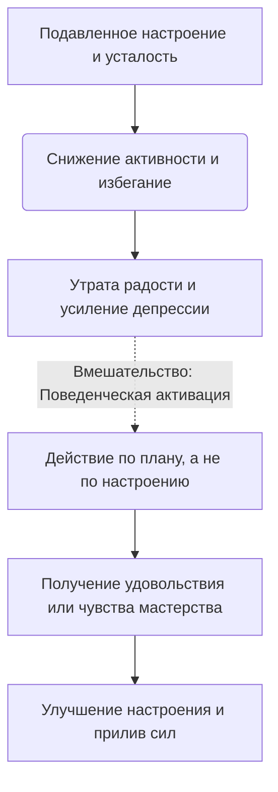

Когда нас накрывает депрессия, сильный стресс или апатия, естественным желанием становится спрятаться от мира. Мы откладываем дела, перестаем общаться с друзьями и часами лежим в постели, надеясь, что как только к нам вернется энергия и хорошее настроение, мы снова начнем жить нормальной жизнью. Однако ожидание мотивации становится ловушкой: бездействие лишь лишает нас последних сил и углубляет отчаяние.

Чтобы разорвать этот замкнутый круг, когнитивно-поведенческая терапия предлагает мощный инструмент, который переворачивает привычную логику с ног на голову. Он учит нас не ждать вдохновения, чтобы начать действовать, а использовать само действие как источник энергии и радости.

## Запуск двигателя жизни: Определение и польза

**Поведенческая активация** — это набор структурированных процедур и техник, направленных на планомерное увеличение вовлеченности человека в виды деятельности, приносящие чувство радости, компетентности и смысла *(Кантер и др., 2021)*. Это один из самых мощных поведенческих методов в арсенале психотерапии *(Cully et al., 2020)*.

Главная задача этого инструмента — помочь человеку вновь начать получать **позитивное подкрепление** (вознаграждение от окружающей среды, повышающее вероятность повторения полезного поведения) *(Кантер и др., 2021)*. Депрессия заставляет нас отказываться от активности, что лишает нас естественных жизненных поощрений; поведенческая активация возвращает нас в среду, где эти поощрения возможны, запуская механизм выздоровления *(Добсон и Добсон, 2021)*. Систематическое возвращение активности дает возможность снова почувствовать контроль над своей жизнью и разорвать изоляцию *(Cully et al., 2020)*.

## Архитектура активации: Действие «снаружи внутрь»

Архитектура поведенческой активации строится на трех ключевых направлениях:

1. **Поиск удовольствия:** Возвращение к прежним хобби или внедрение новых приятных занятий (например, вкусный кофе или прогулка) *(Добсон и Добсон, 2021)*.
2. **Достижение мастерства:** Выполнение задач, которые дают чувство завершенности и продуктивности (например, стирка или оплата счетов) *(Добсон и Добсон, 2021)*.
3. **Сокращение избегания:** Отказ от привычки прятаться от сложных эмоций за пассивностью *(Cully et al., 2020)*.

**Механика работы (Под капотом):** Большинство людей полагают, что изменения должны происходить «изнутри наружу» — сначала я почувствую себя лучше, а затем начну что-то делать *(Кантер и др., 2021)*. Поведенческая активация работает строго по принципу «снаружи внутрь» *(Кантер и др., 2021)*. Тяжелые эмоции диктуют нам **избегание** (отказ от выполнения действий из-за страха, усталости или дискомфорта) *(Cully et al., 2020)*. Выполняя запланированное действие вопреки отсутствию желания, нервная система получает новый опыт успеха или удовольствия, что естественным образом «перезапускает» выработку энергии и улучшает настроение *(Cully et al., 2020)*.

## Ментальные модели и границы: Ожидание автобуса, а не вдохновения

**Аналогия (Автобусная остановка / Завод автомобиля):** Представьте, что вы стоите на улице и ждете, когда появится мотивация пойти на работу. Это звучит абсурдно, ведь на работу мы ходим потому, что это необходимо *(Лихи, 2019)*. В депрессии мы часто ждем «настроения», чтобы помыть посуду. Поведенческая активация учит относиться к делам как к автобусу — мы просто садимся и едем по маршруту. Или представьте автомобиль с разряженным на морозе аккумулятором. Чтобы завести машину, ее нужно сначала «подтолкнуть» вручную (совершить физическое действие без внутренней энергии). Как только колеса закрутятся, генератор начнет вырабатывать ток, и двигатель заведется сам. Поведенческая активация — это и есть тот самый первоначальный ручной толчок.

**Чем это не является:** Поведенческую активацию часто путают с простым советом «развеяться» или суетливой занятостью.

| Суетливая занятость / Токсичный позитив (Ошибки) | Поведенческая активация (Здоровый подход) |
| :--- | :--- |
| **Поиск гедонизма:** Попытка просто «заглушить» грусть случайными развлечениями без смысла *(Кантер и др., 2021)*. | **Опора на ценности:** Выбор занятий, основанный на ваших личных ценностях и целях *(Cully et al., 2020)*. |
| **Избыточная нагрузка:** Попытка в первый же день сделать генеральную уборку всего дома и последующее чувство вины. | **Планомерность:** Постановка крошечных, посильных задач, шансы на выполнение которых максимальны *(Добсон и Добсон, 2021)*. Действия целенаправленно делятся на приносящие удовольствие и дающие чувство мастерства *(Hool, 2010)*. |

## Практическое руководство: От плана к энергии

Рассмотрим, как этот инструмент меняет состояние в клинической практике:

*   **Ситуация — Действие — Результат (Депрессия):** Хелен потеряла работу и перестала вставать с кровати.
    *   *Действие:* Терапевт назначил простую активацию: 20 минут ежедневных танцев (старое хобби) и звонки друзьям *(Кантер и др., 2021)*.
    *   *Результат:* Начав делать это без желания, она быстро восстановила контакт с позитивным подкреплением, и ее депрессия начала отступать *(Кантер и др., 2021)*.
*   **Ситуация — Действие — Результат (Тревога и прокрастинация):** Девушка избегала разбора накопившихся писем.
    *   *Действие:* Она установила цель «мастерства»: сортировать почту ровно 10 минут *(Cully et al., 2020)*.
    *   *Результат:* Выполнение этой небольшой задачи дало ей чувство контроля и резко снизило тревогу.

**Пошаговый алгоритм внедрения:**
1. **Мониторинг:** В течение нескольких дней ведите дневник активности, записывая, что вы делаете каждый час, и оценивая настроение от 0 до 10 *(Hool, 2010)*.
2. **Определите ценности и цели:** Составьте список занятий, приносящих радость (удовольствие), и дел, которые необходимо выполнить (мастерство) *(Cully et al., 2020)*.
3. **Разработайте план действий:** Выберите одну небольшую задачу, запланируйте время и место. Крайне важно разбивать сложные дела на крошечные, выполнимые шаги (по 5-10 минут) *(Cully et al., 2020)*.
4. **Оцените барьеры:** Подумайте, что может вам помешать, и заранее придумайте запасной план *(Cully et al., 2020)*.
5. **Оцените до и после:** Оцените уровень энергии до начала дела и после его завершения. Вы заметите, что мотивация часто появляется *в процессе* деятельности *(Добсон и Добсон, 2021)*.

*Типичная ловушка:* Планирование слишком амбициозных целей (например, «ходить в спортзал каждый день»). Если вы пропустите хотя бы один день, это вызовет чувство вины *(Cully et al., 2020)*. В поведенческой активации успех измеряется самим фактом приложенных усилий, а не идеальным результатом *(Добсон и Добсон, 2021)*. Начинайте с малого.

## Действие вопреки апатии ради возвращения себя

Разорвать гравитацию депрессии или сильной тревоги невероятно сложно. Когда нервная система истощена, каждый инстинкт кричит о необходимости оставаться в постели и избегать контактов с внешним миром. Ваш мозг будет отговаривать вас, генерируя мысли о бессмысленности попыток. Отказ подчиняться этим импульсам требует колоссальной внутренней дисциплины. Изначально вам придется вкладывать значительные волевые усилия просто в то, чтобы встать, одеться или сделать короткий звонок, действуя «через не хочу» и не испытывая радости в процессе.

Однако эти методичные шаги навстречу жизни неизбежно приносят свои плоды. Понимая, что мотивация — это следствие, а не причина активности, вы перестаете быть заложником усталости и апатии. Возврат к планомерной активности восстанавливает самоуважение и помогает нервной системе вновь начать получать естественные вознаграждения от внешнего мира. Вы возвращаете себе право управлять собственной жизнью, опираясь на свои ценности, а не на временные колебания настроения.

## Главный вывод и литература

> Поведенческая активация доказывает: нам не нужно дожидаться правильного настроения, чтобы начать жить. Начиная совершать даже самые крошечные, но осмысленные действия по плану, мы постепенно разжигаем внутри себя искру мотивации и энергии.

**Источники:**
* *Бек, Дж. С. (2021). Когнитивно-поведенческая терапия. От основ к направлениям (3-е изд.).*
* *Добсон, Д., & Добсон, К. (2021). Научно-обоснованная практика в когнитивно-поведенческой терапии. Питер.*
* *Кантер, Дж. У., Буш, Э. М., & Руш, Л. К. (2021). Поведенческая активация: отличительные особенности. ООО "Диалектика".*
* *Лихи, Р. (2018). Лекарство от нервов. Как перестать волноваться и получить удовольствие от жизни.*
* *Лихи, Р. (2019). Терапия эмоциональных схем.*
* *Cully, J. A., Dawson, D. B., Hamer, J., & Tharp, A. L. (2020). A Provider’s Guide to Brief Cognitive Behavioral Therapy. Department of Veterans Affairs South Central MIRECC.*
* *Hool, N. (2010). BABCP Core Curriculum Reference Document. British Association for Behavioural & Cognitive Psychotherapies.*
* *Hopko, D. R., Lejuez, C. W., Ruggiero, K. J., & Eifert, G. H. (2003). Contemporary behavioral activation treatments for depression: Procedures, principles, and progress. Clinical Psychology Review, 23(5), 699-717.*

---

### Проверка понимания (Микро-кейс)

**Ситуация:** Дмитрий переживает глубокую депрессию и не выходит из дома уже две недели. Прочитав про поведенческую активацию, он решает кардинально изменить жизнь и ставит себе план: «С завтрашнего дня я буду бегать по 10 километров каждое утро и проводить по 3 часа за изучением нового языка». На второй день Дмитрий просыпается полностью разбитым, не может заставить себя надеть кроссовки, чувствует острую вину и решает, что «эта техника на нем не работает».

**Вопрос:** Какую критическую ошибку в планировании совершил Дмитрий, учитывая принципы поведенческой активации? Как именно ему следовало бы переформулировать свой план действий на первую неделю, чтобы повысить шансы на успех?
