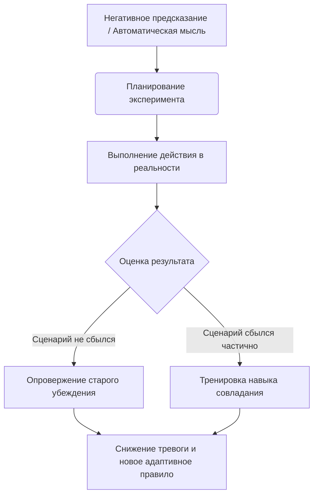

Часто мы оказываемся в ловушке собственных мыслей, парализованные страхом перед тем, что *может* произойти. Мы раз за разом прокручиваем в голове негативные сценарии, пытаясь логически переубедить себя. Однако одна лишь логика редко способна победить глубоко укоренившуюся тревогу — мышление ходит по кругу, пока не столкнется с реальностью.

Именно для выхода из этого замкнутого круга используется поведенческий эксперимент. Этот инструмент позволяет безопасно выйти за пределы своих страхов и на практике проверить, действительно ли мир так опасен, как рисует наше воображение. Он превращает нас из пассивных пленников тревоги в активных исследователей собственной жизни.

## Тестирование реальности: Что такое и зачем это нужно

**Поведенческий эксперимент** — это запланированное действие, направленное на проверку достоверности пугающей мысли или убеждения в реальном мире *(Бек, 2020)*. Это фундаментальный инструмент когнитивно-поведенческой терапии, при котором вы выступаете в роли ученого, тестирующего свои гипотезы *(Bentley et al., 2021)*.

Его главная утилитарная функция заключается в мощнейшем разрушении старых шаблонов мышления. Разговоры и логический анализ полезны, но правильный практический опыт опровергает дисфункциональные ожидания гораздо быстрее и убедительнее, чем любые слова *(McManus et al., 2012)*. Эксперимент нужен для того, чтобы ваш мозг получил неоспоримые физические доказательства вашей безопасности и компетентности.

## Архитектура открытий: Три элемента и механика работы

Фундамент любого грамотного эксперимента всегда опирается на три обязательных компонента:

1. **Предсказание (Гипотеза):** Четкое формулирование того, чего именно вы боитесь (например, «Если я попрошу о помощи, надо мной посмеются») *(Bentley et al., 2021)*.
2. **Действие (Тест):** Конкретный, заранее спланированный шаг, который вы совершаете, чтобы бросить вызов этому предсказанию *(Бек, 2020)*.
3. **Анализ (Вывод):** Сопоставление того, что вы ожидали, с тем, что произошло на самом деле, с последующим извлечением нового адаптивного правила *(Бек, 2020)*.

**Механика работы (Под капотом):** Нашим поведением часто управляют **автоматические мысли** (быстрые, спонтанные и часто искаженные суждения, возникающие в ответ на ситуацию) *(Bentley et al., 2021)*. Тревога всегда питается избеганием. Когда вы избегаете пугающей ситуации, ваш мозг делает ошибочный вывод: «Мы выжили только потому, что не пошли туда». Эксперимент искусственно создает безопасное столкновение вашего страха с реальностью. Когда предсказанная катастрофа не происходит, возникает несоответствие ожиданиям, которое заставляет нейронные сети переписывать старые убеждения и снижать уровень тревоги *(Добсон и Добсон, 2021)*.

## Лаборатория жизни: Краш-тест для убеждений

**Аналогия (Краш-тест автомобиля):** Представьте, что инженеры создали новые ремни безопасности. Они могут годами сидеть над чертежами и математически доказывать, что ремни надежны (это аналог логических рассуждений на сессии). Но настоящая уверенность появится только тогда, когда они посадят манекен в машину и разобьют ее о стену в лаборатории. Поведенческий эксперимент — это ваш личный краш-тест, проводимый в контролируемых условиях, чтобы доказать вашей психике, что ваши «ремни безопасности» (навыки совладания) работают в реальной жизни.

**Чем это не является:** Этот метод часто путают с простой экспозицией (погружением в страх), но между ними есть важное различие *(Reddy et al., 2020)*.

| Простая Экспозиция | Поведенческий Эксперимент |
| :--- | :--- |
| **Цель:** Привыкнуть к страху и дождаться, пока тревога снизится сама собой. | **Цель:** Проверить конкретную автоматическую мысль или убеждение на достоверность *(Bentley et al., 2021)*. |
| **Фокус:** На эмоциях и физических ощущениях. | **Фокус:** На сборе информации и сравнении результата с первоначальным предсказанием. |

## От гипотезы к фактам: Руководство и клинические примеры

Если вы будете просто сидеть и размышлять о неудаче, ничего не изменится; перед лицом трудностей нужно действовать *(Лихи, 2018)*.

*   **Ситуация — Действие — Результат (Социальная тревожность):** Клиент уверен: «Если я запнусь, продавец подумает, что я глупый, и мне будет стыдно» *(Reddy et al., 2020)*.
    *   *Действие:* Клиент намеренно слегка запинается, делая заказ.
    *   *Результат:* Продавец не обращает внимания. Клиент понимает, что его предсказание было ошибочным.
*   **Ситуация — Действие — Результат (Страх отвержения):** Клиент панически боялся услышать слово «нет».
    *   *Действие:* Он пошел в магазин и настойчиво просил нелепую скидку в 30%, намеренно нарываясь на отказ.
    *   *Результат:* Продавец отказал, но клиент понял, что отказ не разрушает его личность, и жизнь продолжается *(Лихи, 2020)*.

**Алгоритм реализации (Модель PETS):**
1. **Подготовка (Prepare):** Сформулируйте точное предсказание. Чего именно вы боитесь и насколько верите в этот исход (от 0 до 100%)? *(Reddy et al., 2020)*.
2. **Действие (Expose):** Совершите шаг в реальной жизни. Критически важно отказаться от использования защитного поведения (действий для искусственного снижения тревоги, например, отведения взгляда), так как они мешают чистоте эксперимента *(Bentley et al., 2021)*.
3. **Проверка (Test):** Внимательно наблюдайте за тем, что происходит на самом деле. Запишите объективные факты, а не эмоции *(Reddy et al., 2020)*.
4. **Резюмирование (Summarize):** Сравните реальный результат с вашим предсказанием. Какой новый вывод вы можете сделать? *(Reddy et al., 2020)*.

*Частая ловушка:* Обесценивание результатов. Совершив успешный эксперимент, человек может сказать: «Они просто были вежливы со мной». Важно строго опираться на факты и не позволять старому убеждению фильтровать новый позитивный опыт.

## Свобода действий через готовность к дискомфорту

Главное приобретение от освоения этой практики — возвращение контроля над своей жизнью. Когда вы перестаете прятаться от пугающих ситуаций и начинаете их методично исследовать, мир вокруг вас расширяется. Вы перестаете верить каждому тревожному сигналу своего мозга и обретаете подлинную уверенность в себе, которая строится не на пустых словах, а на прочном фундаменте реального, прожитого опыта. Ваша психика обретает гибкость, а страхи теряют над вами власть.

Для достижения этой свободы вам потребуется бросить вызов своему естественному стремлению к безопасности. Совершение действий, которые мозг пометил как «опасные», неизбежно вызовет всплеск тревоги. Вам придется добровольно шагнуть в зону неопределенности, рискнуть получить отказ, совершить ошибку или показаться неловким. Особых усилий требует отказ от привычных «спасательных кругов» (защитных ритуалов) во время самого действия. Эта практика требует методичности и решимости действовать вопреки своим эмоциям, но именно прохождение через этот временный дискомфорт перестраивает мышление навсегда.

## Главный вывод и литература

> Поведенческий эксперимент превращает вас из пассивного слушателя своих страхов в активного исследователя реальности. Проверяя свои пугающие прогнозы на практике, вы лишаете их власти и открываете для себя новые, здоровые способы взаимодействия с миром.

**Источники:**
* *Бек, Дж. С. (2020). Когнитивная терапия для сложных случаев: что делать, когда простые решения не работают. ООО "Диалектика".*
* *Добсон, Д., & Добсон, К. (2021). Научно-обоснованная практика в когнитивно-поведенческой терапии. Питер.*
* *Лихи, Р. (2018). Лекарство от нервов. Как перестать волноваться и получить удовольствие от жизни.*
* *Лихи, Р. (2020). Техники когнитивной психотерапии. Питер.*
* *Bentley, K. H., Bernstein, E. E., Wallace, B., & Mischoulon, D. (2021). Treatment for Anxiety and Comorbid Depressive Disorders: Transdiagnostic Cognitive-Behavioral Strategies. Psychiatric Annals, 51(5), 226–230.*
* *McManus, F., Van Doorn, K., & Yiend, J. (2012). Examining the effects of thought records and behavioral experiments in instigating belief change. Journal of Behavior Therapy and Experimental Psychiatry, 43(1), 540–547.*
* *Reddy, Y. C. J., Sudhir, P. M., Manjula, M., Arumugham, S. S., & Narayanaswamy, J. C. (2020). Clinical Practice Guidelines for Cognitive-Behavioral Therapies in Anxiety Disorders and Obsessive-Compulsive and Related Disorders. Indian Journal of Psychiatry, 62(Suppl 2), S230–S250.*

---

### Проверка понимания (Микро-кейс)

**Ситуация:** Иван страдает от социальной тревоги и боится выступать на планерках. Его предсказание: «Если я заговорю, я запнусь, все увидят мою панику и будут надо мной смеяться». Вместе с терапевтом он решает провести поведенческий эксперимент и берет слово на следующем собрании. Чтобы справиться с тревогой, Иван читает свой доклад по бумажке, ни разу не поднимает глаз на коллег, говорит очень быстро и сжимает края стола так, что белеют костяшки пальцев. Доклад закончился, никто не смеялся, но Иван говорит: «Это только потому, что я читал быстро и не смотрел на них. Если бы я поднял глаза, они бы точно смеялись. Моя мысль все еще верна».

**Вопрос:** Почему поведенческий эксперимент Ивана не сработал и не помог изменить его негативную мысль? Какое важное правило проведения эксперимента (описанное в алгоритме реализации) он нарушил?
