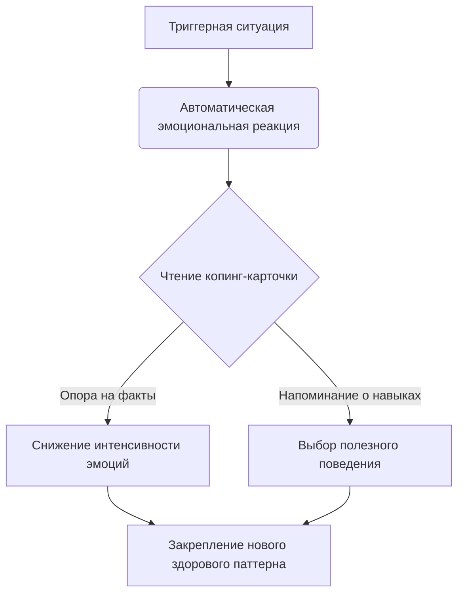

Мы все периодически сталкиваемся с моментами, когда тревога, страх или отчаяние настолько сильны, что парализуют нашу способность мыслить логически. В такие периоды острого стресса кажется, что рациональная часть разума просто отключается, оставляя нас беззащитными перед захлестывающими эмоциями.

Именно для таких ситуаций был создан этот специфический психологический инструмент. Он работает как надежный якорь, который помогает быстро вернуть равновесие и принять верное решение даже тогда, когда собственные умственные ресурсы временно недоступны.

## Сущность метода: Опора в моменты кризиса

**Копинг-карточки** (карточки совладания) — это компактные физические или электронные заметки, содержащие заранее сформулированные полезные инструкции, сбалансированные мысли или объективные факты *(Бек, 2018)*. Они представляют собой шпаргалки для вашей психики, помогающие в нужный момент вспомнить критически важную информацию *(Бек, 2018)*.

Главная задача этого инструмента — своевременно снизить уровень беспокойства и помочь человеку сфокусироваться на эффективном решении проблемы или выполнении задачи *(Бек, 2018)*. По сути, это внешний носитель здравого смысла, который берет на себя функцию управления вашим поведением, когда мозг слишком напуган, чтобы генерировать полезные мысли самостоятельно.

## Архитектура метода: Три формата поддержки

В когнитивно-поведенческой терапии этот инструмент опирается на три ключевых компонента, выполняющих разные функции:

*   **Когнитивные (оспаривающие):** Направлены на нейтрализацию **дисфункциональных мыслей** (нереалистичных и болезненных идей, искажающих реальность). На них записываются рациональные, основанные на фактах ответы, опровергающие катастрофические сценарии.
*   **Поведенческие (инструктивные):** Представляют собой пошаговый алгоритм действий. Они блокируют привычку избегать проблем, четко указывая, что именно нужно сделать прямо сейчас (например, глубоко подышать).
*   **Мотивационные:** Напоминают о долгосрочных жизненных целях. Они связывают текущий дискомфорт с тем, ради чего человек его терпит, помогая не опускать руки.

**Механика работы:** При столкновении с триггером активируются **глубинные убеждения** (жесткие и часто неосознаваемые негативные представления о себе, людях или мире), которые фильтруют реальность и пропускают только пугающую информацию. Чтение заранее написанной карточки обходит этот барьер "туннельного видения". Поскольку текст был создан вами в спокойном состоянии на основе логики, он принудительно вводит в сознание объективные факты, разрывая порочный круг паники *(Gillihan, 2018)*.

## Ментальные модели и границы: Инструкция по безопасности

**Аналогия с правилами в самолете:** Если в полете начинается сильная турбулентность, пассажиру не нужно с нуля вспоминать законы аэродинамики или изобретать план спасения. Все, что от него требуется — открыть готовую графическую инструкцию в кармане кресла и надеть кислородную маску. Заметка в телефоне работает точно так же: это готовая инструкция по выживанию, написанная вашей спокойной частью мозга для вашей паникующей части.

**Чем это не является:** Важнейшая граница метода проходит там, где реализм отделяется от токсичного позитива. Карточки совладания — это не магические аффирмации, основанные на слепом оптимизме.

| Позитивная аффирмация (Слепой оптимизм) | Реалистичная копинг-карточка (Опора на факты) |
| :--- | :--- |
| «Я идеален, я никогда не ошибаюсь, и все меня любят». | «Я могу ошибаться, как и любой человек. Моя личность не сводится к одной ошибке». |
| «Тревоги не существует, я абсолютно спокоен и неуязвим». | «Тревога неприятна, но не смертельна. Это временно, и я уже справлялся с этим раньше». |

## Практическое руководство: От теории к действиям

Рассмотрим, как этот инструмент применяется на практике в клинических ситуациях:

*   **Ситуация 1 (Страх паники):** Пациентка панически боялась, что сильная тревога заставит ее «развалиться на части».
    *   *Действие:* Она использовала карточку: «Это может заставить меня чувствовать себя плохо, но я смогу выдержать. Это не заставит меня “развалиться на части”» *(Бек, 2020)*.
    *   *Результат:* Регулярное чтение помогло ей безопасно выходить из дома и проводить поведенческие эксперименты *(Бек, 2020)*.
*   **Ситуация 2 (Тревога перед публичным выступлением):** Подросток боится отвечать у доски, ожидая провала.
    *   *Действие:* Перед уроком он достает готовую карточку с напоминанием о навыках присутствия в моменте *(Gillihan & Gillihan, 2021)*.
    *   *Результат:* Он делает глубокий вдох, успокаивается и успешно отвечает.

**Алгоритм внедрения:**
1. **Выявление мишени:** Определите старое убеждение или ситуацию, которая регулярно выбивает вас из колеи.
2. **Сбор доказательств:** Напишите факты из вашей жизни, показывающие, что пугающий сценарий не верен на 100%.
3. **Формулировка ответа:** Напишите краткий, реалистичный ответ или пошаговый план действий.
4. **Профилактическое чтение (Критический шаг):** Читайте свои записи регулярно, например, за завтраком и ужином, даже когда чувствуете себя отлично *(Бек, 2020)*.
5. **Применение в кризисе:** Держите шпаргалку под рукой и доставайте при первых признаках ухудшения состояния, не дожидаясь пика паники.

*Частая ловушка:* Записывать слишком длинные и философские тексты. В стрессе мозг не усвоит много информации, поэтому пишите максимально кратко.

## Ежедневная дисциплина ради эмоциональной свободы

Обретение навыка саморегуляции дарит человеку глубокую независимость. Вы перестаете быть заложником случайных всплесков тревоги или депрессии, перестаете зависеть от постоянных утешений со стороны близких или экстренных звонков специалисту. Заменяя автоматический страх на структурированное напоминание о собственных силах, вы берете штурвал управления своим разумом в собственные руки, что радикально повышает уверенность в себе.

Однако достижение такой эмоциональной стабильности требует методичной, повседневной работы. Изменение старых, укоренившихся с детства нейронных связей не происходит мгновенно. Вам потребуется жесткая дисциплина, чтобы перечитывать одни и те же рациональные ответы изо дня в день, утром и вечером, даже когда вам кажется, что в этом нет нужды *(Бек, 2020)*. Это процесс добровольного прохождения через дискомфорт, который необходимо поддерживать до тех пор, пока новые адаптивные идеи не станут вашей естественной реакцией на жизненные вызовы.

## Главный вывод и литература

> Внедрение компактных текстовых опор — это мощный способ перенести инсайты из кабинета психолога прямо в вашу повседневную реальность. Регулярно применяя этот метод, вы постепенно обнаружите, что вам больше не нужно доставать телефон или бумажку: реалистичный и поддерживающий голос с карточки станет вашим собственным внутренним голосом.

**Источники:**
* *Бек, Дж. С. (2018). Когнитивно-поведенческая терапия. От основ к направлениям (3-е изд.). Питер.*
* *Бек, Дж. С. (2020). Когнитивная терапия для сложных случаев: что делать, когда простые решения не работают. ООО "Диалектика".*
* *Gillihan, S. J. (2018). The CBT Deck: 101 Practices to Improve Thoughts, Be in the Moment, & Take Action in Your Life.*
* *Gillihan, S. J., & Gillihan, A. J. L. (2021). CBT Deck for Kids and Teens.*

---

### Проверка понимания (Микро-кейс)

**Ситуация:** Михаил переживает из-за того, что недавно совершил ошибку на новой работе, и у него активировалось глубинное убеждение «Я ни на что не способен». Он решил сделать копинг-карточку. На одной стороне он написал: «Я самый гениальный сотрудник в этой компании, скоро все это поймут, и я больше никогда не совершу ни одной ошибки!». Через несколько дней он снова столкнулся с трудностями на рабочем месте, прочитал карточку, но почувствовал лишь раздражение и усиление тревоги.

**Вопрос:** В чем заключается главная ошибка Михаила при создании этой карточки, исходя из отличий данного метода от позитивных аффирмаций? Как ему следует переформулировать этот текст, чтобы он опирался на объективную реальность и действительно помогал в моменты стресса?
