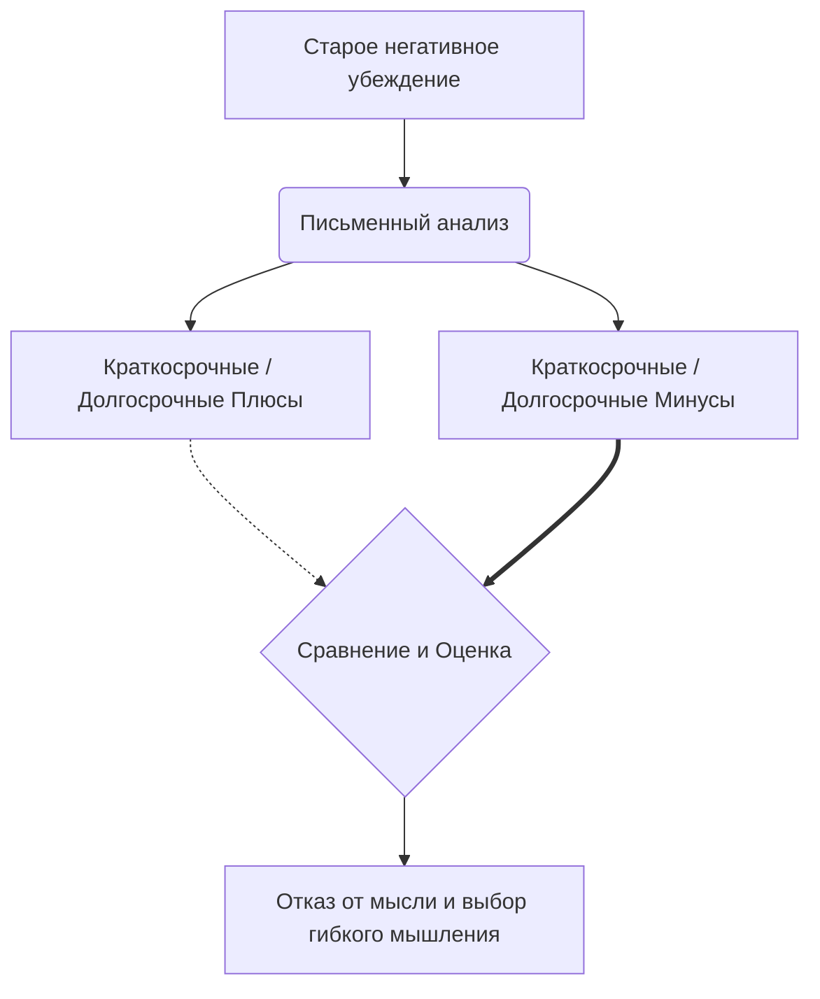

Мы часто держимся за идеи, которые заставляют нас страдать. Тревога, депрессия и выгорание во многом поддерживаются нашими собственными негативными предсказаниями и жесткими требованиями к себе. Возникает логичный вопрос: если эти мысли причиняют такую острую душевную боль, почему мы просто от них не откажемся? Ответ парадоксален: наша психика тайно верит, что эти болезненные убеждения приносят нам пользу и защищают от еще больших бед.

Этот инструмент помогает вывести скрытые мотивы нашего мышления на чистую воду. Честно вынося на бумагу плюсы и минусы своих страхов, вы получаете возможность объективно взглянуть на то, как ваш собственный разум заключает с вами невыгодную сделку, и принимаете осознанное решение изменить правила игры.

## Инвентаризация мыслей: Поиск скрытых мотивов

**Анализ преимуществ и недостатков** — это структурированная оценка положительных и отрицательных последствий сохранения конкретной мысли, жесткого правила или установки *(Лихи, 2020)*.

Главная функция этой техники — преодоление внутреннего сопротивления изменениям. Иногда стандартная проверка мыслей логикой не приносит облегчения, потому что человек подсознательно не хочет с ними расставаться *(Cully et al., 2020)*. Этот метод решает проблему мотивации: он наглядно показывает, как привычное убеждение саботирует долгосрочные цели, и помогает сделать добровольный выбор в пользу здоровой альтернативы *(Лихи, 2020)*.

## Архитектура выбора: Три этапа переоценки

Процесс переоценки собственных мыслей опирается на три базовых компонента:

1.  **Выявление скрытой функции:** Человек признает, что его **автоматические мысли** (быстрые, спонтанные оценки ситуации, возникающие без предварительного обдумывания) не случайны — они выполняют конкретную задачу, например, мотивируют или создают иллюзию контроля *(Лихи, 2020)*.
2.  **Процентное взвешивание:** Составляется подробный список плюсов и минусов, после чего 100% субъективной значимости распределяются между двумя колонками, чтобы определить реальный масштаб вреда и пользы *(Лихи, 2020)*.
3.  **Разработка альтернативы:** Создается новое, более гибкое утверждение, которое затем также подвергается анализу, чтобы доказать его превосходство над старым *(Бек, 2020)*.

**Механика работы (Под капотом):** Когда человек находится в состоянии стресса, его мозг учитывает только краткосрочные выгоды (например, «если я откажусь от встречи, мне не будет тревожно прямо сейчас»). Техника искусственно расширяет горизонт планирования. Заставляя мозг сопоставить сиюминутное облегчение с долгосрочным ущербом (одиночеством, выгоранием), она активирует аналитические центры коры головного мозга. Иллюзия полезности разрушается, и человек естественным образом отказывается от старой стратегии *(Лихи, 2020)*.

## Бизнес-баланс психики: Аудит убыточного партнера

**Аналогия (Аудит предприятия):** Представьте, что у вас есть бизнес-партнер (ваше негативное убеждение), который иногда приносит мелкие контракты и защищает от разочарований, но при этом систематически ворует деньги из кассы и распугивает крупных клиентов. Пока вы не сведете доходы и расходы в единой таблице, вы будете верить, что этот партнер вам необходим. Анализ преимуществ и недостатков — это ваш финансовый отчет, наглядно показывающий, что из-за такого «сотрудничества» вы находитесь на грани банкротства.

**Чем это не является:** Этот метод отличается от классической **когнитивной реструктуризации** (процесса изменения негативного мышления на более реалистичное путем логического поиска доказательств).

| Классическая когнитивная реструктуризация | Анализ преимуществ и недостатков |
| :--- | :--- |
| **Фокус:** Поиск объективных фактов и проверка реальности (Правда это или нет?) *(Бек, 2020)*. | **Фокус:** Поиск практической пользы и вреда (Помогает мне эта мысль или мешает?). |
| **Вопрос:** «Какие у меня есть доказательства того, что эта мысль верна?» | **Вопрос:** «Что я получу и что потеряю, если продолжу в это верить?» |

## Практическое применение: Логика осознанных изменений

Рассмотрим, как этот инструмент применяется на практике:

*   **Ситуация — Действие — Результат (Страх отвержения):** Пациентка отказывается идти на вечеринку из-за мысли: «Меня обязательно отвергнут».
    *   *Действие:* Она выписывает преимущества этой мысли (я избегу унижения) и недостатки (я остаюсь в изоляции, упускаю шанс завести друзей). Она отдает 10% значимости плюсам и 90% минусам *(Лихи, 2020)*.
    *   *Результат:* Оценив альтернативную мысль («Мне нужно меньше думать об оценках окружающих») на 95% преимуществ, она принимает решение пойти *(Лихи, 2020)*.
*   **Ситуация — Действие — Результат (Перфекционизм):** Клиентка требует от себя идеальных результатов на работе. В основе этого лежит жесткое **глубинное убеждение** (фундаментальная, укоренившаяся установка о себе или мире) «Я — никчемная».
    *   *Действие:* Она письменно анализирует плюсы и минусы сохранения веры в собственную никчемность *(Szymanska, 2008)*.
    *   *Результат:* Осознав разрушительный масштаб ущерба, она формирует сбалансированную мысль: «Я в порядке, мне не обязательно делать все идеально», что резко снижает уровень стресса *(Szymanska, 2008)*.

**Алгоритм реализации:**
1. **Зафиксируйте мишень:** Четко выпишите пугающую мысль или правило.
2. **Найдите выгоды:** Запишите все положительные эффекты от сохранения этой мысли, включая краткосрочные и долгосрочные *(Cully et al., 2020)*. Ответьте честно: от чего она вас защищает?
3. **Опишите ущерб:** Перечислите все отрицательные последствия *(Cully et al., 2020)*. Как именно эта мысль портит вам жизнь?
4. **Взвесьте списки:** Распределите 100% субъективной значимости между двумя колонками.
5. **Сформулируйте альтернативу:** Создайте более гибкую мысль и проанализируйте ее плюсы и минусы.

*Частая ловушка:* Иногда люди говорят: «У моей мысли нет никаких плюсов, она просто нерациональна». Важно настоять на поиске скрытой выгоды (например, желания снять с себя ответственность). Если не найти эту тайную пользу, отказаться от мысли будет невозможно *(Лихи, 2020)*.

## Дисциплина ради эмоциональной независимости

Овладение навыком беспристрастного анализа возвращает человеку авторство его собственной жизни. Вы перестаете быть заложником устаревших внутренних правил, сформировавшихся много лет назад. Переход к более гибкому мышлению позволяет высвободить колоссальные объемы внутренних ресурсов, ранее уходивших на обслуживание тревоги, и направить их на построение значимых отношений и достижение реальных целей.

Разумеется, за обретение этой эмоциональной свободы придется приложить серьезные усилия. Отпустить установку, с которой вы прожили многие годы, бывает страшно, ведь она давала предсказуемость и своеобразный «защитный панцирь». Потребуется значительная смелость, чтобы добровольно пойти на разумные риски и встретиться с неопределенностью. Ежедневная методичная работа с таблицами требует терпения, но именно она позволяет трансформировать мимолетные инсайты в устойчивые нейронные связи, формирующие новый, здоровый фундамент личности.

## Главный вывод и литература

> Анализ преимуществ и недостатков — это честный разговор с самим собой о скрытых мотивах. Понимая, какую функцию выполняют ваши болезненные мысли, вы лишаете их неосознанной власти и делаете уверенный шаг навстречу психологической свободе.

**Источники:**
* *Бек, Дж. С. (2020). Когнитивная терапия для сложных случаев: что делать, когда простые решения не работают. ООО "Диалектика".*
* *Лихи, Р. (2020). Техники когнитивной психотерапии. Питер.*
* *Cully, J. A., Dawson, D. B., Hamer, J., & Tharp, A. L. (2020). A Provider’s Guide to Brief Cognitive Behavioral Therapy. Department of Veterans Affairs South Central MIRECC.*
* *Elliot, C. H., & Lassen, M. K. (1998). Why can't I get what I want? How to stop making the same old mistakes and start living a life you can love. California: Davies Black Publishing.*
* *Szymanska, K. (2008). The Downward Arrow Technique. The Coaching Psychologist, 4(2), 85-86.*

---

### Проверка понимания (Микро-кейс)

Олег страдает от социальной тревожности. Его автоматическая мысль звучит так: «Если я пойду на встречу, я обязательно скажу глупость и опозорюсь». Выполняя анализ преимуществ и недостатков, в колонку «плюсы» он пишет: *«Эта мысль удерживает меня дома, поэтому я остаюсь в безопасности и точно избегаю позора сегодня вечером»*. В колонку «минусы» он пишет: *«Из-за этого я чувствую себя одиноким и упускаю шанс завести друзей в перспективе ближайших лет»*. Глядя на списки, Олег решает, что безопасность для него важнее, и отказывается идти.

**Вопрос:** Опираясь на концепцию «близорукости» в принятии решений, объясните, какую системную ошибку совершил Олег при оценке своего списка? На какое критическое различие между плюсами и минусами ему стоит обратить внимание, чтобы увидеть фундаментальную неэффективность своей старой защитной стратегии?
