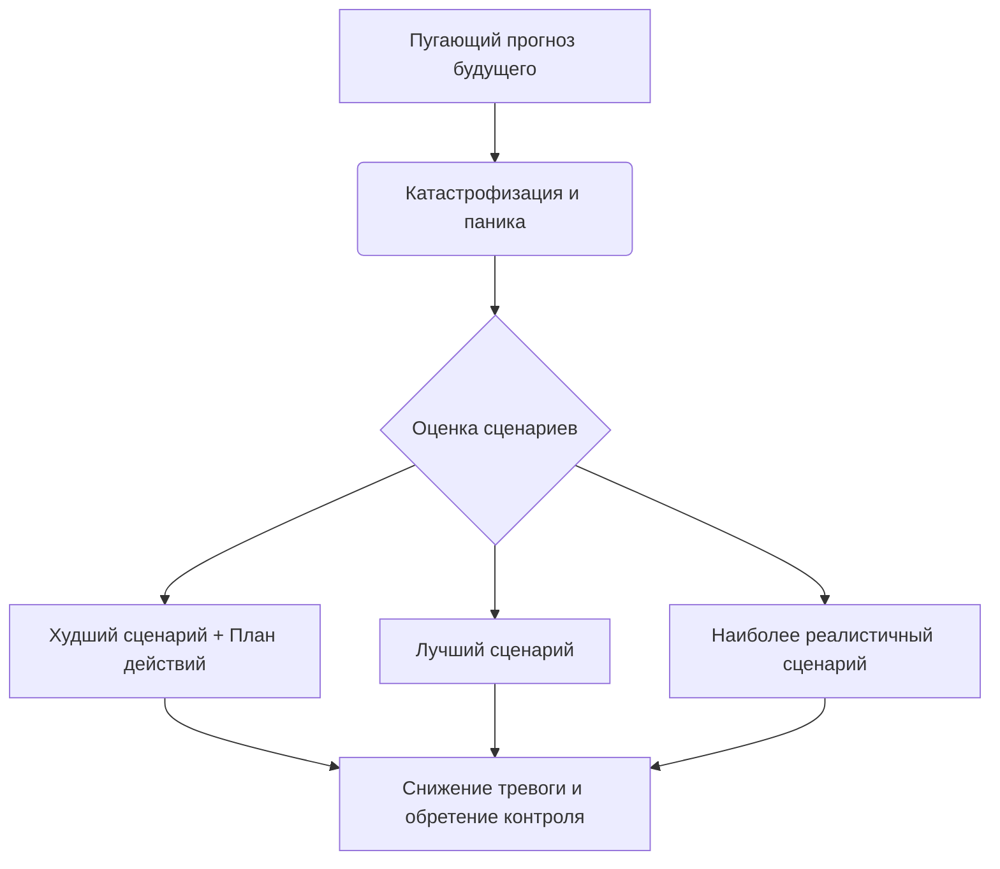

Мы все склонны иногда рисовать в голове мрачные картины будущего. Небольшая ошибка на работе начинает казаться предвестником неминуемого увольнения, а учащенное сердцебиение воспринимается как признак скорой катастрофы. Этот внутренний шторм держит нас в постоянном напряжении и заставляет тратить огромное количество энергии на переживания о том, что еще даже не произошло.

Инструмент декатастрофизации помогает вернуть контроль над своим эмоциональным состоянием. Он не заставляет надевать «розовые очки», а работает как мощный прожектор реальности, превращая пугающую неизвестность в набор конкретных, управляемых и реалистичных сценариев, с которыми можно справиться.

## Шаг от паники к объективному планированию

**Декатастрофизация** (когнитивная техника, направленная на переоценку пугающих прогнозов и оценку реальной способности человека пережить их) — это один из ключевых методов когнитивно-поведенческой терапии *(Barlow et al., 2011)*.

Эта техника помогает разорвать замкнутый круг тревоги. Вместо того чтобы слепо верить в надвигающующуюся трагедию или, наоборот, избегать любых мыслей о ней, вы используете структурированный подход. Метод смещает фокус с панического ожидания ужасного исхода на конструктивный поиск решений и оценку реальных вариантов развития событий *(Cully et al., 2020)*.

## Системная оценка угрозы: От худшего к реалистичному

Этот инструмент опирается на три ключевых компонента, которые помогают системно оценить пугающую ситуацию:

1. **Оценка худшего сценария:** Признание самого пугающего исхода и разработка четкого плана действий на этот случай *(Cully et al., 2020)*.
2. **Оценка лучшего сценария:** Формирование позитивной, максимально благоприятной альтернативы *(Cully et al., 2020)*.
3. **Определение реалистичного исхода:** Поиск взвешенной золотой середины на основе фактов *(Cully et al., 2020)*.

**Механика работы:** Наша тревога часто питается **катастрофизацией** (автоматическим предсказанием наихудшего возможного сценария с недооценкой своих сил) *(Cully et al., 2020)*. Механика метода заключается в том, чтобы безопасно столкнуться со своим страхом, задав вопрос: «Что самое худшее может случиться, и как я с этим справлюсь?» *(Barlow et al., 2011)*. Переводя страх из абстрактного «всё будет ужасно» в конкретную плоскость, вы активируете аналитический центр мозга и резко снижаете эмоциональный накал.

## Включение света в темной комнате

**Аналогия (Включение света):** Представьте, что вы проснулись ночью в темной спальне и видите в углу странный силуэт. Ваша тревога кричит: «Это монстр!». Вы можете спрятаться под одеяло и дрожать до утра. Но декатастрофизация работает иначе — вы просто включаете свет. Вы не пытаетесь убедить себя, что монстров не существует в принципе, вы лишь оцениваете конкретный силуэт и видите, что это стул с наброшенной на него одеждой. Вы опираетесь на объективные факты.

**Чем это не является:** Эту технику часто путают со слепым позитивным мышлением, однако их цели прямо противоположны. Терапия не учит игнорировать реальные проблемы.

| Слепой оптимизм (Позитивное мышление) | Декатастрофизация (Опора на факты) |
| :--- | :--- |
| «Я точно сдам этот сложный экзамен на отлично, волноваться не о чем!» | «Даже если я получу низкую оценку, я знаю, как ее пересдать или исправить.» |
| «На собеседовании ничего плохого не произойдет, я им понравлюсь.» | «Даже если мне откажут, я переживу это и получу полезный опыт для следующего интервью.» |

## Алгоритм действий: От абстрактного страха к конкретному плану

Рассмотрим применение техники на клинических примерах:

*   **Ситуация — Действие — Результат (Тревога о здоровье):** Пациент чувствует учащенное сердцебиение и думает, что у него случится инфаркт.
    *   *Действие:* Он оценивает лучший исход (это просто усталость), худший (приступ, при котором он успеет вызвать скорую) и реалистичный (это проявление его привычной тревоги) *(Barlow et al., 2011)*.
    *   *Результат:* Выбор реалистичного сценария и наличие плана действий останавливают развитие панической атаки.
*   **Ситуация — Действие — Результат (Рабочая тревога):** Клиент паникует перед презентацией: «Я заикнусь, провалюсь, и меня уволят».
    *   *Действие:* Он задает вопрос: «Если мысль верна, что самое худшее может случиться, и как бы я с этим справился?» *(Cully et al., 2020)*.
    *   *Результат:* Он осознает, что увольнение маловероятно, а заминку можно сгладить извинениями. Тревога падает.

**Пошаговое руководство:**
1. **Зафиксируйте пугающую мысль:** Сформулируйте свой прогноз максимально точно и запишите его на бумаге.
2. **Исследуйте худший сценарий:** Спросите себя: «Что самое страшное может произойти?». Затем задайте главный вопрос: «Смогу ли я это пережить? Как именно я с этим справлюсь?» *(Barlow et al., 2011)*.
3. **Сформулируйте лучший сценарий:** Спросите: «Если отбросить страх, что самое лучшее может случиться в этой ситуации?» *(Cully et al., 2020)*.
4. **Найдите реалистичный исход:** Опираясь на факты, ответьте: «Учитывая всё это, какой исход наиболее вероятен?» *(Cully et al., 2020)*.

*Частая ловушка:* Застревание на поиске худшего сценария без перехода к вопросу «Как я с этим справлюсь?». Без поиска конкретных решений анализ только усилит тревогу, превратившись в бесплодное переживание.

## Смелость посмотреть страху в глаза ради внутренней устойчивости

Наш мозг эволюционно запрограммирован искать опасности и перестраховываться, поэтому привычка рисовать в уме катастрофы кажется ему самым надежным способом защиты. Отказаться от этого автоматического механизма в моменты сильного стресса — задача, требующая значительной эмоциональной дисциплины. Требуется немалое мужество, чтобы честно посмотреть в глаза своим самым глубоким опасениям вместо того, чтобы избегать их или слепо надеяться на чудо.

Однако усилия, которые вы вкладываете в эту практику, окупаются многократно. Осознав, что вы способны разработать план действий и пережить даже самый неблагоприятный исход, вы освобождаете огромное количество внутренней энергии. Жизнь перестает казаться непредсказуемым минным полем. Вы перестаете реагировать на каждый мелкий промах как на конец света и обретаете спокойствие, необходимое для уверенного движения вперед.

## Главный вывод и литература

> Декатастрофизация не гарантирует, что в жизни не будет трудностей или неудач. Но этот навык убедительно доказывает: вы гораздо сильнее, находчивее и выносливее, чем пытается внушить вам ваш страх.

**Источники:**
* *Barlow, D. H., Ellard, K. K., Fairholme, C. P., Farchione, T. J., Boisseau, C. L., Allen, L. B., & Ehrenreich-May, J. (2011). The unified protocol for transdiagnostic treatment of emotional disorders: Client workbook. Oxford University Press.*
* *Cully, J. A., Dawson, D. B., Hamer, J., & Tharp, A. L. (2020). A Provider’s Guide to Brief Cognitive Behavioral Therapy. Department of Veterans Affairs South Central MIRECC.*
* *Бек, Дж. С. (2020). Когнитивная терапия для сложных случаев: что делать, когда простые решения не работают. ООО «Диалектика».*
* *ДиДжузеппе, Р., Дойл, К., Драйден, У., Бакс, У. (2021). Рационально-эмотивно-поведенческая терапия.*
* *Лихи, Р. (2018). Лекарство от нервов. Как перестать волноваться и получить удовольствие от жизни.*
* *Лихи, Р. (2021). Не верь всему, что чувствуешь. Как тревога и депрессия заставляют нас поверить тому, чего нет.*

---

### Проверка понимания (Микро-кейс)

**Ситуация:** Сергей очень боится летать на самолетах. Перед командировкой он не может уснуть из-за мысли: «Самолет обязательно попадет в турбулентность, мы разобьемся, и я погибну». Чтобы успокоить себя, он начинает лихорадочно повторять: «Нет, погода завтра будет идеальной, пилот — профессионал с огромным стажем, полет пройдет абсолютно гладко, мне совершенно нечего бояться».

**Вопрос:** Какую системную ошибку совершил Сергей, пытаясь справиться со своей тревогой? Как бы выглядел его внутренний монолог, если бы он правильно применил метод декатастрофизации, последовательно пройдя все три шага предложенного алгоритма?
