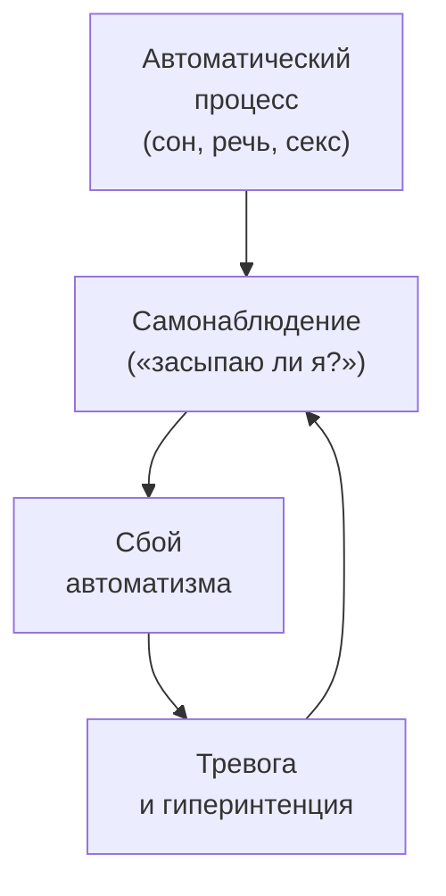
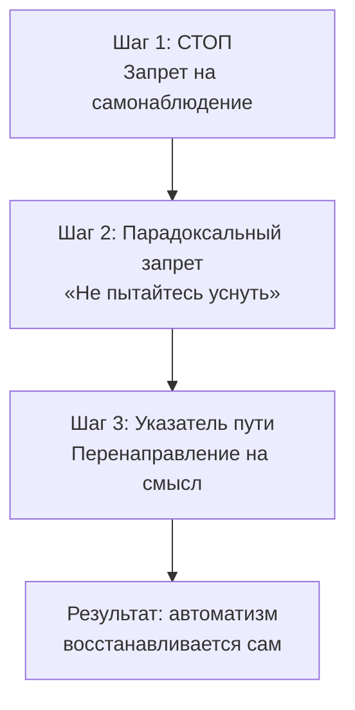

Человек ложится в постель с единственной мыслью: «Я должен уснуть, иначе завтра не смогу работать». Он следит за каждым вдохом, прислушивается — засыпает или нет. Чем больше старается, тем выше напряжение. Сон не приходит. **Дерефлексия** — метод логотерапии, который разрывает этот порочный круг навязчивого самонаблюдения, перенаправляя внимание с симптома на мир смыслов и ценностей.

Техника применяется при психогенной бессоннице, сексуальных неврозах (импотенция, фригидность, аноргазмия), психогенном заикании, расстройствах глотания и любой фиксации на психосоматических симптомах.

### Гиперрефлексия: когда самонаблюдение становится болезнью

**Гиперрефлексия** — болезненное самонаблюдение. Человек начинает следить за автоматическими реакциями: за речью при заикании, за возбуждением при сексе, за засыпанием при бессоннице. Автоматизм нарушается, возникает сбой, тревога усиливается и заставляет наблюдать ещё пристальнее.

Рядом с гиперрефлексией работает **гиперинтенция** — чрезмерное стремление достичь результата. Человек судорожно пытается контролировать процесс, который должен протекать сам. Франкл использовал образ сороконожки, которая задумалась, с какой ноги идти, — и тут же споткнулась.

### Самотрансценденция: активный ингредиент дерефлексии

Дерефлексия работает с фундаментальным дефицитом **самотрансценденции** — способности выходить за пределы своего «Я» и направлять себя на нечто или кого-то другого. В состоянии гиперрефлексии человек попадает в ловушку эгоцентризма. Смысл подменяется жаждой правильного функционирования тела.

Закон экзистенции гласит: счастье и удовольствие — лишь побочный продукт осмысленной деятельности. Они разрушаются в той степени, в какой становятся самоцелью. Дерефлексия возвращает человека в его подлинное экзистенциальное состояние — направленность на объективный мир смыслов и ценностей.

> Дерефлексия — это не бегство от проблемы, а возвращение к подлинной жизни. Терапевт не просто отвлекает пациента. Он деактивирует парализующую рефлексию и перенаправляет внимание на смысл.

### Пошаговый протокол: знак «стоп» и указатель пути

Протокол состоит из двух ключевых установок: «знака остановки» и «указателя пути». Терапевт занимает уверенную, слегка директивную позицию, чтобы снять с пациента груз гиперинтенции.

**Шаг 1. Знак «стоп» (легализация симптома).** Терапевт снимает напряжение, обесценивая важность симптома и запрещая самонаблюдение. Пример: «С этого момента я категорически запрещаю вам наблюдать за своей проблемой. Ставим жёсткий знак "стоп" на самокопании. Вашему организму не нужно сознательное вмешательство, чтобы работать. Оставьте его в покое».

**Шаг 2. Снятие требования результата (парадоксальный запрет).** Терапевт запрещает пациенту достигать цели, к которой тот судорожно стремится. Пример: «Я предписываю вам строгий запрет на достижение результата. Вы не должны пытаться сегодня уснуть. Ваша задача — просто быть, не требуя от тела никаких достижений».

**Шаг 3. Указатель пути (активация самотрансценденции).** Терапевт перенаправляет высвободившееся внимание на внешний, наполненный смыслом объект. Пример: «Направьте всё внимание во внешний мир. Подарите это время тому, что имеет для вас подлинный смысл. Думайте о партнёре, отдайтесь прекрасным воспоминаниям или погрузитесь в интересную задачу».

### Случай Елены: бессонница из-за страха не уснуть

Елена, 32 года. Тяжёлая психогенная бессонница. Каждый вечер она ложится с мыслью: «Я должна сегодня выспаться, иначе завтра не смогу работать». Чем больше старается заснуть, тем выше напряжение. Снотворные дают временный эффект.

**Елена:** «Я ложусь и начинаю прислушиваться: засыпаю или нет? Сердце бьётся, мысли крутятся. Я в ужасе, что снова проведу ночь без сна».

**Терапевт:** «Ваш страх перед бессонницей порождает слишком сильное стремление заснуть, которое и не даёт покоя. На самом деле совершенно неважно, сколько часов вы спите. Организм в любом случае возьмёт свой минимум. С сегодняшнего дня я запрещаю вам пытаться заснуть».

**Елена:** «Запрещаете? А что делать всю ночь?»

**Терапевт:** «Когда не сможете уснуть, скажите себе: "Как хорошо, что я не сплю — это дарит мне часть жизни, когда можно мечтать о прекрасном. Мы и так полжизни просыпаем!" Читайте увлекательную книгу, но ровно за три страницы до конца главы выключите свет. В темноте ваша задача — не спать, а придумывать, чем закончилась глава, во всех мельчайших деталях».

Внимание перенаправлено с процесса засыпания на творческую, увлекательную задачу. Когда Елена переключила фокус на смысл, сон пришёл автоматически.

### Руководство для самостоятельной практики

Вы попали в ловушку самонаблюдения. Вы следите за тем, как спите, говорите, занимаетесь любовью или чувствуете себя, и этим сбиваете ритм собственного тела. Чтобы вернуть естественность, примените дерефлексию — искусство позитивного самозабвения.

**Шаг 1. Знак СТОП.** Откажитесь от контроля. Произнесите вслух: «Я прекращаю следить за своим телом. Разрешаю себе сегодня не достичь цели (не уснуть, заикаться, не получить удовольствия). Снимаю с себя это требование».

**Шаг 2. Указатель пути.** Выберите дело или мысль, которая по-настоящему увлекает и находится *вне* вас.

| Ситуация | Куда перенаправить внимание |
|---|---|
| Бессонница | Мысленное конструирование сюжета недочитанной книги |
| Страх при общении | Внимательное разглядывание цвета глаз собеседника и того, *что* он говорит |
| Сексуальный невроз | Фокусировка на нежности и доставлении радости партнёру |

> Счастье и расслабление приходят сами, когда вы увлечены чем-то другим — когда «выходите за свои пределы».

### Противопоказания и типичные ошибки

**Абсолютные противопоказания.** Дерефлексию нельзя применять там, где требуется сознательное решение проблемы. Если у пациента реальный моральный конфликт, клиническая тяжёлая депрессия или страдание вызвано реальной утратой и горем, дерефлексия превратится в пагубное вытеснение. Техника работает только против невротической гиперрефлексии.

**Типичное сопротивление клиента:** «Вы просто предлагаете мне отвлечься. Это поверхностно». Ответ: «Это не отвлечение, а возвращение к подлинной жизни. Мы отвлекаем вас от болезни, чтобы расширить горизонт и открыть измерения смысла, которые вы перестали замечать».

**Типичная ошибка терапевта:** подмена смысла тривиальностью. Предлагать пациенту «смотреть телевизор», чтобы не думать о проблеме, — не дерефлексия. Истинная дерефлексия требует перенаправления внимания на объективные ценности и смысл, а не на суррогатные развлечения.

### Три маркера успешной дерефлексии

1. **Восстановление автоматизма.** Пациент с удивлением замечает, что уснул, не думая о сне, или произнёс длинную фразу без заикания. Симптом «атрофируется» за ненадобностью.

2. **Сдвиг речи.** Пациент перестаёт говорить о внутренних состояниях и симптомах. Его речь переполняется рассказами о внешнем мире, проектах, отношениях. Происходит «исцеляющее забывание себя».

3. **Возрастание витальности.** Эмоциональный фон выравнивается. Пациент испытывает радость и удовольствие как спонтанные побочные эффекты вовлечённости в жизнь.

### Заключение и Литература

Дерефлексия — метод логотерапии для разрушения порочного круга невротического самонаблюдения. Техника состоит из двух ключевых установок: «знака остановки» (запрет на самонаблюдение и требование результата) и «указателя пути» (перенаправление внимания на ценности и смысл во внешнем мире). Активный ингредиент — самотрансценденция: способность выйти за пределы своего «Я» и направить себя на нечто большее. Метод показан при психогенной бессоннице, сексуальных неврозах, заикании и фиксации на симптомах. Противопоказан при реальных моральных конфликтах, горе и клинической депрессии.

- Франкл, В. (1990). *Человек в поисках смысла*. М.: Прогресс.
- Лукас, Э. (2020). *Учебник логотерапии*. М.: Новый Акрополь.

---

**Контрольный вопрос:** Пациент с психогенным заиканием фиксируется на каждом слове и постоянно следит за своей речью. Как вы примените протокол дерефлексии — конкретно опишите формулировку «знака остановки» и «указателя пути» для этого случая.
