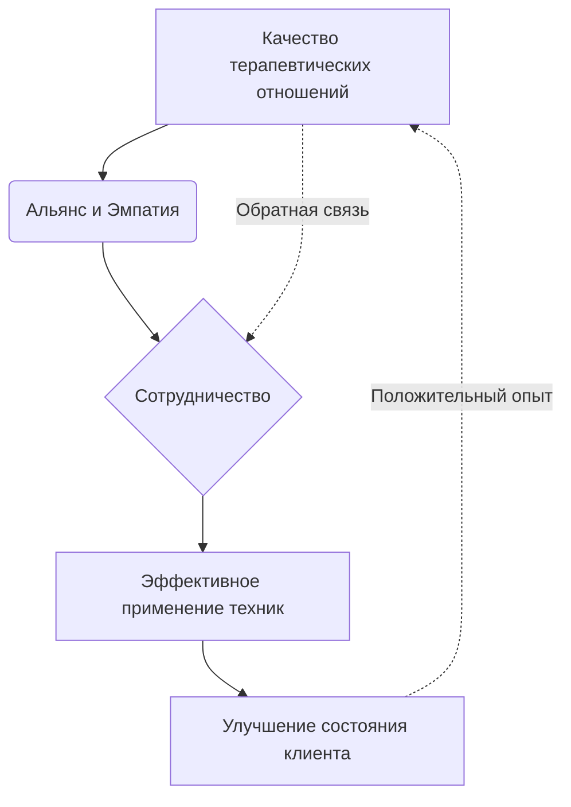

Когда мы думаем о лечении, наш мозг часто ищет «волшебную таблетку» или конкретную техническую манипуляцию. В психологии это проявляется в бесконечных спорах о том, какой метод лучше: когнитивно-поведенческая терапия, психоанализ или гештальт. Однако десятилетия исследований показывают удивительный факт: конкретные технические приемы объясняют лишь малую часть успеха. Настоящий двигатель изменений — это то, что происходит *между* людьми в кабинете.

Научные данные подтверждают, что качество отношений между специалистом и клиентом вносит существенный и последовательный вклад в результат, независимо от типа применяемого лечения *(Norcross & Lambert, 2018)*. Понимание того, как устроены эти отношения, помогает клиенту стать активным участником процесса, а не просто пассивным получателем услуг.

## Сущность исцеляющей связи: Определение и практическая значимость

**Терапевтические отношения** (чувства и установки, которые терапевт и клиент испытывают друг к другу, и способ их выражения) — это живой контекст, внутри которого работают все остальные инструменты психологии *(Norcross & Lambert, 2018)*. Это не просто «приятная беседа», а доказанный терапевтический фактор, который вносит вклад в улучшение состояния клиента так же сильно, а иногда и сильнее, чем конкретные методики *(Norcross & Lambert, 2018)*.

Главная задача этого инструмента — создать безопасную среду, в которой возможны изменения. Без прочного фундамента отношений даже самая эффективная техника может быть воспринята в штыки или проигнорирована. Исследования показывают, что около 5–8% вариативности результатов лечения зависят исключительно от личности терапевта, в то время как вклад конкретных методов часто оценивается в 0–10% *(Norcross & Lambert, 2018)*.

## Архитектура сотрудничества: Ключевые компоненты успеха

Современная наука выделяет конкретные элементы отношений, которые напрямую предсказывают успех терапии. Их можно разделить на три функциональные группы:

1.  **Рабочий альянс:** Согласованность целей, задач и наличие прочной эмоциональной связи между участниками *(Norcross & Lambert, 2018)*.
2.  **Эмпатия и принятие:** Способность специалиста точно понимать мир клиента и выражать безусловное позитивное отношение и поддержку *(Norcross & Lambert, 2018)*.
3.  **Коллаборация и обратная связь:** Активное вовлечение клиента в процесс и регулярная проверка того, «как мы движемся», что позволяет вовремя исправлять ошибки в коммуникации *(Norcross & Lambert, 2018)*.

**Механика процесса:** Взаимодействие между методом и отношениями — это улица с двусторонним движением. Техники не существуют в вакууме; они являются реляционными актами *(Norcross & Lambert, 2018)*. Когда терапевт проявляет эмпатию, это снижает защитные механизмы клиента, позволяя логическим инструментам (например, когнитивной реструктуризации) работать глубже. Напротив, игнорирование разрывов в альянсе ведет к сопротивлению и преждевременному уходу из терапии *(Norcross & Lambert, 2018)*.

## Скальпель и рука хирурга: Ментальные модели и границы

**Аналогия (Хирургия):** Представьте современный хирургический скальпель — это символ психологической техники. Он может быть идеально заточен, но его эффективность полностью зависит от руки хирурга. Если рука дрожит, если хирург не видит пациента или если у пациента аллергия на наркоз, о котором врач не спросил — скальпель не поможет. Терапевтические отношения — это «рука» и «глаза» процесса, которые направляют технический «скальпель» в нужное место и в нужное время.

**Границы метода:** Важно понимать, что хорошие отношения — это не замена лечению и не простая дружба.

| Здоровые терапевтические отношения | Обычное дружеское общение (ОШИБКА) |
| :--- | :--- |
| **Целенаправленность:** Основаны на согласовании конкретных жизненных целей клиента *(Norcross & Lambert, 2018)*. | **Взаимность:** Друзья делятся проблемами по очереди; в терапии фокус всегда на клиенте. |
| **Профессиональная дистанция:** Специалист управляет своим **контрпереносом** (своими личными реакциями на клиента) *(Norcross & Lambert, 2018)*. | **Эмоциональное слияние:** Друг может заразиться вашими эмоциями и потерять объективность. |
| **Регулярная оценка:** Использование тестов и шкал для мониторинга удовлетворенности отношениями *(Norcross & Lambert, 2018)*. | **Отсутствие формальной проверки:** Друзья редко обсуждают эффективность своего общения в процентах. |

## Практическое руководство: Как сделать отношения целительными

Для того чтобы отношения в кабинете работали на результат, необходимо соблюдение определенных алгоритмов обеими сторонами.

* **Ситуация (Разрыв альянса):** Клиент чувствует, что терапевт его не понимает или был слишком резок.
    * *Действие:* Специалист не оправдывается, а инициирует **восстановление разрыва альянса** (признание ошибки и обсуждение чувств клиента) *(Norcross & Lambert, 2018)*.
    * *Результат:* Отношения становятся крепче, а клиент получает опыт безопасного разрешения конфликтов.
* **Ситуация (Отсутствие прогресса):** Клиент ходит три месяца, но симптомы не проходят.
    * *Действие:* Терапевт запрашивает **клиентскую обратную связь** с помощью формальных опросников *(Norcross & Lambert, 2018)*.
    * *Результат:* Выясняется, что клиент не согласен с методами работы, после чего стратегия корректируется и прогресс возобновляется.

**Алгоритм повышения эффективности (для клиента и терапевта):**

1.  **Согласование целей:** В самом начале четко проговорите: «К какому результату мы хотим прийти?» и «Как именно мы будем это делать?» *(Norcross & Lambert, 2018)*.
2.  **Мониторинг комфорта:** Регулярно (раз в несколько сессий) спрашивайте себя или специалиста: «Чувствую ли я, что меня понимают? Верю ли я в то, что мы делаем?» *(Norcross & Lambert, 2018)*.
3.  **Раскрытие трудностей:** Если вам что-то не нравится в поведении терапевта, скажите об этом. Умение специалиста работать с такими претензиями — признак высокого профессионализма *(Norcross & Lambert, 2018)*.
4.  **Учет культурного контекста:** Убедитесь, что терапевт проявляет культурную смиренность и уважает ваши ценности и происхождение *(Norcross & Lambert, 2018)*.

## Ценность сотрудничества: Усилия на пути к изменениям

Обретение целительных отношений требует значительных вложений с обеих сторон. Для клиента это означает готовность быть искренним, доверять свои самые уязвимые стороны и брать на себя ответственность за выполнение совместных задач. Это непростой труд — открываться другому человеку, особенно когда прошлый опыт общения был болезненным. Для терапевта же «цена» успеха — это непрерывное самообучение, работа над собственной личностью и постоянная бдительность к качеству связи.

Однако эти инвестиции окупаются сторицей. Когда вы находитесь в отношениях, характеризующихся высоким уровнем эмпатии, сотрудничества и согласия по целям, вероятность успеха терапии возрастает многократно *(Norcross & Lambert, 2018)*. Прочные терапевтические отношения не только помогают справиться с конкретными симптомами, но и становятся моделью здоровой связи, которую клиент впоследствии переносит в свою реальную жизнь, улучшая отношения с близкими и коллегами.

## Главный вывод и литература

> Психотерапия — это прежде всего человеческая встреча. Техники важны, но они вторичны. Отношения, основанные на эмпатии, сотрудничестве и честной обратной связи, являются главным фактором, превращающим психологическую теорию в реальное исцеление.

**Источники:**

* *Norcross, J. C., & Lambert, M. J. (2018). Psychotherapy relationships that work III. Psychotherapy, 55(4), 303-315.*
* *Elliott, R., Bohart, A. C., Watson, J. C., & Murphy, D. (2018). Therapist empathy and client outcome: An updated meta-analysis. Psychotherapy, 55, 399-410.*
* *Flückiger, C., Del Re, A. C., Wampold, B. E., & Horvath, A. O. (2018). The alliance in adult psychotherapy: A meta-analytic synthesis. Psychotherapy, 55, 316-340.*

---

### Проверка понимания (Микро-кейс)

**Ситуация:** Марина пришла к психологу с жалобой на депрессию. Психолог, будучи экспертом, сразу выдал ей список из десяти упражнений и строго сказал: «Делайте это каждый день, и через месяц всё пройдет. Обсуждать чувства мы не будем, у нас мало времени, только работа по протоколу». Марина чувствует себя подавленной, ей кажется, что ее не слышат, но она боится возразить «умному доктору».

**Вопрос:** Опираясь на данные исследования Norcross & Lambert (2018), объясните, почему подход этого психолога, скорее всего, приведет к провалу лечения? Какие три фундаментальных элемента терапевтических отношений он проигнорировал, и к каким последствиям для Марины это может привести (используйте термины «альянс», «эмпатия» и «коллаборация»)?
