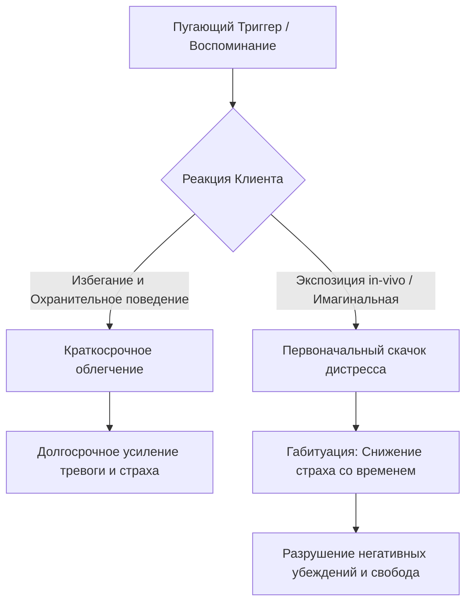

Большинство людей инстинктивно стремятся избегать дискомфорта, пугающих ситуаций и болезненных воспоминаний. Избегание действительно помогает уменьшить количество неприятных переживаний в краткосрочной перспективе, но в долгосрочной — оно лишь усугубляет ваши проблемы, делая жизнь всё более ограниченной *(Добсон и Добсон, 2021)*.

Когда страх начинает диктовать вам, куда ходить и что делать, на помощь приходит один из самых мощных поведенческих инструментов. Этот инструмент учит не убегать от тревоги, а безопасно проходить сквозь неё, чтобы навсегда лишить страх его парализующей власти и вернуть себе свободу действий.

## Прямое столкновение со страхом ради освобождения

**Экспозиция** (целенаправленное и систематическое столкновение с пугающими стимулами в безопасной обстановке) — это фундаментальный поведенческий метод лечения тревоги *(Cully et al., 2020)*.

Этот навык выполняет важнейшую работу: он разрывает порочный круг избегания и позволяет вам на собственном опыте проверить свои негативные мысли. Вместо того чтобы бесконечно рассуждать о вероятности катастрофы, вы тестируете реальность и доказываете себе, что способны справиться с дискомфортом, что в конечном итоге радикально снижает уровень вашей тревоги *(Бек, 2020)*.

## Механика угасания страха: От активации к привыканию

Существует два основных формата, под капотом которых работает этот метод:
1. **Экспозиция in-vivo (в реальной жизни):** Прямое физическое столкновение с объективно безопасными местами или ситуациями, которых вы избегаете (например, поездка в лифте или нахождение в толпе) *(Фоа, Хембри, Оласов-Ротбаум, Раух, 2020)*.
2. **Имагинальная экспозиция (в воображении):** Детальное погружение в пугающие мысли, образы или многократный пересказ вслух пугающих воспоминаний. Используется, когда реальное столкновение невозможно или страх связан с мыслями о будущих катастрофах *(Фоа, Хембри, Оласов-Ротбаум, Раух, 2020)*.

**Механика работы:** В основе метода лежат три обязательных механизма психики. Сначала происходит **активация страха** — вы должны в полной мере ощутить тревогу *(Добсон и Добсон, 2021)*. Затем наступает **нарушение ожиданий** — ситуация разворачивается не так, как предсказывал ваш страх, что разрушает старые негативные убеждения *(Добсон и Добсон, 2021)*. Наконец, срабатывает **габитуация** — естественный процесс, при котором ваша реакция постепенно снижается просто за счет того, что вы остаетесь в пугающей ситуации достаточно долго *(Фоа, Хембри, Оласов-Ротбаум, Раух, 2020)*.

## Купание в холодной воде: Погружение вместо бегства

**Аналогия (Холодный океан):** Представьте, что вы боитесь зайти в воду, потому что она кажется ледяной. Вы делаете шаг. Первые несколько минут вас трясет, хочется немедленно выскочить на берег (избегание). Но если вы останетесь в воде, рецепторы адаптируются, и вам станет комфортно *(Лихи, 2021)*. Это и есть габитуация: дискомфорт длится недолго. Если же вы выскочите в первые секунды, вы запомните только невыносимый холод и больше никогда туда не зайдете.

**Чем это не является:** Экспозиция — это не безрассудный риск и не слепое "преодоление сквозь зубы".

| Избегание и иллюзия безопасности (Ошибка) | Экспозиция в КПТ (Правильно) |
| :--- | :--- |
| **Использование защиты:** Применение **охранительного поведения** (скрытых действий для создания иллюзии безопасности, например, сжимание кулаков или поездка только с "безопасным" другом) *(Бек, 2020)*. | **Отказ от защиты:** Намеренный отказ от любых "психологических костылей" ради чистоты эксперимента *(Добсон и Добсон, 2021)*. |
| **Внезапность:** Ситуация возникает спонтанно, человек к ней не готов. | **Постепенность:** Процесс начинается с умеренных задач с помощью **иерархии страхов** (ранжированного списка пугающих ситуаций). |
| **Попытки отвлечься:** Переключение внимания или быстрое завершение ситуации на пике паники. | **Погружение:** Человек фокусирует внимание на стимуле и дожидается естественного угасания тревоги. |

## Алгоритм тренировки смелости: От плана к действию

Рассмотрим примеры из клинической практики:

*   **Ситуация — Действие — Результат (Агорафобия, in-vivo):** Женщина боится панической атаки в магазине.
    *   *Действие:* Она составляет план и идет в магазин одна. В первые 15 минут тревога зашкаливает, но она остается в отделе, не убегая и ни на что не отвлекаясь (отказ от охранительного поведения).
    *   *Результат:* Через 40 минут мозг фиксирует габитуацию: тревога падает, катастрофа не случилась.
*   **Ситуация — Действие — Результат (ПТСР, имагинальная):** Ветеран избегает мыслей о травме.
    *   *Действие:* Терапевт просит его закрыть глаза и 45 минут рассказывать о случившемся в настоящем времени.
    *   *Результат:* Многократный пересказ лишает воспоминание обжигающей силы и возвращает человеку контроль *(Фоа, Хембри, Оласов-Ротбаум, Раух, 2020)*.

**Пошаговое руководство (Алгоритм):**
1. **Создание иерархии:** Составьте список пугающих ситуаций и оцените каждую по 100-балльной Шкале субъективного дистресса *(Фоа, Хембри, Оласов-Ротбаум, Раух, 2020)*.
2. **Выбор мишени:** Начните с ситуации, вызывающей средний дискомфорт (40–50 баллов) *(Фоа, Хембри, Оласов-Ротбаум, Раух, 2020)*.
3. **Отказ от защиты:** Убедитесь, что вы не будете использовать охранительное поведение (отвлекаться на телефон, слушать музыку) *(Cully et al., 2020)*.
4. **Погружение:** Войдите в ситуацию in-vivo (или закройте глаза для имагинальной работы). Сфокусируйтесь на своих чувствах *(Добсон и Добсон, 2021)*.
5. **Удержание и анализ:** Оставайтесь в ситуации, пока уровень дистресса не снизится хотя бы вдвое. Запишите результаты и отметьте, сбылись ли пугающие предсказания.

*Частая ловушка:* Завершение упражнения на самом пике тревоги. Если вы убежите в момент паники, мозг запомнит этот опыт как травмирующий. Экспозиция работает только тогда, когда вы дожидаетесь естественного спада эмоций.

## Обретение контроля через готовность к дискомфорту

Систематическое применение этого инструмента возвращает вам авторство вашей собственной жизни. Когда вы на собственном опыте доказываете себе, что способны выдержать столкновение со своими главными страхами, иллюзорная угроза рушится. Вы перестаете тратить львиную долю своей энергии на контроль, избегание и построение безопасных маршрутов. Уверенность в себе стремительно растет, а мир вокруг вновь становится широким и полным возможностей для реализации целей.

Обретение этой свободы потребует от вас значительных усилий и дисциплины. Этот метод просит сделать нечто совершенно контринтуитивное: добровольно шагнуть в те самые переживания, от которых вы всю жизнь пытались защититься, и позволить себе прочувствовать страх без попыток от него убежать. Этот процесс невозможно ускорить или обмануть: перестройка укоренившихся нейронных связей происходит только тогда, когда вы регулярно встречаетесь со своими страхами лицом к лицу, не отступая при первых признаках паники и позволяя психике естественным образом проделать работу по исцелению.

## Главный вывод и литература

> Убегая от того, что пугает, вы лишь кормите свой страх. Имагинальная и in-vivo экспозиция — это ваш способ доказать своему мозгу, что воспоминания и внешние ситуации безопасны, лишив тревогу возможности управлять вашими решениями.

**Источники:**
* *Бек, Дж. С. (2020). Когнитивная терапия для сложных случаев: что делать, когда простые решения не работают. ООО "Диалектика".*
* *Добсон, Д., & Добсон, К. (2021). Научно-обоснованная практика в когнитивно-поведенческой терапии. Питер.*
* *Лихи, Р. (2021). Не верь всему, что чувствуешь. Как тревога и депрессия заставляют нас поверить тому, чего нет.*
* *Фоа, Э. Б., Хембри, Э. А., Оласов-Ротбаум, Б., & Раух, Ш. А. М. (2020). Пролонгированная экспозиция в терапии ПТСР: переработка травматического опыта. Руководство для терапевта (2-е изд.). ООО "Диалектика".*
* *Хэррис, Р. (2015). Ловушка счастья. Перестаем переживать — начинаем жить.*
* *Cully, J. A., Dawson, D. B., Hamer, J., & Tharp, A. L. (2020). A Provider’s Guide to Brief Cognitive Behavioral Therapy. Department of Veterans Affairs South Central MIRECC.*
* *Reddy, Y. C. J., Sudhir, P. M., Manjula, M., Arumugham, S. S., & Narayanaswamy, J. C. (2020). Clinical Practice Guidelines for Cognitive-Behavioral Therapies in Anxiety Disorders and Obsessive-Compulsive and Related Disorders. Indian Journal of Psychiatry, 62(Suppl 2), S230–S250.*
* *Technical Compendium of Evidence-Based Protocols and Repositories in Cognitive Behavioral Therapy. (n.d.).*

---

### Проверка понимания (Микро-кейс)

**Ситуация:** Олег страдает от сильного страха перед загрязнением (микробами) и решил провести самостоятельную экспозицию in-vivo. Его задача из иерархии страхов — прикоснуться к ручке входной двери в торговом центре. Олег подходит к двери, глубоко дышит, берется за ручку голой рукой, открывает дверь и заходит внутрь. Сразу после этого он чувствует сильную тревогу, быстро достает из кармана влажную антибактериальную салфетку, тщательно вытирает руки и с чувством облегчения идет за покупками.

**Вопрос:** Какую критическую ошибку, сводящую на нет весь эффект экспозиции, совершил Олег? Объясните механизм того, почему в долгосрочной перспективе его страх не исчезнет после такого выполнения упражнения.
