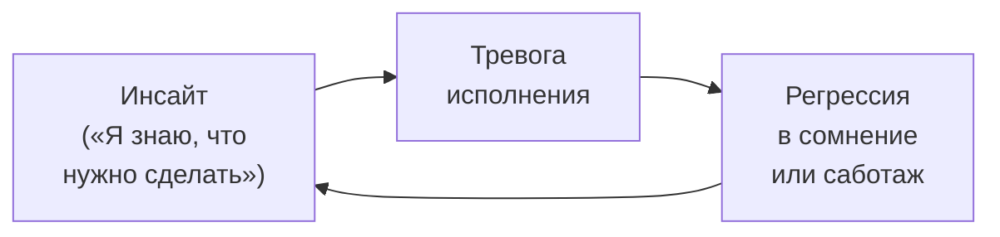
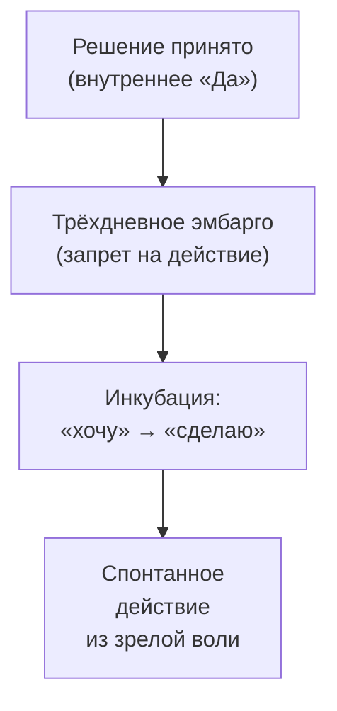

Человек точно знает, что ему нужно сделать: уволиться, разорвать разрушающие отношения, сказать «нет». Но каждый раз, когда он пытается заставить себя действовать, его парализует. Он ругает себя за слабость, а паралич только усиливается. **Метод укрепления воли** (МУВ) решает эту задачу парадоксально: вместо того чтобы подталкивать к действию, терапевт *запрещает* действовать в течение трёх дней. За это время мимолётное «хочу» трансформируется в зрелое волевое намерение.

Метод показан, когда когнитивный выбор уже осуществлён, но волевое намерение слишком слабо, чтобы преодолеть тревогу воплощения.

### Тревога выбора и тревога исполнения: почему знание не ведёт к действию

В экзистенциальном анализе воля — не слепой напор, а «орган будущего», способность перевести желаемое в реальность. Любое подлинное решение болезненно: оно требует «убийства» (от лат. *decidere* — отрезать) всех других альтернатив. Клиент страдает от страха перед необратимостью и **экзистенциальной изоляцией**: если он совершит поступок, он сам станет его неоспоримым автором.

Как только невротический клиент принимает решение, на него обрушивается ужас перед необходимостью физически его воплотить. Этот ужас настолько велик, что клиент регрессирует в спасительное сомнение.

### Инкубация: расщепление двух тревог

Активный ингредиент метода — **расщепление тревоги выбора и тревоги исполнения**. Когда терапевт предлагает: «Сохраните это намерение, но не смейте действовать три дня», он создаёт безопасный «инкубатор». Клиент легализует своё внутреннее «Да» без угрозы немедленных внешних последствий.

В эти три дня происходит трансформация: мимолётное «хотение» превращается в зрелое «волевое намерение». Тревога снижается. На её место приходит способность занять духовную позицию. Клиент привыкает к весу своего авторства. Спустя три дня действие рождается не из панического импульса, а из избытка накопленной внутренней аутентичности.

### Пошаговый протокол для терапевта

Терапевт занимает позицию спокойного, не давящего, но абсолютно твёрдого присутствия.

**Шаг 1. Конфронтация с параличом и остановка давления.** Терапевт переводит фокус с внешних препятствий на внутренний процесс. Пример: «Вы совершенно точно знаете, чего хотите, но каждый раз, когда пытаетесь заставить себя сделать шаг, вас парализует. Давайте прямо сейчас перестанем толкать вас в спину. Я запрещаю вам делать этот шаг сегодня».

**Шаг 2. Кристаллизация внутреннего согласия.** Терапевт помогает перевести расплывчатое желание в форму чёткого волевого акта. Пример: «Сформулируйте решение вслух. Не "мне следовало бы", а твёрдое: "Я принимаю решение сделать это, потому что это правильно для моей жизни"».

**Шаг 3. Экзистенциальная инкубация (парадоксальный запрет на действие).** Пример: «Можете ли вы оставить это решение себе на три дня? Не делать ничего для его реализации, а просто сохранить внутри как непоколебимое, тайное намерение?»

**Шаг 4. Инструкция по феноменологическому наблюдению.** Пример: «В течение трёх дней прислушивайтесь к себе. Наблюдайте, как тело, эмоции и совесть реагируют на факт, что решение уже живёт внутри вас. Позвольте ему просто быть вашим».

### Случай Елены: разрыв контракта с токсичным партнёром

Елена, 38 лет. Изматывающие, унижающие отношения с деловым партнёром. Она понимает, что должна разорвать контракт, но каждый раз откладывает тяжёлый разговор.

**Елена:** «Вчера он снова обесценил мою работу при всей команде. Я ехала домой и плакала. Я обещала себе утром положить ему на стол заявление о расторжении. Но пришла, он улыбнулся, предложил кофе, и я опять ничего не сказала. Я жалкая трусиха».

**Терапевт:** «Вы атакуете себя за отсутствие действия. Но настоящая проблема — в слабости внутреннего обязательства. Я запрещаю вам делать этот шаг сегодня. Вместо этого сформулируйте решение вслух: "Я принимаю решение разорвать контракт, потому что это правильно для моей жизни"».

**Елена** (глубокий вдох): «Я принимаю решение разорвать контракт, потому что это правильно для моей жизни. И потому что я больше не позволю себя унижать».

**Терапевт:** «Как эти слова отзываются в теле?»

**Елена:** «В груди стало горячо. И страшно. Но это ощущается как правда».

**Терапевт:** «Можете ли вы оставить это решение себе на три дня? Не начинать разговор, а просто сохранить его внутри как тайное намерение. В течение трёх дней прислушивайтесь к себе: как ваше тело, эмоции и совесть реагируют на факт, что решение уже принято?»

**Елена:** «Просто ходить на работу и знать, что ухожу, но молчать?»

**Терапевт:** «Именно. Позвольте решению просто быть вашим».

### Руководство для самостоятельной практики: Инкубатор Воли

Проблема не в том, что вы трус. Проблема в том, что вы пытаетесь прыгнуть, не построив фундамент. Настоящий поступок требует внутренней опоры. Разделите решение и его исполнение.

**Шаг 1. Декларация.** Возьмите лист бумаги и напишите одно решение, которое откладываете. Используйте формулу авторства: не «Мне надо бы...», а «Я принимаю решение [уволиться / сказать правду / переехать], потому что это мой выбор и моя жизнь».

**Шаг 2. Трёхдневное эмбарго.** Сложите лист и уберите. В ближайшие 72 часа ничего не делайте для исполнения решения. Запретите себе действовать. Это нужно, чтобы перестать паниковать и дать психике привыкнуть к новой реальности, в которой выбор уже сделан.

**Шаг 3. Дневник наблюдений.** Каждый вечер записывайте ответы на три вопроса:

| Вопрос | Ваш ответ |
|---|---|
| Как я чувствовал себя сегодня, зная, что решение принято? | ________ |
| С какими иллюзиями или надеждами я прощаюсь, отказываясь от других вариантов? | ________ |
| Какая энергия рождается в теле, когда меня никто не заставляет действовать прямо сейчас? | ________ |

> Через три дня вы обнаружите: когда вас не гонят в спину, решение прорастает корнями в вашу волю. Действие становится естественным, почти неизбежным следующим шагом.

### Противопоказания и типичные ошибки

**Абсолютные противопоказания:**
1. **Острый суицидальный риск.** Здесь нужны жёсткие антисуицидальные контракты, а не инкубация.
2. **Активное насилие.** Если клиентка решает уйти от избивающего мужа, предложение «подождать три дня» может стоить ей жизни.
3. **Острые психозы** со сниженным тестированием реальности.

**Типичное сопротивление клиента:** «Если буду ждать ещё три дня, я снова прокрастинирую!» Ответ: «Прокрастинация — это избегание решения и попытка спрятаться от тревоги. То, что делаем мы, — активное, осознанное выдерживание тревоги уже принятого решения. Вы заливаете бетон в фундамент воли».

**Типичная ошибка терапевта:** нравоучительство. Терапевт теряет терпение и апеллирует к «силе воли»: «Вы должны постараться!» Это подменяет внутреннюю волю клиента волей терапевта, инфантилизирует пациента и вызывает сопротивление. Смысл метода — отказаться от внешнего давления.

### Три маркера созревшей воли

1. **Сдвиг в языке (переход к авторству).** Пациент перестаёт использовать пассивные конструкции («меня вынуждают», «так сложилось», «я должен»). В его речи появляются: «Я хочу», «Я выбираю», «Я не буду».

2. **Телесное умиротворение.** В момент кризиса клиент выглядит дёрганым, дыхание поверхностно. После успешной инкубации появляется спокойствие: тело расслабляется, голос звучит ниже и твёрже. Прекратилась внутренняя борьба между «хочу» и «боюсь».

3. **Спонтанная инициация действия.** Клиент совершает поступок до окончания срока или точно в срок, причём без сверхусилий. Действие ощущается как естественное и единственно возможное.

### Заключение и Литература

Метод укрепления воли решает проблему паралича действия, когда клиент застрял в зазоре между знанием и поступком. Терапевт расщепляет тревогу выбора и тревогу исполнения, вводя трёхдневный парадоксальный запрет на действие. За это время мимолётное желание трансформируется в зрелое волевое намерение. Клиент привыкает к весу авторства, и действие рождается не из паники, а из накопленной внутренней аутентичности.

- Франкл, В. (1990). *Человек в поисках смысла*. М.: Прогресс.
- Ялом, И. (2020). *Экзистенциальная психотерапия*. М.: Класс.
- Лэнгле, А. (2019). *Персональный экзистенциальный анализ*. М.: Генезис.

---

**Контрольный вопрос:** Клиент три года не может уволиться с работы, которая его разрушает. Он говорит: «Я знаю, что надо уйти, но каждый понедельник снова прихожу». Как вы отличите прокрастинацию от ситуации, подходящей для метода укрепления воли, и какую формулировку используете на шаге 2?
