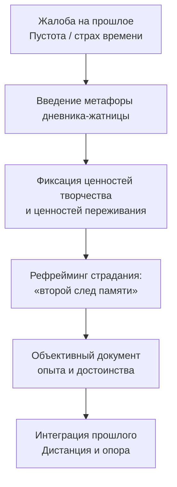

Клиент смотрит на свою жизнь как на худеющий настенный календарь: каждый оторванный листок — ещё одна утраченная возможность, ещё одно доказательство потраченных впустую лет. Такой взгляд порождает хроническую скуку, апатию и ощущение внутренней пустоты — состояние, которое Виктор Франкл называл **экзистенциальным вакуумом** *(Frankl, 1985)*.

Метод **«Дневника смыслов»** и техника **«Автобиографии под контролем»** (Элизабет Лукас) дают альтернативу. Терапевт помогает клиенту сменить угол зрения: прошлое — не кладбище надежд, а надёжная житница, в которой навсегда сохранены достижения, пережитая любовь и мужественно перенесённые страдания *(Frankl, 1985)*.

### Показания: когда применяют дневник смыслов

Метод показан при работе с **экзистенциальным вакуумом** — когда клиент жалуется на хроническую скуку, апатию и отсутствие жизненных целей *(Frankl, 1985)*. Техника строго показана при страхе старения и сожалениях о прошлом. Клиент в таком состоянии подобен пессимисту: он с печалью наблюдает, как kalendar становится тоньше, не замечая того, что уже положил в хранилище. Метод эффективен при работе с травматичным прошлым. Его применяют, когда клиент застрял в позиции жертвы и смотрит на свою историю исключительно с гневом и жалостью к себе *(Lukas, 2019a)*.

**Экзистенциальный дефицит.** Клиент блокирует способность к самотрансценденции. Он обесценивает прошлый опыт: видит в нём только упущенные возможности и пережитые несправедливости. Безусловная ценность собственной личности не признаётся.

**Противопоказания.** Метод не применяется при тяжёлых формах шизофрении с бредовыми включениями: пациент может использовать записи для конструирования патологической картины мира. В острой фазе шоковой травмы духовное ядро заблокировано. Требование искать смысл в свежей трагедии будет воспринято как насилие и морализаторство.

### Механизм: прошлое как «надёжная житница»

Активный ингредиент техники — целенаправленный **феноменологический сдвиг**. Терапевт переключает фокус внимания пациента с упущенных возможностей на реализованные реальности *(Frankl, 1985)*.

Прошлое не исчезает и не может быть отнято. Всё пережитое, всё созданное и всё выдержанное с достоинством навсегда помещается в хранилище бытия. Этот инсайт принципиально меняет отношение ко времени: пессимист-жертва боится завтра, человек с дневником смыслов уже знает, что вчера — в безопасности.

Механизм опирается на формирование **«второго следа памяти»** *(Lukas, 2019a)*. Письменная фиксация объективирует опыт: запись существует отдельно от автора и позволяет смотреть на него с дистанции. Человек реализует позицию *Homo Patiens* — человека страдающего, который способен трансформировать неизбежную боль в человеческое достижение.

### Протокол терапевта: четыре шага

Протокол требует от терапевта позиции **трагического оптимиста**: не отрицать боль клиента, но настойчиво искать в ней скрытый смысл.

**Шаг 1. Конфронтация с утекающим временем.** Терапевт прерывает жалобы клиента на упущенные годы. Он вводит концепцию сохранённого прошлого. Скрипт: «Вы смотрите на свою жизнь как на худеющий календарь. Вы боитесь каждого оторванного листка. Давайте изменим взгляд. Я предлагаю вам стать человеком, который снимает листок, делает на нём дневниковую запись и бережно сохраняет его. Никто не может отнять у вас то, что вы уже прожили».

**Шаг 2. Логотерапевтическая инвентаризация.** Терапевт поручает клиенту перенести воспоминания на бумагу. Фокус — на трёх категориях ценностей *(Frankl, 1985)*. Скрипт: «Запишите три события из прошлого. Первое — дело, которое вы честно выполнили. Второе — момент красоты или любви, который вы испытали. Третье — страдание, которое вы мужественно перенесли. Это ваши сокровища».

**Шаг 3. Закладка «второго следа памяти».** Терапевт помогает клиенту переформулировать негативные воспоминания. Жалоба на судьбу заменяется признанием личного достоинства. Скрипт: «Вы описали тяжёлый период. Теперь запишите рядом новый абзац — опишите ту же ситуацию, но с фокусом на том, как ваше духовное упрямство помогло вам выжить. Что эта ситуация сказала о вашей внутренней силе?».

**Шаг 4. Объективизация и дистанцирование.** Терапевт просит клиента посмотреть на записи как на завершённый человеческий документ. Скрипт: «Теперь этот текст существует отдельно от вас. Это документальное свидетельство вашего достоинства. Вы можете закрыть эту тетрадь и отложить её. Ваше прошлое в безопасности. Теперь мы смотрим в будущее».

### Кейсы: три примера из практики

**Кейс 1. Самотерапия Виктора Франкла.** После освобождения из нацистского концентрационного лагеря Франкл потерял отца, мать, брата и жену *(Frankl, 1985)*. Он применил метод письменной объективизации к самому себе: в течение девяти дней записал всё пережитое в лагере *(Lukas, 2019a)*. Книга была опубликована анонимно. Запись кошмарных воспоминаний сработала как экзистенциальный дневник — Франкл установил здоровую дистанцию по отношению к травме и перевёл страдание в категорию человеческого достижения.

**Кейс 2. Осмысление абсурда — журналист Петер Башер.** В период террора фракции «Красной армии» в Германии Башер переживал глубокий кризис смысла *(Lukas, 2019b)*. Он обратился к своим дневниковым записям о встречах с Франклом и зафиксировал ключевую мысль: не человек спрашивает жизнь о смысле — жизнь сама задаёт вопросы человеку ежедневно. Фиксация этой установки в тексте позволила Башеру совершить «коперниканский переворот» *(Frankl, 1985)*: перейти из позиции жертвы социального абсурда в позицию ответственного человека.

**Кейс 3. «Автобиография под контролем» (групповая логотерапия Лукас).** Пациенты с невротическими фиксациями на прошлом участвовали в серии сеансов по написанию структурированной автобиографии *(Lukas, 2019b)*. Терапевт систематически закладывал «второй след памяти», акцентируя внимание на безоговорочном достоинстве участников. Результат: спонтанное выражение глубокой благодарности и ощущение, что за кулисами жизни созидающая сила заботилась о них *(Lukas, 2019b)*. Выраженное снижение депрессивной симптоматики подтвердило эффективность метода.

### Руководство для самостоятельной работы: микрозадание (10 минут)

Ниже — алгоритм для самостоятельного ведения экзистенциального дневника.

| Шаг | Вопрос-подсказка | Формат записи |
| :--- | :--- | :--- |
| **1. Ценность дела** | Что я сегодня выполнил честно? | «Я горжусь тем, что сделал [действие]. Это навсегда останется моим» |
| **2. Ценность переживания** | Какой момент красоты или любви я пережил? | «Я пережил [опыт]. Никто не сотрёт этот момент из истории мира» |
| **3. Ценность отношения** | Какое страдание я выдержал с достоинством? | «Мне было больно, но я сохранил человеческое лицо в [событии]. Это моё величайшее достижение» |

Закройте дневник. Вы не теряете время — вы собираете урожай своей жизни.

### Ошибки терапевта и сопротивление клиента

**Типичное сопротивление.** Клиент говорит: «Зачем мне писать? Моё прошлое — сплошная боль и ошибки. Вы просто хотите, чтобы я занимался самообманом!» Ответ терапевта: «Мы не занимаемся самообманом. Ваша боль реальна. Но сейчас вы смотрите на прошлое через кривое зеркало, замечая только поражения. Я прошу вас взять ручку, чтобы задокументировать вашу силу. То, что вы выжили и сидите здесь, — доказательство вашего упрямства духа. Давайте запишем это».

**Типичная ошибка терапевта: поощрение жалости к себе.** Логотерапия категорически отвергает этот подход *(Lukas, 2019a)*. Если дневник превращается в список претензий к миру, терапевт обязан вмешаться. Фокус переводится с вопроса «Кто виноват?» на вопрос «Как я достойно ответил на этот удар?»

### Маркеры прогресса

1. **Исчезновение гипотезы притязаний.** Фразы «моя жизнь разрушена» или «я всё упустил» исчезают из речи клиента.
2. **Феномен парадоксальной благодарности.** При чтении дневника пациент испытывает спокойную гордость. Жизнь ощущается богаче и полнее, чем казалось раньше *(Lukas, 2019a)*.
3. **Возрастание ответственности в настоящем.** Клиент прекращает пассивное ожидание. Накопленный смысл прошлого становится топливом для активных решений сегодня.

### Заключение и Литература

Дневник смыслов — логотерапевтический инструмент, который превращает «худеющий календарь» в надёжную житницу достоинства. Терапевт последовательно переключает взгляд клиента с упущенного на реализованное, помогая сформировать «второй след памяти» через письменную объективизацию. Прошлое перестаёт быть угрозой и становится опорой. Человек страдающий — *Homo Patiens* — обнаруживает, что ни одно пережитое, полюбленное или мужественно выстраданное не было потрачено впустую.

- Frankl, V. E. (1985). *Man's Search for Meaning*. Washington Square Press.
- Frankl, V. E. (2005). *Сказать жизни «Да!»: психолог в концлагере*. Альпина нон-фикшн.
- Lukas, E. (2019a). *Источники осознанной жизни. Преврати проблемы в ресурсы*. Никея.
- Lukas, E. (2019b). *Учебник логотерапии. Представление о человеке и методы*. Московский институт психоанализа.

---

**Проверка понимания.** Клиент 58 лет обращается с жалобой: «Я всю жизнь работал, а теперь выхожу на пенсию и чувствую, что прожил впустую — мог сделать больше, не рискнул, не успел». Опираясь на протокол дневника смыслов, объясните: какой из четырёх шагов устранит «кривое зеркало» ретроспекции? Какой конкретный вопрос вы зададите клиенту на шаге 3, чтобы помочь ему обнаружить «ценность отношения» — не в обстоятельствах, а в том, как он их пережил?
