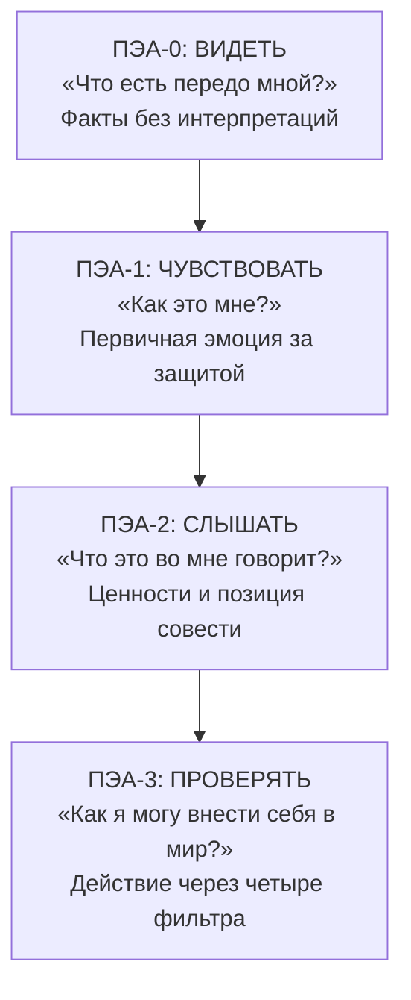

Человек реагирует на стресс автоматически — до того, как успевает подумать. Кто-то убегает: отмалчивается, уходит от конфликта. Кто-то атакует: взрывается гневом и упрёками. Кто-то погружается в гиперактивность: завален делами, чтобы не чувствовать. Кто-то замирает: застывает в тупике бесконечных сомнений. Это **психодинамические защитные реакции** — слепые автоматические ответы психики на дефицит в одной из фундаментальных мотиваций *(Längle, 2022)*.

**Персональный экзистенциальный анализ** (ПЭА) — метод Альфрида Лэнгле (1988–1990), — помогает пройти путь от сырого переживания к осознанному поступку через четыре последовательных шага. Его главная задача — искусственно замедлить процесс реагирования. Терапевт расщепляет слитный конгломерат из фактов, защитного аффекта и страха *(Längle, 2022)*. Человек выходит из позиции беспомощной жертвы собственных реакций и находит внутреннее согласие со своими первичными чувствами.

### Защитные реакции: когда психодинамика блокирует контакт

Когда человек сталкивается с дефицитом в одной из четырёх фундаментальных мотиваций (нехватка защиты, ценности, уважения или смысла), психика автоматически запускает одну из четырёх копинговых реакций *(Längle, 2022)*.

| Тип защиты | Проявление | Дефицит ФМ |
| :--- | :--- | :--- |
| **Бегство** | Отмалчивается, избегает контакта, уходит | 1-я ФМ: угроза безопасности |
| **Активизм** | Гиперзанятость, оправдания, «я должен работать» | Любая ФМ — как отвлечение |
| **Агрессия** | Гнев, раздражение, атака на другого | 2-я или 3-я ФМ: угроза ценности или достоинству |
| **Рефлекс мнимой смерти** | Ступор, паралич, искажение реальности | Тяжёлая угроза любой ФМ |

Психодинамика служит исключительно поддержанию жизни и снятию напряжения. Духовная мотивация ориентирована на ценности и формирование жизни *(Längle, 2022)*. ПЭА переводит человека из первого режима во второй.

> В отличие от когнитивно-поведенческих инструментов, ПЭА не ограничивается поиском логических ошибок. Его цель — мобилизация персональных сил через интеграцию чувств на духовном уровне.

### Четыре шага ПЭА: видеть, чувствовать, слышать, проверять

Каждый шаг решает свою антропологическую задачу. Вместе они описывают естественную здоровую динамику того, как духовное ядро человека (Person) перерабатывает переживания в диалоге с миром.

| Шаг | Вопрос | Установка | Задача |
| :--- | :--- | :--- | :--- |
| **ПЭА-0: Видеть** | «Что есть передо мной?» | «Я даю этому быть» | Сбор фактов, торможение защиты |
| **ПЭА-1: Чувствовать** | «Как это мне?» | «Я позволяю себе чувствовать» | Фиксация первичной эмоции за защитным аффектом |
| **ПЭА-2: Слышать** | «Что это во мне говорит?» | «Я даю этому в себе говорить» | Занятие аутентичной позиции |
| **ПЭА-3: Проверять** | «Как я могу внести себя в мир?» | «Я даю себе подействовать на мир» | Воплощение воли через четыре фильтра |

**ПЭА-0 — Видеть: торможение защиты фактами.** Человек описывает ситуацию конкретно: что произошло, кто участвовал, когда и где. Никаких интерпретаций, мнений или оценок. Этот шаг тормозит автоматическую защитную реакцию и укрепляет связь с реальностью. Скрипт: «Давайте на мгновение отложим ваши выводы. Что именно произошло фактологически? Какие конкретно слова были сказаны?»

**ПЭА-1 — Чувствовать: обход защитного аффекта.** Терапевт ищет первичную эмоцию, скрытую за защитой. За гневом часто прячется обида, за высокомерием — страх отвержения. Скрипт: «Я вижу ваше раздражение, но это лишь защитный щит. Какое самое первое, тихое чувство возникло у вас за секунду до вспышки гнева? Позвольте этому чувству быть здесь».

**ПЭА-2 — Слышать: занятие позиции.** Переживающее «Я» отходит на дистанцию от непосредственных эмоций (**самодистанцирование**). Клиент рассматривает их, понимает феноменологическое значение и сопоставляет с жизненными ценностями. Скрипт: «Отойдите на шаг в сторону и посмотрите на это чувство. О какой важной ценности оно вам сообщает? Согласны ли вы внутренне с тем, что происходит?»

**ПЭА-3 — Проверять: аутентичное действие.** Персональный ответ воплощается в мире. Действие проходит через четыре фильтра:

| Фильтр | Назначение | Пример вопроса |
| :--- | :--- | :--- |
| **Стыда** | Что должно остаться только моим | «Всё ли из этого я готов показать другим?» |
| **Модальностей** | Выбор способа и инструмента | «Позвонить, написать или попросить кого-то?» |
| **Разума** | Соразмерность и выбор адресата | «Кому и как?» |
| **Временной** | Выбор подходящего момента | «Сейчас или стоит подождать?» |

### Кейсы: три примера защитных реакций

**Кейс 1. Защита через раздражение: мужчина 33 лет.** Клиент обратился из-за постоянных ссор с женой: она регулярно планировала выходные с друзьями, не советуясь с ним *(Längle, 2022)*. Его защитная реакция — агрессия (раздражение и упрёки). **ПЭА-0:** жена не принуждала его — она предлагала присоединиться. **ПЭА-1:** за защитным раздражением обнаружилось первичное чувство одиночества и пренебрежения. **ПЭА-2:** клиент осознал: он строит отношения иначе — очень внимателен к потребностям партнёра. Поведение жены обесценивало эту установку, порождая чувство несправедливости. **ПЭА-3:** вместо скандала — письмо жене, объясняющее его чувства одиночества с предложением компромисса: информировать заранее.

**Кейс 2. Защита через активизм и оправдания: ожидающий ребёнка отец.** Беременная жена страдала от депрессии и страхов. Муж защищался от тревоги с помощью обесценивания и активизма *(Lukas, 2019)*. Он бил жену ночью за то, что та будила его страхами, и оправдывался: «Я должен зарабатывать деньги, я должен быть в форме!» Терапевт жёстко остановил поток оправданий (**ПЭА-0**). Затем, пробивая защитную «броню», нацелил вопросы на первичную эмоцию (**ПЭА-1 и ПЭА-2**): врач противопоставил защитному поведению высшие ценности — ценность ребёнка, ценность правды. Оболочка оправданий рухнула. Клиент признал неадекватность своей защиты и смог проявить подлинное отношение к страданиям жены.

**Кейс 3. Защита через интеллектуализацию: Хол Стейнмен.** Успешный психолог-исследователь Хол терял контроль и впадал в ярость при общении с сыном-подростком *(Bugental, 2001)*. На сессиях он защищался от эмоций тотальной интеллектуализацией: превращал себя в объект исследования, рассуждая о причинах гнева как отстранённый учёный. Терапевт категорически блокировал когнитивную защиту (**ПЭА-0**). Он запрещал клиенту искать «почему» и требовал сфокусироваться на «что есть прямо сейчас»: «Вы снова пытаетесь вычислить себя как головоломку. Просто позвольте мне слышать, что происходит внутри». Клиент прошёл через шесть слоёв защиты. За маской холодной аналитики обнаружилась подлинная уязвимость *(Bugental, 2001)*.

### Руководство для самостоятельной практики

Когда ситуация вызывает сильные эмоции и вы не знаете, как поступить, пройдите по четырём шагам ПЭА письменно.

**1. Видеть — запишите голые факты.** Что конкретно произошло? Кто что сказал? Никаких оценок.

**2. Чувствовать — назовите свои чувства.** «Как мне от этого?» Запишите первую эмоцию (часто это защитная реакция: злость, раздражение). Затем: «А что стоит *за* этой злостью?». За гневом нередко прячутся обида, страх или одиночество.

**3. Слышать — найдите свою позицию.** Отойдите на дистанцию от эмоций. «Что *это во мне* говорит? Какая ценность затронута? Что я считаю правильным?» Запишите позицию одним предложением.

**4. Проверять — спланируйте действие через фильтры.**

| Вопрос фильтра | Ваш ответ |
| :--- | :--- |
| Что из этого должно остаться только моим? | ________ |
| Каким способом лучше выразить свою позицию? | ________ |
| Кому я это говорю и как он отреагирует? | ________ |
| Когда лучший момент для этого? | ________ |

> Цель ПЭА — не найти «правильный» ответ извне, а обнаружить свою аутентичную внутреннюю позицию. Решение рождается не из теории, а из честного контакта с собственным переживанием.

### Противопоказания и типичные ошибки

**Противопоказания.** ПЭА не применяется в полном объёме при острых психозах и в острой фазе шока *(Längle, 2022)*. В состоянии шока духовное ядро заблокировано. Попытка пробиться к эмоциям (ПЭА-1) спровоцирует ретравматизацию. Терапия строго ограничивается ПЭА-0: укрепление связи с реальностью, обеспечение покоя и безопасности.

**Типичное сопротивление.** Клиент заявляет: «Я ничего не чувствую, внутри просто пустота» или «Зачем мы об этом говорим, это слишком больно». Ответ: нельзя форсировать эмоции. Терапевт переходит на мета-уровень и делает предметом разговора саму защиту *(Längle, 2022)*: «Вам сейчас очень трудно говорить об этом. Почему эта тема вызывает такую сильную боль, что вам приходится закрываться пустотой? Что мы можем сделать прямо сейчас, чтобы вам стало безопаснее?» Это возвращает контроль клиенту и снижает тревогу.

**Ошибка терапевта: морализаторство.** Если на ПЭА-3 терапевт диктует клиенту, как именно тот должен поступить, — он лишает пациента свободы. Терапевт — акушер смысла. Решение всегда принимает сам пациент.

### Маркеры прогресса

1. **Смена языкового регистра.** Слова-оправдания («меня вынудили», «я не мог иначе») исчезают. Появляются: «я решаю», «я даю внутреннее согласие».
2. **Восстановление телесной витальности.** Растворение «брони» сопровождается глубоким вздохом, расслаблением плечевого пояса и появлением спонтанных жестов.
3. **Разблокировка действия.** Исчезает разрыв между намерением и поступком. Пациент реализует задуманное без надрыва и прокрастинации.

### Заключение и Литература

Персональный экзистенциальный анализ Лэнгле — метод переработки индивидуального опыта через четыре шага: видеть (факты), чувствовать (первичная эмоция за защитой), слышать (позиция совести) и проверять (действие через фильтры). Психодинамические защитные реакции — бегство, агрессия, активизм, ступор — автоматически блокируют аутентичный контакт с миром. ПЭА искусственно замедляет этот процесс и помогает человеку выйти из режима слепой защиты в режим ценностного выбора.

- Bugental, J. F. T. (2001). *Искусство психотерапевта*. Питер.
- Längle, A. (2022). *Основы экзистенциального анализа*. Питер.
- Lukas, E. (2019). *Учебник логотерапии. Представление о человеке и методы*. Московский институт психоанализа.
- Лэнгле, А. (2019). *Персональный экзистенциальный анализ*. М.: Генезис.

---

**Контрольный вопрос:** Клиент злится на коллегу, который присвоил его идею на совещании. На ПЭА-0 клиент говорит: «Он намеренно хотел меня унизить». (а) Почему это уже НЕ ПЭА-0, а интерпретация? Как вы вернёте клиента к факту? (б) На ПЭА-1 клиент настаивает: «Внутри ничего — только злость». Какой именно вопрос вы зададите, чтобы помочь ему обнаружить первичную эмоцию за защитным гневом? Назовите, какую из четырёх фундаментальных мотиваций, вероятнее всего, задела эта ситуация — и почему.
