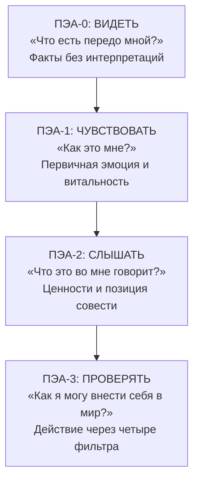

Человек чувствует, что застрял. Ситуация давит, эмоции захлёстывают, а разум крутится по кругу. Он знает, что надо что-то решить, но не понимает, чего на самом деле хочет. **Персональный экзистенциальный анализ** (ПЭА) — метод Альфрида Лэнгле, разработанный в 1988–1990 годах, — помогает пройти путь от сырого переживания к осознанному поступку через четыре последовательных шага.

В отличие от когнитивно-поведенческих инструментов (например, дневника СМЭР), ПЭА не ограничивается поиском логических ошибок. Его цель — мобилизация персональных сил, интеграция чувств на духовном уровне и нахождение **внутреннего согласия** с собственными действиями.

### Когда применять ПЭА: показания и ограничения

ПЭА показан при дезориентации, нерешительности, эмоциональной захваченности (когда человек чувствует себя жертвой обстоятельств), а также при поиске себя как личности в ситуациях, когда трудно понять себя или окружающий мир.

**Противопоказания:** острые психозы и фазы шока в кризисных ситуациях, когда человеку требуются покой, защита и опора.

Метод подчёркивает ценность **субъективного переживания** как единственного адекватного доступа к миру человека. Поэтому ПЭА требует феноменологического, понимающего подхода, а не простого теоретизирования.

### Четыре шага ПЭА: видеть, чувствовать, слышать, проверять

Каждый шаг решает свою антропологическую задачу. Вместе они описывают естественную здоровую динамику того, как духовное ядро человека (Person) перерабатывает переживания в диалоге с миром.

| Шаг | Вопрос | Установка | Задача |
|---|---|---|---|
| ПЭА-0: Видеть | «Что есть передо мной?» | «Я даю этому быть» | Сбор фактов без интерпретаций |
| ПЭА-1: Чувствовать | «Как это мне?» | «Я позволяю себе чувствовать» | Фиксация первичной эмоции |
| ПЭА-2: Слышать | «Что это во мне говорит?» | «Я даю этому в себе говорить» | Занятие аутентичной позиции |
| ПЭА-3: Проверять | «Как я могу внести себя в мир?» | «Я даю себе подействовать на мир» | Воплощение воли через фильтры |

### Шаг 0 — Видеть: сбор фактов и связь с реальностью

Человек описывает ситуацию конкретно: что произошло, кто участвовал, когда и где. Никаких интерпретаций, мнений или фантазий. Экзистенциальный анализ работает с предметными фактами. Этот шаг укрепляет связь с реальностью и требует **самопринятия** — готовности признать то, что есть.

### Шаг 1 — Чувствовать: что ситуация делает со мной

Человек погружается в непосредственное, ещё не переработанное состояние «запрошенности» ситуацией. Он фиксирует первичную эмоцию, затронутость и витальную силу, которая приходит в движение. Субъективно это переживается как чувство, ведущее к импульсу.

Установка: «Я позволяю себе чувствовать то, что чувствую». При нарциссических расстройствах этот шаг часто применяется как базовый, поскольку таким клиентам необходима близость к собственным переживаниям.

### Шаг 2 — Слышать: занятие позиции через совесть

Переживающее «Я» отходит на дистанцию от непосредственных эмоций (**самодистанцирование**), чтобы рассмотреть их, понять феноменологическое значение и сопоставить с жизненными ценностями. Совесть согласовывает интуитивное чутьё с тем, что человек считает правильным.

На этом этапе формируется ядро воли. Человек находит свою аутентичную внутреннюю позицию.

### Шаг 3 — Проверять: действие через четыре фильтра

Персональный ответ воплощается в мире. Это не слепое отреагирование аффекта, а продуманный поступок. Чтобы действие было успешным, оно проходит через четыре фильтра:

| Фильтр | Назначение | Пример вопроса |
|---|---|---|
| Фильтр стыда | Осознание границ: что должно остаться только моим | «Всё ли из этого я готов показать другим?» |
| Фильтр модальностей | Выбор способа и инструмента | «Позвонить, написать, попросить кого-то?» |
| Фильтр разума | Соразмерность и оценка адресата | «Кому я это говорю и как он отреагирует?» |
| Временной фильтр | Выбор подходящего момента | «Сейчас или стоит подождать?» |

### Клинический пример: напряжение в браке

Мужчина 33 лет обратился к консультанту из-за растущего напряжения в браке.

**ПЭА-0 (Факты).** Жена планирует выходные, не учитывая его желания и не спрашивая, хочет ли он провести время с ней.

**ПЭА-1 (Впечатление).** Пациент испытывал сильную злость и раздражение. Однако при углублении в эмоцию выяснилось, что за раздражением (защитной реакцией) стояли глубокое чувство одиночества, обида и ощущение пренебрежения.

**ПЭА-2 (Позиция).** Клиент осознал, что сам строит отношения иначе — он очень внимателен к потребностям партнёра и ставит отношения выше многих вещей. Поведение жены обесценивало его фундаментальную установку. Отсюда — чувство глубокой несправедливости.

**ПЭА-3 (Действие).** Пройдя через фильтры, клиент решил написать жене электронное письмо (фильтр модальности: личная беседа часто переходила во взаимные упрёки). В письме он планировал изложить свои чувства одиночества, подчеркнуть, что понимает её потребность в социальных контактах, но предложить конкретное решение: чтобы она информировала его *до* принятия решений о планах на выходные.

### Руководство для самостоятельной практики

Когда ситуация вызывает сильные эмоции и вы не знаете, как поступить, пройдите по четырём шагам ПЭА письменно.

**1. Видеть — запишите голые факты.**
Опишите ситуацию без оценок. Что конкретно произошло? Кто что сказал? Когда и где?

**2. Чувствовать — назовите свои чувства.**
Ответьте на вопрос «Как мне от этого?». Запишите первую эмоцию (часто это защитная реакция: злость, раздражение). Затем задайте себе: «А что стоит *за* этой злостью?». Часто за гневом прячутся обида, страх или одиночество.

**3. Слышать — найдите свою позицию.**
Отойдите на дистанцию от эмоций. Задайте себе: «Что *это во мне* говорит по данному поводу? Какая ценность затронута? Что я считаю правильным?». Запишите свою позицию одним предложением.

**4. Проверять — спланируйте действие через фильтры.**

| Вопрос фильтра | Ваш ответ |
|---|---|
| Что из этого должно остаться только моим? | ________ |
| Каким способом лучше выразить свою позицию? | ________ |
| Кому я это говорю и как он отреагирует? | ________ |
| Когда лучший момент для этого? | ________ |

> Цель ПЭА — не найти «правильный» ответ извне, а обнаружить свою аутентичную внутреннюю позицию. Решение рождается не из теории, а из честного контакта с собственным переживанием.

### Заключение и Литература

Персональный экзистенциальный анализ Лэнгле — метод переработки индивидуального опыта через четыре шага: видеть (факты), чувствовать (первичная эмоция), слышать (позиция совести) и проверять (действие через фильтры стыда, модальности, разума и времени). Метод помогает при дезориентации, нерешительности и эмоциональной захваченности. В отличие от когнитивно-поведенческих инструментов, ПЭА не ищет логические ошибки, а мобилизует духовное ядро человека для нахождения аутентичного внутреннего согласия.

- Лэнгле, А. (2019). *Персональный экзистенциальный анализ*. М.: Генезис.
- Франкл, В. (1990). *Человек в поисках смысла*. М.: Прогресс.

---

**Контрольный вопрос:** Клиент злится на коллегу, который присвоил его идею на совещании. Проведите клиента через все четыре шага ПЭА. Какой вопрос вы зададите на этапе ПЭА-1, чтобы помочь ему обнаружить чувство за защитной злостью?
