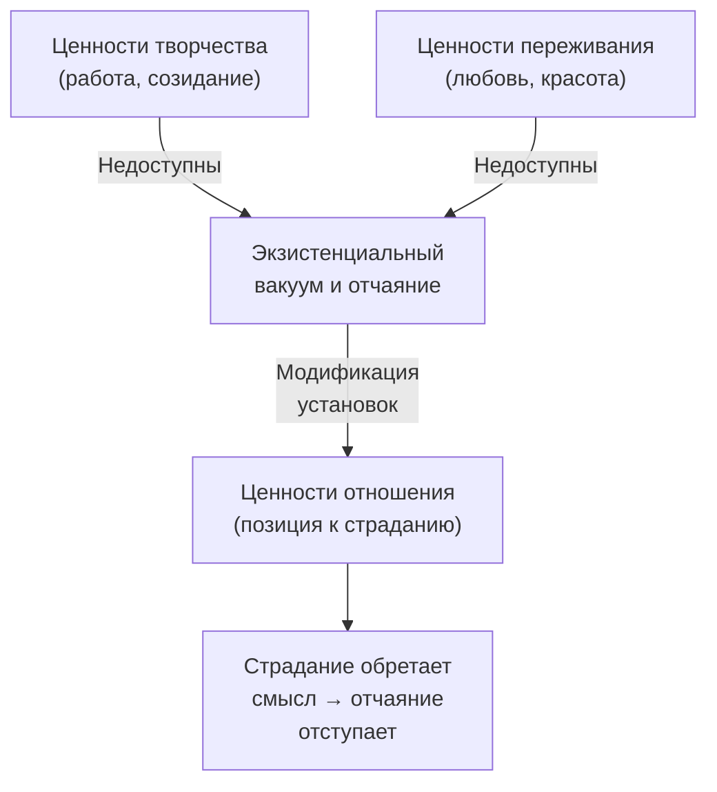

Человек столкнулся с неизменной, неотвратимой судьбой: неизлечимая болезнь, потеря близкого, необратимая ошибка прошлого. Действовать нечем — все двери закрыты. Остаётся только отчаяние. **Модификация установок** (модуляция установок) — метод логотерапии, который помогает в этой крайней точке. Он показывает: даже когда невозможно изменить обстоятельства, остаётся последняя свобода — выбрать своё отношение к страданию.

Техника применяется исключительно к «**трагической триаде**» человеческого существования: неизбежному страданию, непоправимой вине и смерти. Её категорически нельзя использовать, если ситуацию можно объективно исправить действием.

### Ценности отношения: смысл там, где закрыты все двери

Франкл выделял три категории ценностей, через которые человек реализует смысл: **ценности творчества** (то, что мы отдаём миру), **ценности переживания** (то, что мы получаем от мира) и **ценности отношения** (позиция, которую мы занимаем, когда первые две категории недоступны).

Модификация установок работает с дефицитом доступа к ценностям творчества и переживания. Пациент не может работать и не может наслаждаться. Он страдает от духовной слепоты: не понимает, что даже в тисках судьбы сохраняет высшую свободу — выбрать своё отношение.

> Страдание без необходимости — мазохизм, а не героизм. Модификация установок — оружие последнего рубежа. Если ситуацию можно изменить действием, пациент должен действовать.

### Упрямство духа: почему переосмысление исцеляет отчаяние

Активный ингредиент техники — **«упрямство духа»** (ноэтическое сопротивление). Страдание возникает как разрыв между тем, что *есть*, и тем, что *должно быть*. Пациент-жертва смотрит исключительно на закрытые двери.

Терапевт производит **коперниканский переворот**: смещает фокус с утраченного на оставшееся. В этот момент активируется *Homo Patiens* — человек страдающий, способный на наивысшее достижение: трансформировать трагедию в нравственный триумф. Страдание перестаёт быть слепым и разрушающим, когда находит свой смысл.

### Пошаговый протокол для терапевта

Терапевт занимает позицию «трагического оптимиста»: не утешает дешёвыми фразами, а с уважением бросает вызов духовному ядру пациента.

**Шаг 1. Конфронтация с судьбой (разделение данности и свободы).** Терапевт признаёт трагедию, но указывает на оставшееся пространство. Пример: «То, что с вами произошло, — необратимо. Это жестокий факт. Но прямо сейчас вы позволяете этой трагедии отнять не только прошлое, но и ваше достоинство в настоящем. Кто прямо сейчас выбирает, как реагировать?»

**Шаг 2. Признание ценности страдания.** Терапевт показывает мужество пациента. Пример: «То, что вы несёте этот крест и продолжаете жить, — это не слабость. Это свидетельство огромного мужества. То, как вы справляетесь с этим неизбежным ударом, является одним из величайших человеческих достижений».

**Шаг 3. Сократический сдвиг (игра с альтернативами).** Терапевт открывает новый угол зрения. Пример: «Что было бы, если бы это случилось не с вами, а с тем, кого вы любите больше всего? Какую цену вы платите сейчас своими страданиями, чтобы избавить близких от этой боли?»

**Шаг 4. Апелляция к наследию.** Терапевт связывает страдание с перспективой и оставшимися возможностями. Пример: «Ваши физические возможности ограничены. Но духовное пространство нетронуто. Каким человеком вы хотите остаться в памяти близких? Какой пример вы покажете сегодня?»

### Случай Виктора: хирург, потерявший руку

Виктор, 45 лет, бывший хирург. Полгода назад он потерял правую руку в аварии. Глубочайшая депрессия, отказ от встреч с друзьями, тиранит жену упрёками.

**Виктор:** «На что мне смотреть? Вся моя идентичность была в скальпеле. Без него я никто. Судьба посмеялась надо мной. Я обрубок, я беспомощная жертва нелепой случайности».

**Терапевт:** «Судьба забрала вашу руку, Виктор. Это трагедия, которую я не смею преуменьшать. Но судьба не заставляла вас сегодня утром кричать на жену. Это сделали вы. Вы не жертва — вы человек, который прямо сейчас принимает решение сдаться».

**Виктор** (зло): «Вы не понимаете! У меня забрали дело жизни!»

**Терапевт:** «У вас забрали возможность реализовывать ценности творчества. Да, вы больше не хирург. Но вы по-прежнему муж, по-прежнему мыслящий человек. Вы всю жизнь спасали людей скальпелем, когда были сильны. Теперь у вас есть шанс спасти достоинство вашей семьи, будучи уязвимым. Что, если ваша текущая, самая сложная операция — это показать жене и коллегам, как человек переносит крушение карьеры, не теряя человеческого лица?»

**Виктор** (молчит долго, злость сменяется задумчивостью): «Вы хотите сказать, что я могу быть полезен тем, *как* я терплю это?»

**Терапевт:** «Именно. Ни одна авария не может лишить вас возможности показать пример мужества. Жизнь по-прежнему ждёт от вас ответа. Каким он будет сегодня вечером, когда жена вернётся с работы?»

### Карта свободы: руководство для самостоятельной практики

Когда случается непоправимое, человеку кажется, что жизнь загнала его в угол. Но здоровье, деньги или статус можно отнять. Последнюю свободу — свободу выбрать, **как** относиться к удару, — не может отнять никто.

**Шаг 1. Инвентаризация судьбы (что я не могу изменить).** Напишите голые факты ситуации без эмоций. Скажите вслух: «Это моя данность. Я признаю, что не могу изменить этот факт».

**Шаг 2. Поиск свободного пространства (что осталось моим).** Ответьте на вопросы:
- Чего эта ситуация *не* смогла у меня отнять? (Мой разум, способность говорить, моральные принципы, способность любить).
- Какие три реакции доступны мне прямо сейчас?

| Реакция | Описание |
|---|---|
| Пассивная | Запереться и жалеть себя |
| Разрушительная | Срывать злость на близких |
| Достойная | Принять ситуацию и найти в ней смысл |

**Шаг 3. Обретение смысла (моя новая задача).** Ответьте честно:
- Как я могу превратить это испытание в личный триумф?
- Для кого прямо сейчас важно увидеть, что я не сломался?
- Какой урок я смогу передать другим, оказавшимся в подобной ситуации?

Назначьте задачу на сегодня: «Я не могу изменить то, что произошло, но сегодня решаю перенести это с достоинством ради ________».

### Противопоказания и типичные ошибки

**Абсолютные противопоказания:**
- **Острые психотические состояния и тяжёлая эндогенная депрессия.** Требовать от пациента в разгаре бреда или меланхолии «героически нести крест» — преступно. Это усугубит чувство вины.
- **Избегаемое страдание.** Нельзя применять, если пациент терпит побои супруга или работает на нелюбимой работе, которую может сменить. Если проблему можно решить действием, пациент должен действовать.

**Типичное сопротивление клиента:** «Это красивые философские слова. Они не уменьшают боль. Вы просто хотите, чтобы я смирился». Ответ: «Я не прошу смиряться. Я прошу перестать быть пассивным зрителем своей боли и стать её хозяином. Страдание останется, но перестанет быть бессмысленным, если вы поймёте, ради чего его переносите».

**Типичная ошибка терапевта:** морализаторство вместо сократического диалога. Логотерапевт — не священник, навязывающий смысл. Он «протирает линзы» пациента, задавая вопросы, пока тот *сам* не увидит смысл. Навязывание своего смысла лишает пациента экзистенциальной ответственности.

### Три маркера выхода из позиции жертвы

1. **Исчезновение гипотезы притязаний.** Пациент перестаёт использовать фразы «Жизнь мне должна», «Это несправедливо», «Если бы только...». В его словаре появляются формулировки: «Я принимаю», «Я решаю», «Несмотря на это...».

2. **Ослабление эгоцентрической гиперрефлексии.** Фокус смещается на внешний мир: пациент интересуется делами близких, предлагает поддержку другим.

3. **Феномен парадоксальной благодарности.** Тихая гордость за умение выдерживать удар. Пациент осознаёт, что страдание сделало его более эмпатичным и зрелым. В его глазах исчезает паника загнанного зверя и появляется достоинство.

### Заключение и Литература

Модификация установок — метод логотерапии для ситуаций столкновения с неизменной судьбой: неизбежным страданием, непоправимой виной и смертью. Терапевт активирует «упрямство духа» пациента, смещая фокус с утраченного на оставшееся свободное пространство. Человек обнаруживает ценности отношения — высшую категорию смыслов, доступную даже тогда, когда ценности творчества и переживания закрыты. Метод противопоказан при психозах, эндогенной депрессии и в ситуациях, где страдание можно предотвратить действием.

- Франкл, В. (1990). *Человек в поисках смысла*. М.: Прогресс.
- Лукас, Э. (2020). *Учебник логотерапии*. М.: Новый Акрополь.

---

**Контрольный вопрос:** Пациентка потеряла ребёнка и застряла в формуле «Жизнь мне должна». Как вы определите, готова ли она к модификации установок, и какой сократический вопрос зададите на шаге 3, чтобы помочь ей обнаружить ценность отношения?
