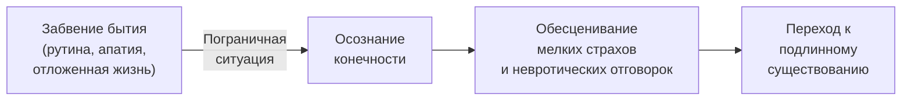

Человек жалуется на пустоту, скуку и ощущение застоя. Он откладывает важные решения, терпит то, что его разрушает, и ждёт, когда «настоящая жизнь» начнётся сама. За этой апатией скрывается забытый факт: время ограничено. **Пробуждение осознавания смерти** — техника экзистенциальной терапии, которая использует конечность жизни как катализатор перемен.

Это руководство описывает механизм техники, пошаговый терапевтический протокол, клинический пример и упражнения для самостоятельной практики. Метод показан при хронической апатии, синдроме отложенной жизни и параличе воли.

### Иллюзия бесконечного времени: корень апатии

Техника применяется, когда клиент пребывает в **экзистенциальном вакууме** — состоянии хронической пустоты и потери направленности. Человек воспринимает нынешнее существование как репетицию настоящей жизни, ожидающей его впереди. Он страдает **синдромом отложенной жизни**: «когда-нибудь», «когда дети вырастут», «когда заработаю достаточно».

Экзистенциальный дефицит заключается в отрицании смерти. Забывая о конечности, человек уклоняется от необходимости делать выбор и создавать смыслы. Иллюзия бесконечного времени позволяет ему избегать ответственности за собственную жизнь.

> Смерть в этой технике рассматривается не как клиническая фобия, а как забытая конечная данность существования. Отрицание этой данности ведёт к сужению жизненного опыта и омертвению.

### Пограничная ситуация: как смерть пробуждает жизнь

Механизм действия техники опирается на концепцию **«пограничной ситуации»** (К. Ясперс, И. Ялом). Столкновение с неизбежностью личной смерти вырывает человека из повседневного «забвения бытия» и переводит в состояние подлинного осознавания.

Осознание того, что время истекает, радикально обесценивает невротические отговорки. Интеграция идеи смерти действует не как приговор, а как мощный стимул. Франкл описывал человека, который со страхом смотрит на худеющий отрывной календарь. Терапевт помогает ему осознать: каждый прожитый день можно превратить в спасение реальностей — перенести в «полные житницы прошлого».

**Существование не может быть отложено.** По-настоящему жить возможно только в настоящем.

### Пошаговый протокол для терапевта

Протокол требует от терапевта присутствия и готовности выдерживать тревогу вместе с клиентом.

**Шаг 1. Феноменологическая остановка.** Терапевт прерывает поток жалоб и фиксирует клиента в настоящем моменте. Пример: «Я слушаю вас полчаса и чувствую, как по кругу ходят ваши мысли. Вы словно ждёте, когда начнётся настоящая жизнь. Что вы чувствуете в теле прямо сейчас, осознавая, что время уходит?»

**Шаг 2. Введение пограничной ситуации.** Терапевт вводит перспективу конечности с помощью жёсткого, но эмпатичного вопроса. Пример: «Сколько ещё зим вы готовы прожить точно так же, как эту? Три? Десять? Вы понимаете, что их количество ограничено?»

**Шаг 3. Проекция на смертный одр.** Терапевт создаёт искусственный пограничный опыт с помощью воображения. Пример: «Представьте, что вы близки к смерти. Вы оглядываетесь на свою жизнь — на ту жизнь, которую ведёте сейчас. Что чувствуете? О чём сожалеете больше всего?»

**Шаг 4. Возврат ответственности.** После того как клиент соприкоснётся с сожалением о непрожитой жизни, терапевт переводит это чувство в топливо для действий. Пример: «Это сожаление — голос вашей непрожитой жизни. Пока вы живы, у вас есть возможность всё изменить. Что конкретно мы можем сделать сегодня, чтобы в ваш последний час этого сожаления не было?»

### Случай Марии: пять лет в зале ожидания

Мария, 45 лет. Жалуется на тотальную апатию, отсутствие смысла и ощущение застоя в нелюбимой профессии и пресном браке. Постоянно говорит, что «когда-нибудь» всё изменится, но ничего не предпринимает на протяжении пяти лет.

**Мария:** «Я чувствую себя пустой. Дни идут, я хожу на работу, возвращаюсь к мужу, мы смотрим телевизор. Я жду, что однажды проснусь, и у меня появится энергия. Но пока я как будто в зале ожидания».

**Терапевт:** «Вы находитесь в этом зале ожидания уже пять лет. Ждёте поезда, который не придёт сам по себе. Представьте, что вы в самом конце пути. Вам осталось несколько часов. Вы оглядываетесь на свою жизнь, на эти годы в "зале ожидания". Что чувствуете?»

**Мария** (глаза наполняются слезами): «Сожаление. Жуткое сожаление. О том, что зря потратила жизнь, так и не узнав, чем могла бы быть. Я всю жизнь боялась рискнуть».

**Терапевт:** «И теперь, стоя у края, вы видите: страх риска украл у вас вашу жизнь. Стрелки часов движутся непрерывно, и тайм-аутов не бывает».

**Мария:** «Это ужасно. Я как дублёр, который смотрит пьесу из-за кулис и надеется выйти на сцену, но спектакль заканчивается».

**Терапевт:** «Именно. Но сейчас спектакль ещё идёт. Вы живы. Каким будет ваш первый шаг на сцену сегодня?»

Экзистенциальная вина («сожаление») использована здесь как конструктивная сила — советчик, возвращающий клиента к авторству своей жизни.

### Два упражнения для самостоятельной практики

Выполните эти упражнения в тишине и уединении. Они помогут честно посмотреть на главный факт: ваше время ограничено.

**Упражнение 1: Линия вашей жизни**

1. Начертите горизонтальную линию. Левый конец — момент рождения. Правый — момент смерти.
2. Поставьте крестик на том месте, где вы находитесь сейчас.
3. Посмотрите на отрезок справа. Задайте себе: «Сколько ещё зим мне отпущено? На что я трачу этот отрезок прямо сейчас?»
4. Смотрите на крестик пять минут. Позвольте себе почувствовать дискомфорт — это просыпается воля к жизни.

**Упражнение 2: Встреча со своим некрологом**

1. Напишите свой некролог так, как если бы вы умерли сегодня. Что там будет? О чём была ваша жизнь? Чего вы боялись?
2. Напишите «идеальный» некролог — текст о человеке, которым вы хотели стать, но не решались.
3. Сравните два текста. Разница между ними — ваша **экзистенциальная вина** за нереализованный потенциал. Пусть она станет топливом, чтобы сегодня сделать один смелый шаг навстречу «идеальному» некрологу.

> Хотя реальность смерти разрушает нас физически, сама идея смерти может нас спасти. Осознание конечности позволяет перестать откладывать жизнь и начать жить по-настоящему.

### Противопоказания и типичные ошибки

**Противопоказания:**
- **Тяжёлая меланхолическая (эндогенная) депрессия** с выраженной психомоторной заторможенностью и бредом вины. Разрыв между «бытием» и «долгом» уже гипертрофирован. Обращение к смерти может спровоцировать обострение и суицид. Требуется медикаментозное лечение.
- **Острые психозы.**

**Типичное сопротивление клиента:** «Зачем думать о смерти? Это депрессивно. Мы ничего не можем с этим поделать!» Ответ: «Осознание конечности позволяет перестать откладывать жизнь и начать жить по-настоящему прямо сейчас».

**Типичная ошибка терапевта:** уход в интеллектуализацию. Терапевт сам боится темы смерти и позволяет клиенту превратить переживание в абстрактную философскую дискуссию. Смерть обсуждается не как «моя неизбежная смерть», а как холодный статистический факт. Терапевт должен настойчиво возвращать клиента к личным чувствам «здесь и сейчас».

### Три маркера пробуждения

1. **Отказ от иллюзии будущего времени.** Клиент перестаёт использовать фразы «когда-нибудь», «когда дети вырастут». Он принимает необратимые решения в настоящем: меняет работу, завершает изжившие себя отношения, начинает обучение.

2. **Снижение толерантности к тривиальности.** Клиент распознаёт и отбрасывает то, что не имеет подлинного значения. Он перестаёт тратить время на невротические склоки, пустые развлечения и отношения из страха одиночества.

3. **Обострение способности к переживанию.** Клиент чаще обращает внимание на простые радости: красоту смены времён года, вкус еды, возможность дышать и двигаться. Тёмный фон смерти заставляет нежные цвета жизни сверкать в полную силу. Человек начинает жить, а не готовиться к жизни.

### Заключение и Литература

Пробуждение осознавания смерти — техника экзистенциальной терапии, которая использует конечность жизни как катализатор перемен. Столкновение с неизбежностью личной смерти действует как «пограничная ситуация»: оно обесценивает мелкие страхи и невротические отговорки, пробуждает волю к жизни и возвращает человеку ответственность за настоящее. Метод показан при апатии, синдроме отложенной жизни и параличе воли. Противопоказан при тяжёлой эндогенной депрессии и психозах.

- Франкл, В. (1990). *Человек в поисках смысла*. М.: Прогресс.
- Ялом, И. (2020). *Экзистенциальная психотерапия*. М.: Класс.

---

**Контрольный вопрос:** Клиент, 50 лет, десять лет работает в нелюбимой должности и говорит: «Я подожду до пенсии, а потом займусь тем, что мне нравится». Какой конкретный терапевтический приём из протокола вы используете и какую формулировку предложите, чтобы разрушить иллюзию бесконечного времени?
