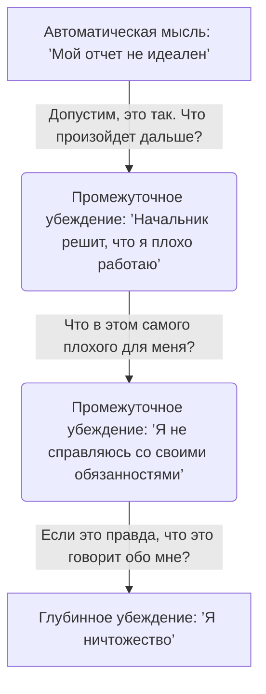

Бывает очень утомительно, когда одни и те же страхи постоянно возвращаются, сколько бы вы ни пытались мыслить позитивно или контролировать ситуацию. Часто острая душевная боль вызвана не конкретной проблемой, которая разворачивается перед вами в данный момент, а тем, что эта ситуация задевает глубоко скрытое, старое переживание.

Этот метод позволяет безопасно спуститься к самому корню ваших страхов, чтобы вы могли работать с реальной проблемой, а не только с ее поверхностными симптомами. Он помогает перестать бороться с ветряными мельницами повседневных тревог и заглянуть в саму суть устройства вашего разума.

## Определение и польза: Поиск коренной причины

**Техника «Падающая стрела»** (или метод вертикального спуска) — это сократический метод опроса, разработанный для выявления **глубинных убеждений** (скрытых, абсолютных и часто неосознаваемых представлений человека о себе, других людях и мире) *(Burns, 1990)*.

Главная задача этого инструмента — помочь вам перестать тратить время на борьбу с поверхностными симптомами и обнаружить ту самую коренную причину, которая искажает ваше восприятие и вызывает сильный эмоциональный дискомфорт. Выявив эту скрытую установку, вы получаете четкую мишень для дальнейшей работы и возможность освободиться от постоянного фонового напряжения *(Grant, 2001)*.

## Большая картина и механика: Три уровня мышления

В когнитивно-поведенческой терапии считается, что наши эмоциональные реакции строятся на трех ключевых уровнях *(Бек, 2020)*:
1. **Автоматические мысли:** Быстрые, поверхностные реакции на конкретное событие (например, «Я провалю это выступление»).
2. **Промежуточные убеждения:** Внутренние правила и допущения, по которым мы живем (например, «Если я ошибаюсь, значит, я плохо работаю»).
3. **Глубинные убеждения:** Самый глубокий уровень, формирующий фундамент личности (например, «Я некомпетентен» или «Я никчемен»).

**Механика работы:**
Вместо того чтобы оспаривать пугающую автоматическую мысль, мы временно допускаем, что она является абсолютной правдой. Отталкиваясь от этого допущения, мы задаем себе серию однотипных вопросов (например, «И что это значит?» или «Что в этом самого плохого?»). Эти вопросы заставляют мозг каждый раз спускаться на один уровень глубже, пробивая логические защиты *(Grant, 2001)*. Процесс продолжается до тех пор, пока ответы не сведутся к короткому, категоричному ярлыку о собственной личности.

## Ментальные модели и границы: Выкорчевывание сорняка

**Аналогия с корнем сорняка в саду:** Представьте, что автоматические мысли — это листья сорняка. Если просто отрывать листья, сорняк будет вырастать снова и снова. Техника «Падающая стрела» — это лопата, которая помогает раскопать землю и обнажить корень (глубинное убеждение). Только вытащив корень целиком, можно очистить сад.

**Чем это не является:** Этот метод имеет строгие границы, и его часто ошибочно путают с классическим оспариванием мыслей, хотя их задачи прямо противоположны.

| Классическое оспаривание мыслей | Техника «Падающая стрела» |
| :--- | :--- |
| Проверяет мысль на достоверность, ищет реальные доказательства «за» и «против» *(Добсон и Добсон, 2021)*. | Намеренно допускает, что мысль — 100% правда, чтобы посмотреть, к какому страху она приведет. |
| Цель — найти сбалансированный взгляд и снизить тревогу здесь и сейчас. | Цель — собрать информацию и диагностировать скрытое базовое убеждение. |
| Приносит эмоциональное облегчение в процессе выполнения. | Может временно усилить дискомфорт, так как обнажает скрытую боль. Категорически нельзя использовать в момент острой паники. |

## Практическое руководство: Логика применения

Рассмотрим, как этот процесс выглядит на реальных примерах из клинической практики:

* **Ситуация 1 (Музыкальный педагог):**
    * *Ситуация:* Студенты дают концерт. У преподавателя возникает автоматическая мысль: «Этот концерт обернется катастрофой».
    * *Действие:* Задается вопрос: «Допустим, это так. Что это значит?» -> «Это значит, что я потерпел неудачу». «А если ты потерпел неудачу, что это значит?» -> «Это значит, что я плохой учитель». «И что это значит?» -> «Это значит, что я полностью некомпетентен» *(Elliot & Lassen, 1998)*.
    * *Результат:* Выявлено жесткое убеждение о собственной некомпетентности, которое становится мишенью для дальнейшей терапии.

* **Ситуация 2 (Страх за здоровье):**
    * *Ситуация:* У пациента постоянно возникают мысли, что у него найдут тяжелую болезнь.
    * *Действие:* «Предположим, это так, что дальше?» -> «Я умру». «Что самое худшее для вас в смерти?» -> «Моя жена и дочь останутся одни. Без меня они совершенно беспомощны» *(Лихи, 2020)*.
    * *Результат:* Истинный страх клиента — не сама смерть, а глубокое убеждение в беспомощности его близких.

**Алгоритм внедрения:**
1. **Запишите «горячую» мысль.** Выберите автоматическую мысль, которая вызывает сильную эмоциональную реакцию (интенсивность страха от 70%).
2. **Сделайте допущение.** Спросите себя: «Если бы это было абсолютной правдой, что бы это значило обо мне, о мире или о моем будущем?».
3. **Повторите погружение.** Применяйте этот же вопрос к каждому новому ответу 5–7 раз, спускаясь все ниже.
4. **Зафиксируйте суть.** Остановитесь, когда найдете короткое, категоричное утверждение (обычно это безжалостный ярлык о себе).
5. **Сформируйте альтернативу.** Поняв истинную мишень, разработайте для этого жесткого ярлыка новую, реалистичную и здоровую альтернативу.

*Главная ошибка новичков:* Навязывание формулировок. Формулировка финального глубинного убеждения должна исходить строго от вас самих. Нельзя вкладывать готовые книжные ярлыки в свой разум, если они не откликаются эмоционально *(Добсон и Добсон, 2021)*.

## Энергия исследования ради долгосрочной эмоциональной устойчивости

Освоение навыка заглядывать за кулисы собственной тревоги приносит колоссальное облегчение и свободу. Понимание своих фундаментальных уязвимостей дает возможность перестроить сам фундамент мышления. Вы перестаете расходовать внутренние ресурсы на реакцию на каждый мелкий промах как на конец света и начинаете целенаправленно строить новые адаптивные реакции. Это радикально повышает вашу эмоциональную стабильность в повседневной жизни *(Бек, 2020)*.

Однако приобретение этой ясности потребует от вас значительных внутренних вложений, дисциплины и мужества. Практика вертикального спуска заставляет добровольно отказаться от самообмана и встретиться лицом к лицу с самыми болезненными страхами, от которых психика защищалась годами. Это дискомфортный процесс погружения во тьму собственных уязвимостей.

Тем не менее, эти усилия — абсолютно необходимый этап. Пока коренная причина скрыта, она тайно управляет вашим поведением, заставляя избегать трудностей. Выведенная на свет, она теряет свою власть и становится просто мыслью, которую можно планомерно изменить *(Добсон и Добсон, 2021)*.

## Главный вывод и литература

> Техника «Падающая стрела» — это точный навигационный инструмент, позволяющий пройти сквозь слои ежедневной тревоги к ядру проблемы. Раскрывая скрытые схемы и жесткие правила, мы получаем шанс оспорить их и выстроить более адаптивный, здоровый взгляд на себя и свою жизнь.

**Источники:**
* *Бек, Дж. С. (2020). Когнитивная терапия для сложных случаев: что делать, когда простые решения не работают. ООО "Диалектика".*
* *Добсон, Д., & Добсон, К. (2021). Научно-обоснованная практика в когнитивно-поведенческой терапии. Питер.*
* *Лихи, Р. (2020). Техники когнитивной психотерапии. Питер.*
* *Burns, D. (1990). The feeling good handbook. New York: Plume.*
* *Elliot, C. H., & Lassen, M. K. (1998). Why can't I get what I want? How to stop making the same old mistakes and start living a life you can love. California: Davies Black Publishing.*
* *Grant, A. M. (2001). Coaching for enhanced performance: Comparing cognitive and behavioural approaches to coaching. Paper presented at the 3rd International Spearman Seminar, Sydney, Australia.*
* *Padesky, C. A., & Greenberger, D. A. (1995). Clinician's guide to mind over mood. New York: Guilford Press.*

---

### Проверка понимания (Микро-кейс)

**Ситуация:** Анна переживает из-за того, что не успела вовремя сдать рабочий проект. Ее автоматическая мысль: «Я не успела в срок, босс будет недоволен». Чтобы поработать с этой мыслью, Анна решает применить технику «Падающая стрела». Она задает себе вопрос: *«Какие у меня есть объективные доказательства того, что босс будет недоволен, и какие есть факты, говорящие о том, что он отнесется с пониманием?»*. Она выписывает аргументы в две колонки.

**Вопрос:** Правильно ли Анна применила технику «Падающая стрела»? Обоснуйте свой ответ, опираясь на механику метода, описанную выше, и предложите конкретный вопрос, который Анна должна была задать себе на самом деле для начала вертикального спуска.
