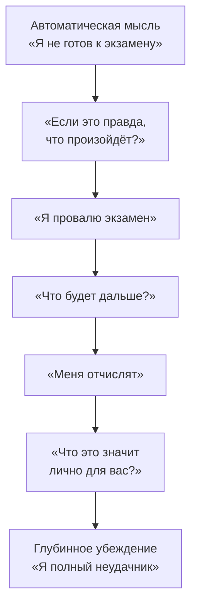

Поверхностная мысль «Я провалю это собеседование» редко является истинной причиной тревоги. Чаще она растёт из более глубокого убеждения — например, «Я недостаточно хорош» или «Я неудачник». Техника «Падающая стрела» (вертикальный спуск) позволяет проследить эту цепочку: от ситуативной автоматической мысли к фундаментальным схемам о себе, других людях и мире.

## Что такое техника «Падающая стрела»

«Падающая стрела» — инструмент когнитивно-поведенческой терапии для выявления глубинных убеждений (схем) и промежуточных правил, которые лежат в основе поверхностных автоматических мыслей.

В отличие от других методов КПТ, здесь терапевт или клиент **временно принимает негативную мысль за чистую правду**. Затем задаётся серия вопросов о том, к каким последствиям приведёт эта правда или что она означает для личности человека. Ответ на каждый вопрос становится новой мыслью, к которой снова применяется тот же вопрос. Процесс повторяется слой за слоем («спускаясь вниз»), пока цепочка не упрётся в финальный, всеохватывающий вывод — глубинное убеждение.

## Основные вопросы для спуска

Чтобы двигаться вглубь, используют следующие вопросы:

- «Предположим, эта мысль оказалась правдой — и что тогда?»
- «Если это действительно произойдет, что это будет значить лично для вас?»
- «Что самое ужасное могло бы случиться в результате?»
- «Если это случится, что это будет говорить о вас как о человеке?»
- «Почему вас это так сильно беспокоит?»

## Пошаговый алгоритм работы

**Шаг 1. Зафиксируйте поверхностную мысль.**
Выберите конкретную автоматическую мысль, которая сильно беспокоит в определённой ситуации.

*Пример:* Студент думает: «Я не готов к экзамену».

**Шаг 2. Запустите спуск (вопрос о последствиях).**
Задайте вопрос: «Если это правда, что произойдёт дальше?»

*Ответ:* «Я провалю экзамен».

**Шаг 3. Углубитесь.**
Запишите ответ и снова примените к нему вопрос «стрелы». Цикл повторяют 5–7 раз, пока ответы не начнут повторяться или не приведут к глобальному, абсолютному утверждению.

*Вопрос:* «Предположим, вы провалите экзамен. Почему это вас так беспокоит? Что будет дальше?»

*Ответ:* «Меня отчислят из университета».

**Шаг 4. Найдите личностное значение.**
*Вопрос:* «Если вас отчислят, что это будет значить лично для вас?»

*Ответ:* «Это будет значить, что я полный неудачник, который не способен ничего добиться в жизни».

В самом низу обнаруживается глубинное убеждение. Обычно это короткий, категоричный и безапелляционный ярлык: «Я никчемный», «Я неудачник», «Меня невозможно любить», «Мир опасен».

**Шаг 5. Оцените убеждение.**
Оцените по шкале от 0 до 100%, насколько сильно вы верите в найденное убеждение. Это станет отправной точкой для дальнейшей когнитивной работы.

## Примеры из клинической практики

### Пример 1. Социальная тревожность: страх выставить себя дураком

- **Клиент:** Случилось это на прошлой неделе. У меня на работе была планерка, и начальница меня просто убила. Она посмотрела прямо мне в глаза и задала вопрос, которого все мы боялись. Я не мог и слова вымолвить. Просто замер.
- **Терапевт:** Попробуйте вспомнить, какие мысли возникли у вас тогда, прямо перед тем, как вы замерли?
- **Клиент:** Я подумал: «Боже, нет, только не я! Не спрашивай меня! Я выставлю себя дураком».
- **Терапевт:** А если бы это было верным, если бы вы выставили себя дураком, что тогда?
- **Клиент:** Все бы подумали, что я ни на что не способен. Начальница поняла бы, что я ничего не стою.
- **Терапевт:** И если бы это произошло, что это значило бы для вас?
- **Клиент:** Меня бы никто не принимал.
- **Терапевт:** А если бы это было верным, если бы никто вас не принимал, что тогда?
- **Клиент:** Можно было бы просто свернуться калачиком и умереть. Зачем тогда жить?

*Здесь терапевт понимает, что достигнуто самое дно — глубинное убеждение о том, что социальное отвержение равносильно смерти.*

---

### Пример 2. Одиночество: от страха остаться одному до суицидальных мыслей

- **Клиент:** Я буду совсем одиноким.
- **Терапевт:** «А если я буду совсем одиноким, то…»
- **Клиент:** У меня будет депрессия.
- **Терапевт:** «А если у меня будет депрессия, меня тревожит, что…» Что тогда случится?
- **Клиент:** Жизнь будет бессмысленной, и мне можно будет просто её прервать.
- **Терапевт:** Получается, вы думаете, что если окажетесь одиноким, жизнь станет настолько бессмысленной, что проще будет с ней расстаться.

---

### Пример 3. Бытовая ситуация: от беспорядка в квартире к чувству некомпетентности

(Пример работы Джудит Бек с пациентом по имени Эйб)

- **Терапевт:** Итак, подводя итоги, можно сказать, что вы оглядели квартиру и подумали: «Какой беспорядок! Мне не стоило доводить квартиру до такого состояния»?
- **Клиент:** Да.
- **Терапевт:** Мы не рассматривали доказательства, чтобы убедиться, верны ли эти мысли. Но я хотела бы посмотреть, сможем ли мы выяснить, из-за чего эта мысль возникла. Допустим, в вашей квартире действительно беспорядок и не стоило доводить её до такого состояния. Что это могло бы сказать о вас?
- **Клиент:** Не знаю. Я просто чувствую себя некомпетентным.

*Автоматическая мысль о беспорядке мгновенно привела к глубинному убеждению «Я некомпетентен».*

---

### Пример 4. Тревога из-за внешности: поиск скрытого значения

- **Терапевт:** Вас очень беспокоит, что ваше лицо выглядит не так, как раньше, и вы постоянно замечаете новые изъяны. Верно?
- **Клиентка:** Да. Мне кажется, я выгляжу старше.
- **Терапевт:** Хорошо. Тогда давайте разберёмся, что это значит лично для вас: «Я переживаю, что буду выглядеть старше, потому что…»
- **Клиентка:** Это означает, что я непривлекательна.

---

### Пример 5. Проблемы с доверием к терапевту: катастрофизация непонимания

- **Клиент:** Если вы не понимаете, как я себя чувствую, то вам нельзя доверять.
- **Терапевт:** Что случится дальше? И если бы такое случилось, то что бы это означало?
- **Клиент:** Тогда вы сделаете мне больно.
- **Терапевт:** И если это так?
- **Клиент:** Это меня погубит.

*Или аналогичный спуск с другим пациентом:*

- **Клиент:** Если вы не видите ситуацию моими глазами, то не сможете мне помочь.
- **Терапевт:** А если я не смогу вам помочь?
- **Клиент:** Если вы не сможете мне помочь, то никто не поможет.
- **Терапевт:** И что это значит для вас?
- **Клиент:** Я совсем один. Я не имею значения.

## Важные правила и возможные трудности

Поскольку техника быстро погружает клиента в самые болезненные глубины его психики, важно соблюдать несколько правил.

### 1. Правильный тайминг

**Не используйте на первых сессиях.** Извлечение глубинных негативных убеждений может вызвать сильную эмоциональную реакцию. Если применить технику слишком рано, когда клиент ещё не обладает навыками совладания с эмоциями и не доверяет терапевту в полной мере, он может оказаться не готов к столкновению со своими схемами.

**Никогда не используйте в конце сессии.** Категорически не рекомендуется начинать вертикальный спуск в последние несколько минут встречи. Терапевт обязан следить за временем, чтобы иметь возможность погасить возможные негативные эффекты, успокоить клиента и завершить сессию на поддерживающей ноте.

### 2. Подготовка и терапевтическая позиция

**Предупреждение об отсутствии оспаривания.** Перед началом упражнения терапевт должен обязательно проговорить: сейчас мы временно примем негативную мысль за чистую правду, но *это не значит, что терапевт с ней согласен* или что она объективно верна. Это нужно, чтобы клиент не решил, будто психотерапевт действительно считает его, например, безнадёжным неудачником.

**Опасность механистичного подхода.** Если терапевт задаёт вопросы вроде «И что тогда?» холодно, отстранённо и механистически, клиенту покажется, что его эмоциональное страдание специалисту безразлично. Обязательно демонстрируйте теплоту, эмпатию и искреннее любопытство.

### 3. Преодоление сопротивления клиента

**Преждевременная остановка.** Часто на середине пути клиент пытается прервать процесс, заявляя: «Дальше я не верю, что это произойдёт» или «Уже и так достаточно страшно». Терапевту не следует останавливаться. Нужно мягко настоять на продолжении в гипотетическом ключе: «Даже если эти мысли не кажутся вам на 100% достоверными, давайте представим: *если бы* это произошло, почему бы это вас беспокоило?». Скрытые «худшие страхи» подпитывают тревогу, и именно до них необходимо добраться.

**Слияние со схемой.** Некоторые клиенты настолько долго живут со своими негативными убеждениями, что не видят разницы между реальностью и своей мыслью. Например, застенчивый клиент может считать: «Я скучный по своей сути», и это подкрепляется его избегающим поведением. Терапевту нужно помочь разделить понятия: указать, что «быть скучным человеком» и «вести себя как скучный человек в конкретной ситуации» — это разные вещи.

### 4. Завершение техники

После того как глубинное убеждение найдено, процесс не должен обрываться. Терапевту следует:

1. **Сделать выводы.** Выступить с поддерживающими утверждениями о том, какой смысл удалось извлечь из страданий клиента в контексте его глубинных убеждений.
2. **Дать надежду.** Проговорить, как важно будет вернуться к этим глубинным убеждениям в дальнейшем, чтобы их перестроить. Цель найдена, теперь предстоит работа над её изменением с помощью поиска доказательств, поведенческих экспериментов и когнитивной реструктуризации.

### Таблица: типичные ошибки терапевта и способы их избежать

| Ошибка терапевта | Последствие для клиента | Как действовать правильно |
| :--- | :--- | :--- |
| **Проведение техники в конце сеанса** | Клиент уходит с сессии в состоянии острого дистресса, активированы глубинные страхи. | Рассчитывать время так, чтобы после нахождения глубинного убеждения оставалось время на поддержку и стабилизацию. |
| **Механическое задавание вопросов («И что дальше?»)** | Клиент чувствует холодность, думает, что его страдания безразличны специалисту. | Использовать эмпатический тон, проявлять искреннее сочувствие к боли, к которой приводят раскопки. |
| **Отсутствие подготовки (инструктажа)** | Клиент думает, что терапевт согласен с его негативным прогнозом. | Заранее объяснить: «Мы не соглашаемся с мыслью, а лишь гипотетически проверяем, куда она ведёт». |
| **Согласие на остановку на полпути** | Глубинный страх остаётся невыявленным, терапия работает только с поверхностной тревогой. | Мягко настаивать: «Даже если это маловероятно, давайте просто представим, что бы это для вас значило, если бы случилось». |

## Что делать после обнаружения глубинного убеждения

Узнать своё глубинное убеждение — лишь первый шаг. Далее с ним обязательно нужно работать через:

- **Анализ доказательств.** Какие факты подтверждают это убеждение? Какие опровергают?
- **Поиск альтернатив.** Есть ли другие, более адаптивные способы видеть себя и мир?
- **Поведенческие эксперименты.** Можно ли проверить истинность убеждения на практике? Например, человек с убеждением «Я некомпетентен» может намеренно взять на себя новую задачу и отследить результат.
- **Когнитивную реструктуризацию.** Формулирование сбалансированного, реалистичного взгляда на себя.

Без этого этапа найденное убеждение останется лишь болезненным открытием, а не точкой для изменений.

## Запомнить

- **«Падающая стрела» (вертикальный спуск)** — техника для выявления глубинных убеждений, которые лежат в основе поверхностных автоматических мыслей.
- **Вместо оспаривания** мы временно принимаем негативную мысль за истину и задаём вопросы о её последствиях: «Если это правда, что тогда?», «Что это значит лично для вас?», «Что в этом самого худшего?».
- **Цикл повторяется 5–7 раз**, пока ответы не приведут к глобальному, безапелляционному утверждению — глубинному убеждению (например, «Я никчёмный», «Меня невозможно любить», «Мир опасен»).
- **Не используйте технику на первых сессиях или в конце сеанса.** Нужно время на выстраивание альянса и стабилизацию после спуска.
- **Терапевтическая позиция:** мягкость, эмпатия, предварительное объяснение правил, гипотетический тон при сопротивлении клиента.
- **Найденное убеждение — не конечная точка, а начало работы.** Далее следуют анализ доказательств, поведенческие эксперименты и когнитивная реструктуризация.
