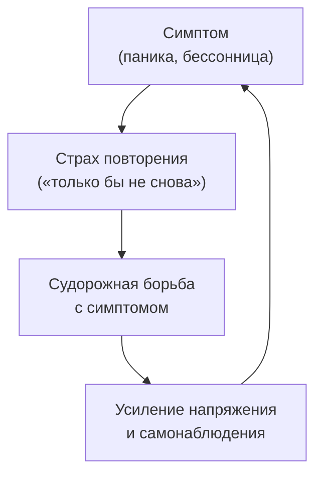
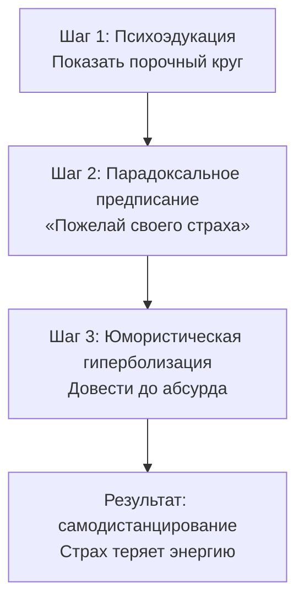

Человек боится панической атаки. Он напрягает все силы, чтобы она не случилась. Но чем сильнее он борется, тем мощнее бьёт паника. Тело словно играет против него. **Парадоксальная интенция** предлагает неожиданный выход: перестать убегать от страха и начать намеренно желать того, чего боишься. Звучит абсурдно, но именно этот абсурд разрывает невротическую петлю.

В этом руководстве разобран механизм техники, пошаговый протокол для терапевта и клиента, клинический пример и правила безопасного применения. Метод подходит при фобиях, панических атаках, навязчивых состояниях и психогенной бессоннице.

### Страх ожидания: когда борьба питает симптом

**Страх ожидания** (антиципаторная тревога) — центральный механизм, на который нацелена парадоксальная интенция. Человек боится повторения неприятного симптома: приступа паники, бессонницы, покраснения на людях. Этот страх запускает порочный круг.

Виктор Франкл описал эту динамику точной формулой: если «желание — отец мысли», то «страх — мать происшествия». Человек провоцирует именно то, чего больше всего боится. Он сливается со своим страхом и теряет способность к **самодистанцированию** — возможности встать «над» ситуацией и над самим собой.

> Парадоксальная интенция строго показана при психогенных расстройствах, в основе которых лежит механизм страха ожидания: панические атаки, фобии (агорафобия, клаустрофобия, эритрофобия), обсессивно-компульсивные состояния и психогенная бессонница.

Технику нельзя применять при экзистенциальном вакууме (когда человеку нужен смысл, а не снятие симптома), при переработке острой травмы или горя.

### Юмор против паники: почему абсурдное задание исцеляет

Страх и желание — полярные антиподы. Невозможно одновременно панически бояться события и искренне желать его наступления. Когда человек намеренно вызывает у себя приступ паники или бессонницу, страх ожидания лишается энергии. Ветер выбивается из парусов тревоги.

Ключевой активный ингредиент — **юмор**. Человек способен посмотреть на свой симптом с иронией. Он переходит из позиции жертвы инстинктов в позицию свободного духа. Франкл называл эту способность проявлением *Homo Patiens* — человека страдающего, но способного на духовный порыв. «Моё тело дрожит, но Я решаю дрожать ещё сильнее!» — в этой фразе содержится акт экзистенциальной свободы.

Без юмора техника превращается в обычную экспозицию. Совместный смех над абсурдностью ситуации — обязательное условие самодистанцирования.

### Пошаговый протокол для терапевта

Протокол требует от терапевта артистичности и клинической смелости. Юмор направлен на симптом, но никогда на самого пациента.

**Шаг 1. Разоблачение механизма (психоэдукация).** Терапевт объясняет, как борьба с симптомом его усиливает. Пример формулировки: «Вы тратите колоссальные усилия, чтобы избежать паники, но чем сильнее вы с ней боретесь, тем крепче она за вас держится. Ваш страх питается вашим сопротивлением. Я предлагаю перестать убегать и развернуться к нему лицом».

**Шаг 2. Формулирование парадоксального предписания.** Терапевт предлагает пациенту намеренно вызвать у себя симптом. Пример: «Сегодня ночью поставьте будильник на каждый час. Просыпайтесь специально, чтобы испытать самый сильный страх в вашей жизни. Посмотрим, получится ли удержать эту панику дольше пяти минут».

**Шаг 3. Юмористическая гиперболизация (доведение до абсурда).** Терапевт усиливает предписание до комической степени. Пример: «Не просто бойтесь — станьте чемпионом мира по панике! Если сердце забьётся, скажите: "Разве это инфаркт? Сейчас я покажу настоящий — пусть пульс подскочит до двухсот ударов!" Выжмите из этой паники всё до последней капли!»

### Случай Михаила: бессонница и страх задохнуться

Михаил, 34 года. Тяжёлая бессонница и ночные панические атаки. Страх задохнуться во сне привёл к тому, что он боится ложиться в кровать. Снотворные дают лишь временный эффект.

**Михаил:** «Я ложусь и начинаю прислушиваться к дыханию. Стоит начать засыпать — сердце колотится, не хватает воздуха. Я боюсь, что усну и перестану дышать. Поэтому борюсь со сном всю ночь».

Терапевт распознал классический страх ожидания. Пациент судорожно контролирует сон, что блокирует автоматизм расслабления.

**Терапевт:** «А что, если мы изменим тактику? Поставьте сегодня будильник на каждый час. Просыпайтесь специально, чтобы испытать самый сильный страх удушья в жизни. Посмотрим, получится ли удержать его дольше пяти минут».

**Михаил** (нервно усмехаясь): «Вы шутите? Если буду это делать, меня увезут на скорой».

**Терапевт:** «Я серьёзен. Вы же профессионал в панических атаках — докажите это! Скажите себе: "Ну что, смерть, давай! Пусть у меня остановится дыхание, пусть пульс подскочит до трёхсот!" Бросьте вызов своей панике».

**Михаил** (смеётся): «Я буду чувствовать себя полным идиотом, сидя в кровати в три часа ночи и приказывая себе задыхаться».

Терапевт зафиксировал момент самодистанцирования: пациент увидел комичность невротической позиции. На следующем сеансе Михаил рассказал, что проснулся по первому будильнику, честно пытался вызвать панику, но почувствовал лишь смех и сильную усталость. После второго будильника он отключил его и проспал до утра.

### Руководство для самостоятельной практики

Ловушка устроена просто: чем больше человек боится приступа, тем сильнее борется. Чем сильнее борется, тем мощнее приступ. Чтобы разорвать этот круг, нужно перестать бороться и намеренно **захотеть** того, чего боишься.

**Шаг 1. Признайте страх.** Не говорите себе «Я должен успокоиться». Скажите: «Да, я боюсь. И сейчас буду бояться на все 100%».

**Шаг 2. Сформулируйте парадоксальное желание.** Переверните страх в желание:

| Чего я боюсь | Парадоксальное желание |
|---|---|
| Бессонница | «Я вообще не буду спать этой ночью! Буду таращить глаза в потолок до самого утра!» |
| Покраснеть перед коллегами | «Сейчас покажу, как краснеет настоящий помидор! Я освещу всю комнату!» |
| Паническая атака | «Давай, сердце, выпрыгни из груди! Хочу упасть в самый грандиозный обморок!» |

**Шаг 3. Выполняйте задание по расписанию.** Если страх приходит ночью — запланируйте его. Поставьте будильник на каждый час. Попытайтесь удержать панику дольше пяти минут. Записывайте результаты:

1. Время попытки: ________
2. Как именно я пугал себя: ________
3. Сколько минут удерживал панику (искренне): ________
4. Что почувствовал вместо страха (смех, усталость, абсурдность): ________

> Страх — это хулиган. Как только вы сами приглашаете его войти и просите устроить погром, он тушуется и убегает.

### Противопоказания и типичные ошибки

**Абсолютные противопоказания:**

1. **Эндогенная депрессия и суицидальные намерения.** Предлагать пациенту с реальным риском суицида «пожелать себе умереть» — грубейшая профессиональная ошибка.
2. **Острые психозы и шизофрения.** Пациент должен обладать сохранным тестированием реальности, чтобы отличить метафорическое задание от реальной угрозы.
3. **Реальная объективная опасность.** Парадоксальная интенция работает только с иррациональными невротическими страхами. Нельзя советовать человеку «желать» быть укушенным настоящим тигром.

**Типичное сопротивление клиента:** «Я не верю в это. Звучит как бред». Ответ: «Вам и не нужно верить. Метод работает даже у скептиков. Просто сыграйте роль — максимально гротескно и театрально. Отнеситесь как к абсурдному эксперименту».

**Типичная ошибка терапевта:** отсутствие юмора. Если терапевт предлагает «встретиться со страхом» с каменным лицом, это превращается в экспозиционную терапию. Главный активный ингредиент логотерапии — юмор. Без совместного смеха самодистанцирование не состоится, и пациент ретравматизируется.

### Три маркера успешной парадоксальной интенции

1. **Спонтанный смех или улыбка.** Самый достоверный маркер. Пациент пытается напугать себя и вдруг фыркает или смеётся. Это означает, что дух отделился от психики — «ноопсихический антагонизм» сработал.

2. **Феномен «ускользающего симптома».** Пациент возвращается с недоумением: «Я честно пытался вспотеть (задохнуться, не спать), но ничего не вышло». Неспособность воспроизвести симптом по заказу — главное доказательство разрушения невротической петли.

3. **Перенос фокуса внимания.** Пациент перестаёт говорить о симптоме как о центре жизни. Он измерял день количеством панических атак, теперь говорит о делах, отношениях, смысле. Фокус смещается с выживания на существование.

### Заключение и Литература

Парадоксальная интенция — техника логотерапии для разрушения порочного круга «страх ожидания → борьба → усиление симптома». Человек намеренно желает того, чего боится, доводит страх до абсурда с помощью юмора и обнаруживает, что паника лишается энергии. Техника работает при фобиях, панических атаках, навязчивых состояниях и психогенной бессоннице. Главный активный ингредиент — юмор и самодистанцирование. Метод противопоказан при эндогенной депрессии с суицидальным риском, острых психозах и реальных угрозах.

- Франкл, В. (1990). *Человек в поисках смысла*. М.: Прогресс.
- Лукас, Э. (2020). *Учебник логотерапии*. М.: Новый Акрополь.

---

**Контрольный вопрос:** Пациент с эритрофобией (страхом покраснеть) избегает публичных выступлений. Как вы сформулируете парадоксальное предписание для него и какой маркер подтвердит, что самодистанцирование состоялось?
