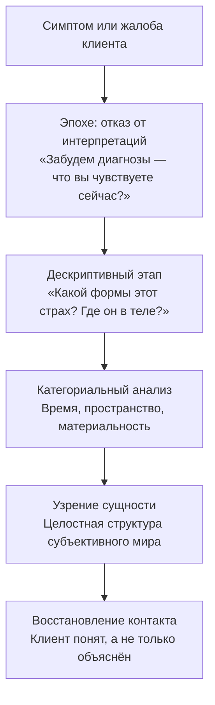

Терапевт смотрит на клиента и видит симптомы. За каждым симптомом он ищет причину — в детских травмах, в паттернах привязанности, в когнитивных схемах. Клиент объяснён. Но клиент не понят.

**Феноменологическое прояснение** — метод, который переворачивает эту логику. Вместо поиска причин («объяснения») терапевт стремится к постижению смыслов («пониманию») *(Лэнгле, 2022)*. Активный ингредиент — процедура **эпохе**: терапевт временно «заключает в скобки» все свои профессиональные концепции и психоаналитические догмы *(Элленбергер, 1958)*. Он наблюдает феномен — жалобу, страх, галлюцинацию, компульсию — в абсолютно чистом виде, как будто видит его впервые.

Именно этот отказ от субъект-объектной дихотомии разрывает невротический цикл. Человек перестаёт воспринимать себя как механизм с поломкой. Включается концепция *Homo Patiens*: клиент осознаёт себя не объектом воздействия инстинктов, а творцом собственного отношения к миру *(Мэй, 1958)*.

### Показания: когда нужно отказаться от интерпретаций

Метод применяется при **глубоком отчуждении клиента от собственного опыта**. Пациент постоянно задаёт вопрос «почему я так поступаю?» и при этом игнорирует реальное переживание настоящего момента. Он жёстко интеллектуализирует — превращает живые чувства в холодные объекты исследования.

Феноменологическое прояснение критически необходимо при работе с **бредом, галлюцинациями и психотическими состояниями** *(Мэй, 1958)*. Традиционная психиатрия заходит в тупик перед такими состояниями: диагностические ярлыки описывают, но не понимают. Феноменология позволяет терапевту войти в искаженный субъективный мир пациента и установить подлинный контакт.

**Противопоказания.** Глубокое феноменологическое погружение категорически противопоказано в острой фазе шока или паники *(Лэнгле, 2022)*. В таком состоянии полная открытость реальности приведёт к ретравматизации. Человеку сначала нужна базовая опора и безопасность.

### Механизм: от «почему» к «что есть»

Терапевт осуществляет **радикальный феноменологический сдвиг**: фокус смещается от поиска причин к постижению смыслов *(Лэнгле, 2022)*. Это возможно, потому что терапевт исследует субъективный мир пациента через четыре фундаментальные категории: **время** (как клиент его переживает), **пространство** (открытое или сжатое), **материальность** (тяжёлое или лёгкое) и **причинность** (ощущение свободы воли или фатальной предопределённости) *(Элленбергер, 1958)*.

### Протокол: четыре шага феноменологического прояснения

Алгоритм требует от терапевта позиции **«дисциплинированной наивности»** *(Мэй, 1958)*. Вопрос «почему» строго исключается на всех этапах.

**Шаг 1. Эпохе (психологическо-феноменологическая редукция).** Терапевт отсекает любые теоретические интерпретационные схемы и останавливает попытки клиента искать причины в прошлом. Скрипт: «Давайте отложим в сторону диагнозы. Забудьте на время о причинах. Опишите только то, что испытываете прямо сейчас. Представьте, что мы видим это чувство впервые в жизни».

**Шаг 2. Дескриптивная феноменология.** Терапевт просит клиента описать субъективное состояние максимально точно. Фокус удерживается исключительно на непосредственных деталях переживания. Скрипт: «Не объясняйте, откуда взялся этот страх. Расскажите, какой он. Какую форму он имеет? Где именно в теле зарождается?»

**Шаг 3. Категориальный анализ.** Терапевт исследует фундаментальные оси субъективного мира пациента. Скрипт: «Как вы ощущаете время в этом состоянии? Оно замерло, течёт вспять или несётся скачками? Как ощущается пространство вокруг вас? Оно давит, расширяется или заполняется густым туманом?»

**Шаг 4. Узрение сущности.** Терапевт улавливает целостную структуру субъективного мира пациента. Разрозненные симптомы складываются в единый логичный рисунок. Терапевт возвращает это понимание клиенту. Скрипт: «Слушая вас, я начинаю понимать устройство вашего мира. Похоже, в нём совершенно исчезло свободное пространство. Ваше время превратилось в бесконечную вязкую массу. Вы чувствуете именно это?»

### Кейсы: три примера из практики

**Кейс 1. Эллен Вест: шизофрения и конфликт двух миров.** Традиционная психиатрия видела в Эллен Вест лишь набор бессвязных бредовых симптомов и компульсивное переедание *(Бинсвангер, 1958)*. Людвиг Бинсвангер применил феноменологический метод. Он исследовал пространственные и материальные категории её экзистенции и выявил острый конфликт двух субъективных миров. Первый — мир света, эфира и свободы, где она парит как бестелесная птица. Второй — мир земли, гнили и тяжести, где ползает как слепой червь. Разрозненные пищевые симптомы сложились в единую понятную структуру: одержимость едой — заполнение пустой экзистенциальной дыры *(Бинсвангер, 1958)*. Пациентка перестала быть объектом с поломкой. Врач установил с ней подлинный человеческий контакт.

**Кейс 2. Кататоническая пациентка Кронфелда.** Традиционное наблюдение фиксировало бессмысленные дикие прыжки, агрессию и хаос движений *(Элленбергер, 1958)*. Карл Ясперс применил дескриптивную феноменологию: он попросил пациентку после окончания острой фазы описать её субъективные переживания изнутри приступа. Оказалось: движения не были связаны с агрессией. Она испытывала «чисто животное наслаждение от собственного движения» — переизбыток жизненных сил и наивную радость. Агрессивные удары возникали только как реакция обиды на насильственную укладку в постель *(Элленбергер, 1958)*. Феноменологический взгляд превратил «опасную безумицу» в человека с неверно понятой эмоцией.

**Кейс 3. Разоблачение интеллектуализации Хола.** Успешный учёный Хол страдал от неконтролируемых вспышек ярости в общении с сыном *(Бьюдженталь, 2001)*. На терапевтических сессиях он превращал себя в объект холодного научного исследования — бесконечно анализировал «логические причины» своего гнева, надёжно блокируя доступ к реальным чувствам. Джеймс Бьюдженталь категорически пресекал каждую такую попытку. Он постоянно возвращал Хола к непосредственному телесному опыту: «Просто позвольте мне слышать, что происходит внутри прямо сейчас» *(Бьюдженталь, 2001)*. Многослойная защита разрушилась. За маской холодного разума обнаружилась глубокая экзистенциальная печаль. Хол заплакал — и установил подлинный контакт с собственным субъективным центром.

### Руководство для самостоятельной работы: встреча с реальностью

Мы часто смотрим на свою жизнь через мутное стекло — из чужих мнений, теорий и собственных страхов. Ниже — практика феноменологического взгляда (5 минут).

1. Сядьте в тишине. Выберите любую эмоцию, которая беспокоит вас сейчас.
2. Примените эпохе: **строго запретите себе задавать вопрос «Почему?»**. Отключите внутреннего судью.
3. Опишите чувство как неизвестный пейзаж. Какое оно на ощупь? Какую геометрическую форму имеет? Где именно в теле живёт? Светлое или тёмное? Жидкое или твёрдое?
4. Просто наблюдайте за феноменом. Не прогоняйте его. Не исправляйте.

Страх теряет власть, когда перестаёте с ним бороться и начинаете его видеть.

### Ошибки терапевта и сопротивление

**Сопротивление клиента.** Типичная реакция: «Зачем мы описываем эту пустоту? Дайте мне алгоритм, как от неё быстро избавиться!» Ответ: «Быстрые советы здесь не сработают. Вы привыкли бежать от своих чувств. Наша задача — набраться мужества просто посмотреть на эту пустоту, чтобы понять её подлинное послание».

**Главная ошибка: «психологизаторство» и редукционизм.** Терапевт начинает трактовать описания клиента — объяснять религиозные переживания как «скрытые инстинкты» или страхи как «эдипов комплекс» *(Frankl, 2005)*. Он переходит от «понимания» к «объяснению». Это мгновенно разрушает доверие и обесценивает духовный мир человека.

### Маркеры прогресса

| Признак | Проявление |
| :--- | :--- |
| **Смена фокуса** | Клиент перестаёт копаться в причинах прошлого. Переходит к анализу настоящего момента |
| **Оживление языка** | Исчезают сухие термины («у меня депрессия»). Появляются живые метафоры («я словно увяз в тёмном болоте») |
| **Снижение тревоги** | Клиент перестаёт панически бояться собственных непонятных состояний. Восстанавливается «естественная самоочевидность» бытия *(Лэнгле, 2022)* |

### Заключение и Литература

Феноменологическое прояснение — метод, который возвращает терапевту доступ к закрытым мирам. Отказываясь от объяснений и принимая позицию «дисциплинированной наивности», терапевт устанавливает подлинную встречу с клиентом. Дикие прыжки кататонической пациентки оказываются наслаждением движением, пищевые расстройства — конфликтом двух миров, а интеллектуализация — броней над живой болью. Понять — значит большее, чем объяснить.

- Бинсвангер, Л. (1958). Экзистенциально-аналитическая школа мысли. В: Мэй, Р., Энджел, Э., Элленбергер, Г. (Ред.), *Экзистенция: Новое измерение в психиатрии и психологии*. Basic Books.
- Бьюдженталь, Дж. Ф. Т. (2001). *Искусство психотерапевта*. Питер.
- Лэнгле, А. (2022). *Основы экзистенциального анализа*. Питер.
- Мэй, Р. (1958). Истоки экзистенциального направления в психологии. В: *Экзистенция*. Basic Books.
- Frankl, V. E. (2005). *Сказать жизни «Да!»: психолог в концлагере*. Альпина нон-фикшн.
- Элленбергер, Г. (1958). Клиническое введение в психиатрическую феноменологию. В: *Экзистенция*. Basic Books.

---

**Проверка понимания.** Клиент 30 лет, успешный программист, обращается с жалобой на «постоянное бессмысленное чувство тревоги». На первые два вопроса отвечает подробными теориями: «Это, скорее всего, связано с моим тревожным типом привязанности — я читал о нём и понимаю, что это рационализация страха отвержения». Вы хотите применить феноменологическое прояснение. Объясните: (а) какую именно ошибку совершит терапевт, если сразу подхватит тему привязанности; (б) какой вопрос вы зададите на Шаге 2 (дескриптивный этап), чтобы прорвать интеллектуальную защиту и вернуть клиента к живому переживанию?
